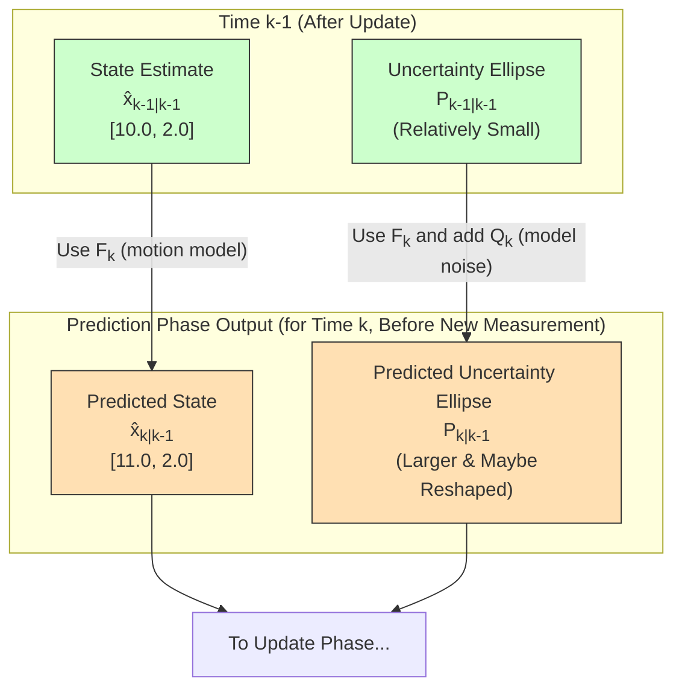

# Chapter 6: Prediction Phase

Welcome to Chapter 6! In [Chapter 5: Recursive Nature](05_recursive_nature_.md), we learned that the Kalman Filter works like an efficient detective, processing clues (measurements) one by one without needing to re-examine all past evidence. It does this through a repeating two-step cycle: Predict and Update.

Now, we're going to dive into the first of these crucial steps: the **Prediction Phase**.

## Peering into the Future: What is the Prediction Phase?

Imagine you're trying to predict tomorrow's weather.
*   You know what the weather is like **today** (your current best information).
*   You also have some **general knowledge** about how weather systems move and change (your "model" of weather).

Based on these, you can make a **forecast** for tomorrow. This forecast is made *before* you get any new satellite images or sensor readings for tomorrow. This is exactly what the Kalman Filter does in its Prediction Phase!

The **Prediction Phase** is where the Kalman Filter uses:
1.  Its most recent best guess of the system's state (from the previous time step).
2.  A model of how the system typically changes over time (the [Dynamic System Model](07_dynamic_system_model_.md)).

To make two key predictions for the *current* time step, *before* looking at the latest measurement:
1.  **A prediction of the system's state**: "Where do I think the system is now?"
2.  **A prediction of the uncertainty associated with this state prediction**: "How confident am I about this guess?"

This phase is all about looking ahead based on what we knew and how we think things work.

## The Goal: Making an Educated Guess (and Knowing its Fuzziness)

Let's go back to our "mystery moving dot" from [Chapter 1: Kalman Filter](01_kalman_filter_.md).
Suppose at the end of the last cycle (time `k-1`), the filter had a good estimate of the dot's position and velocity, and it was pretty confident about it.

Now, for the current time (`k`), before we get a new fuzzy sighting of the dot, the Prediction Phase aims to:
1.  **Predict the dot's new position and velocity**: If it was at `X` moving at speed `V`, where is it likely to be now, after a small time `dt` has passed? This is our *predicted state estimate* (often written as `x̂_{k|k-1}`). The notation `k|k-1` means "the estimate for time `k` given information up to time `k-1`."
2.  **Predict the uncertainty of this new guess**: Our previous estimate wasn't perfectly certain, and the dot might have experienced small, unpredictable nudges. So, our new prediction will also have uncertainty, and it's usually *more* uncertain than our previous estimate because we're projecting into the future. This is our *predicted error covariance* (often written as `P_{k|k-1}`).

It's like saying, "I think the dot will be around *here* (`x̂_{k|k-1}`), and my confidence in this guess is *this much* (`P_{k|k-1}`)."

## The Recipe for Prediction: What Goes In?

To make these predictions, the Kalman Filter needs a few key "ingredients":

1.  **Previous State Estimate (`x̂_{k-1|k-1}`)**: This is the filter's best guess of the [System State (State Variables)](02_system_state__state_variables__.md) from the *end* of the previous time step (after the last measurement was incorporated).
2.  **Previous Error Covariance (`P_{k-1|k-1}`)**: This matrix tells us how uncertain the filter was about its `x̂_{k-1|k-1}`. We learned about this in [Chapter 3: Covariance (Error Covariance Matrix)](03_covariance__error_covariance_matrix__.md).
3.  **Dynamic System Model (often represented by matrix `F_k`)**: This is a mathematical description of how the system's state naturally changes from one time step to the next, if left on its own. For our dot, this could involve basic physics like `new_position = old_position + velocity * time_step`. We'll explore this in detail in [Chapter 7: Dynamic System Model](07_dynamic_system_model_.md).
4.  **Control Input Model (matrix `B_k`) and Control Vector (`u_k`)** (Optional): If there are any known external forces or controls acting on the system (like pressing the accelerator in a car, or a known force applied to our dot), these are factored in here. `u_k` is the control input, and `B_k` tells us how `u_k` affects the state. Many simple examples don't have control inputs, so this part might be zero.
5.  **Process Noise Covariance (matrix `Q_k`)**: This is super important! It represents the uncertainty in our [Dynamic System Model](07_dynamic_system_model_.md). Our model of how the system changes (e.g., "the dot moves in a straight line") is never perfect. There might be small, unmeasured forces ("nudges") or random variations. `Q_k` quantifies this "process noise" – the fuzziness inherent in the system's evolution itself. This is also a key part of the [Dynamic System Model](07_dynamic_system_model_.md).

With these ingredients, the filter performs two main calculations:

### Step 1: Predicting the New State Estimate (`x̂_{k|k-1}`)

The filter predicts the current state (`x̂_{k|k-1}`) by taking the previous state estimate (`x̂_{k-1|k-1}`) and evolving it forward according to the dynamic system model (`F_k`). If there are control inputs (`u_k`), their effect (via `B_k`) is also added.

The conceptual formula looks like this:
`Predicted State (x̂_{k|k-1}) = (How system evolves * Previous State) + (Effect of known controls)`
Or, more formally:
`x̂_{k|k-1} = F_k * x̂_{k-1|k-1} + B_k * u_k`

(If there are no known controls, the `B_k * u_k` term is often omitted or zero.)

This is like saying: "Based on where the dot was and how it was moving, and any steering I did, I predict it's now here."

### Step 2: Predicting the New Error Covariance (`P_{k|k-1}`)

Predicting the state is one thing, but how confident are we in this new prediction? The filter also predicts the uncertainty (`P_{k|k-1}`) of this new state estimate.

This involves two main ideas:
1.  **Uncertainty from the previous state propagates**: The uncertainty from our previous estimate (`P_{k-1|k-1}`) carries over. If we were unsure about the last state, we'll be even more unsure about a state predicted from it. This propagation happens via the dynamic system model (`F_k`).
2.  **Uncertainty from the model itself (Process Noise `Q_k`)**: Because our model of how the system moves isn't perfect (those unpredictable "nudges"), we need to add some uncertainty. This is where `Q_k` comes in. `Q_k` essentially says, "Even if I knew the previous state perfectly, my prediction of the next state would still be a bit fuzzy by this much, because the world isn't perfectly predictable."

The conceptual formula looks like this:
`Predicted Uncertainty (P_{k|k-1}) = (Uncertainty propagated from previous state) + (Uncertainty due to imperfect model)`
Or, more formally:
`P_{k|k-1} = F_k * P_{k-1|k-1} * F_k^T + Q_k`
(The `F_k^T` is the transpose of the `F_k` matrix, a necessary part of the math for propagating covariance correctly.)

An important thing to notice: **the predicted error covariance `P_{k|k-1}` is usually larger than the previous `P_{k-1|k-1}`**. This makes sense! When you forecast further into the future without new information, your forecast naturally becomes less certain. The `Q_k` term ensures that even if `P_{k-1|k-1}` was tiny (meaning we were very sure), `P_{k|k-1}` will still have some uncertainty due to the imperfectness of our real-world model.

## Example: Our Moving Dot Predicts Its Future (1D)

Let's make this concrete with our 1D dot that moves horizontally. Its state is `[position, velocity]`.

**Suppose at the end of time `k-1` (after the last update):**
*   Previous State Estimate (`x̂_{k-1|k-1}`): `[position = 10.0 units, velocity = 2.0 units/sec]`
*   Previous Error Covariance (`P_{k-1|k-1}`): Let's say it was `[[0.2, 0.05], [0.05, 0.1]]` (meaning fairly certain, with small variances and a little correlation between position and velocity errors).

**Now, for the Prediction Phase at time `k`:**
Let the time step `dt = 0.5 sec`.

1.  **Dynamic System Model (`F_k`)**:
    For a 1D dot, a simple model is:
    *   `new_position = old_position + old_velocity * dt`
    *   `new_velocity = old_velocity` (assuming constant velocity for this step, no acceleration)
    So, `F_k` would be:
    `[[1, dt],`
    ` [0,  1]]`
    `F_k = [[1, 0.5], [0, 1]]`
    (We'll learn more about how to build `F_k` in [Chapter 7: Dynamic System Model](07_dynamic_system_model_.md)).

2.  **Control Inputs (`B_k`, `u_k`)**: Let's assume there are no known control inputs for this dot. So, `B_k * u_k = [0, 0]`.

3.  **Process Noise Covariance (`Q_k`)**: This accounts for unmodeled effects, like tiny random accelerations. Deriving `Q_k` properly involves some physics, but for our example, let's say based on `dt` and an assumed variance of random acceleration (`sigma_a^2`), `Q_k` is:
    `Q_k = [[0.01, 0.005], [0.005, 0.02]]` (These are just example values representing small model uncertainties).
    (Again, [Chapter 7: Dynamic System Model](07_dynamic_system_model_.md) will cover `Q_k` more).

**Calculations:**

*   **Predict State Estimate (`x̂_{k|k-1}`):**
    `x̂_{k|k-1} = F_k * x̂_{k-1|k-1}`
    `x̂_{k|k-1} = [[1, 0.5], [0, 1]] * [10.0, 2.0]^T`
    `x̂_{k|k-1} = [(1*10.0 + 0.5*2.0), (0*10.0 + 1*2.0)]^T`
    `x̂_{k|k-1} = [11.0, 2.0]^T`
    So, the filter predicts the dot will be at position 11.0, still moving at 2.0 units/sec.

*   **Predict Error Covariance (`P_{k|k-1}`):**
    `P_{k|k-1} = F_k * P_{k-1|k-1} * F_k^T + Q_k`
    Plugging in the matrices:
    `P_{k|k-1} = [[1, 0.5], [0, 1]] * [[0.2, 0.05], [0.05, 0.1]] * [[1, 0], [0.5, 1]]^T + [[0.01, 0.005], [0.005, 0.02]]`
    (The math involves matrix multiplication. We won't do it by hand here.)
    Let's say, after calculation, `P_{k|k-1}` becomes something like:
    `P_{k|k-1} = [[0.35, 0.12], [0.12, 0.14]]` (Example result)

Notice how the diagonal terms of `P_{k|k-1}` (0.35 and 0.14) are larger than those of `P_{k-1|k-1}` (0.2 and 0.1). This shows our uncertainty has increased, as expected!

### Conceptual Code Snippet

Here's how this might look conceptually in Python-like code using NumPy:

```python
import numpy as np

# --- Inputs from previous step (k-1) ---
# Previous State Estimate (x_hat_k_minus_1_updated)
x_hat_k_minus_1 = np.array([10.0, 2.0]) # [position, velocity]

# Previous Error Covariance (P_k_minus_1_updated)
P_k_minus_1 = np.array([[0.2, 0.05],
                        [0.05, 0.1]])

# --- Model Parameters (for current step k) ---
dt = 0.5 # time step

# Dynamic System Model (F_k)
F_k = np.array([[1.0, dt],
                [0.0, 1.0]])

# Process Noise Covariance (Q_k) - uncertainty in the model itself
# (Simplified example values for Q_k for illustration)
# A proper Q_k depends on dt and assumed variance of unmodeled accelerations.
# E.g., if random acceleration has variance sigma_a_sq = 0.04
# Q_k_example = np.array([[(dt**4)/4, (dt**3)/2], [(dt**3)/2, dt**2]]) * sigma_a_sq
# Q_k_example would be [[0.000625, 0.0025],[0.0025, 0.01]] for sigma_a_sq = 0.04
# For this example, we'll use the Q_k from the text explanation for consistency.
Q_k = np.array([[0.01, 0.005],
                [0.005, 0.02]])


# (Assuming no control inputs B_k, u_k for simplicity)
# control_input_effect = np.array([0.0, 0.0]) # if B_k*u_k is zero

# --- Prediction Phase Calculations ---

# 1. Predict the State Estimate (a priori state estimate)
# x_hat_k_predicted = F_k @ x_hat_k_minus_1 + control_input_effect
x_hat_k_predicted = F_k @ x_hat_k_minus_1
print(f"Predicted State Estimate (x_hat_k|k-1): {x_hat_k_predicted}")

# 2. Predict the Error Covariance (a priori error covariance)
P_k_predicted = F_k @ P_k_minus_1 @ F_k.T + Q_k
print(f"Predicted Error Covariance (P_k|k-1):\n{P_k_predicted}")
```

**Explanation of the Code:**
*   We start with `x_hat_k_minus_1` (our last best guess) and `P_k_minus_1` (our uncertainty about that guess).
*   We define `F_k`, our model for how the dot moves given a time step `dt`.
*   We also define `Q_k`, which represents the idea that our motion model isn't perfect.
*   `x_hat_k_predicted = F_k @ x_hat_k_minus_1` calculates the new predicted state. The `@` symbol is often used for matrix multiplication in Python with NumPy.
*   `P_k_predicted = F_k @ P_k_minus_1 @ F_k.T + Q_k` calculates the new predicted uncertainty. `F_k.T` is the transpose of `F_k`. The uncertainty increases due to both the propagation of old uncertainty and the addition of new process noise `Q_k`.

If you run this (conceptual) code, `x_hat_k_predicted` would be `[11.0, 2.0]`. The `P_k_predicted` would be a new 2x2 matrix where the diagonal values (variances) are generally larger than in `P_k_minus_1`, indicating increased uncertainty.

## Visualizing the Prediction

We can think of the error covariance `P` as an "uncertainty ellipse" around our state estimate. During the prediction phase, this ellipse typically grows and might change shape:


This diagram shows our state estimate moving from its previous position to a new predicted position. The uncertainty ellipse around it also evolves, usually getting bigger, reflecting the increased uncertainty of a forecast.

## What's Next?

The outputs of the Prediction Phase – the predicted state estimate `x̂_{k|k-1}` and the predicted error covariance `P_{k|k-1}` – are crucial. They represent the filter's "expectation" *before* it sees any new evidence for the current time step.

These two values are then passed to the next major step in the Kalman Filter cycle: the [Update Phase](08_update_phase_.md). In the Update Phase, a new [Measurement (Observation)](04_measurement__observation__.md) will arrive, and the filter will use these predictions to intelligently combine the prediction with the new measurement.

## Conclusion

The **Prediction Phase** is the Kalman Filter's forecasting step. It answers:
1.  "Based on what I knew and how things change, where do I think the system is now?" (Predicts the state).
2.  "And how fuzzy is this prediction?" (Predicts the uncertainty of that state).

It achieves this by using the previous state estimate, the previous uncertainty, and a model of system dynamics (including known controls and process noise). A key outcome is that uncertainty generally increases during this phase because we are projecting into an unknown future and our models of change are not perfect.

But how do we define this "model of how the system changes"? That's exactly what we'll explore in [Chapter 7: Dynamic System Model](07_dynamic_system_model_.md).

---

Generated by [AI Codebase Knowledge Builder](https://github.com/The-Pocket/Tutorial-Codebase-Knowledge)