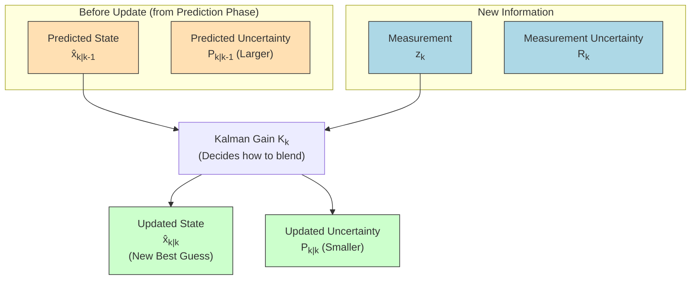
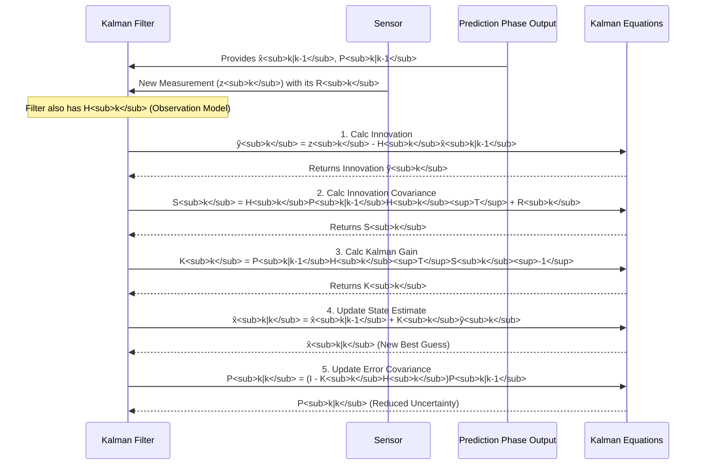

# Chapter 8: Update Phase

Welcome to Chapter 8! In the previous chapters, we've seen how our Kalman Filter makes an educated guess about the future. In [Chapter 6: Prediction Phase](06_prediction_phase_.md), it forecasted where our system (like our moving dot) would likely be and how uncertain that forecast was. This forecast was based on the [Dynamic System Model](07_dynamic_system_model_.md) – the rules of how the system behaves.

But what happens when new, real-world information arrives? How does our filter use this new data to sharpen its guess? This is where the **Update Phase** shines. It's all about making our estimate better by incorporating fresh evidence.

## The Forecast Meets Reality: Refining Our Guess

Imagine you're a weather forecaster.
*   **Prediction Phase**: Yesterday, you made a forecast for today's temperature based on your weather models (e.g., "Today will be around 20°C, but I'm a bit uncertain, say +/- 3°C").
*   **New Information Arrives**: Now, a new satellite image and current temperature readings from weather stations come in (your [Measurement (Observation)](04_measurement__observation__.md)). Let's say the current average reading is 22°C, and you know your satellite/station readings have their own inaccuracies (say, +/- 1°C).

The **Update Phase** is like the forecaster taking their initial forecast (20°C +/- 3°C) and blending it with the new, actual readings (22°C +/- 1°C) to arrive at a more accurate and confident assessment of the current weather (e.g., "Okay, my revised estimate is 21.5°C, and I'm now more confident, say +/- 0.9°C").

The Update Phase is the second main step in the Kalman Filter's [Recursive Nature](05_recursive_nature_.md) cycle. Once a new measurement is observed, the filter compares this measurement to its prediction. It then calculates a clever weighted average of the predicted state and the information from the measured state to produce an improved, or **"a posteriori"** (meaning "after the fact"), state estimate. The weighting depends heavily on how certain the prediction was versus how certain the new measurement is.

## What Happens in the Update Phase?

The main goal of the Update Phase is to:
1.  Take the **predicted state** (from the [Prediction Phase](06_prediction_phase_.md)) and its **predicted uncertainty**.
2.  Take the new **measurement** from our sensor and its **measurement uncertainty**.
3.  Intelligently combine them to produce a **new, updated state estimate** that is (hopefully) more accurate than either the prediction alone or the measurement alone.
4.  Also, calculate a **new, updated uncertainty** for this new estimate, which is usually smaller (meaning we're more confident).

## The "Ingredients" for the Update

To perform its magic, the Update Phase needs several pieces of information:

1.  **Predicted State Estimate (`x̂_{k|k-1}`)**: This is what the [Prediction Phase](06_prediction_phase_.md) gave us – our best guess of the current state *before* considering the latest measurement. (Remember, `k|k-1` means "estimate for time `k` using data up to `k-1`").
2.  **Predicted Error Covariance (`P_{k|k-1}`)**: This matrix tells us how uncertain our `x̂_{k|k-1}` is ([Chapter 3: Covariance (Error Covariance Matrix)](03_covariance__error_covariance_matrix__.md)).
3.  **The New Measurement (`z_k`)**: This is the actual data point we just got from our sensor at time `k` ([Chapter 4: Measurement (Observation)](04_measurement__observation__.md)).
4.  **The Observation Model (`H_k`)**: This matrix tells us how the true state `x_k` relates to our measurement `z_k`. For example, if our state includes both position and velocity, but our sensor only measures position, `H_k` defines this relationship ([Chapter 9: Observation Model](09_observation_model_.md)).
5.  **The Measurement Noise Covariance (`R_k`)**: This matrix tells us how noisy or unreliable our measurement `z_k` is. A small `R_k` means a precise sensor; a large `R_k` means a noisy one ([Chapter 4: Measurement (Observation)](04_measurement__observation__.md)).

With these ingredients, the filter goes through a few key calculations.

## The Steps of an Update (Conceptually)

The Update Phase involves a sequence of calculations that blend the prediction with the new measurement. The heart of this blending process is the **Kalman Gain (`K_k`)**, which we'll discuss in detail in [Chapter 10: Kalman Gain](10_kalman_gain_.md).

Here's a step-by-step look at what the filter does:

**Step 1: Calculate the "Surprise" (Innovation or Measurement Residual)**

The filter first sees how different the actual measurement is from what it *expected* to measure.
*   Expected Measurement: `H_k * x̂_{k|k-1}` (What the observation model says we should see, based on our predicted state).
*   Actual Measurement: `z_k`

The difference is called the **innovation** (or measurement residual), often denoted `ỹ_k`:
`ỹ_k = z_k - (H_k * x̂_{k|k-1})`

If this innovation `ỹ_k` is small, our prediction was close to what we actually measured. If it's large, our prediction was further off – the measurement brought a "surprise."

**Step 2: Calculate the Uncertainty of this "Surprise" (Innovation Covariance `S_k`)**

How much should we trust this surprise? It depends on how uncertain the prediction was and how uncertain the measurement itself is. This combined uncertainty in the innovation is captured by the **Innovation Covariance `S_k`**:
`S_k = H_k * P_{k|k-1} * H_k^T + R_k`

*   `H_k * P_{k|k-1} * H_k^T`: This part is the uncertainty of our prediction (`P_{k|k-1}`) transformed into the "measurement space" (i.e., what units and form our sensor measures in).
*   `R_k`: This is the uncertainty of our measurement itself.

**Step 3: Calculate the Blending Factor (Kalman Gain `K_k`)**

Now for the "magic sauce"! The **Kalman Gain (`K_k`)** determines how much weight to give to the innovation (the surprise from the measurement) versus the original prediction.
`K_k = P_{k|k-1} * H_k^T * S_k^{-1}`
(Note: `S_k^{-1}` means the inverse of the matrix `S_k`.)

*   If our prediction was very uncertain (`P_{k|k-1}` is large), `K_k` will tend to be larger, meaning we'll pay more attention to the new measurement.
*   If our measurement is very noisy (`R_k` is large, making `S_k` large and `S_k^{-1}` small), `K_k` will tend to be smaller, meaning we'll stick more closely to our prediction.
We'll explore the Kalman Gain in much more detail in [Chapter 10: Kalman Gain](10_kalman_gain_.md).

**Step 4: Get the New, Improved State Estimate (A Posteriori State Estimate `x̂_{k|k}`)**

The filter now corrects its predicted state estimate using the innovation, scaled by the Kalman Gain:
`x̂_{k|k} = x̂_{k|k-1} + K_k * ỹ_k`

This `x̂_{k|k}` is our new, refined best guess of the system's state at time `k`, *after* considering the measurement `z_k`. It's often called the "a posteriori" (after the fact) estimate.

**Step 5: Update Our Uncertainty (A Posteriori Error Covariance `P_{k|k}`)**

Finally, because we've incorporated new information from a measurement, our confidence in our state estimate should increase, meaning our uncertainty should decrease. The filter calculates the new error covariance:
`P_{k|k} = (I - K_k * H_k) * P_{k|k-1}`
(Where `I` is the identity matrix – a matrix with 1s on the diagonal and 0s elsewhere.)

This new `P_{k|k}` matrix represents the uncertainty of our `x̂_{k|k}`. Generally, the values in `P_{k|k}` (especially the variances on the diagonal) will be smaller than those in `P_{k|k-1}`. We've become more certain!

These updated `x̂_{k|k}` and `P_{k|k}` values then become the starting point for the next cycle's [Prediction Phase](06_prediction_phase_.md).

## Example: Our 1D Moving Dot Gets an Update

Let's continue with our 1D dot that moves horizontally. Its state is `x = [position, velocity]`.
From the [Prediction Phase](06_prediction_phase_.md) example (Chapter 6), we had:
*   Predicted State (`x̂_{k|k-1}`): `[11.0, 2.0]^T` (predicted position 11.0, velocity 2.0)
*   Predicted Error Covariance (`P_{k|k-1}`): `[[0.35, 0.12], [0.12, 0.14]]`

Now, let's say a new measurement arrives at time `k`:
*   **New Measurement (`z_k`)**: Our sensor measures only the position and gives a reading of `10.8`. So, `z_k = [10.8]`.
*   **Observation Model (`H_k`)**: Since our state is `[position, velocity]` but we only measure position:
    `H_k = [1  0]`
*   **Measurement Noise Covariance (`R_k`)**: Let's say our sensor has a position measurement variance of `0.1`. (This means a standard deviation of about `sqrt(0.1) ≈ 0.316 units).
    `R_k = [[0.1]]` (It's a 1x1 matrix because we only measure one thing).

Let's walk through the update steps:

1.  **Innovation (`ỹ_k`)**:
    `Expected Measurement = H_k * x̂_{k|k-1} = [1  0] * [11.0, 2.0]^T = 1*11.0 + 0*2.0 = 11.0`
    `ỹ_k = z_k - Expected Measurement = 10.8 - 11.0 = -0.2`
    (The sensor saw the dot at 10.8, but we predicted it would be seen at 11.0. The "surprise" is -0.2).

2.  **Innovation Covariance (`S_k`)**:
    `H_k * P_{k|k-1} * H_k^T = [1  0] * [[0.35, 0.12], [0.12, 0.14]] * [1, 0]^T`
    `= [0.35  0.12] * [1, 0]^T = 0.35*1 + 0.12*0 = 0.35`
    `S_k = (H_k * P_{k|k-1} * H_k^T) + R_k = 0.35 + 0.1 = 0.45`
    (Since we measure only one value, `S_k` is a 1x1 matrix, or just a scalar here).

3.  **Kalman Gain (`K_k`)**:
    `P_{k|k-1} * H_k^T = [[0.35, 0.12], [0.12, 0.14]] * [1, 0]^T = [ (0.35*1 + 0.12*0), (0.12*1 + 0.14*0) ]^T = [0.35, 0.12]^T` (This is a 2x1 vector).
    `S_k^{-1} = 1 / 0.45 ≈ 2.222`
    `K_k = (P_{k|k-1} * H_k^T) * S_k^{-1} = [0.35, 0.12]^T * 2.222 = [0.35*2.222, 0.12*2.222]^T ≈ [0.778, 0.267]^T`
    (The Kalman Gain `K_k` is a 2x1 vector here. It tells us how to adjust each state variable based on the 1D innovation).

4.  **Updated State Estimate (`x̂_{k|k}`)**:
    `x̂_{k|k} = x̂_{k|k-1} + K_k * ỹ_k`
    `x̂_{k|k} = [11.0, 2.0]^T + [0.778, 0.267]^T * (-0.2)`
    `x̂_{k|k} = [11.0, 2.0]^T - [0.1556, 0.0534]^T`
    `x̂_{k|k} ≈ [10.8444, 1.9466]^T`
    Our new estimate for position is 10.8444 (pulled from 11.0 towards the measurement 10.8). Velocity is now estimated as 1.9466.

5.  **Updated Error Covariance (`P_{k|k}`)**:
    `K_k * H_k = [0.778, 0.267]^T * [1  0] = [[0.778, 0.0], [0.267, 0.0]]` (This is a 2x2 matrix).
    `I - K_k * H_k = [[1-0.778, 0-0.0], [0-0.267, 1-0.0]] = [[0.222, 0.0], [-0.267, 1.0]]`
    `P_{k|k} = (I - K_k * H_k) * P_{k|k-1}`
    `P_{k|k} = [[0.222, 0.0], [-0.267, 1.0]] * [[0.35, 0.12], [0.12, 0.14]]`
    Performing matrix multiplication:
    `P_00 = 0.222*0.35 + 0.0*0.12 = 0.0777`
    `P_01 = 0.222*0.12 + 0.0*0.14 = 0.02664`
    `P_10 = -0.267*0.35 + 1.0*0.12 = -0.09345 + 0.12 = 0.02655` (Should be symmetric, so close to P_01)
    `P_11 = -0.267*0.12 + 1.0*0.14 = -0.03204 + 0.14 = 0.10796`
    So, `P_{k|k} ≈ [[0.0777, 0.0266], [0.0266, 0.1080]]`

Notice that the variance of the position estimate (the top-left element of `P`) went from `0.35` (in `P_{k|k-1}`) down to `0.0777` (in `P_{k|k}`). This is a significant reduction in uncertainty! Our confidence in the dot's position has increased. The velocity uncertainty also changed.

### Conceptual Code for the Update Phase

Here's what this might look like conceptually in Python with NumPy:

```python
import numpy as np

# --- Outputs from Prediction Phase ---
x_hat_predicted = np.array([11.0, 2.0]) # [position, velocity]
P_predicted = np.array([[0.35, 0.12],
                        [0.12, 0.14]])

# --- New Measurement and Sensor Info ---
z_k = np.array([10.8]) # Measured position

# Observation Model (H_k)
H_k = np.array([[1.0, 0.0]]) # Measures position, not velocity

# Measurement Noise Covariance (R_k)
R_k = np.array([[0.1]]) # Variance of position measurement

# --- Update Phase Calculations ---

# Step 1: Innovation (Measurement Residual)
# y_tilde = z_k - H_k @ x_hat_predicted
expected_measurement = H_k @ x_hat_predicted
y_tilde = z_k - expected_measurement
# print(f"Innovation (y_tilde): {y_tilde}") # [-0.2]

# Step 2: Innovation Covariance (S_k)
S_k = H_k @ P_predicted @ H_k.T + R_k
# print(f"Innovation Covariance (S_k):\n{S_k}") # [[0.45]]

# Step 3: Kalman Gain (K_k)
# Note: S_k is 1x1, so S_k_inv is just 1/S_k
S_k_inv = np.linalg.inv(S_k) # For general matrices
K_k = P_predicted @ H_k.T @ S_k_inv
# print(f"Kalman Gain (K_k):\n{K_k}") # [[0.777...], [0.266...]]

# Step 4: Updated State Estimate (x_hat_updated)
x_hat_updated = x_hat_predicted + K_k @ y_tilde # y_tilde is 1x1, K_k is 2x1
# For correct matrix multiplication with a scalar innovation for multiple state variables
# it is y_tilde as a scalar: x_hat_updated = x_hat_predicted + K_k * y_tilde[0]
x_hat_updated = x_hat_predicted + (K_k * y_tilde[0]) # Assuming y_tilde is treated as scalar if 1x1
print(f"Updated State Estimate (x_hat_k|k):\n{x_hat_updated}") # [10.8444..., 1.9466...]

# Step 5: Updated Error Covariance (P_updated)
I = np.eye(P_predicted.shape[0]) # Identity matrix of same size as P
P_updated = (I - K_k @ H_k) @ P_predicted
print(f"Updated Error Covariance (P_k|k):\n{P_updated}")
# [[0.0777..., 0.0266...],
#  [0.0266..., 0.1079...]]
```
This code follows the 5 steps, using NumPy for matrix operations. The `@` symbol represents matrix multiplication. The `np.linalg.inv()` function calculates the matrix inverse, and `np.eye()` creates an identity matrix.

## Visualizing the Update

Imagine our predicted state estimate (`x̂_{k|k-1}`) has an uncertainty ellipse (`P_{k|k-1}`) around it. A new measurement (`z_k`) arrives, also with its own uncertainty (related to `R_k`). The Update Phase finds a new point (`x̂_{k|k}`) that optimally combines these, and its new uncertainty ellipse (`P_{k|k}`) is usually smaller.


This diagram shows how the filter takes the prediction (orange) and the measurement (blue) and, using the Kalman Gain, produces an updated estimate (green) that is more certain.

## Internal Workings: A Simplified Flow

Here's a sequence diagram showing how the parts interact during the update:


This flow represents the core logic. The `tmp_erm9wcp.txt` file (which is a Wikipedia page on Kalman filters) describes these standard equations under the "Update" section. Our project `tmp_erm9wcp` would implement these steps.

## Conclusion

The **Update Phase** is where the Kalman Filter truly shines by learning from new data. It takes the forecast from the [Prediction Phase](06_prediction_phase_.md) and skillfully blends it with the latest [Measurement (Observation)](04_measurement__observation__.md). This blending is guided by the [Kalman Gain](10_kalman_gain_.md), which considers the uncertainties of both the prediction and the measurement.

The result is an **a posteriori state estimate** (`x̂_{k|k}`)—a refined guess that is generally more accurate—and an **a posteriori error covariance** (`P_{k|k}`)—reflecting increased confidence in our estimate.

But how exactly does the filter know how our measurements relate to the actual state variables we're trying to track? This is described by the [Observation Model](09_observation_model_.md), which we'll explore in the next chapter.
```

---

Generated by [AI Codebase Knowledge Builder](https://github.com/The-Pocket/Tutorial-Codebase-Knowledge)