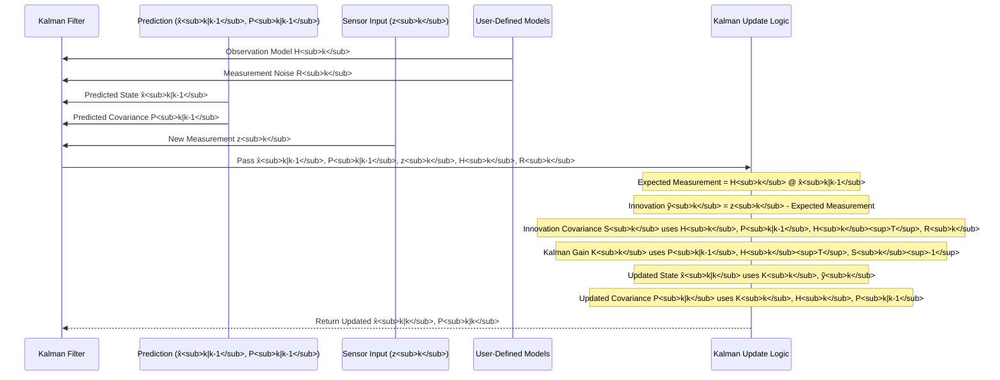

# Chapter 9: Observation Model

In [Chapter 8: Update Phase](08_update_phase_.md), we saw how the Kalman Filter takes a new measurement from a sensor and uses it to refine its guess about the system's state. We briefly introduced the idea that the filter needs to know how the [System State (State Variables)](02_system_state__state_variables__.md) relates to what the sensor actually measures. This crucial piece of information is defined by the **Observation Model**.

## What are My Sensors Actually Telling Me?

Imagine you're trying to track a remote-controlled toy car. Your "system state" for the car might include its exact 2D position (x, y coordinates on the floor) and its 2D velocity (how fast it's moving in the x and y directions).
`State (x) = [x_position, y_position, x_velocity, y_velocity]`

Now, suppose you have a camera mounted on the ceiling looking down. This camera can tell you the (x, y) position of the car, but it's a bit fuzzy (noisy). The camera gives you a measurement:
`Measurement (z) = [measured_x_position, measured_y_position]`

Notice two things:
1.  The camera only tells you about the *position* part of the car's state, not its velocity directly.
2.  The camera's output (measured positions) directly corresponds to the position variables in your state.

How does the Kalman Filter know that the camera's readings relate to the first two numbers in your state vector (`x_position`, `y_position`) and not, say, the velocity, or some combination? This is where the Observation Model comes in.

## The Observation Model (H): Bridging State and Measurement

The **Observation Model** describes how the true, underlying system state variables map to the actual measurement variables that your sensors provide. It's like a translator that helps the filter understand what kind of measurement to *expect* for a given system state.

This model is most often represented by a matrix, commonly denoted as **H** (or **H<sub>k</sub>** if it changes over time).

The basic relationship is often expressed as:
`expected_measurement = H * true_state`

(In reality, the actual measurement also includes noise: `actual_measurement = H * true_state + measurement_noise`. The uncertainty of this noise is captured by the `R` matrix, as we discussed in [Chapter 4: Measurement (Observation)](04_measurement__observation__.md)).

The `H` matrix essentially tells the filter: "If the system is in *this* particular state, then I expect my sensors to read *that*."

## Example: Our 1D Moving Dot Revisited

Let's make this more concrete with our trusty 1D moving dot, which only moves horizontally.
Its [System State (State Variables)](02_system_state__state_variables__.md) is:
`x = [position, velocity]`

**Scenario 1: Sensor Measures Only Position**
Suppose we have a sensor that only measures the dot's position. So, our [Measurement (Observation)](04_measurement__observation__.md) is:
`z = [measured_position]`

How does `H` look? We want to map the 2-element state vector `[position, velocity]` to the 1-element measurement vector `[measured_position]`.
The `H` matrix would be:
`H = [[1, 0]]`

Let's see why:
`expected_measurement = H * state`
`[expected_measured_position] = [[1, 0]] * [position, velocity]^T`
`expected_measured_position = (1 * position) + (0 * velocity)`
`expected_measured_position = position`

This `H` matrix correctly tells the filter that the measurement it receives corresponds *only* to the position component of the state, and the velocity component has no direct effect on this particular sensor's reading.

**Scenario 2: Sensor Measures Only Velocity (Less Common, but Illustrative)**
If, hypothetically, we had a sensor that only measured velocity:
`z = [measured_velocity]`
Then `H` would be:
`H = [[0, 1]]`
Because:
`expected_measured_velocity = (0 * position) + (1 * velocity) = velocity`

**Scenario 3: Sensor Measures Position, but in Different Units**
Imagine our state's `position` is in meters, but our sensor reports position in centimeters.
`State: x = [position_meters, velocity_meters_per_sec]`
`Measurement: z = [measured_position_centimeters]`

Since 1 meter = 100 centimeters, our `H` matrix would be:
`H = [[100, 0]]`
Because:
`expected_measured_position_centimeters = (100 * position_meters) + (0 * velocity_meters_per_sec)`

This `H` matrix correctly translates the state's position (in meters) into what the sensor should see (in centimeters).

## Why is H So Important? Making Sense of "Surprise"

The `H` matrix is vital during the [Update Phase](08_update_phase_.md) of the Kalman Filter. Recall that the filter calculates an "innovation" (or "surprise"):
`innovation (ỹ_k) = actual_measurement (z_k) - expected_measurement`
`innovation (ỹ_k) = z_k - (H_k * predicted_state (x̂_{k|k-1}))`

The term `H_k * x̂_{k|k-1}` is the filter using the observation model `H_k` to translate its *predicted state* (which is in the state's own units and variables) into the "language" of the sensor – what the sensor *should* have seen if the prediction was perfect.
Without `H`, the filter wouldn't be able to meaningfully compare its prediction with the sensor's reading if they weren't directly the same quantities or units.

## Conceptual Code: Defining and Using H

Let's see how `H` might be defined and used in a Python-like example with NumPy. We'll use our 1D dot where the state is `[position, velocity]` and the sensor measures only position.

```python
import numpy as np

# Example State Vector (e.g., filter's current prediction)
# state_vector = [predicted_position, predicted_velocity]
predicted_state_vector = np.array([10.5, 2.1]) # e.g., position=10.5, velocity=2.1

# --- Observation Model (H) ---
# Our sensor measures only the first state variable (position) directly.
# Measurement vector z will have 1 element. State vector x has 2 elements.
# So, H must be a 1x2 matrix.
H_matrix = np.array([[1.0, 0.0]]) 
# This means: measurement = 1.0 * position + 0.0 * velocity

# Calculate what we expect the sensor to read based on our predicted_state_vector
expected_measurement = H_matrix @ predicted_state_vector
# The "@" symbol is NumPy's way of doing matrix multiplication.

print(f"Predicted State Vector: {predicted_state_vector}")
print(f"Observation Matrix (H):\n{H_matrix}")
print(f"Expected Measurement (H * predicted_state): {expected_measurement}")
# Output will be: Expected Measurement: [10.5]
```

**Explanation:**
*   `predicted_state_vector` is our filter's current guess for `[position, velocity]`.
*   `H_matrix` is defined as `[[1.0, 0.0]]`. This tells us that to get an expected measurement, we take 1 times the first state variable (position) and 0 times the second state variable (velocity).
*   `H_matrix @ predicted_state_vector` performs the matrix multiplication:
    `[[1.0, 0.0]] @ [10.5, 2.1]^T = (1.0 * 10.5) + (0.0 * 2.1) = 10.5`.
    The result `[10.5]` is what the filter expects the position sensor to read if its current state prediction is correct.

If an actual sensor reading `z_k = [10.8]` comes in, the filter can then calculate the innovation: `[10.8] - [10.5] = [0.3]`.

## Dimensions of H

The `H` matrix doesn't have to be square. Its dimensions depend on:
*   `n`: The number of variables in your state vector.
*   `m`: The number of variables in your measurement vector.

The `H` matrix will have `m` rows and `n` columns (it's an `m x n` matrix).

*   In our 1D dot example (Scenario 1):
    *   State `x = [position, velocity]` (so, `n=2`).
    *   Measurement `z = [measured_position]` (so, `m=1`).
    *   `H` is a `1x2` matrix: `[[1, 0]]`.

*   If we were tracking a 2D dot `x = [x_pos, y_pos, x_vel, y_vel]` (`n=4`) and our sensor measured both x and y positions `z = [x_meas, y_meas]` (`m=2`), then `H` would be a `2x4` matrix:
    `H = [[1, 0, 0, 0],`
    `     [0, 1, 0, 0]]`

## How `H` is Used in the Kalman Filter Equations

The Observation Model `H_k` is a star player in several key equations of the [Update Phase](08_update_phase_.md) (using the notation from `tmp_erm9wcp.txt` which is our Wikipedia source):

1.  **Innovation (Measurement Pre-fit Residual) `ỹ_k`**:
    `ỹ_k = z_k - H_k * x̂_{k|k-1}`
    *   `H_k` transforms the predicted state `x̂_{k|k-1}` into the measurement space so it can be compared with the actual measurement `z_k`.

2.  **Innovation Covariance `S_k`**:
    `S_k = H_k * P_{k|k-1} * H_k^T + R_k`
    *   `H_k` and its transpose `H_k^T` are used to project the predicted error covariance `P_{k|k-1}` into the measurement space.

3.  **Optimal Kalman Gain `K_k`**:
    `K_k = P_{k|k-1} * H_k^T * S_k^{-1}`
    *   `H_k^T` relates the uncertainty in the measurement space back to the state space.

4.  **Updated (A Posteriori) State Estimate `x̂_{k|k}`** (using one form of the equation):
    `x̂_{k|k} = x̂_{k|k-1} + K_k * ỹ_k`
    *   `K_k` (which incorporates `H_k`) scales the innovation to correct the state estimate.

5.  **Updated (A Posteriori) Estimate Covariance `P_{k|k}`**:
    `P_{k|k} = (I - K_k * H_k) * P_{k|k-1}`
    *   `H_k` is part of the term that reduces the predicted covariance `P_{k|k-1}`.

Here's a simplified flow diagram showing `H_k`'s role during the update:


This shows that you, the designer, provide `H_k` to the filter. The filter then uses it internally in its calculations to make sense of the incoming `z_k` relative to its own predicted state.

## Defining Your `H` Matrix

The `H` matrix is something *you* define when you set up your Kalman Filter. It depends entirely on:
*   What variables are in your [System State (State Variables)](02_system_state__state_variables__.md).
*   What your sensors actually measure and in what units.

It's your way of telling the filter, "This is how my sensor readings relate to the things I'm trying to track." Getting `H` right is crucial for the filter to work correctly. If `H` incorrectly describes how measurements relate to the state, the filter will misunderstand the sensor data, leading to poor estimates.

## Conclusion

The **Observation Model**, represented by the matrix `H`, is a fundamental part of the Kalman Filter. It acts as a crucial bridge, translating between the filter's internal representation of the system's state and the actual, often indirect or partial, measurements received from sensors.

By defining `H`, you tell the filter:
*   *Which* parts of the state vector are being measured.
*   *How* they are being measured (e.g., direct correspondence, scaling, combination).

This allows the filter to intelligently compare its predictions with real-world data during the [Update Phase](08_update_phase_.md), forming the basis for calculating the innovation and ultimately the [Kalman Gain](10_kalman_gain_.md).

Speaking of which, we've seen `H` (and `P` and `R`) used to calculate this mysterious "Kalman Gain." In the next chapter, we'll finally put the [Kalman Gain](10_kalman_gain_.md) itself under the microscope to understand how it masterfully blends prediction with measurement.

---

Generated by [AI Codebase Knowledge Builder](https://github.com/The-Pocket/Tutorial-Codebase-Knowledge)