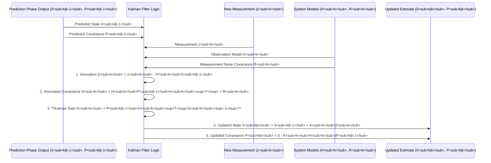
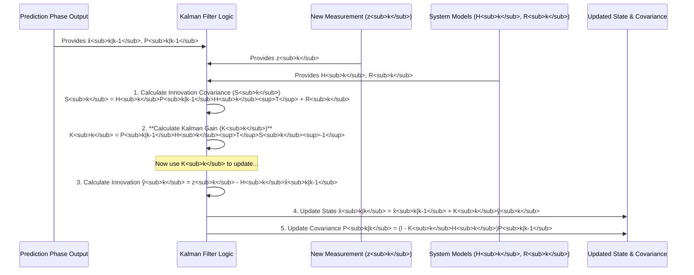

# Chapter 10: Kalman Gain

Welcome to Chapter 10! In the previous chapter, [Chapter 9: Observation Model](09_observation_model_.md), we learned how the `H` matrix helps the Kalman Filter understand what our sensor measurements mean in relation to the actual [System State (State Variables)](02_system_state__state_variables__.md). Now, we're ready to explore one of the most "intelligent" parts of the filter: the **Kalman Gain**.

## The Big Question: Whom to Trust More?

Imagine our Kalman Filter is trying to track our friendly moving dot.
1.  **Prediction**: Based on its previous understanding and the [Dynamic System Model](07_dynamic_system_model_.md), the filter made a prediction: "I think the dot is now at `position_predicted`, but I'm only `P_predicted` sure about this." ([Chapter 6: Prediction Phase](06_prediction_phase_.md)).
2.  **Measurement**: A new, fuzzy sighting (a [Measurement (Observation)](04_measurement__observation__.md)) comes in: "The sensor says the dot is at `position_measured`, and the sensor has an uncertainty of `R`." ([Chapter 4: Measurement (Observation)](04_measurement__observation__.md)).

Now, the filter has two pieces of information: its own (uncertain) prediction and a new (also uncertain) measurement. How does it decide what its *new best guess* for the dot's position should be? Should it fully trust its prediction? Fully trust the measurement? Or, more likely, find a smart way to blend them?

This is exactly where the **Kalman Gain (often denoted as 'K')** comes into play. It's a crucial value calculated during the [Update Phase](08_update_phase_.md) that helps the filter make this decision.

## What is the Kalman Gain? The "Trust Knob"

Think of the **Kalman Gain (K)** as a "trust knob" or a "blending factor." It determines how much the new measurement influences the updated state estimate versus how much the filter relies on its own prediction.

*   **High Kalman Gain**: If the gain is high, the filter will adjust its estimate significantly *towards* the new measurement. This usually happens when the filter believes the measurement is quite reliable (low measurement noise `R`) or when its own prediction was very uncertain (high predicted error covariance `P_{k|k-1}`).
*   **Low Kalman Gain**: If the gain is low, the filter will stick closer to its own prediction and give less weight to the new measurement. This typically occurs if the measurement is deemed very noisy (high `R`) or if the filter was already very confident in its prediction (low `P_{k|k-1}`).

The Kalman Gain isn't a fixed value you set once. It's **dynamically calculated at each time step**, taking into account the current uncertainties of both the prediction and the measurement. This adaptability is what makes the Kalman Filter so powerful.

## How the Kalman Gain is Calculated (A Glimpse at the Math)

The Kalman Gain `K_k` at time step `k` is calculated to minimize the uncertainty (error covariance) of the updated state estimate. While the full derivation involves some matrix calculus, the formula itself uses components we've already encountered:

`K_k = P_{k|k-1} * H_k^T * S_k^{-1}`

Let's break this down conceptually:

*   `P_{k|k-1}`: This is the **predicted error covariance** from the [Prediction Phase](06_prediction_phase_.md). It represents how uncertain the filter is about its own prediction *before* seeing the new measurement. (Covered in [Chapter 3: Covariance (Error Covariance Matrix)](03_covariance__error_covariance_matrix__.md) and [Chapter 6: Prediction Phase](06_prediction_phase_.md)).
*   `H_k`: This is the **observation model matrix** ([Chapter 9: Observation Model](09_observation_model_.md)). It maps the state space to the measurement space.
*   `H_k^T`: This is the **transpose** of the observation model matrix.
*   `S_k`: This is the **innovation covariance** (or measurement prediction covariance). It represents the total uncertainty associated with the "surprise" (the difference between the actual measurement and the predicted measurement). It's calculated as:
    `S_k = H_k * P_{k|k-1} * H_k^T + R_k`
    *   `R_k` is the **measurement noise covariance** ([Chapter 4: Measurement (Observation)](04_measurement__observation__.md)), representing the uncertainty of the sensor itself.
*   `S_k^{-1}`: This is the **inverse** of the innovation covariance matrix.

**The Intuition:**

*   **If `P_{k|k-1}` (prediction uncertainty) is large**: `K_k` tends to be larger. The filter says, "My prediction isn't very good, so I'll rely more on the new measurement."
*   **If `R_k` (measurement uncertainty) is large**: This makes `S_k` large, and `S_k^{-1}` small. So, `K_k` tends to be smaller. The filter says, "This new measurement is very noisy, so I'll stick more to my prediction."
*   The term `P_{k|k-1} * H_k^T` essentially projects the prediction uncertainty into the measurement space.
*   The `S_k^{-1}` term then scales this by how uncertain the "surprise" (innovation) is.

The Kalman Gain `K_k` is a matrix whose dimensions allow it to correctly adjust each state variable based on the (possibly multi-dimensional) innovation.

## How the Kalman Gain is Used in the Update Phase

Once `K_k` is calculated, it plays a direct role in the two main update equations from [Chapter 8: Update Phase](08_update_phase_.md):

1.  **Updating the State Estimate**:
    `x̂_{k|k} = x̂_{k|k-1} + K_k * ỹ_k`
    Where:
    *   `x̂_{k|k}` is the new, updated state estimate.
    *   `x̂_{k|k-1}` is the predicted state estimate.
    *   `ỹ_k` is the **innovation** (or measurement residual): `z_k - H_k * x̂_{k|k-1}`. This is the "surprise" – the difference between the actual measurement `z_k` and what the filter expected to measure.
    The Kalman Gain `K_k` scales this "surprise" to determine how much to correct the predicted state.

2.  **Updating the Error Covariance**:
    `P_{k|k} = (I - K_k * H_k) * P_{k|k-1}`
    Where:
    *   `P_{k|k}` is the new, updated error covariance (representing reduced uncertainty).
    *   `I` is the identity matrix.
    The term `(I - K_k * H_k)` effectively reduces the predicted error covariance `P_{k|k-1}` based on how much information was gained from the measurement (as determined by `K_k` and `H_k`).

### Example: Our 1D Moving Dot – The Gain in Action

Let's recall the numbers from our 1D dot example in [Chapter 8: Update Phase](08_update_phase_.md):
*   Predicted State (`x̂_{k|k-1}`): `[11.0 (pos), 2.0 (vel)]`
*   Predicted Error Covariance (`P_{k|k-1}`): `[[0.35, 0.12], [0.12, 0.14]]`
*   Measurement (`z_k`): `[10.8]` (only position measured)
*   Observation Model (`H_k`): `[[1, 0]]`
*   Measurement Noise Covariance (`R_k`): `[[0.1]]`

We calculated:
*   Innovation (`ỹ_k`): `-0.2`
*   Innovation Covariance (`S_k`): `0.45`
*   **Kalman Gain (`K_k`)**: `[0.778, 0.267]^T` (approximately)

**State Update**:
`x̂_{k|k} = [11.0, 2.0]^T + [0.778, 0.267]^T * (-0.2)`
`x̂_{k|k} ≈ [11.0 - 0.1556, 2.0 - 0.0534]^T ≈ [10.8444, 1.9466]^T`

*   The position estimate moved from the prediction of `11.0` to `10.8444`. It was pulled towards the measurement of `10.8`. The `K_k[0]` (which is `0.778`) determined *how much* of the `-0.2` innovation was applied to the position.
*   The velocity estimate also changed (from `2.0` to `1.9466`), even though velocity wasn't directly measured! This happens because the Kalman Gain's second component `K_k[1]` (`0.267`) linked the position innovation to a velocity correction, thanks to the off-diagonal elements in `P_{k|k-1}` which indicated a correlation between position and velocity errors.

**Covariance Update**:
`P_{k|k} = (I - K_k * H_k) * P_{k|k-1} ≈ [[0.0777, 0.0266], [0.0266, 0.1080]]`
The Kalman Gain `K_k` (along with `H_k`) was instrumental in significantly reducing the uncertainty (the values in `P_{k|k}` are smaller than in `P_{k|k-1}`).

## Internal Calculation Flow for K

Here's a simplified flow diagram showing how the Kalman Gain `K_k` is calculated and then used, based on the equations from the Wikipedia page (`tmp_erm9wcp.txt`) which our project `tmp_erm9wcp` aims to understand.


The critical step is step 3, where `K_k` is computed. It uses the prediction's uncertainty `P_{k|k-1}`, how the state relates to measurements `H_k`, and the total uncertainty of the new information `S_k` (which itself includes the sensor's noise `R_k`).

### Conceptual Code for Calculating Kalman Gain

Let's focus on the Python-like (NumPy) calculation of the Kalman Gain, using variables from our ongoing dot example:

```python
import numpy as np

# From Prediction Phase:
P_predicted = np.array([[0.35, 0.12],   # P_k|k-1
                        [0.12, 0.14]])

# From Observation Model:
H_k = np.array([[1.0, 0.0]])

# From Measurement Noise Model:
R_k = np.array([[0.1]])

# --- Steps to Calculate Kalman Gain (K_k) ---

# Step A: Calculate Innovation Covariance (S_k)
# S_k = H_k @ P_predicted @ H_k.T + R_k
S_k = (H_k @ P_predicted @ H_k.T) + R_k
# print(f"Innovation Covariance (S_k):\n{S_k}") # Will be [[0.45]]

# Step B: Calculate Kalman Gain (K_k)
# K_k = P_predicted @ H_k.T @ np.linalg.inv(S_k)
# Note: H_k.T is the transpose of H_k
#       np.linalg.inv(S_k) is the inverse of S_k
K_k = P_predicted @ H_k.T @ np.linalg.inv(S_k)

print(f"Predicted Error Covariance (P_k|k-1):\n{P_predicted}")
print(f"Observation Model (H_k):\n{H_k}")
print(f"Measurement Noise Covariance (R_k):\n{R_k}")
print(f"Calculated Innovation Covariance (S_k):\n{S_k}")
print(f"Calculated Kalman Gain (K_k):\n{K_k}")
# Output for K_k will be approximately:
# [[0.777...],
#  [0.266...]]
```
**Explanation of Code:**
1.  We have `P_predicted` (our filter's uncertainty about its prediction), `H_k` (how the state relates to the sensor), and `R_k` (how noisy the sensor is).
2.  First, we calculate `S_k`, the innovation covariance. This tells us the overall uncertainty in the difference between our measurement and our prediction, considering both sources of error.
3.  Then, `K_k` is calculated.
    *   `P_predicted @ H_k.T` projects our state uncertainty into the measurement domain.
    *   `np.linalg.inv(S_k)` finds the inverse of `S_k`. Multiplying by this inverse essentially scales our projected state uncertainty by "how much we should trust the innovation."
    *   The resulting `K_k` is the optimal blending factor.

## Analogy: The Expert Panel

Imagine you're trying to guess the temperature in a room.
*   **Your Prediction (`x̂_{k|k-1}`)**: Based on the thermostat setting and how long the AC has been on, you guess it's 20°C. You're moderately confident (`P_{k|k-1}`).
*   **Friend 1's Measurement (`z_k`)**: Your friend has a thermometer (a sensor) and says it's 22°C.
    *   If Friend 1's thermometer is very accurate (low `R_k`), you'll trust their reading more. The Kalman Gain will be higher, pulling your estimate closer to 22°C.
    *   If Friend 1's thermometer is known to be unreliable (high `R_k`), you'll be skeptical. The Kalman Gain will be lower, and your estimate will stay closer to your 20°C prediction.
*   **Your Confidence (`P_{k|k-1}`)**:
    *   If you were very unsure about your initial 20°C prediction (large `P_{k|k-1}`), you'll be more willing to listen to your friend, even if their thermometer is only okay. The Gain will be higher (towards the measurement).
    *   If you were super confident in your 20°C prediction (very small `P_{k|k-1}`), your friend's reading would have to be extremely precise (very small `R_k`) to change your mind much. The Gain will be lower.

The Kalman Gain mathematically balances these factors to find the sweet spot, telling you how much to adjust your estimate based on your friend's input.

## Conclusion

The **Kalman Gain (K)** is a dynamic, intelligently calculated weighting factor. It's the "brains" of the [Update Phase](08_update_phase_.md), dictating how much the filter should trust a new [Measurement (Observation)](04_measurement__observation__.md) versus its own [Prediction Phase](06_prediction_phase_.md) output.

By considering:
*   The uncertainty of its own prediction (`P_{k|k-1}`).
*   The uncertainty of the measurement (`R_k`).
*   How the state relates to the measurement (`H_k`).

The Kalman Gain ensures that the filter optimally blends these pieces of information. This leads to an updated state estimate that is statistically more accurate and more certain than either the prediction or the measurement could be on their own.

Understanding the Kalman Gain is key to appreciating the adaptive and optimal nature of the Kalman Filter. With this, we've covered all the core conceptual components of the Kalman filter as outlined in our tutorial structure! You now have a foundational understanding of how the `tmp_erm9wcp` project uses these ideas to make sense of noisy data.# Chapter 10: Kalman Gain

Welcome to Chapter 10! In [Chapter 9: Observation Model](09_observation_model_.md), we explored how the Observation Model (`H_k`) acts as a translator, helping the Kalman Filter understand how sensor measurements relate to the true [System State (State Variables)](02_system_state__state_variables__.md). Now, we're ready to look at the "magic" ingredient that decides how to blend our predictions with these real-world measurements: the **Kalman Gain**.

## The Balancing Act: Prediction vs. Measurement

Let's return to our familiar "mystery moving dot."
1.  **Prediction Step**: Our Kalman Filter, using its [Dynamic System Model](07_dynamic_system_model_.md), has just made a forecast: "I predict the dot is at position `x_predicted = 11.0`, and my uncertainty about this is `P_predicted` (e.g., a variance of 0.35 for position)." This is its educated guess from the [Prediction Phase](06_prediction_phase_.md).
2.  **Measurement Arrives**: Suddenly, our sensor gives us a new [Measurement (Observation)](04_measurement__observation__.md): "I see the dot at `z_measured = 10.8`. I know my sensor has some noise, quantified by `R` (e.g., a variance of 0.1)."

The filter now has two pieces of information about the dot's current position:
*   Its own prediction (11.0, with uncertainty 0.35).
*   The sensor's measurement (10.8, with uncertainty 0.1).

Neither is perfect. How should the filter combine these to get the best possible new estimate? Should it trust its prediction more, or the new measurement more? This is the crucial decision the Kalman Gain helps make.

## What is the Kalman Gain (K)? The "Trust Dial"

The **Kalman Gain**, often denoted by the letter **K**, is a value calculated during the filter's [Update Phase](08_update_phase_.md). Think of it as a "trust dial" or a "blending factor." It determines how much weight the filter gives to the new measurement versus how much it relies on its own prediction.

*   **If K is High**: The filter will significantly adjust its state estimate *towards* the new measurement. It's like saying, "The new measurement seems quite reliable, or my prediction was very fuzzy, so I'll lean heavily on this new data."
*   **If K is Low**: The filter will make a smaller adjustment based on the measurement, sticking closer to its original prediction. It's like saying, "This new measurement looks very noisy, or my prediction was already quite good, so I'll only nudge my estimate a little."

The beauty of the Kalman Gain is that it's not a fixed value. It's **dynamically calculated at every time step**, taking into account the current uncertainties.

*   If the **measurement is deemed very reliable** (low measurement noise `R`, from [Chapter 4: Measurement (Observation)](04_measurement__observation__.md)), the Kalman Gain will tend to be higher.
*   If the **filter's own prediction is very uncertain** (high predicted error covariance `P_{k|k-1}`, from [Chapter 3: Covariance (Error Covariance Matrix)](03_covariance__error_covariance_matrix__.md) and [Chapter 6: Prediction Phase](06_prediction_phase_.md)), the Kalman Gain will also tend to be higher (giving more weight to the new measurement, assuming it's not incredibly noisy itself).

## How is the Kalman Gain Calculated? (The Core Idea)

The Kalman Gain `K_k` (at time step `k`) is calculated in such a way that it minimizes the error (specifically, the mean square error) of the updated state estimate. The formula, as seen in `tmp_erm9wcp.txt` (our Wikipedia reference), is:

`K_k = P_{k|k-1} * H_k^T * S_k^{-1}`

Let's break down these components in a friendly way:

*   `P_{k|k-1}`: This is the **predicted error covariance**. It's the filter's uncertainty about its own prediction *before* seeing the new measurement. A larger `P_{k|k-1}` means more uncertainty in the prediction.
*   `H_k`: This is the **observation model matrix** from [Chapter 9: Observation Model](09_observation_model_.md). It translates the state variables into what the sensor would measure.
*   `H_k^T`: This is the **transpose** of `H_k`. (It helps to correctly align matrix dimensions for multiplication).
*   `S_k`: This is the **innovation covariance** (also called measurement prediction covariance). It represents the total uncertainty of the "surprise" part of the measurement (the difference between the actual measurement and what the filter predicted the measurement would be). It's calculated as:
    `S_k = H_k * P_{k|k-1} * H_k^T + R_k`
    *   `R_k` is the **measurement noise covariance** – the sensor's own uncertainty ([Chapter 4: Measurement (Observation)](04_measurement__observation__.md)).
*   `S_k^{-1}`: This is the **inverse** of the innovation covariance matrix `S_k`.

**The Intuition Behind the Formula:**

*   The term `P_{k|k-1} * H_k^T` represents how much the state's uncertainty contributes to the measurement's uncertainty.
*   `S_k` is the total uncertainty of the measurement prediction (combining state prediction uncertainty projected into measurement space, and actual measurement noise).
*   So, `K_k` is essentially saying: "How much of the state's uncertainty is 'visible' in the measurement, relative to the total uncertainty of that measurement (including sensor noise)?"

Essentially:
*   If `P_{k|k-1}` (prediction uncertainty) is large compared to `R_k` (measurement uncertainty), `K_k` will be larger. The filter trusts the measurement more.
*   If `R_k` (measurement uncertainty) is large compared to `P_{k|k-1}` (prediction uncertainty), then `S_k` will be large, making `S_k^{-1}` small, and thus `K_k` will be smaller. The filter trusts its prediction more.

The Kalman Gain is a matrix. Its size allows it to correctly scale the (potentially multi-dimensional) "surprise" from the measurement to update each of the (potentially multi-dimensional) state variables.

## How the Kalman Gain is Used in the [Update Phase](08_update_phase_.md)

Once `K_k` is calculated, it directly influences how the state estimate and its uncertainty are updated:

1.  **Updating the State Estimate (`x̂_{k|k}`)**:
    `x̂_{k|k} = x̂_{k|k-1} + K_k * ỹ_k`
    *   `x̂_{k|k-1}` is the predicted state.
    *   `ỹ_k` is the **innovation** or "surprise": `z_k - (H_k * x̂_{k|k-1})`. It's the difference between the actual measurement `z_k` and what the filter *expected* to measure.
    The Kalman Gain `K_k` scales this innovation. If `K_k` is large, a large portion of the innovation is added to the prediction. If `K_k` is small, only a small portion is added.

2.  **Updating the Error Covariance (`P_{k|k}`)**:
    `P_{k|k} = (I - K_k * H_k) * P_{k|k-1}`
    *   `I` is the identity matrix.
    This equation shows how the Kalman Gain `K_k` (along with `H_k`) helps to *reduce* the uncertainty of the prediction `P_{k|k-1}`. A "good" measurement (leading to a meaningful `K_k`) will result in `P_{k|k}` being smaller than `P_{k|k-1}`, meaning the filter is now more confident.

### Back to Our 1D Dot: How K Shaped the Update

In [Chapter 8: Update Phase](08_update_phase_.md), we had:
*   Predicted State (`x̂_{k|k-1}`): `[11.0 (pos), 2.0 (vel)]^T`
*   Measurement (`z_k`): `[10.8]`
*   Innovation (`ỹ_k`): `-0.2`
*   **Kalman Gain (`K_k`)**: `[0.778, 0.267]^T` (approximately)

When we updated the state: `x̂_{k|k} = x̂_{k|k-1} + K_k * ỹ_k`
`x̂_{k|k} = [11.0, 2.0]^T + [0.778, 0.267]^T * (-0.2) ≈ [10.8444, 1.9466]^T`

*   **Position update**: The position estimate changed from `11.0` to `10.8444`. The correction was `K_k[0] * ỹ_k = 0.778 * (-0.2) ≈ -0.1556`. The gain `0.778` determined how much of the `-0.2` difference was applied.
*   **Velocity update**: The velocity estimate changed from `2.0` to `1.9466`. The correction was `K_k[1] * ỹ_k = 0.267 * (-0.2) ≈ -0.0534`. This shows that even though only position was measured, the gain `K_k` (derived from the covariances) knew how to translate a surprise in position into an adjustment for velocity.

The Kalman Gain was the crucial factor deciding the magnitude of these adjustments.

## The "Under the Hood" Calculation of K

Let's visualize the sequence of events focusing on `K_k`'s calculation and role during the Update Phase.


The diagram highlights that calculating `K_k` (Step 2) happens after understanding the total uncertainty of the new information (`S_k`), and it uses the predicted uncertainty `P_{k|k-1}`, the observation model `H_k`, and this total innovation uncertainty `S_k`.

### Conceptual Code for Calculating K

Here's a simplified Python-like snippet (using NumPy) focusing on calculating the Kalman Gain `K_k`, using the values from our dot example:

```python
import numpy as np

# --- Inputs to Kalman Gain Calculation ---
# Predicted Error Covariance (from Prediction Phase)
P_predicted = np.array([[0.35, 0.12],   # This is P_k|k-1
                        [0.12, 0.14]])

# Observation Model (how state relates to measurement)
H_k = np.array([[1.0, 0.0]])

# Measurement Noise Covariance (sensor's uncertainty)
R_k = np.array([[0.1]])

# --- Step 1: Calculate Innovation Covariance (S_k) ---
# S_k = H_k * P_predicted * H_k_transpose + R_k
H_k_transpose = H_k.T
S_k = (H_k @ P_predicted @ H_k_transpose) + R_k
# For our example, S_k becomes [[0.45]]

# --- Step 2: Calculate Kalman Gain (K_k) ---
# K_k = P_predicted * H_k_transpose * S_k_inverse
S_k_inverse = np.linalg.inv(S_k) # Calculate inverse of S_k
K_k = P_predicted @ H_k_transpose @ S_k_inverse

print(f"P_predicted (P_k|k-1):\n{P_predicted}")
print(f"H_k:\n{H_k}")
print(f"R_k:\n{R_k}")
print(f"Calculated S_k (Innovation Covariance):\n{S_k}")
print(f"Calculated K_k (Kalman Gain):\n{K_k}")
# K_k will be approximately:
# [[0.777...]
#  [0.266...]]
```

**Code Explanation:**
1.  We start with the necessary matrices: `P_predicted` (filter's current uncertainty about its prediction), `H_k` (how measurements relate to the state), and `R_k` (sensor noise).
2.  We calculate `S_k`, the innovation covariance. This tells us the total expected "fuzziness" of the difference between our measurement and our prediction.
3.  We then compute `K_k`.
    *   `P_predicted @ H_k_transpose`: Projects the state's uncertainty into the "measurement space."
    *   `np.linalg.inv(S_k)`: Inverts the innovation covariance.
    *   Multiplying these together gives `K_k`, the optimal weighting factor. This `K_k` will then be used to update the state and its covariance.

## Analogy: The Weather Forecaster's Dilemma

Think of a weather forecaster.
*   **Prediction**: Yesterday, they predicted today's temperature would be 20°C. Their confidence in this prediction isn't perfect (this is like `P_{k|k-1}`).
*   **New Data**: A weather balloon sends back a current temperature reading of 18°C. This balloon's sensor also has some known inaccuracy (like `R_k`).

The **Kalman Gain** is like the forecaster's sophisticated internal calculation that decides:
*   "How much should I trust this new balloon reading versus my own prediction?"
*   If the balloon's sensor is known to be very precise (low `R_k`), and perhaps the forecaster's model wasn't very confident yesterday (high `P_{k|k-1}`), the Gain will be high. The forecast will shift significantly towards 18°C.
*   If the balloon's sensor is known to be erratic (high `R_k`), or the forecaster was very sure about their 20°C prediction (low `P_{k|k-1}`), the Gain will be low. The forecast might only nudge slightly, perhaps to 19.8°C.

The Kalman Gain ensures this "nudging" is done in an optimal way to minimize the overall error in the final temperature estimate.

## Conclusion

The **Kalman Gain (K)** is the heart of the Kalman Filter's adaptability. It's not a fixed parameter but a value computed dynamically at each step. It intelligently determines how to blend the filter's own prediction with new, noisy measurements by carefully weighing their respective uncertainties (`P_{k|k-1}` and `R_k`) and how they relate (`H_k`).

This ensures that the state estimate is corrected in an optimal way, leading to the best possible estimate given the available information. The Kalman Gain is what makes the filter "learn" effectively from new data during the [Update Phase](08_update_phase_.md).

We have now covered all the fundamental conceptual building blocks of the Kalman Filter described in our tutorial structure! By understanding the [System State (State Variables)](02_system_state__state_variables__.md), its [Covariance (Error Covariance Matrix)](03_covariance__error_covariance_matrix__.md), the nature of [Measurements (Observation)](04_measurement__observation__.md) and their models ([Observation Model](09_observation_model_.md)), the [Recursive Nature](05_recursive_nature_.md) of the filter, the [Prediction Phase](06_prediction_phase_.md) with its [Dynamic System Model](07_dynamic_system_model_.md), the [Update Phase](08_update_phase_.md), and now the Kalman Gain, you have a solid foundation for appreciating how the `tmp_erm9wcp` project uses these principles for powerful estimation.

---

Generated by [AI Codebase Knowledge Builder](https://github.com/The-Pocket/Tutorial-Codebase-Knowledge)