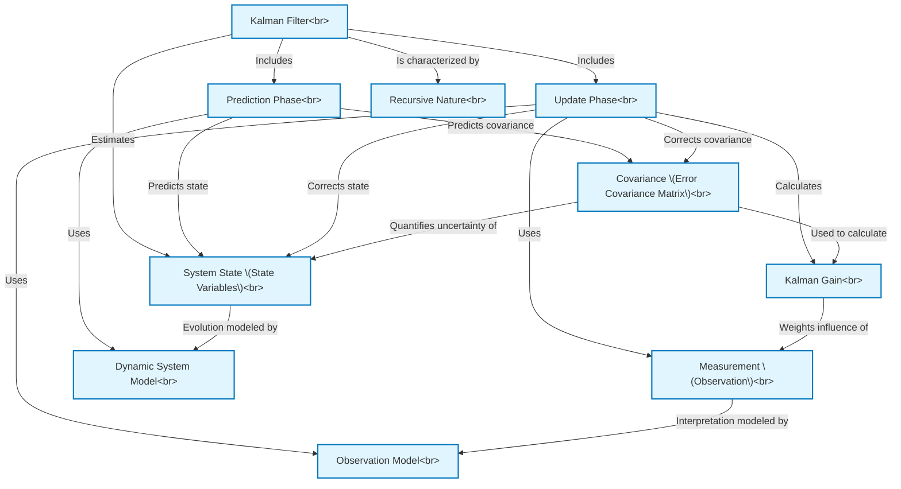

# Tutorial: tmp_erm9wcp

The project `tmp_erm9wcp` provides information about the **Kalman Filter**, an *algorithm* used to make **more accurate estimates** of unknown variables (the *system state*) over time. It achieves this by cleverly combining a series of *noisy measurements* with a *mathematical model of how the system behaves*, operating in a recursive **predict-update cycle** to continuously refine its estimates and their uncertainty.

**Source Repository:** [None](None)

## Chapters

1. [Kalman Filter
](01_kalman_filter_.md)
2. [System State (State Variables)
](02_system_state__state_variables__.md)
3. [Covariance (Error Covariance Matrix)
](03_covariance__error_covariance_matrix__.md)
4. [Measurement (Observation)
](04_measurement__observation__.md)
5. [Recursive Nature
](05_recursive_nature_.md)
6. [Prediction Phase
](06_prediction_phase_.md)
7. [Dynamic System Model
](07_dynamic_system_model_.md)
8. [Update Phase
](08_update_phase_.md)
9. [Observation Model
](09_observation_model_.md)
10. [Kalman Gain
](10_kalman_gain_.md)

---

Generated by [AI Codebase Knowledge Builder](https://github.com/The-Pocket/Tutorial-Codebase-Knowledge)