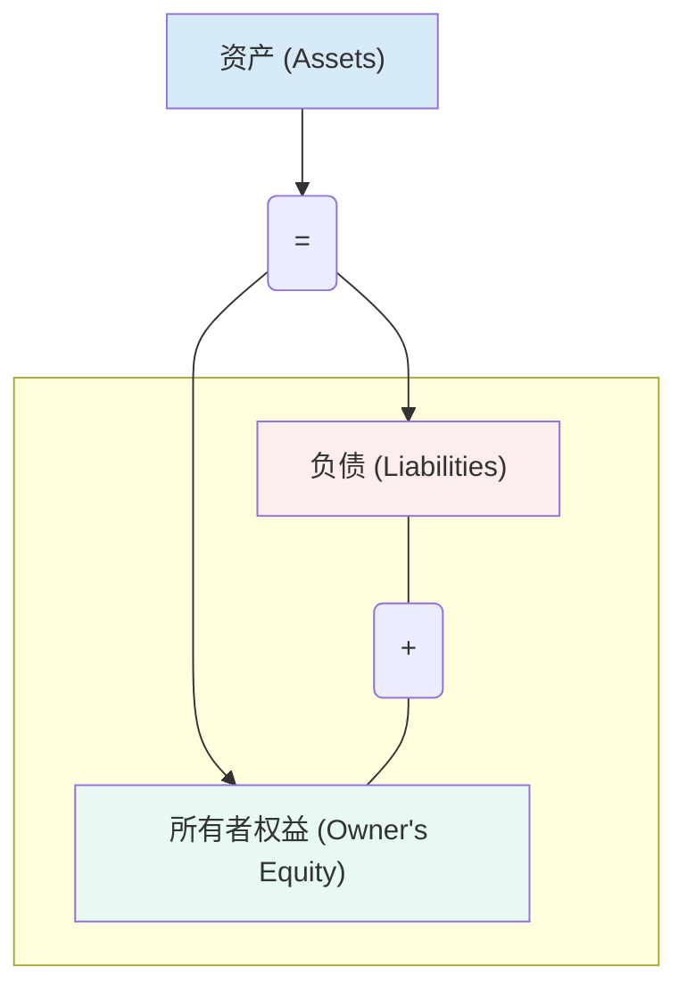
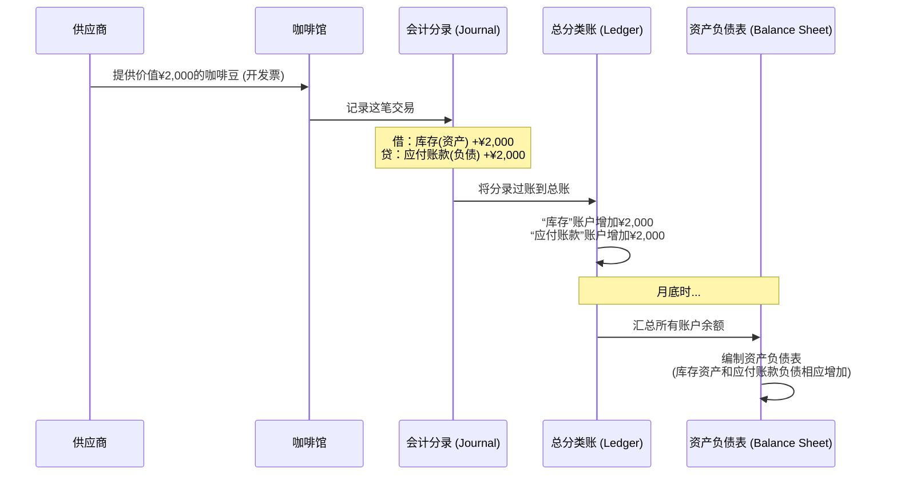

# Chapter 1: 财务与会计

欢迎来到《一日MBA》课程！这是我们的第一站，我们将从所有商业活动的基础开始：财务与会计。你可能觉得这些词听起来有点吓人，充满了数字和复杂的规则。但请放心，本章将用最简单、最友好的方式，为你揭开它们的神秘面紗。

想象一下，你刚刚开了一家梦想中的咖啡馆。每天顾客盈门，你忙得不亦乐乎。但月底时，一个问题困扰着你：我这个月到底赚了多少钱？银行账户里的钱似乎多了，但你又刚花钱买了一批新咖啡豆和牛奶。这家咖啡馆是在健康成长，还是在“赔本赚吆喝”？

要回答这个问题，你就需要学习商业的“语言”——财务与会计。

## 什么是财务与会计？商业的仪表盘

财务与会计是商业的“语言”和“仪表盘”，它通过记录、衡量和报告企业所有的经济活动来反映其经营状况。

这就像驾驶一辆汽车。你需要通过仪表盘了解车速、油量、发动机温度等关键信息，才能安全、高效地把车开到目的地。如果没有仪表盘，你只能凭感觉猜测油还够不够，车速是不是太快了。

在商业世界里，财务报表就是企业的仪表盘。它告诉你公司的“速度”（销售增长）、“油量”（现金储备）和“发动机状况”（盈利能力）。没有财务知识，管理者就像在黑暗中驾驶，仅凭直觉做决策，这无疑是极其危险的。

## 核心概念：理解两大关键报表

要读懂企业的仪表盘，我们首先需要认识两个最重要的部分：**利润表**和**资产负债表**。在我们深入了解它们之前，必须先掌握一个最基本的公式，它是所有会计工作的基础。

### 会计基石：会计恒等式

所有复杂的会计规则都建立在一个非常简单的等式上：

**资产 = 负债 + 所有者权益**

这是什么意思呢？让我们用你的咖啡馆来解释：

*   **资产 (Assets)**：这是你的咖啡馆所**拥有**的有价值的东西。比如：
    *   现金
    *   咖啡机、磨豆机（设备）
    *   咖啡豆、牛奶（库存）
    *   桌子、椅子（家具）

*   **负债 (Liabilities)**：这是你的咖啡馆**欠**别人的钱。比如：
    *   购买咖啡机时银行的贷款
    *   欠供应商的咖啡豆货款

*   **所有者权益 (Owner's Equity)**：这是**真正属于你**的部分，是资产减去负债后剩下的净值。它通常包括：
    *   你最初投入的创业资金
    *   公司赚到但尚未分配的利润（留存收益）

这个等式永远成立。比如，你花了5万元买了一台咖啡机。其中2万元是你自己的钱（权益），另外3万元是银行贷款（负债）。那么：

**咖啡机（资产：5万） = 银行贷款（负债：3万） + 你的投资（权益：2万）**

这个等式就像一个天平，左右两边永远保持平衡。你所拥有的东西（资产），要么是借来的（负债），要么是你自己的（权益）。

### 报表一：利润表 (Income Statement) - 我赚钱了吗？

利润表，又称损益表，回答了一个企业家最关心的问题：“在**一段时间内**（比如一个月或一年），我到底是赚钱了还是亏钱了？”

它的核心逻辑非常简单：

**收入 - 费用 = 利润**

让我们为你的咖啡馆制作一张极简的利润表：

**咖啡馆一月利润表**

| 项目 (Item) | 金额 (Amount) | 备注 (Notes) |
| :--- | :--- | :--- |
| **营业收入 (Revenue)** | ¥30,000 | 卖咖啡、蛋糕等所有收入 |
| **减：费用 (Expenses)** | | |
| 咖啡豆、牛奶成本 | ¥8,000 | 原材料成本 |
| 员工工资 | ¥6,000 | 支付给咖啡师的薪水 |
| 店铺租金 | ¥5,000 | 每月固定的租金 |
| 水电费 | ¥1,000 | |
| **费用合计 (Total Expenses)** | **(¥20,000)** | 所有费用的总和 |
| **净利润 (Net Income)** | **¥10,000** | **收入 - 费用** |

这张表清楚地告诉你，一月份，你的咖啡馆净赚了10,000元。这个数字就是这段时间里，你通过经营活动创造的价值。管理者需要密切关注利润表，来评估企业的**盈利能力**。

### 报表二：资产负债表 (Balance Sheet) - 我的家底有多少？

与利润表不同，资产负债表显示的是在**一个特定的时间点**（比如1月31日），你的公司的财务状况。它就像一张财务快照。

它完美地体现了我们之前学过的会计恒等式：`资产 = 负债 + 所有者权益`。

让我们看看你的咖啡馆在1月31日的资产负债表是什么样的：

**咖啡馆资产负债表 (截至1月31日)**

| 资产 (Assets) | 金额 (Amount) | 负债和所有者权益 (Liabilities & Equity) | 金额 (Amount) |
| :--- | :--- | :--- | :--- |
| **资产部分** | | **负债部分** | |
| 现金 | ¥15,000 | 银行贷款 | ¥28,000 |
| 库存 (咖啡豆等) | ¥5,000 | 应付账款 (欠供应商) | ¥2,000 |
| 设备 (咖啡机) | ¥49,000 | **负债合计** | **¥30,000** |
| | | **所有者权益部分** | |
| | | 初始投资 | ¥20,000 |
| | | 留存收益 (本月利润) | ¥19,000 |
| | | **权益合计** | **¥39,000** |
| **资产总计** | **¥69,000** | **负债和权益总计** | **¥69,000** |

从这张快照中，我们可以看到：
1.  **左边等于右边**：资产总计（69,000）= 负债合计（30,000）+ 权益合计（39,000）。会计恒等式永远成立！
2.  **公司家底**：你的咖啡馆拥有价值69,000元的资产。
3.  **资金来源**：这些资产中，有30,000元是借来的，有39,000元是属于你自己的。
4.  **公司健康状况**：通过分析负债和权益的比例，我们可以初步判断公司的财务风险。

管理者通过阅读资产负债表，可以了解公司的财务结构、偿债能力和资源状况，从而做出更明智的决策。

## 背后原理：一笔交易是如何记录的？

你可能会好奇，一杯咖啡的销售是如何最终体现在这些复杂的报表上的。这个过程被称为**会计循环（Accounting Cycle）**，它就像一个信息处理流水线。

让我们用一个简单的例子来追踪一笔交易：
**交易：** 你向供应商赊购了一批价值2,000元的咖啡豆。

这个过程的核心是**复式记账法 (Double-Entry Bookkeeping)**，正如在我们的“源代码”`MBA In A Day.pdf`的第99页所描述的。每一笔交易都至少影响两个账户，一个记为“借方 (Debit)”，一个记为“贷方 (Credit)”，且借贷金额必须相等。这保证了会计恒等式 `资产 = 负债 + 所有者权益` 永远保持平衡。

*   **对于购买咖啡豆的交易：**
    *   你**得到**了咖啡豆，所以“库存”（一种资产）增加了。在会计中，资产增加记为**借方**。
    *   你**欠**了供应商钱，所以“应付账款”（一种负债）也增加了。负债增加记为**贷方**。

通过这样日复一日的记录和汇总，企业的所有经济活动都被精确地捕捉下来，并最终呈现在财务报表上，为管理者提供了清晰的决策依据。

## 总结

在本章中，我们学习了财务与会计的基础知识。你现在应该理解了：

*   **财务与会计是商业的语言**，是帮助管理者做出明智决策的仪表盘。
*   核心的**会计恒等式**：`资产 = 负债 + 所有者权益`，是所有会计记录的基础。
*   **利润表**告诉我们企业在一段时间内的**盈利状况**。
*   **资产负债表**则展示了企业在特定时间点的**财务快照**。
*   每一笔交易都通过**复式记账法**被记录下来，确保了数据的准确和平衡。

理解这些基本概念，你就拥有了看懂企业“体检报告”的能力。这为你评估任何商业机会或管理任何规模的组织都打下了坚实的基础。

在了解了如何衡量一家公司的“健康状况”之后，我们自然会问：如何为这家公司制定一个长远的、能够致胜的行动计划呢？这正是我们下一章将要探讨的内容。

接下来，让我们一起学习 [战略管理](02_战略管理.md)。

---

Generated by [AI Codebase Knowledge Builder](https://github.com/The-Pocket/Tutorial-Codebase-Knowledge)