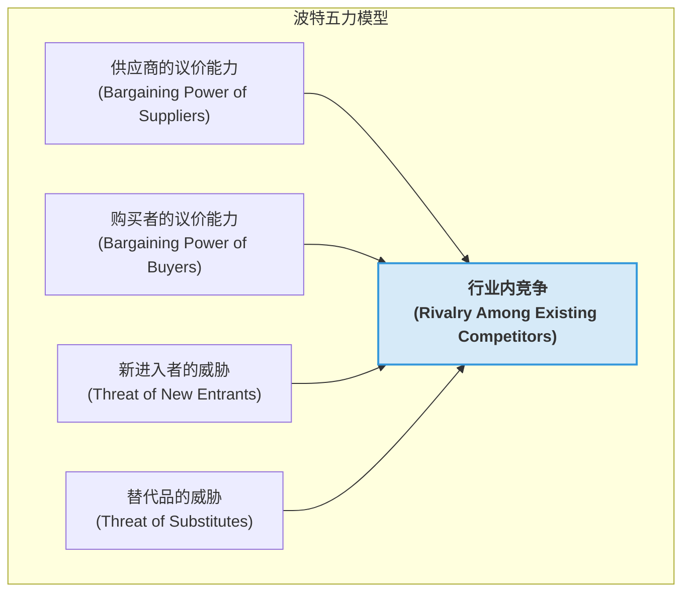
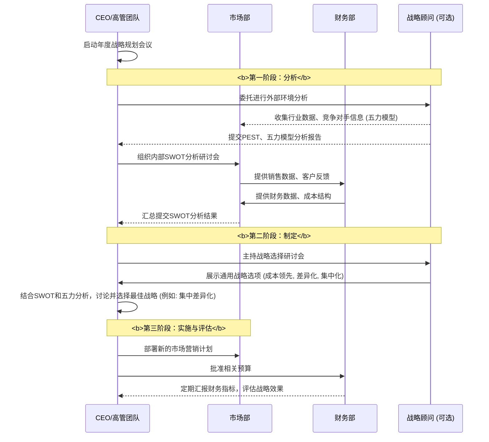

# Chapter 2: 战略管理


在上一章 [财务与会计](01_财务与会计_.md) 中，我们学会了如何使用财务报表来诊断一家公司的“健康状况”。我们知道了咖啡馆上个月赚了多少钱，也清楚了它的家底。但这只是第一步。知道自己很健康，并不能保证在未来的马拉松比赛中一定能获胜。

现在，设想一个更严峻的挑战：你发现一家全国知名的连锁咖啡品牌（比如星巴克或瑞幸）即将在你的街角开一家新店。你的咖啡馆虽然小有盈利，但面对这样强大的对手，你感到了前所未有的压力。你开始思考：

*   我应该降价竞争吗？
*   还是应该专注于我独特的、手工制作的特色咖啡？
*   或者，我应该把咖啡馆重新装修，打造成一个更吸引人的社区空间？

这些问题不再是简单的“我今天赚了多少钱”，而是关乎“我明天以及未来如何才能活下去，并且活得更好”的生存问题。要回答这些问题，你需要从日常运营中抬起头，像一位将军一样审视整个战场，并制定一套长远的作战计划。这就是**战略管理**。

## 什么是战略管理？企业的致胜蓝图

战略管理是企业为获得并维持**竞争优势**而制定长期发展蓝图的过程。它不是关于如何处理日常琐事，而是关于如何赢得整场战争。

这就像一位象棋大师。他不仅要了解自己每个棋子的优势（车快、马活），还要分析整个棋局（对手的布局），预测对手的动向，并提前规划好几步棋，以确保最终的胜利。

对于你的咖啡馆来说，战略管理意味着：
*   **分析外部环境**：那家即将开业的连锁巨头是谁？它有什么优势（品牌响、价格标准化）？经济大环境怎么样？顾客的消费习惯有什么变化？
*   **审视内部能力**：我的咖啡馆有什么独一无二的地方（温馨的氛围、与顾客的良好关系、独特的咖啡豆配方）？我有什么不足（资金有限、品牌知名度低）？
*   **制定行动方案**：基于以上分析，我应该采取什么行动来发挥我的优势、弥补我的劣势，并应对外部的威胁？

战略为企业的所有关键决策（如产品开发、市场营销、财务投资等）提供了方向和框架，确保所有努力都指向同一个目标：**赢得竞争**。

## 核心概念：像战略家一样思考

战略管理虽然听起来很宏大，但我们可以把它分解成几个非常实用的思考工具。这些工具能帮助你系统地分析局势，做出更明智的决策。

### 第一步：知己知彼 - SWOT 分析

在制定任何计划之前，你必须对自己和环境有一个清晰的认识。SWOT分析就是一个经典的工具，帮助你从四个维度梳理思路。SWOT是四个词的缩写：

*   **优势 (Strengths)**：你内部做得好的地方，你拥有的独特资源。
*   **劣势 (Weaknesses)**：你内部做得不好的地方，你欠缺的资源。
*   **机会 (Opportunities)**：外部环境中对你有利的因素或趋势。
*   **威胁 (Threats)**：外部环境中对你不利的因素或趋势。

优势和劣势是**内部因素**（你可以控制），机会和威胁是**外部因素**（你无法控制，但可以应对）。

让我们为你的咖啡馆做一个SWOT分析：

```mermaid
graph TD
    subgraph 内部因素 (可控)
        S["<b>优势 (Strengths)</b><br/>- 独特的装修风格，氛围温馨<br/>- 拥有忠实的本地熟客<br/>- 老板亲手调制的特色咖啡<br/>- 灵活，决策快"]
        W["<b>劣势 (Weaknesses)</b><br/>- 资金有限，营销预算低<br/>- 品牌知名度不高<br/>- 空间小，座位有限<br/>- 依赖老板个人能力"]
    end

    subgraph 外部因素 (不可控)
        O["<b>机会 (Opportunities)</b><br/>- 社区对本地小店的支持度高<br/>- 人们寻求咖啡馆作为“第三空间”<br/>- 可以与本地艺术家/书店合作<br/>- 外卖平台兴起"]
        T["<b>威胁 (Threats)</b><br/>- 全国连锁品牌即将入驻<br/>- 咖啡豆等原材料成本上升<br/>- 消费者对价格更敏感"]
    end

    style S fill:#E8F8F5
    style W fill:#FDEDEC
    style O fill:#EBF5FB
    style T fill:#F9EBEA
```

通过这个矩阵，你的处境一目了然。你的核心优势在于“小而美”的独特性和本地关系，而最大的威胁就是那个“大而全”的连锁品牌。你的战略就应该围绕“如何利用我的优势和机会，去应对我的劣批和威胁”来展开。

### 第二步：审视战场 - 波特五力模型

仅仅了解自己还不够，你还需要理解你所在的“行业战场”的竞争有多激烈。哈佛大学教授迈克尔·波特提出的**五力模型**是一个强大的分析工具，它指出了决定行业吸引力和盈利能力的五种力量。

这五种力量就像五座大山，压得行业里的公司喘不过气来。压力越大，在这个行业赚钱就越难。



让我们用这个模型分析一下你所在的咖啡馆行业：

1.  **行业内竞争 (Rivalry)**：**非常激烈**。不仅有即将开业的连锁巨头，还有其他独立咖啡馆、奶茶店，甚至便利店的现磨咖啡。大家都在争夺同一批顾客。
2.  **新进入者的威胁 (Threat of New Entrants)**：**高**。开一家咖啡馆的门槛相对较低，不需要特别复杂的技术或许可，所以随时都可能有新的竞争者出现。
3.  **替代品的威胁 (Threat of Substitutes)**：**高**。顾客不喝咖啡可以喝茶、果汁、可乐，或者干脆在家里自己冲速溶咖啡。这些都是你的替代品。
4.  **供应商的议价能力 (Bargaining Power of Suppliers)**：**中等**。如果你依赖一种非常独特的、稀有的咖啡豆，那么这个供应商对你的议价能力就很强。但如果是一般的咖啡豆和牛奶，你可以从很多家供应商那里采购，他们的议价能力就弱一些。
5.  **购买者的议价能力 (Bargaining Power of Buyers)**：**高**。因为有很多选择（竞争激烈），顾客可以轻松地“用脚投票”，今天在你家喝，明天去别家。他们对价格和品质都很敏感。

分析结论是什么？咖啡馆行业是一个竞争异常激烈的“红海市场”。五股力量中有四股都对你不利。这意味着，想在这个行业里轻松赚钱几乎是不可能的。你必须找到一种非常聪明的方式来脱颖而出。

### 第三步：确立方向 - 通用竞争战略

好了，通过SWOT和五力模型，我们已经对内外部环境有了深刻的了解。现在，我们该如何行动？迈克尔·波特还提出了三种可以帮助企业获得竞争优势的“通用战略”。这就像是战场上的三种基本战术。

1.  **成本领先 (Cost Leadership)**：目标是成为行业中成本最低的生产者。通过规模化、高效运营，以比竞争对手更低的价格提供产品，从而吸引对价格敏感的顾客。
    *   **例子**：沃尔玛、瑞幸咖啡。它们的成功很大程度上依赖于强大的供应链和成本控制能力。
    *   **适合你的咖啡馆吗？** **不适合**。作为一家小店，你不可能在采购成本和运营效率上与连锁巨头抗衡。跟它们打价格战，无异于以卵击石。

2.  **差异化 (Differentiation)**：目标是在产品或服务上提供一些独特的、被顾客认为有价值的东西，从而让顾客愿意为此支付更高的价格。
    *   **例子**：苹果公司、星巴克（早期）。苹果手机价格昂贵，但人们愿意为其设计、生态系统和品牌价值买单。星巴克提供的不仅仅是咖啡，更是一种“第三空间”的体验。
    *   **适合你的咖啡馆吗？** **非常适合！** 这正是你的机会所在。你的“温馨氛围”、“老板特调”、“与熟客的亲切互动”都是连锁店难以复制的差异化优势。

3.  **集中化 (Focus/Niche)**：这不是一个独立的战略，而是前两种战略的应用范围。它意味着不服务于整个市场，而是专注于一个特定的、细分的客户群体（利基市场），并在这个小市场里实施成本领先或差异化。
    *   **例子**：专门为素食主义者提供餐饮的餐厅、只销售高端户外运动装备的商店。
    *   **适合你的咖啡馆吗？** **非常适合！** 你可以结合差异化战略，将目标客户**集中**在“追求高品质手冲咖啡的爱好者”、“需要安静空间的自由职业者”或“喜爱本地文化的文艺青年”身上。

**你的战略选择：**
基于以上分析，你的咖啡馆的最佳战略应该是**“集中差异化” (Focused Differentiation)**。
*   **不求大而全**：放弃与连锁品牌争夺所有顾客。
*   **专注小而美**：专注于服务好一个特定的客户群体。
*   **打造独特性**：强化你的差异化优势，比如：
    *   **产品上**：开发独家手冲咖啡菜单，定期更换精品咖啡豆。
    *   **体验上**：举办读书会、民谣弹唱夜、本地艺术家画展，将咖啡馆打造成一个真正的社区文化中心。
    *   **服务上**：记住熟客的喜好，提供个性化服务，建立情感连接。

这个战略让你巧妙地避开了与巨头的正面冲突，在它们无法顾及的细分领域里，建立了属于你自己的“护城河”。

## 背后原理：战略是如何产生的？

你可能会好奇，这些战略框架（如SWOT、五力模型）是如何在真实的公司里运作的。这个过程通常是一个系统性的、周期性的活动，涉及公司的高层管理团队。

正如`MBA In A Day.pdf`的第157页到第164页所描述的，战略分析是一个系统工程。我们可以用一个简化的流程图来展示一家公司制定战略的过程：



这个流程的核心在于：
1.  **数据驱动**：战略不是凭空想象的，而是基于对市场、竞争对手和自身情况的详尽数据分析。
2.  **系统性思考**：通过SWOT、五力模型等框架，确保思考的全面性，避免遗漏关键因素。
3.  **高层决策**：战略是关乎公司未来的重大决策，必须由高层领导者（CEO、董事会）最终确定方向。
4.  **持续循环**：市场在不断变化，因此战略规划不是一次性的活动，而是一个需要定期回顾和调整的动态过程。

## 总结

在本章中，我们踏入了商业世界的“作战室”，学习了如何像一位战略家一样思考。你现在应该理解了：

*   **战略管理是关于选择和取舍**，决定了企业在竞争中“做什么”和“不做什么”，是企业的致胜蓝图。
*   **SWOT分析**是一个强大的工具，可以帮助你系统地评估自身的**优势、劣势、机会和威胁**。
*   **波特五力模型**揭示了决定一个行业盈利潜力的五种关键力量，帮助你理解战场的激烈程度。
*   **三种通用竞争战略**——成本领先、差异化、集中化——为你指明了建立竞争优势的基本路径。

通过这些工具，你为你的咖啡馆制定了**“集中差异化”**的战略。你决定不再盲目地与强大的对手硬碰硬，而是选择了一条更聪明、更适合自己的道路。

但是，一个再好的战略，如果顾客不知道、不认可，那也只是纸上谈兵。如何将你的“独特性”有效地传达给你的目标客户，让他们喜爱你、选择你，并愿意为你买单呢？这就需要市场营销和品牌的力量。

接下来，让我们一起学习 [市场营销与品牌建设](03_市场营销与品牌建设_.md)。

---

Generated by [AI Codebase Knowledge Builder](https://github.com/The-Pocket/Tutorial-Codebase-Knowledge)