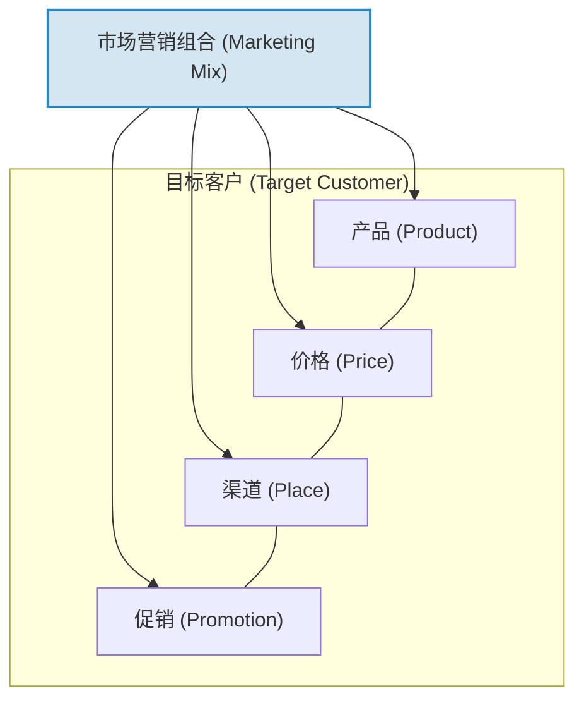
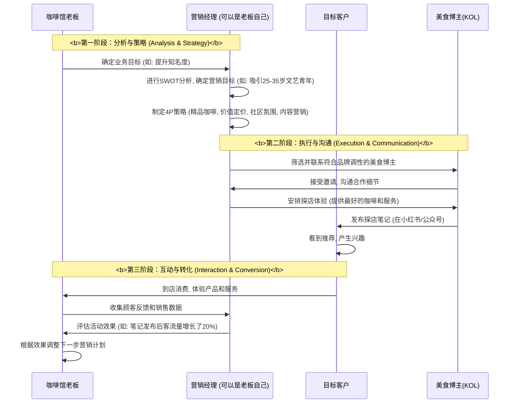

# Chapter 3: 市场营销与品牌建设

在上一章 [战略管理](02_战略管理.md) 中，我们为你的咖啡馆制定了一个聪明的作战计划——**“集中差异化”**。我们决定不与连锁巨头硬碰硬，而是专注于服务一个特定的客户群体，并为他们提供独一无二的咖啡体验。这是一个非常棒的战略！

但现在，想象一下这个场景：你拥有世界上最棒的咖啡，最舒适的环境，最独特的战略，但你的咖啡馆里却空无一人。为什么？因为没有人知道你的存在。一个再好的战略，如果不能有效地传达给目标客户，也只是纸上谈兵。

你该如何向世界宣告：“嘿，这里有一家与众不同的咖啡馆，值得你前来体验！”？你如何才能不仅仅是卖出一杯咖啡，而是在顾客心中留下一个深刻、温暖的印记，让他们成为忠实的回头客，甚至主动向朋友推荐你？

要解决这些问题，你需要掌握商业世界中最富创造力和吸引力的艺术：**市场营销与品牌建设**。

## 什么是市场营销与品牌建设？讲述你的品牌故事

**市场营销 (Marketing)** 是识别并满足客户需求，并通过定价、促销和分销等一系列活动，将你的产品或服务成功推向市场的全过程。它回答了“如何让顾客找到我、选择我”的问题。

**品牌建设 (Branding)** 则更进一步，它是在消费者心中建立一个独特且值得信赖的形象。它回答了“顾客想起我时，会有什么样的感觉”的问题。

这就像一位出色的说书人。市场营销是他说书的技巧、音量和选择的舞台，确保故事能被目标听众听到。而品牌建设，就是他讲述的那个引人入胜、贯穿始终的核心故事。一个强大的品牌，能让顾客产生情感共鸣，他们购买的不仅仅是产品，更是这个故事所代表的体验和价值观。这个品牌，是公司最宝贵的无形资产。

## 核心概念：营销的四大支柱 (4P理论)

怎样才能系统地构建你的营销计划呢？一个经典且非常实用的框架是**市场营销组合 (Marketing Mix)**，也就是我们常说的“4P理论”。它把复杂的营销活动分解为四个核心要素。对于你的咖啡馆来说，这意味着：

*   **产品 (Product)**：你卖的究竟是什么？
*   **价格 (Price)**：顾客需要付出多少钱？
*   **渠道 (Place)**：顾客在哪里能找到你？
*   **促销 (Promotion)**：你如何告诉顾客关于你的一切？

这四个P必须相互协调，共同为你“集中差异化”的战略服务。



让我们逐一分析，如何为你的咖啡馆打造独特的4P组合。

### 1. 产品 (Product)：你的核心吸引力

产品不仅仅指那杯咖啡。它是顾客在你店里获得的**完整体验**。根据我们的“集中差异化”战略，你的产品必须处处体现出“独特”和“高品质”。

*   **核心产品**：
    *   **高品质咖啡**：使用单一产地、公平贸易的精品咖啡豆，提供手冲、冰滴等多种制作方式。
    *   **特色烘焙点心**：与本地糕点师合作，提供独家供应的、与咖啡完美搭配的蛋糕和饼干。
*   **延伸产品 (体验)**：
    *   **舒适的环境**：温馨的灯光、舒适的沙发、精选的背景音乐、免费且高速的Wi-Fi。
    *   **社区文化**：墙上挂着本地艺术家的画作（可以售卖）、定期举办小型读书会或音乐分享会。
    *   **优质的服务**：记住常客的名字和他们喜欢的口味，提供真诚、友善的交流，而不是标准化的“欢迎光临”。

**思考**：你的产品组合，是否清晰地向目标客户（如文艺青年、自由职业者）传递了“这里不仅仅是喝咖啡的地方，更是一个有温度的社区空间”的信号？

### 2. 价格 (Price)：价值的货币体现

价格是顾客为获得你的产品所需付出的成本。在上一章的战略分析中，我们已经明确了**不打价格战**。你的定价应该反映出你提供的独特价值。

*   **定价策略**：**价值导向定价法 (Value-Based Pricing)**。你的价格应该略高于星巴克等连锁品牌，但必须让顾客觉得“物有所值”。
*   **如何体现价值**：
    *   **透明化**：在菜单上简单标注咖啡豆的产地、风味特点，让顾客明白他们为什么付更高的价格。
    *   **分层定价**：基础的美式、拿铁咖啡价格可以有竞争力，但手冲精品咖啡则可以设定更高的价格，吸引真正的咖啡爱好者。
    *   **会员优惠**：推出储值卡或会员计划，为忠实顾客提供少量折扣，增强他们的归属感。

**思考**：你的价格是否让你看起来“很贵”，还是在向顾客诉说“我很珍贵”？一个略高的价格，本身就是一种品牌定位的宣言。

### 3. 渠道 (Place)：与顾客相遇的路径

渠道是指顾客如何接触、购买到你的产品。对于咖啡馆来说，这首先是物理位置。但在这个数字时代，渠道的含义要广泛得多。

*   **物理渠道**：
    *   **选址**：一个安静的街角，靠近创意园区、大学或有格调的居民区。
    *   **店内布局**：动线流畅，既有适合独自工作的单人座，也有适合朋友小聚的区域。
*   **数字渠道**：
    *   **外卖平台**：与美团、饿了么等平台合作，但要确保包装能维持咖啡的品质和温度，将品牌体验延伸到店外。
    *   **社交媒体**：你的Instagram、小红书账号也是重要的“渠道”。顾客在这里“逛”你的店，感受你的氛围。
    *   **地图应用**：确保在百度地图、高德地图上的信息准确无误，有吸引人的照片和正面的顾客评价。
*   **合作渠道**：
    *   与旁边的书店合作，凭书店小票可以在你这里打折。
    *   成为本地某个文化活动的门票兑换点或合作伙伴。

**思考**：你的目标客户最常出现在哪里？你是否在他们出现的路径上，设置了方便且愉快的“入口”？

### 4. 促销 (Promotion)：讲述故事的方式

促销是人们最常联想到的“营销活动”。它指的是你用来与顾客沟通、吸引他们注意力的所有方法。对于预算有限的独立咖啡馆，聪明的促销远比昂贵的广告更重要。

*   **线上推广**：
    *   **内容营销**：在社交媒体上，不只是发“今日特价”。分享关于咖啡豆的故事、冲泡咖啡的技巧、店内活动的精彩瞬间。用高质量的内容吸引关注，而不是用折扣。
    *   **用户生成内容 (UGC)**：鼓励顾客拍照打卡，并设置一个独特的标签（如`#XX街角的暖光#`）。定期精选并转发顾客的美图，这是最真实、最可信的广告。
*   **线下活动**：
    *   **会员卡/集点卡**：简单有效的忠诚度计划。“买十杯，赠一杯”能极大地鼓励重复消费。
    *   **店内活动**：定期举办“咖啡品鉴会”、“拉花体验课”等，不仅能带来收入，更能深化与顾客的关系，将他们变成品牌的拥护者。
*   **公共关系 (PR)**：
    *   邀请本地的美食博主、生活方式KOL（关键意见领袖）来免费体验，并写一篇探店笔记。一篇真诚的推荐，效果可能超过数千元的广告投放。

这四个P是相辅相成的。一个高品质的**产品**，支撑了你略高的**价格**；一个有格调的**渠道**（店面），强化了你的品牌形象；而有创意的**促销**活动，则把这一切有效地告诉了你的目标客户。

## 深入理解：什么是品牌？

通过4P的运筹帷幄，你的咖啡馆开始有了名气。顾客来了，他们体验了你的产品，感受了你的服务。久而久之，当他们想到你的咖啡馆时，脑海中会浮现出一些关键词：“温暖”、“地道”、“有品位”、“像家一样”。

这个在顾客心中形成的、独特的、综合的印象，就是你的**品牌 (Brand)**。

品牌不仅仅是一个名字或一个Logo。正如`MBA In A Day.pdf`的第171页所说，“品牌是产品、服务所有特性的总和，使其独一无二”。它是一个承诺。你的品牌承诺了每一杯咖啡的品质，每一次光临的舒适体验。

### 品牌的核心要素

一个强大的品牌，由内而外都散发着一致的魅力。我们可以把它拆解为几个关键元素：

```mermaid
graph TD
    subgraph 品牌建设 (Brand Building)
        A["品牌核心 (Brand Core)<br/>- 价值观: 真实、匠心、社区<br/>- 承诺: 提供一杯完美的咖啡和片刻宁静"]
        B["品牌识别 (Brand Identity)<br/>- <b>名称</b>: 街角慢磨<br/>- <b>Logo</b>: 一个手摇磨豆机的简化图形<br/>- <b>色彩</b>: 暖黄、原木色、深棕<br/>- <b>标语</b>: ‘时光慢熬，一味好咖’"]
        C["品牌体验 (Brand Experience)<br/>- <b>产品</b>: 精品手冲<br/>- <b>环境</b>: 温馨的音乐和灯光<br/>- <b>服务</b>: 亲切的问候<br/>- <b>沟通</b>: 社交媒体上的温暖文案"]
    end
    A --> B
    B --> C

    style A fill:#E8F8F5,stroke:#2ECC71
    style B fill:#EBF5FB,stroke:#3498DB
    style C fill:#FDEDEC,stroke:#E74C3C
```

1.  **品牌核心 (Brand Core)**：这是你品牌的灵魂和价值观。对于你的咖啡馆，核心可能是“匠人精神”和“社区连接”。这是所有决策的出发点。
2.  **品牌识别 (Brand Identity)**：这是品牌看得见、摸得着的部分，是品牌核心的外在表现。包括：
    *   **名称和Logo**：一个容易记住且能体现品牌个性的名字和标志。
    *   **视觉系统**：统一的颜色（如原木色和暖黄色）、字体、照片风格。
    *   **品牌口号 (Slogan)**：一句能概括品牌承诺的话。
3.  **品牌体验 (Brand Experience)**：这是顾客与品牌互动的全过程。从他看到你的第一条社交媒体帖子，到走进店门闻到的咖啡香，再到咖啡师微笑着递上咖啡，最后到品尝咖啡的每一口。每一次接触，都在塑造或印证你的品牌形象。

**关键在于一致性 (Consistency)**。如果你的Logo设计很现代极简，但店里装修却很复古；或者你宣传的是“安静空间”，但店里总是在放摇滚乐，这种不一致会迷惑顾客，削弱品牌的力量。

## 背后原理：营销与品牌是如何运作的？

一个营销活动，比如“邀请美食博主探店”，是如何策划和执行的呢？这个过程通常遵循一个清晰的逻辑流程，我们称之为**营销规划流程**。



这个流程展示了营销活动并非偶然，而是：
1.  **始于战略**：所有的营销活动都服务于在[战略管理](02_战略管理_.md)中确立的总体目标。
2.  **基于研究**：了解你的目标客户是谁，他们在哪里，他们关心什么，这是制定有效促销方案的基础。
3.  **整合执行**：营销活动需要调动多个资源（产品、服务、人员），并通过合适的渠道（如KOL）进行推广。
4.  **闭环反馈**：通过衡量结果（如客流量、销售额、社交媒体互动量），来评估营销活动的效果，并为下一次活动提供决策依据。

正如`MBA In A Day.pdf`的第145页所述，“营销是从理解市场和满足客户需求开始的系统性过程”。

## 总结

在本章中，我们学习了如何为你精心制定的战略插上翅膀，让它飞入目标客户的心中。你现在应该理解了：

*   **市场营销与品牌建设**的核心是向世界讲述一个关于你的独特价值的、引人入胜且真实的故事。
*   **4P理论（产品、价格、渠道、促销）**是你构建营销计划的四大基石，它们必须协调一致，共同服务于你的企业战略。
*   **品牌**是顾客对你的综合印象和情感连接，是你最宝贵的无形资产。它通过品牌核心、品牌识别和品牌体验共同构建。
*   一个成功的营销活动是一个从**分析、策略、执行到评估**的完整闭环，确保每一分投入都用在刀刃上。

现在，你的咖啡馆有了健康的财务，明确的战略，以及吸引人的品牌故事。但是，这个故事需要由谁来讲述和传递呢？是那位能记住顾客名字、能冲泡出完美咖啡的咖啡师。企业的成功，最终依赖于人。

接下来，让我们进入下一个关键领域，学习如何管理企业中最宝贵的、能动的资产——人。

下一章，[人力资本管理](04_人力资本管理_.md)。

---

Generated by [AI Codebase Knowledge Builder](https://github.com/The-Pocket/Tutorial-Codebase-Knowledge)