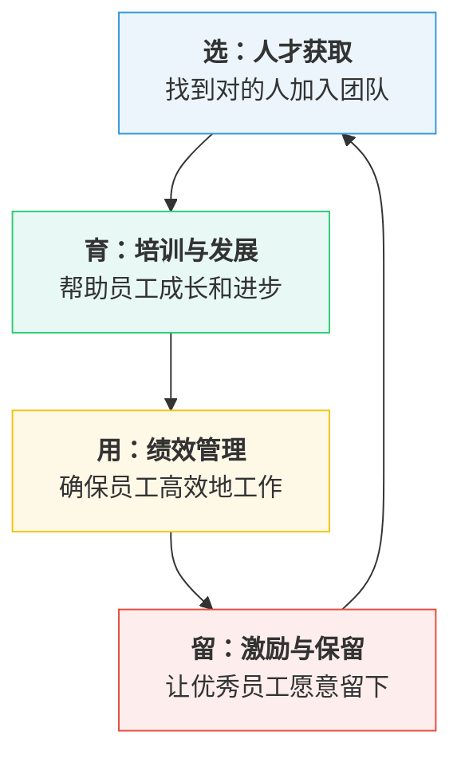
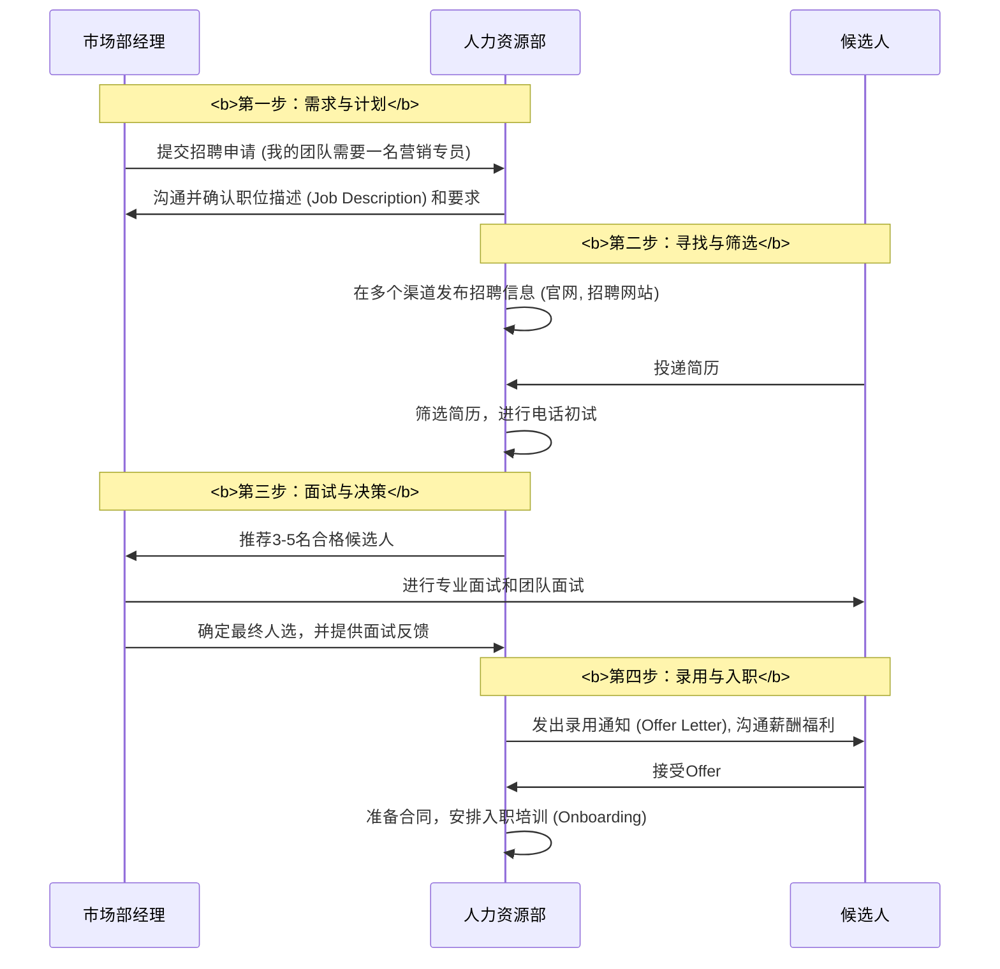

# Chapter 4: 人力资本管理

在上一章 [市场营销与品牌建设](03_市场营销与品牌建设_.md) 中，我们为咖啡馆制定了一套引人入SN心的品牌故事和营销计划。我们知道如何通过独特的产品、合适的定价、便利的渠道和创新的促销活动，来吸引我们的目标客户。这太棒了！你的品牌故事开始传播，顾客慕名而来。

现在，想象一下这个场景：由于你的成功，咖啡馆每天都挤满了人。你自己既要负责采购，又要管理账目，还要时不时地顶替咖啡师。你唯一的全职咖啡师，虽然技艺高超、服务热情，但也因为工作量巨大而疲惫不堪。最近，他甚至向你暗示，街角的另一家咖啡馆向他抛出了橄榄枝。你意识到，你不能再单打独斗了。你需要：

*   再招聘一到两名新员工，但如何确保他们能像你一样充满热情，并且符合咖啡馆的温馨氛围？
*   如何留住你这位明星咖啡师，让他觉得在这里工作不仅有薪水，还有未来？
*   新员工来了之后，如何快速地把他们培养成合格的、能独当一面的团队成员？

这些问题不再关乎产品或营销，而是关乎企业最核心、最宝贵的资产——**人**。一个再完美的商业模式，如果没有合适的团队去执行，也终将是空中楼阁。要解决这些挑战，你需要掌握一门至关重要的管理艺术：**人力资本管理**。

## 什么是人力资本管理？打造你的冠军团队

**人力资本管理 (Human Capital Management, HCM)** 是一种管理理念，它强调人是组织最宝贵的**资产**，而不仅仅是“资源”或“成本”。它涵盖了所有与人相关的活动，如招聘、激励、培训、领导员工以及建设高效团队，旨在最大化员工的潜力和他们对组织的贡献。

这就像一位冠军球队的教练。他的工作远不止是发工资。他需要：
1.  **招募 (Recruit)**：在成千上万的球员中，挑选出技术、心态和团队精神都最适合球队战术的队员。
2.  **训练 (Train)**：通过科学的训练方法，提升现有队员的技能，弥补他们的短板。
3.  **激励 (Motivate)**：了解每个队员的追求（冠军、高薪、荣誉感），并用不同的方式激励他们，让他们在赛场上发挥出120%的水平。
4.  **保留 (Retain)**：创造一个积极的团队环境，让明星球员愿意长期留在这里，共同建立一个王朝。

在商业世界里，管理者就是教练，员工就是球员。人力资本管理就是你的“教练手册”，指导你如何组建并领导一支能不断赢取胜利的梦之队。

## 核心概念：员工的生命周期

为了更好地理解人力资本管理，我们可以沿着一名员工在公司里的“旅程”来学习它的核心概念。这个旅程，我们称之为**员工生命周期 (Employee Lifecycle)**，它通常包括“选、育、用、留”四个关键阶段。

让我们以你的咖啡馆为例，看看在这四个阶段里，你需要做什么。

### 阶段一：“选” - 人才获取 (Talent Acquisition)

这是起点，也是至关重要的一步。招到错误的人，后续的培训和激励成本会非常高。人才获取的目标不仅仅是填补空缺，更是要找到与你的咖啡馆“气味相投”的人。

*   **明确你的需求 (Job Description)**：
    你需要的不只是一名“会做咖啡的人”。你需要的是一位“咖啡馆体验的创造者”。因此，你的职位描述应该超越简单的技能要求。
    *   **糟糕的描述**：招聘咖啡师，会使用咖啡机，有经验者优先。
    *   **优秀的描述**：招聘全职咖啡师。我们希望你不仅热爱咖啡，更热爱与人交流。你需要负责制作高品质的咖啡饮品，维护我们温馨、整洁的社区环境，并乐于向顾客分享每一颗咖啡豆背后的故事。

*   **找到候选人 (Sourcing)**：
    优秀的人才不会自动送上门来。你需要去他们可能出现的地方寻找。
    *   **内部推荐**：问问你现在的明星咖啡师，他有没有同样优秀的朋友推荐？这是成功率最高、成本最低的方式之一。
    *   **本地社区**：在本地的社区论坛、大学社团、甚至常来的熟客中发布招聘信息。
    *   **线上平台**：使用招聘网站，但要确保你的招聘文案能体现出你咖啡馆的独特性，以吸引到对的人。

*   **筛选与面试 (Screening & Interview)**：
    面试的目标是评估候选人的“冰山模型”。技能和知识只是冰山浮在水面上的部分，而水面下的价值观、个性和动机，才是决定他能否融入团队的关键。
    *   **技能测试**：可以让他现场做一杯拿铁，看看基本功。
    *   **行为面试**：不要只问“你会做什么”，要问“你做过什么”。比如：“请分享一次你如何处理顾客投诉的经历。” 这能更好地预测他未来的行为。
    *   **情景模拟**：提出一个假设场景，比如“如果一位顾客抱怨等待时间太长，你会怎么做？” 看看他的应变能力和客户服务意识。

通过这三步，你找到了一位有潜力的新员工，小李。他不仅咖啡做得好，而且性格开朗，对你的咖啡馆文化非常认同。

### 阶段二：“育” - 培训与发展 (Training & Development)

小李加入了你的团队，但这只是开始。为了让他尽快融入并发挥最大价值，你需要系统地培养他。这就像球队的新秀训练营。

*   **入职培训 (Onboarding)**：
    这不仅仅是告诉他厕所在哪、Wi-Fi密码是什么。成功的入职培训是关于文化的传递。
    *   **第一天**：不要让他马上开始工作。花时间亲自带他，向他讲述你创办咖啡馆的梦想，你的品牌故事，以及你对“完美咖啡体验”的理解。让他感受到，他加入的是一个有故事、有温度的地方。
    *   **导师制度 (Mentoring)**：让你那位明星咖啡师作为小李的“师傅”，在工作中随时指导他。这不仅能让小李快速上手，也能增强明星咖啡师的责任感和成就感。

*   **持续发展 (Continuous Development)**：
    投资员工的成长，是留住他们的最好方式。
    *   **技能提升**：当你的咖啡馆盈利后，可以考虑出资让小李和你一起去参加“精品咖啡品鉴会”或“拉花艺术大赛”。这不仅提升了技能，更是一种强有力的激励。
    *   **职业规划**：与小李谈谈他的未来。告诉他，如果他做得好，未来可能成为这家店的店长，或者负责开发新的咖啡饮品，甚至参与新店的筹备。让他看到在这里工作的成长路径。

### 阶段三：“用” - 绩效管理 (Performance Management)

如何确保员工的工作表现符合预期，并帮助他们不断进步？这就是绩效管理要做的事。它不是为了“秋后算账”，而是为了“持续进步”。

*   **设定清晰的目标 (Goal Setting)**：
    你需要让小李清楚地知道，“做得好”的标准是什么。目标应该是具体的、可衡量的。
    *   **例如**：在接下来一个季度，我们希望你能掌握至少3种手冲咖啡的制作方法，并且顾客对你的服务满意度评价（可以通过在收银台放一个简单的评价卡收集）保持在95%以上。

*   **定期反馈 (Regular Feedback)**：
    不要等到年终才进行一次正式评估。反馈应该是即时和持续的。
    *   **正面反馈**：当你看到小李微笑着记住了一位熟客的名字和喜好时，立刻表扬他：“小李，你刚才做得太棒了！这正是我们希望带给顾客的感觉。”
    *   **建设性反馈**：当你发现他某个操作可以改进时，私下里、友好地指出来：“小李，我发现你打奶泡的时候如果把蒸汽棒再深入一点，泡沫会更绵密。我们来试试？”

*   **正式评估 (Formal Appraisal)**：
    可以每半年或一年进行一次正式的绩效面谈。这更像是一次“健康检查”。回顾过去，肯定成绩，分析不足，并共同制定下一阶段的成长目标。在商业实践中，**360度反馈 (360-Degree Assessment)** 是一种非常有效的工具，它不仅有上级的评价，还包括同事、甚至顾客（通过满意度调查）的反馈，能提供一个更全面、更客观的视角。正如在 `MBA In A Day.pdf` 的第13页所提到的那样，这种多源评估方式能更准确地反映员工的整体表现。

### 阶段四：“留” - 激励与保留 (Motivation & Retention)

在竞争激烈的市场中，如何留住你的明星员工？你需要一个全面的激励体系，它包括物质和精神两个层面。

*   **有竞争力的薪酬 (Competitive Compensation)**：
    这是基础。你需要了解市场上同类职位的薪酬水平，确保你的薪酬具有竞争力。但这不只是基本工资。
    *   **奖金**：可以设立“新品开发奖”。如果小李研发的一款新饮品大受欢迎，给他一笔额外的奖金。
    *   **利润分享**：当咖啡馆达到某个盈利目标时，可以拿出一小部分利润作为年终奖金分给所有员工。

*   **创造积极的工作环境 (Positive Work Environment)**：
    钱不是唯一的激励因素。人们会因为喜欢一个地方的文化和氛围而留下。
    *   **认可与赞赏 (Recognition)**：设立一个“月度之星”的小牌子，公开表彰表现优秀的员工。简单的一句“感谢你的付出”比你想象的更有力量。
    *   **授权与信任 (Empowerment)**：信任你的员工。让小李负责设计每周的“特色咖啡”菜单，让他感觉自己不仅仅是一个执行者，更是咖啡馆的共同创造者。
    *   **工作与生活的平衡 (Work-Life Balance)**：关心你的员工。合理的排班，确保他们有足够的休息时间。在他们生日时，送上一张小小的贺卡和蛋糕。

通过这个“选、育、用、留”的完整循环，你不仅解决了眼前的用人危机，更建立起了一套可持续的人才管理体系。你的咖啡馆不再仅仅依赖你一个人，而是拥有了一支充满活力、不断成长的团队。

## 背后原理：人力资源部门是如何运作的？

在你的小咖啡馆里，所有这些人力资本管理的职能都由你——老板兼教练——来承担。但在一个大公司里，通常有一个专门的部门来系统地处理这些事务，那就是**人力资源部 (Human Resources Department, HR)**。

让我们看看一个标准的招聘流程在一家大公司里是如何运作的。这清楚地展示了用人部门（比如市场部）和人力资源部是如何分工协作的。

这个流程体现了现代人力资本管理的核心原则，正如在 `MBA In A Day.pdf` 的第一章《Human Resources》（第3-17页）中所描述的那样：
1.  **战略伙伴 (Strategic Partner)**：HR不再只是一个行政部门，而是业务部门的战略伙伴。他们帮助业务经理明确人才需求，并提供专业的招聘支持。
2.  **流程化与专业化 (Process-Oriented & Professional)**：从职位描述、渠道选择、面试方法到薪酬谈判，每一步都有专业的流程和工具来支持，确保招聘的效率和质量。
3.  **分工明确 (Clear Division of Labor)**：HR负责招聘的“流程”和“专业性”（如筛选简历、背景调查、薪酬谈判），而业务部门经理则负责评估候选人的“专业能力”和“团队契合度”。
4.  **候选人体验 (Candidate Experience)**：整个过程也注重候选人的体验，一个专业、高效的招聘流程本身就是对公司品牌的最好宣传。

## 总结

在本章中，我们探讨了如何管理企业最宝贵的、会思考、有情感的资产——人。你现在应该理解了：

*   **人力资本管理**的核心是将员工视为能够增值的“资本”，而非“成本”。其目标是打造一支能打胜仗的冠军团队。
*   **员工生命周期**——“选、育、用、留”——为我们提供了一个系统性思考人力资本管理的框架。
    *   **选人**：要找到技能和文化都匹配的“对的人”。
    *   **育人**：要通过培训和发展，持续投资员工的成长。
    *   **用人**：要通过有效的绩效管理，帮助员工发挥最大潜能。
    *   **留人**：要通过物质和精神激励，让优秀的人才愿意与你并肩作战。
*   在一个组织中，**人力资源部 (HR)** 扮演着专业角色，与业务部门协同合作，共同完成人才的选拔和培养。

现在，你的咖啡馆财务健康，战略清晰，品牌响亮，并且拥有了一支充满活力的小团队。万事俱备，只欠东风。这“东风”就是如何将所有这些要素（钱、人、物料）高效地组织起来，确保每一天、每一杯咖啡的制作和服务都能顺畅、稳定地运行。

接下来，让我们进入商业管理的“生产车间”，学习如何优化日常工作的每一个环节。

下一章，[运营与流程管理](05_运营与流程管理_.md)。

---

Generated by [AI Codebase Knowledge Builder](https://github.com/The-Pocket/Tutorial-Codebase-Knowledge)