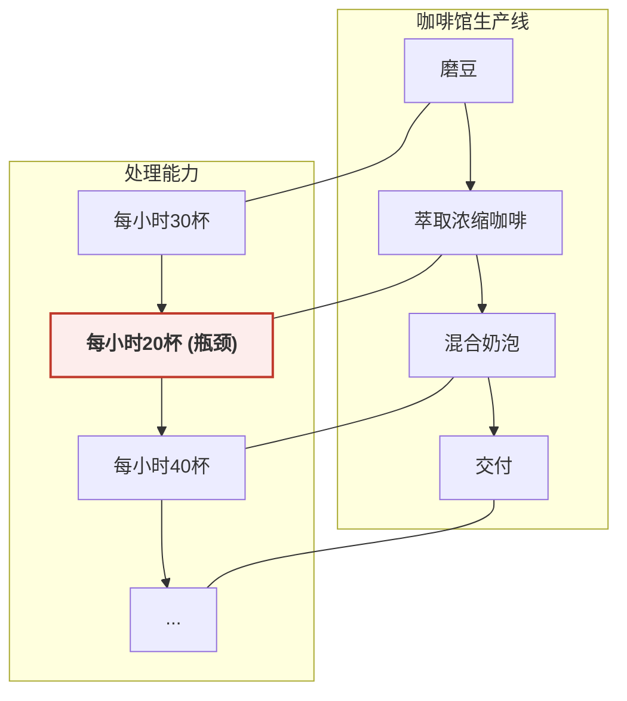
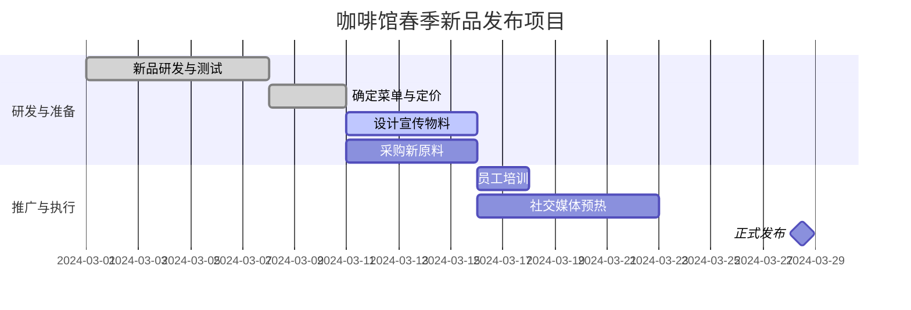
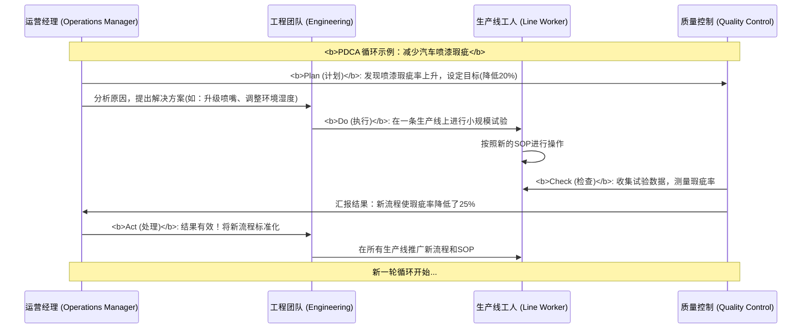

# Chapter 5: 运营与流程管理


在上一章 [人力资本管理](04_人力资本管理_.md) 中，我们学习了如何为你的咖啡馆招募、培养并留住一支优秀的团队。现在，你的咖啡馆不仅财务健康、战略清晰、品牌响亮，还有了一群充满活力的员工。一切看起来都欣欣向荣。

但很快，新的问题出现了。随着生意越来越好，你的小团队开始手忙脚乱：
*   **效率低下**：顾客点单后等待的时间越来越长，队伍排到了门外。
*   **品质不稳**：不同咖啡师做出的拿铁，有时奶泡太厚，有时咖啡太苦，味道总有偏差。
*   **物料混乱**：高峰期突然发现牛奶用完了，或者最受欢迎的咖啡豆没有及时补货。

这些混乱让你意识到，光有优秀的人是不够的。你还需要一套**高效、可靠的工作方式**，确保团队的每一次努力都能稳定地转化为顾客满意的产品和服务。这就像一支才华横溢的乐队，如果每个乐手都随心所欲地演奏，结果只会是噪音。他们需要一份精密的乐谱和一位出色的指挥，才能合奏出美妙的乐章。

在商业世界里，这份“乐谱”和“指挥”的角色，就由**运营与流程管理**来扮演。

## 什么是运营与流程管理？商业的“后台总指挥”

运营与流程管理关注的是企业“如何”高效地完成工作。它涉及设计、执行和控制一系列将输入（如原材料、信息、人力）转化为输出（产品或服务）的活动。其核心目标是**提高效率、保证质量和可靠性**。

这好比一场复杂舞台剧的编排，每一个演员的走位、每一个灯光的切换、每一个道具的递送，都经过精心设计和反复演练，以确保最终呈现给观众一场完美无瑕的演出。运营管理就是确保你的咖啡馆这出“舞台剧”每天都能顺畅上演的后台总指挥。

它不再问“我们应该做什么”（那是[战略管理](02_战略管理_.md)的任务），也不再问“谁来做”（那是[人力资本管理](04_人力资本管理_.md)的任务），而是问“**我们应该怎样做得更好、更快、更省**？”

## 核心概念：让你的咖啡馆像精密时钟一样运转

要成为一名出色的“后台总指挥”，你需要掌握几个简单而强大的工具，它们能帮助你理清思路，优化你咖啡馆的每一个工作环节。

### 第一步：可视化你的工作流 - 流程图 (Process Flowchart)

在你尝试改进任何事情之前，你必须先清楚地了解它“现在”是如何运作的。流程图是一种非常直观的工具，它能将一个复杂的过程分解成一系列简单的步骤，让你对整个工作流程一目了然。

让我们为你咖啡馆的“制作一杯拿铁”这个核心流程画一张流程图：

```mermaid
graph TD
    A[顾客点单并付款] --> B{收到“拿铁”订单};
    B --> C[1. 磨咖啡豆];
    C --> D[2. 萃取浓缩咖啡 (Espresso)];
    B --> E[3. 打发牛奶 (Steam Milk)];
    subgraph "并行操作"
    D
    E
    end
    D --> F[4. 将浓缩咖啡倒入杯中];
    E --> G[5. 将奶泡倒入咖啡];
    F --> G;
    G --> H[6. 拉花 (可选)];
    H --> I[完成，交给顾客];

    style A fill:#D6EAF8
    style I fill:#E8F8F5
```

这张图清晰地展示了从接单到交付的每一个步骤。通过这种方式，你可以和你的团队一起分析：
*   这个流程合理吗？有没有可以省略或合并的步骤？
*   每个步骤由谁负责？职责是否清晰？
*   步骤之间的衔接是否顺畅？

将工作流程“画”出来，是优化它的第一步，也是最重要的一步。

### 第二步：找出效率杀手 - 瓶颈 (Bottleneck)

现在，看着上面的流程图，想象一下你的咖啡馆只有一个昂贵的、专业的浓缩咖啡机。在高峰时段，无论磨豆有多快，打奶泡有多熟练，所有订单都必须排队等待这台机器完成萃取。这台咖啡机就成了整个流程中的**瓶颈**。

**瓶颈**是指在一个流程中，处理能力最低、限制了整个系统产出的那个环节。它就像一个沙漏最窄的那个部分，无论你有多少沙子，流速都由那个最窄处决定。


在你的咖啡馆里，瓶颈可能出现在：
*   **设备**：只有一台咖啡机、一个收银机。
*   **人员**：只有一位经验丰富的咖啡师能做手冲咖啡。
*   **空间**：吧台设计不合理，员工需要来回走动，相互干扰。

**运营管理的一个核心任务，就是识别并消除瓶颈**。因为提升非瓶颈环节的效率是徒劳的。即使你把磨豆速度提高到每小时100杯，如果咖啡机每小时只能处理20杯，那么整个咖啡馆的出品速度依然是每小时20杯。

### 第三步：管理一次性任务 - 项目管理 (Project Management)

日常运营关注的是重复性的工作，但企业里还有很多一次性的、有明确开始和结束时间的任务，我们称之为“项目”。例如，为你的咖啡馆策划一次“春季新品发布会”。

这个项目不像每天做咖啡那样重复，它包含一系列独特的任务：研发新饮品、设计宣传海报、采购新原料、培训员工、策划推广活动等。要成功完成这个项目，你需要**项目管理**的知识。

项目管理是计划、组织、领导和控制资源，以达成特定目标的过程。一个简单的项目管理工具是**甘特图 (Gantt Chart)**，它可以帮助你规划任务和时间。

让我们为“春季新品发布会”项目创建一个简单的甘特图：



这张图告诉你：
*   **任务分解 (WBS - Work Breakdown Structure)**：项目被分成了哪些具体任务。
*   **时间规划 (Timeline)**：每个任务的开始和结束时间。
*   **任务依赖 (Dependencies)**：哪些任务必须在其他任务完成后才能开始（例如，必须先研发完新品，才能开始设计海报）。
*   **项目里程碑 (Milestone)**：关键的节点，如“正式发布”。

通过项目管理，你可以确保像新品发布这样的复杂活动能够有条不紊地进行，而不是陷入一片混乱。

### 第四步：追求稳定与卓越 - 质量管理 (Quality Management)

回到我们最初的问题：为什么咖啡的味道会不稳定？这正是一个典型的**质量管理**问题。

**质量管理**是一套确保产品或服务持续满足顾客期望的系统性方法。它不仅仅是“检查”产品是否合格，更是要“构建”一个能够稳定产出高质量产品的体系。

对于你的咖啡馆，可以实施一些简单的质量管理方法：
1.  **标准化 (Standardization)**：
    *   为每一款饮品创建**标准操作流程 (SOP - Standard Operating Procedure)**卡片。
    *   **示例：标准拿铁SOP**
        *   咖啡豆：20克，中度研磨
        *   浓缩咖啡：萃取30毫升，时间25-30秒
        *   牛奶：200毫升，打发至65°C
        *   融合：先倒咖啡，再倒牛奶
    *   通过标准化，可以最大限度地减少因人而异的差异，确保每一杯咖啡的品质都保持一致。

2.  **持续改进 (Continuous Improvement / Kaizen)**：
    *   质量管理不是一劳永逸的。鼓励你的团队不断寻找可以改进的地方。
    *   **示例**：可以每周开一个15分钟的短会，讨论“本周我们遇到了哪些问题？”或“有没有什么方法能让我们的工作更顺畅？”。也许有员工会提议，把常用的糖浆瓶放在离咖啡机更近的地方，这个小小的改动就能节省几秒钟的时间。无数个这样的小改进，最终会带来巨大的效率和质量提升。

在大型企业中，质量管理发展出了像**六西格玛 (Six Sigma)** 和**全面质量管理 (TQM)** 这样复杂的体系，它们的核心思想都是通过数据分析和流程优化，将产品或服务中的缺陷（Variation）降到最低。

## 背后原理：运营流程是如何被系统性优化的？

在你的咖啡馆，你就是运营经理，亲自发现问题并解决问题。在大型企业，比如一家汽车制造厂，运营与流程管理是一个非常庞大和精密的系统。它遵循着一套被称为**PDCA循环（或戴明环）**的科学方法，这在 `MBA In A Day.pdf` 的第十四章《Quality Management Systems》中有深入探讨。

PDCA是四个步骤的缩写：**Plan (计划) -> Do (执行) -> Check (检查) -> Act (处理)**。


这个循环展示了运营改进不是一次性的行动，而是一个持续的、螺旋式上升的过程：
1.  **计划 (Plan)**：基于数据分析，识别问题，设定目标，并制定改进方案。
2.  **执行 (Do)**：小范围地实施计划。
3.  **检查 (Check)**：衡量执行结果，看是否达到了预期的目标。
4.  **处理 (Act)**：如果结果是积极的，就将改进方案固化为新的标准，并在更大范围内推广。如果结果不理想，就分析原因，重新进入“计划”阶段。

这个看似简单的循环，是丰田生产方式（Toyota Production System）等世界级运营体系的核心精髓，它驱动着组织不断地自我完善和进化。

## 总结

在本章中，我们走进了企业的“后台”，学习了如何让复杂的商业活动变得井井有条。你现在应该理解了：

*   **运营与流程管理**是关于如何设计和优化工作方式，以实现**效率、质量和可靠性**的学科。
*   **流程图**是你的“地图”，能帮助你看清并分析当前的工作流程。
*   **瓶颈**是流程中的“效率杀手”，识别并解决瓶颈是提升整体效率的关键。
*   **项目管理**是完成一次性、独特性任务的强大工具，能确保复杂活动有序进行。
*   **质量管理**的核心是通过**标准化**和**持续改进**，确保每一次产出都符合顾客的期望。
*   **PDCA循环**是驱动运营系统不断自我优化的基本逻辑。

通过应用这些概念，你的咖啡馆将不再是一个时而顺畅、时而混乱的作坊，而会逐渐变成一台运转精密的“机器”。这台机器能够稳定、高效地为顾客创造价值，为你赢得口碑和利润，也为未来的扩张打下坚实的基础。

至此，我们已经走完了《一日MBA》课程的所有核心模块。从理解商业语言的[财务与会计](01_财务与会计_.md)，到制定致胜蓝图的[战略管理](02_战略管理_.md)，再到赢得顾客青睐的[市场营销与品牌建设](03_市场营销与品牌建设_.md)，然后是打造冠军团队的[人力资本管理](04_人力资本管理_.md)，最后到今天我们学习的、确保高效执行的**运营与流程管理**。

你已经掌握了经营一家企业所需的核心思维框架。现在，请合上书本，回顾你的咖啡馆。你会发现，你看待它的眼光已经完全不同。你看到的不再只是一杯杯咖啡，而是一个由财务、战略、市场、人力和运营等多个齿轮精密啮合、协同运转的商业系统。恭喜你，你已经拥有了MBA的视野！

---

Generated by [AI Codebase Knowledge Builder](https://github.com/The-Pocket/Tutorial-Codebase-Knowledge)