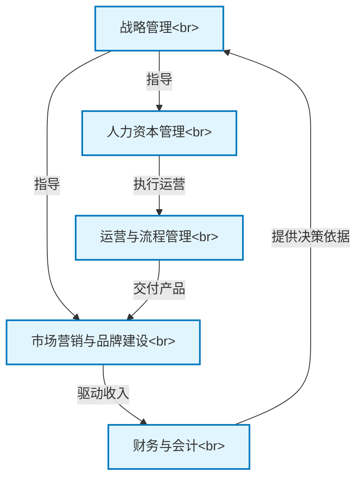

# Tutorial: MBA In A Day

本项目概括了*工商管理硕士(MBA)*的核心课程，涵盖了**战略、营销、财务、人力和运营**等关键商业领域。它旨在为专业人士和企业家提供一个快速学习和理解现代商业管理原则的框架。

**Source Repository:** [None](None)

## Chapters

1. [财务与会计
](01_财务与会计_.md)
2. [战略管理
](02_战略管理_.md)
3. [市场营销与品牌建设
](03_市场营销与品牌建设_.md)
4. [人力资本管理
](04_人力资本管理_.md)
5. [运营与流程管理
](05_运营与流程管理_.md)

---

Generated by [AI Codebase Knowledge Builder](https://github.com/The-Pocket/Tutorial-Codebase-Knowledge)