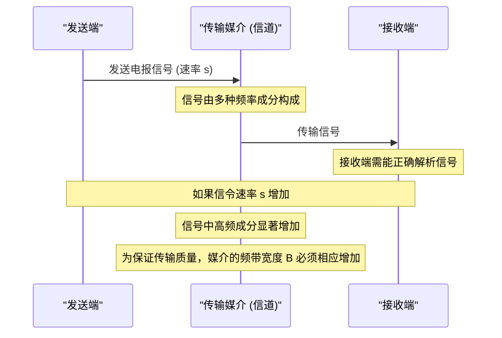

# Chapter 1: 信令速率与频带宽度

欢迎来到奈奎斯特《电报传输理论中的若干问题》论文的导读系列！本系列旨在用浅显易懂的方式，帮助初学者理解这篇通信领域的经典论文中的核心思想。

想象一下，你想给远方的朋友快速发送一封电报。你希望电报内容能以最快的速度送达，并且信息准确无误。那么，我们究竟能以多快的速度发送电报信号呢？这又对我们使用的通信“线路”有什么要求呢？本章将探讨的“信令速率与频带宽度”就回答了这个问题。

## 什么是信令速率与频带宽度？

在深入探讨之前，我们先来理解两个核心概念：

1.  **信令速率 (Signaling Speed)**：
    这指的是我们发送电报信号的基本单元的速度。可以把它想象成你在一秒钟内能打出多少个“点”或“划”（摩尔斯电码的基本组成部分）。信令速率越高，意味着单位时间内发送的信息单元就越多，信息传输也就越快。在奈奎斯特的论文中，这通常用符号 `s` 来表示，单位可能是每秒点数（dots per second）。

2.  **频带宽度 (Bandwidth)**：
    这指的是通信信道（比如电缆、无线电波）能够有效传输的频率范围。你可以把它想象成一条公路的宽度。一条很窄的路同一时间只能通过很少的车；而一条很宽的多车道高速公路则能同时容纳大量车流。同样，频带宽度越大，信道能承载的频率成分就越丰富，也就越有潜力传输更复杂或更快速的信号。

## 核心关系：速率越高，带宽越大

奈奎斯特在其论文中提出的第一个，也是非常基础的一个重要结论是：

> **发送电报信号的速率越快，所需要的通信“道路”宽度（即频带宽度）就越大，两者成正比关系。**

这就像我们在开头提到的城市交通的比喻：
*   **信令速率** 好比 **单位时间内希望通过的车辆数目**。
*   **频带宽度** 好比 **马路的宽度**。

如果你想让单位时间内有更多的车辆通过（即提高信令速率，更快地传输信息），你就需要更宽的马路（即更大的频带宽度）来容纳这些车流，否则就会造成拥堵（信号失真）。

在奈奎斯特论文的开篇（PDF 第1页，“Synopsis”的第一点以及“SCOPE”的第一点）就明确指出了这一点：
> "1. The required frequency band is directly proportional to the signalingspeed."
> 翻译：“1. 所需的频带与信令速率成正比。”

### 为什么会这样呢？

让我们用一个简单的例子来理解。想象一下我们用方波来发送一个“点”信号：
*   **发送慢速信号**：信号从低电平跳到高电平，再跳回低电平，这个过程持续时间较长。信号的变化相对平缓。
*   **发送快速信号**：同样是发送一个“点”，但持续时间很短。这意味着信号电平的变化非常迅速和剧烈。

信号中快速、剧烈的变化对应着信号中包含更多的高频成分。为了能够准确地传输这些高频成分，使得接收端能够正确还原出快速变化的信号，通信信道就必须有足够的频带宽度来容纳这些高频成分。如果频带宽度不够，那些高频成分就会丢失或衰减，导致接收到的信号变形失真，就像快速行驶的汽车在窄路上会互相剐蹭、无法保持队形一样。

奈奎斯特在论文的第3-4页（PDF，“PROPORTIONALITY BETWEEN SPEED OF SIGNALING AND TRANSMITTED FREQUENCY BAND”部分）对此进行了更细致的阐述。他指出：
1.  任何一个重复的电报信号（无论多长）都可以被分解成一系列不同频率的正弦波分量（这是傅里叶分析的基本思想）。
2.  现在考虑另一个信号，它与前一个信号完全一样，只是发送速度快了一倍（例如，原来一个“点”信号持续10毫秒，现在只持续5毫秒）。
3.  那么，这个快速信号分解出来的正弦波分量，其频率也会相应地变为原来的两倍。
4.  如果第二个电报系统（用于传输快速信号的系统）能够传输高达两倍于第一个系统的频率，并且对这些频率分量的处理（如衰减、相位变化）与第一个系统对相应（一半频率）分量的处理方式相同，那么在第二种情况下接收到的波形将与第一种情况下的波形完全对应，也就是说，它们的变形程度会相同。

因此，他得出结论（PDF 第4页）：
> "Generalizing, it may be concluded that for any given defornation of the received signal the transmitted frequency range must be increased in direct proportion to the signalingspeed, and the effect of the system at any corresponding frequencies must be the same. The conclusion is that the frequency band is directly proportional to the speed."
> 翻译：“概括地说，可以得出结论，对于接收信号的任何给定变形，所传输的频率范围必须与信令速率成正比增加，并且系统在任何相应频率上的影响必须相同。结论是频带与速率成正比。”

我们可以用一个简单的流程图来形象地表示这个过程：

这个图显示了，当发送端提高信令速率时，信号中的高频成分会增多。为了让接收端能够无误地接收这些包含更多高频成分的信号，传输媒介本身（也就是通信信道）就必须提供更宽的频带。

## 这对我们有什么意义？

理解信令速率和频带宽度之间的这种正比关系至关重要，因为它是所有通信系统设计的基础：

1.  **系统设计**：工程师在设计通信系统（如电话网络、互联网基础设施、无线通信）时，必须根据期望的数据传输速率来规划和分配足够的频带宽度。
2.  **频谱资源管理**：无线电频谱是一种有限的宝贵资源。了解传输一定量信息需要多少带宽，有助于更有效地规划和利用频谱，避免浪费。
3.  **技术限制**：在给定的频带宽度下，信令速率存在一个理论上的上限。要想进一步提高速率，就需要寻找更宽的频带，或者发展更先进的信号处理技术来更有效地利用现有带宽。

这个基本原理为我们后续章节中将要讨论的更复杂的概念，如[奈奎斯特准则/最小带宽](03_奈奎斯特准则_最小带宽_.md)（即在理想情况下，传输给定速率的信号所需的最小带宽是多少），奠定了基础。

## 总结

在本章中，我们学习了通信理论中的一个基本概念：**信令速率与频带宽度成正比**。这意味着，如果我们想要更快地发送信息（提高信令速率），我们就需要一个“更宽的通信公路”（更大的频带宽度）。这个由奈奎斯特明确提出的原理，是理解和设计现代通信系统的基石。

在下一章中，我们将探讨在信号传输过程中，如何才能做到[无失真传输](02_无失真传输_.md)，即如何确保接收到的信号与发送的信号尽可能一致。

---

Generated by [AI Codebase Knowledge Builder](https://github.com/The-Pocket/Tutorial-Codebase-Knowledge)