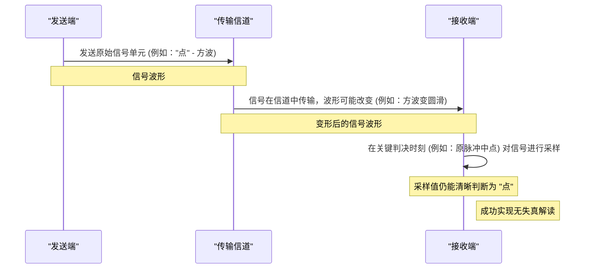

# Chapter 2: 无失真传输

在上一章 [信令速率与频带宽度](01_信令速率与频带宽度_.md) 中，我们了解到发送信号的速度越快，所需要的通信“道路”（频带宽度）就越宽。这就像我们要开快车，就需要更宽阔的马路一样。但是，即使马路足够宽，我们还需要保证车子（信号）在到达目的地时，能够被准确地识别出来。如果车子在路上撞得面目全非，即使到达了，也失去了意义。本章，我们将探讨一个核心概念：“无失真传输”，它关注的是如何确保我们发送的电报信号，在经历漫长的旅途后，仍然能够被接收端准确无误地解读。

## 什么是“无失真传输”？我们为什么关心它？

想象一下，你正在给远方的朋友发送一封重要的电报，内容是“明日十点，东门集合”。你肯定希望朋友收到的信息和你的原始意图完全一致，而不是变成“明日一点，西门集合”或者干脆无法辨认。

在电报传输过程中，信号（电流或电压的波形）会受到线路特性的影响，比如电阻、电感、电容等，这些因素会导致信号的波形发生改变。就像声音在空旷的房间里会产生回声，或者水波在传播过程中会逐渐衰减和变形一样。如果这种变形过于严重，接收端可能就无法正确识别原始信号代表的是“点”还是“划”，从而导致信息错误。

**“无失真传输”** 指的就是，尽管信号在传输过程中其**波形**（waveform）可能会因为线路特性而发生变化，但只要在接收端的**关键判决时刻**（key decision instants），信号的值能够被准确地解读，并正确地反映发送端原始信号的意图（比如是“1”还是“0”，或者摩尔斯电码的“点”或“划”），那么我们就认为实现了无失真传输。

这里的关键在于区分**“波形失真”**和**“信息失真”**。
*   **波形失真**：指信号的实际形状与原始形状有差异。
*   **信息失真**：指接收端无法从变形的波形中正确恢复出原始信息。

**无失真传输的目标是消除信息失真，即使波形失真可能无法完全避免。**

我们可以用一个生活中的例子来理解：
> 就像听远方传来的歌声。虽然由于距离、障碍物等因素，声音可能有些回响、音量减弱或者音调轻微改变（这可以看作是声音“波形”的失真），但只要你能准确地听清楚歌词和旋律（这代表了原始的“信息”），那么对于你来说，就算是无失真地接收到了这首歌。

奈奎斯特在他的论文中，正是探讨了实现这种“信息层面”的无失真传输所需要满足的条件，以及通信系统应该具备什么样的特性。

## 关键在于判决时刻

那么，既然信号波形会变，我们如何在接收端做出正确的判断呢？诀窍在于关注**“关键判决时刻”**。

对于数字信号（电报信号可以看作是一种早期的数字信号），发送端会按照一定的时间间隔发送信号单元（比如一个“点”信号持续一段时间，一个“划”信号持续另一段时间）。接收端也需要在特定的时刻去“采样”或“观察”接收到的信号，并根据此刻信号的值来判断它代表的是什么。

*   如果发送的是一个代表“1”的高电平脉冲。
*   这个脉冲在传输后可能不再是完美的方形，可能会变得圆滑，甚至拖尾。
*   但是，如果接收端在原脉冲的**中间时刻**（或其他预先定义好的判决时刻）去检测信号的电压：
    *   如果电压仍然明显高于某个阈值，能够清晰地被识别为“1”。
    *   并且不会因为前一个或后一个信号的干扰而误判。
*   那么，即使波形不是当初那个漂亮的方波了，我们依然成功地、无失真地传输了这个“1”。

奈奎斯特在其论文的第 5 页（PDF 第 5 页），“DISTORTIONLESS TRANSMISSION” 一节中这样描述：
> "Suppose, for instance, that the receiving device records the value of the wave at the mid-instant of the time unit corresponding to each signal element. Then all that matters is the value of the wave at that instant; it does not matter how much it is deformed in intervening intervals. For convenience the term non-distorting wave, will be introduced and will be defined as a wave which produces perfect signals. A non-distorting wave may or may not be deformed. The criterion for a non-distorting wave will vary with the manner of receiving the signal. In this paper, when not otherwisestated, the illustration just indicated will be taken as the criterion, i.e., a wave will be said to be non-distorting when the value at the mid-instant of any time unit is proportional to the magnitude factor for the corresponding element."

> **翻译**：“举例来说，假设接收设备记录的是每个信号单元对应的时间单元中点时刻的波形值。那么，关键就在于那个时刻的波形值；至于在其他非判决时刻波形如何变形则无关紧要。为方便起见，我们引入‘无失真波形’这个术语，它被定义为能够产生完美信号的波形。一个无失真波形其本身可能变形，也可能没有变形。无失真波形的判据会因接收信号的方式而异。在本文中，除非另有说明，我们将采用刚描述的判据，即：当任何时间单元中点时刻的（波形）值与相应（发送）单元的幅度因子成正比时，该波形就被认为是无失真的。”

这段话的核心思想是：我们不强求接收到的波形和发送的波形一模一样，我们只关心在那些预先定义好的“采样点”（判决时刻），信号的值是否能让我们做出正确的判断。

我们可以用一个简单的图示来理解这个过程：

这个图清晰地展示了，即使信号波形在传输信道中发生了变化，只要在接收端的关键判决时刻，我们能够依据采样值准确地恢复出原始信号单元所代表的信息，那么整个传输过程就可以被认为是无失真的。

## 如何实现无失真传输？

奈奎斯特的论文进一步探讨了要实现这种无失真传输，通信系统（包括发送设备、传输线路和接收设备）需要满足哪些条件。他从信号的频率成分（频谱）和系统的传输特性入手，分析了如何设计系统或调整信号，使得在判决时刻，不同信号单元之间的干扰（称为码间串扰，Intersymbol Interference, ISI）最小，甚至为零。

例如，论文中提到了“理想形状因子”（Ideal Shape Factors，见 PDF 第 5 页的图 2）。这些特定的信号波形或系统响应特性，能够保证即使信号在频带受限的信道中传输，在判决时刻也能获得清晰的、不受前后信号干扰的值。

更具体地说，奈奎斯特指出（PDF 第 6 页），如果我们希望接收到的波形具有理想的形状因子 `Fr`（以实现无失真传输），而发送波形的形状因子是 `Fs`，那么系统的**传输导纳 (Transfer Admittance)** `Y(ω)`（可以理解为系统对不同频率信号的“通行能力”或响应特性）应该满足一定的关系，例如 `Fr = Y(ω) * Fs`（简化理解）。这意味着，我们可以通过精心设计系统的 [传输导纳 (Y(ω))](07_传输导纳__y_ω__.md) 或者调整发送信号的 [形状因子 (F(ω))](05_形状因子__f_ω___.md) 来达到无失真传输的目的。

这些更深入的数学和工程细节，我们将在后续章节，特别是讨论 [奈奎斯特准则/最小带宽](03_奈奎斯特准则_最小带宽_.md) 时详细展开。目前，我们只需要理解无失真传输的核心思想：**关注判决时刻的准确性，而非全程波形的完美复制。**

## 总结

本章我们学习了“无失真传输”这个重要概念。它的核心思想是：

1.  **目标**：确保接收端能够准确无误地解读发送的原始信息。
2.  **现实**：信号在传输过程中，其物理波形几乎总是会因线路特性而改变（波形失真）。
3.  **关键**：无失真传输并不要求接收波形与发送波形完全一致，而是要求在特定的**关键判决时刻**，接收信号的值能够正确反映原始信号单元。
4.  **意义**：理解了这一点，我们就可以专注于如何在这些关键时刻获得正确的值，而不是试图完美复原整个波形，这为高效的通信系统设计奠定了理论基础。

在上一章我们知道了信号速率与所需带宽的关系，本章我们明确了传输质量的目标——无失真。那么，在给定的带宽下，如何才能真正做到无失真传输，并且尽可能快地发送信号呢？这就是我们下一章 [奈奎斯特准则/最小带宽](03_奈奎斯特准则_最小带宽_.md) 将要揭示的奥秘。敬请期待！

---

Generated by [AI Codebase Knowledge Builder](https://github.com/The-Pocket/Tutorial-Codebase-Knowledge)