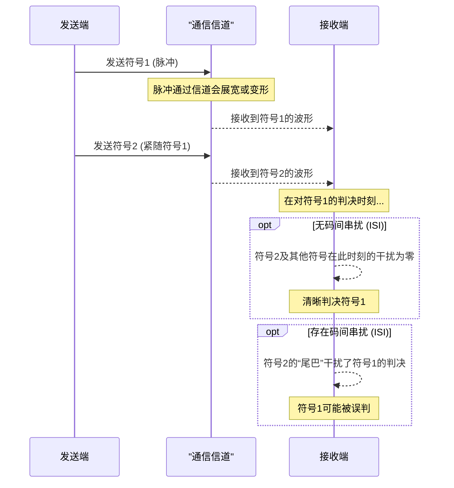
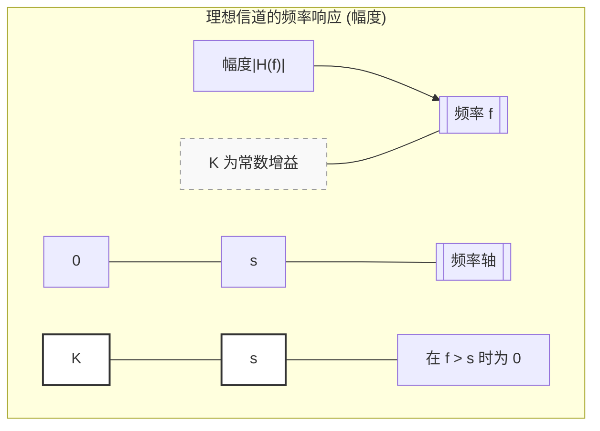
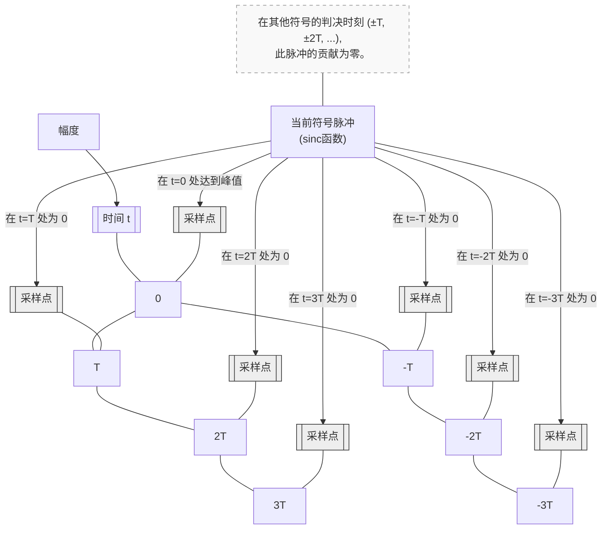

# Chapter 3: 奈奎斯特准则/最小带宽

在上一章 [无失真传输](02_无失真传输_.md) 中，我们探讨了如何确保接收端能够准确无误地解读发送的原始信息，即使信号波形在传输过程中发生了变化。我们了解到，关键在于确保在特定的“判决时刻”，信号的值能够正确反映原始信号单元。

现在，我们面临一个新的问题：假设我们的通信“道路”（频带宽度）是有限的，我们究竟能以多快的速度发送信号，同时还能保证无失真传输呢？是否存在一个理论上的最小带宽需求，来支持特定的信令速率？这就是本章“奈奎斯特准则/最小带宽”将要解答的核心问题。

想象一下，你有一条单行道（代表通信信道），你想在这条路上以特定的速度放置一系列标记物（代表电报信号的符号）。为了确保每个标记物在到达终点时都能被清晰地识别，不会与前后相邻的标记物混淆，这条道路至少需要多宽呢？奈奎斯特准则正是为我们揭示了这条“最小道路宽度”的奥秘。

## 什么是奈奎斯特准则/最小带宽？

奈奎斯特准则，也常被称为奈奎斯特第一准则或奈奎斯特无码间串扰准则，是通信理论中的一个里程碑。它指出了：

> **为了无歧义地（无码间串扰地）传输电报信号，所需要的最小频带宽度在数值上等于信令速率 `s`。**

这里的几个关键点需要我们细细品味：

1.  **无歧义地传输 (Unambiguous Interpretation)**：还记得上一章我们讨论的无失真传输吗？这里的“无歧义”更进一步，特指在接收端的判决时刻，当前符号的采样值不会受到其他符号（前一个或后一个）的干扰。这种干扰被称为**码间串扰 (Intersymbol Interference, ISI)**。奈奎斯特准则告诉我们如何避免这种串扰。

2.  **信令速率 (Signaling Speed, `s`)**：在奈奎斯特的论文中，`s` 特指“每秒传输的点数”或更广义地，“每秒传输的信号单元数除以二”（详见论文 PDF 第 3 页对符号 `s` 的定义）。如果用更现代的说法，假设我们每秒传输 `R_sym` 个独立的符号（符号速率），那么奈奎斯特定义的 `s = R_sym / 2`。因此，奈奎斯特准则也可以表述为：**传输 `R_sym` 个独立符号/秒，所需的最小带宽 `B_min = R_sym / 2` 赫兹 (Hz)。** 反过来说，对于一个带宽为 `B` 的理想信道，最大可以无码间串扰地传输 `2B` 个符号/秒。

3.  **最小频带宽度 (Minimum Bandwidth)**：这是理论上的最小值。要达到这个最小值，需要满足一些理想条件，我们稍后会讨论。

这个准则的提出，为通信系统设计中如何有效利用宝贵的频谱资源提供了关键的理论指导。

奈奎斯特在其论文的“概要 (Synopsis)”部分的第 3 点明确指出了这一点 (PDF 第 1 页):
> "3. The minimum bandwidth required for unambiguous interpretation is substantially equal, numerically, to the speed of signaling."
> **翻译**：“3. 无歧义解读所需的最小带宽在数值上基本等于信令速率。”

并且，在论文的“分析直流电波 (ANALYSIS OF D-C. WAVE)”部分 (PDF 第 4-5 页)，他进一步论证了这个结论：
> "Each such band contains all the information about the signal that the totality of bands from zero to infinity contains. One such band (or its equivalent) is necessary and sufficient to determine the original signal. ... The frequency range which must be transmitted to specify one band is numerically equal to the speed of signaling."
> **翻译**：“（在将信号分解为不同频段后）每一个这样的频带包含了从零到无穷大所有频带所包含的关于信号的全部信息。这样一个频带（或其等效频带）对于确定原始信号是必要且充分的。... 为了指定一个频带所必须传输的频率范围，在数值上等于信令速率。”

这里的“一个频带的宽度”就是我们所说的最小带宽，其数值等于信令速率 `s`。

### 码间串扰 (ISI) 的直观理解

想象一下你在一条传送带上快速放置小方块。
*   如果方块之间有足够的间隔，并且每个方块的形状在传送过程中保持得很好，那么在传送带的另一端，你可以很容易地区分每个方块。
*   但是，如果方块放置得太密集，或者方块在传送过程中会“摊开”或“拖尾”，那么一个方块的边缘就可能侵入到邻近方块的区域。当你试图识别一个方क्य时，它的形状可能已经受到了前后方块的影响，导致你判断失误。这就是码间串扰。

奈奎斯特准则的目标，就是找到一种方法，使得在对当前符号进行判决的那个精确时刻，所有其他符号（过去的和未来的）在该时刻的响应值都恰好为零。

## 如何实现最小带宽传输？（理想情况）

要达到奈奎斯特准则所描述的 `B_min = s` (或 `R_sym = 2B`) 的理论极限，需要满足一些理想条件：

1.  **理想的信道特性**：信道需要具有理想的“砖墙式”频率响应。这意味着信道对于从 0 到 `s` Hz (或者说从 `-s` 到 `+s` Hz，总带宽为 `s` 对于基带信号，或者 `B_min` 对于带通信号) 的所有频率分量都以相同的增益通过，并且不产生相位失真；而对于频率大于 `s` Hz 的分量则完全截止。

    这就像一个完美的筛子，只允许特定大小范围内的沙子通过，不多也不少。

    在奈奎斯特的论文中，图 2(a) (PDF 第 6 页) 展示了这种理想接收波形的[形状因子 (F(ω))](05_形状因子__f_ω___.md) `Fr(ω)`，它在频率从 0 到 `s` (原文图中标为 `2πs`，其中 `ω=2πf`，所以对应频率 `f=s`) 是一个常数，在 `s` 以外为零。

    *图 3.1：理想低通滤波器的幅度响应，带宽为 s*

2.  **理想的脉冲形状**：为了在上述理想信道下实现无码间串扰，发送的信号脉冲，在经过信道后，到达接收端时应具有特定的形状。最经典的例子是 **sinc 函数** 形状的脉冲。

    `sinc(x) = sin(πx) / (πx)`

    一个 `sinc` 函数形状的脉冲在时间轴上，其峰值点对应当前符号的判决时刻。而在其他所有符号的判决时刻（即 `t = ±T, ±2T, ±3T, ...`，其中 `T` 是一个符号的周期，`T = 1/R_sym = 1/(2s)`），`sinc` 函数的值都恰好为零。

    *图 3.2：理想的 sinc 脉冲形状，确保无码间串扰*

    当每个符号都以这种方式整形并通过理想信道后，在任何一个符号的判决时刻，我们只会“看到”那个符号本身的贡献，所有其他符号的贡献都为零。这就实现了“无歧义的解读”。

## 奈奎斯特准则的意义

理解奈奎斯特准则及其背后的原理至关重要：

1.  **理论极限**：它定义了在给定带宽下，无码间串扰传输的最高符号速率的理论上限。或者说，传输给定速率的符号所需的最小带宽。虽然在实际中，由于无法实现完美的“砖墙”滤波器和理想的 `sinc` 脉冲（`sinc` 脉冲在时域上无限延伸，且对定时误差敏感），我们通常需要比理论值稍宽的带宽（例如使用升余弦滤波器），但奈奎斯特准则提供了一个重要的基准。论文的 PDF 第 1 页也提到：“这种在频率范围上的节省...应被视为一种理论极限，在实践中无法达到，但可以接近...”

2.  **频谱效率的指导**：在无线通信等频谱资源非常宝贵的领域，奈奎斯特准则指导工程师们如何更有效地设计系统，以在有限的带宽内传输更多的数据。

3.  **通信系统设计的基础**：现代数字通信系统中的许多关键技术，如脉冲成形（如升余弦滚降滤波器）、均衡技术等，都是在奈奎斯特准则的基础上发展起来的，旨在逼近这个理论极限，同时克服实际系统中的各种非理想因素。

4.  **奠定信息论基础**：奈奎斯特的这项工作，连同哈特莱和香农后来的工作，共同奠定了现代信息论和通信理论的基石。

## 如果带宽不足会怎样？

奈奎斯特论文的附录 III 中有一节“Insufficiency of Ranges Smaller than the Signaling Speed”（PDF 第 18 页，原文第 634 页），讨论了当传输带宽小于奈奎斯特准则要求的最小带宽（即小于 `s`）时的情况。

简而言之，如果你的带宽 `B` 小于 `s`（即 `B < R_sym / 2`），那么无论你如何设计脉冲形状，都无法完全消除码间串扰。在这种情况下，一个符号的能量会不可避免地“泄露”到相邻符号的判决时刻，导致判决错误。即使是最简单的情况，例如只传输两种电平（“点”和“划”），也无法保证能正确区分它们。

这就像你的单行道如果比理论最小宽度还要窄，那么无论你开车多小心，车辆（符号）之间都必然会发生剐蹭（码间串扰）。

## 总结

在本章中，我们学习了通信理论中一个非常核心的准则——**奈奎斯特准则/最小带宽**。我们了解到：

1.  **核心内容**：为了实现无码间串扰的符号传输，在速率为 `R_sym` 符号/秒时，所需的最小理想带宽为 `B_min = R_sym / 2` 赫兹。或者说，在奈奎斯特的定义下（信令速率 `s = R_sym / 2`），最小带宽等于 `s`。
2.  **实现条件**：这个理论极限依赖于理想的“砖墙式”信道滤波器和特定的脉冲形状（如 `sinc` 脉冲），以确保在每个符号的判决时刻，其他符号的干扰为零。
3.  **重要意义**：它为通信系统设计提供了关于频谱效率的理论上限，是许多现代通信技术的基础。

奈奎斯特准则不仅告诉我们“路要多宽”，还暗示了信号在时域和频域之间的深刻联系。在下一章 [信号波形的对偶性](04_信号波形的对偶性_.md) 中，我们将更深入地探讨信号在时间和频率这两个不同“视角”下的表现形式，以及它们之间的转换关系，这将帮助我们更好地理解奈奎斯特论文中的其他重要概念。

---

Generated by [AI Codebase Knowledge Builder](https://github.com/The-Pocket/Tutorial-Codebase-Knowledge)