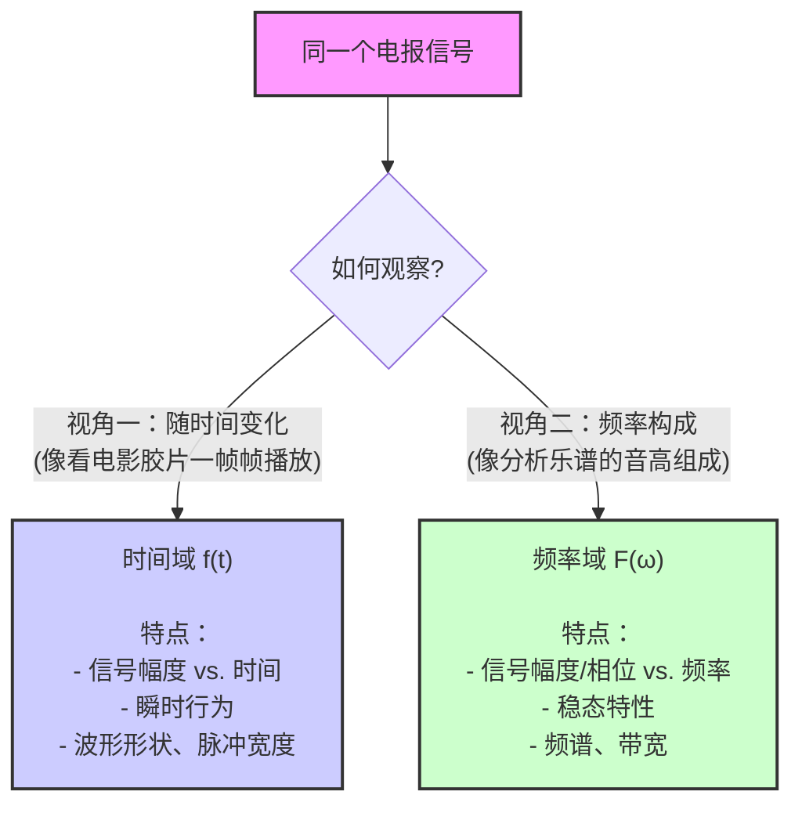
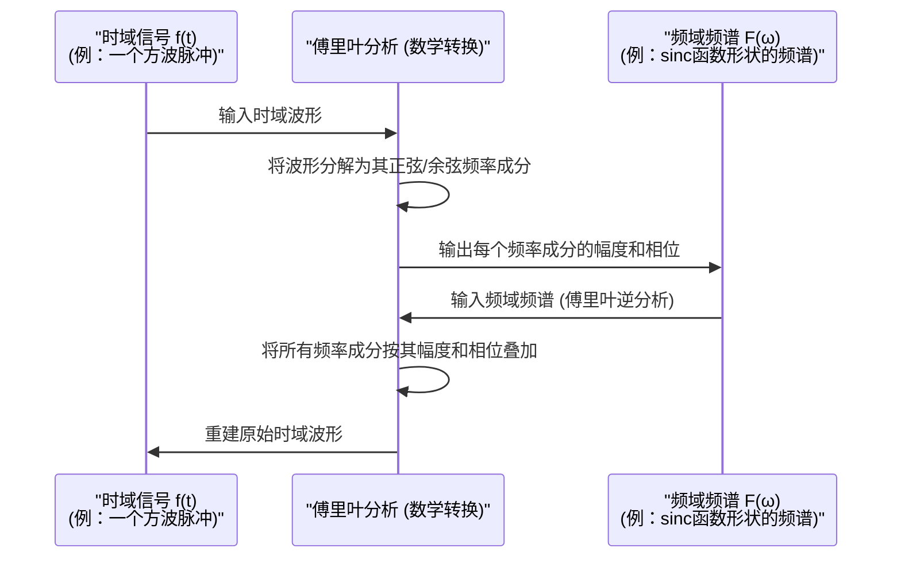

# Chapter 4: 信号波形的对偶性

在上一章 [奈奎斯特准则/最小带宽](03_奈奎斯特准则_最小带宽_.md) 中，我们了解了在理想情况下，无码间串扰地传输给定速率的信号所需的最小带宽。这个准则为我们划定了一个理论边界。但是，要真正理解信号是如何通过具有特定带宽限制的系统，以及如何设计这样的系统，我们需要从不同的角度来观察和分析信号本身。本章将介绍一个非常重要的概念——“信号波形的对偶性”，它为我们提供了分析信号的两种互补视角。

## 为什么需要两种视角看信号？

想象一下，你是一位医生，想要全面了解病人的健康状况。你可能会通过观察病人的外表、听诊心肺（类似“瞬时”状态）来进行诊断，但同时，你也可能会借助血液检测报告、X光片等（类似分析身体内部的“成分”和“结构”）来获得更深层次的信息。这两种方式都非常重要，它们从不同层面反映了病人的状况。

同样，在分析电报信号时，如果我们只关注信号电压如何随时间波动，可能无法完全理解信号通过通信线路（比如电缆）时会发生什么。通信线路对不同频率的信号成分有不同的“待遇”（比如衰减不同，延迟不同）。为了搞清楚这一点，我们就需要一种方法来“看透”信号的内部频率构成。

“信号波形的对偶性”指的就是我们可以从两个主要方面来研究和理解同一个信号：

1.  **时间域 (Time Domain)**：关注信号的幅度如何随着时间变化。
2.  **频率域 (Frequency Domain)**：关注信号是由哪些不同频率的正弦波叠加而成的。

这两种视角就像一枚硬币的两面，共同构成了对信号的完整描述。

## 深入理解：时间域与频率域

奈奎斯特在其论文中（PDF 第1页，“概要”第10点以及“范围”第10点）明确指出了这种对偶性：
> "10. A discussion is given of the dual aspect of the telegraph wave. The wave may be looked on either as a function of ω, requiring the so-called steady-state method of treatment, or as a function of t requiring the so-called method of transients. It is shown that the steady-state theory can be made to yield the information necessary to specify the characteristics of an ideal system."
> **翻译**：“10. 讨论了电报波形的对偶特性。该波形既可以看作是 ω (角频率) 的函数，需要所谓的稳态分析方法；也可以看作是 t (时间) 的函数，需要所谓的瞬态分析方法。结果表明，稳态理论能够提供指定理想系统特性所需的信息。”

让我们更详细地了解这两个“域”：

### 1. 时间域 (Time Domain) - 信号的瞬时故事

*   **是什么？** 时间域描述的是信号的幅度（比如电压或电流）是如何直接随时间演变的。你可以把它想象成用示波器观察到的波形曲线，横轴是时间 (t)，纵轴是信号的瞬时值 `f(t)`。
*   **关注点：**
    *   信号在任意时刻的具体值。
    *   脉冲的上升、下降时间。
    *   信号的持续时间。
    *   信号的整体形状，比如是方波、三角波还是其他复杂形状。
*   **好比：** 欣赏一首乐曲时，你关注的是每个音符是何时开始、何时结束，以及它们的先后顺序和节奏。或者，观察湖面上一个石子投入后，水波是如何一圈圈荡漾开去，每个浪头在特定时间的高度和位置。

在奈奎斯特的论文中，当他讨论信号的“瞬态 (transients)”行为时，主要就是从时间域的角度进行分析。

### 2. 频率域 (Frequency Domain) - 信号的成分构成

*   **是什么？** 频率域描述的是一个信号由哪些不同频率的正弦波（或余弦波）组成。每个频率成分都有其对应的幅度和相位。你可以把它想象成用频谱分析仪看到的图形，横轴是频率 (ω 或 f)，纵轴是对应频率分量的强度 (幅度) 或相位。这个整体的频率构成被称为信号的**频谱**。
*   **关注点：**
    *   信号中包含哪些主要的频率。
    *   每个频率成分的强度有多大。
    *   信号占据的频率范围（即[频带宽度](01_信令速率与频带宽度_.md)）。
*   **好比：** 还是欣赏乐曲，这次你关注的是这首乐曲是由哪些基本音高（频率）和谐地组合而成的。比如，一个和弦是由C、E、G这几个音高（频率）同时发声构成的。或者，一道白光（看起来是一种颜色）可以被三棱镜分解成红、橙、黄、绿、蓝、靛、紫等不同颜色（频率）的光。

在奈奎斯特的论文中，当他讨论信号的“稳态 (steady-state)”特性，分析[形状因子 (F(ω))](05_形状因子__f_ω___.md)或[传输导纳 (Y(ω))](07_传输导纳__y_ω___.md)时，主要就是从频率域的角度进行分析。

下图形象地展示了这两种观察视角：

*图 4.1: 信号的时间域与频率域视角*

## 连接时间域与频率域的桥梁：傅里叶分析

你可能会问，这两个看起来如此不同的视角，是如何关联起来的呢？答案是**傅里叶分析 (Fourier Analysis)**。这是一个强大的数学工具，它告诉我们：

*   **任何（满足一定条件的）复杂的周期信号都可以表示为一系列不同频率、不同幅度和不同相位的简单正弦波（或余弦波）的叠加。** (傅里叶级数)
*   **非周期信号也可以通过类似的方式，表示为连续频率的正弦波的积分。** (傅里叶变换)

简单来说，傅里叶分析就像一个“数学棱镜”，可以将复杂的时域信号 `f(t)` 分解成其在频率域的各个组成成分 `F(ω)`。反过来，如果我们知道了信号的频谱 `F(ω)`，也可以通过傅里叶逆变换（或傅里叶级数求和）将其合成为时域波形 `f(t)`。

奈奎斯特在他的论文第 9-10 页（PDF，“DUAL ASPECT OF SIGNALING WAVE”部分）提到了这种转换关系。他指出，时域中的波形 `f(t)` 和频域中的形状因子 `F(ω)` 是可以通过数学变换相互得到的（简化形式）：
*   从时间域到频率域： `F(ω) = ∫ f(t) * e^(-iωt) dt` (傅里叶变换)
*   从频率域到时间域： `f(t) = (1/2π) * ∫ F(ω) * e^(iωt) dω` (傅里叶逆变换)
(注意：奈奎斯特论文中的具体公式包含一些与信令速率 `s` 相关的常数因子，这里给出的是更普遍的形式。)

下面的序列图概念性地展示了这个转换过程：

*图 4.2: 时间域与频率域之间的傅里叶变换概念图*

这个“数学棱镜”非常重要，因为它意味着：
*   一个信号在时域的行为和它在频域的特性是**唯一对应**的。
*   我们可以选择在更方便的域中进行分析或设计。

## 奈奎斯特如何运用这种对偶性？

奈奎斯特论文的一个核心贡献在于，他巧妙地运用了这种对偶性来解决电报传输中的实际问题。他指出，虽然我们最终关心的是信号在时间域的传输效果（例如，在判决时刻是否失真），但通过分析系统在**频率域的特性**（如[传输导纳 (Y(ω))](07_传输导纳__y_ω___.md)），可以更有效地设计系统以达到期望的时域性能。

例如，要实现[无失真传输](02_无失真传输_.md)（特别是在判决时刻无码间串扰），接收信号在时间域需要满足特定条件。奈奎斯特的工作展示了如何将这些时域条件**转换**为对信号频谱或系统频率响应的要求。这就使得工程师可以专注于设计具有特定频率特性的滤波器或均衡器，从而间接控制信号在时间域的行为。

论文中提到 (PDF 第 10 页)：
> "It is seen that in the case of functions of ω the operations consist of the multiplication of two characteristics. ... In the case of the functions of t the computations are much more complex involving differentiation, the multiplication of two functions, and the evaluation of an integral. It is, therefore, as a practical matter, greatly advantageous to arrange the calculations so they can be carried out with functions of ω."
> **翻译**：“可以看出，在处理 ω 的函数时，操作包括两个特性的相乘。... 而在处理 t 的函数时，计算要复杂得多，涉及到微分、两个函数的相乘以及积分的求值。因此，从实践角度来看，将计算安排成可以用 ω 的函数来执行，具有很大的优势。”

这意味着，在频率域中，系统对信号的影响通常可以简化为乘法运算（例如，输出频谱 = 输入频谱 × 系统频率响应），这比在时间域中进行复杂的卷积运算要简单得多。

因此，信号波形的对偶性是理解奈奎斯特后续提出的[形状因子 (F(ω))](05_形状因子__f_ω___.md)（信号在频域的“形状”）和[传输导纳 (Y(ω))](07_传输导纳__y_ω___.md)（系统在频域的“传输特性”）等概念的基础。

## 总结

在本章中，我们学习了信号波形的对偶性这一基本而重要的概念：

1.  **双重视角**：任何电报信号都可以从时间域和频率域这两个互补的视角进行分析。
2.  **时间域 `f(t)`**：描述信号幅度随时间的变化，关注瞬态行为。
3.  **频率域 `F(ω)`**：描述信号由哪些频率成分组成，关注稳态频谱特性。
4.  **傅里叶分析**：是连接这两个域的数学桥梁，允许我们在这两个域之间进行转换。
5.  **奈奎斯特的应用**：通过在频率域分析和设计系统，可以有效地控制信号在时间域的传输质量，例如实现无失真传输。频率域的计算通常更为简洁。

理解了信号具有时间和频率两种“面孔”，并且它们之间存在固定的转换关系后，我们就能更好地理解通信系统是如何与信号的这些不同方面相互作用的。

在下一章中，我们将深入探讨奈奎斯特提出的一个关键频率域概念——[形状因子 (F(ω))](05_形状因子__f_ω___.md)，它描述了信号单元在频率域中的“理想形状”对于实现高效无失真传输的重要性。

---

Generated by [AI Codebase Knowledge Builder](https://github.com/The-Pocket/Tutorial-Codebase-Knowledge)