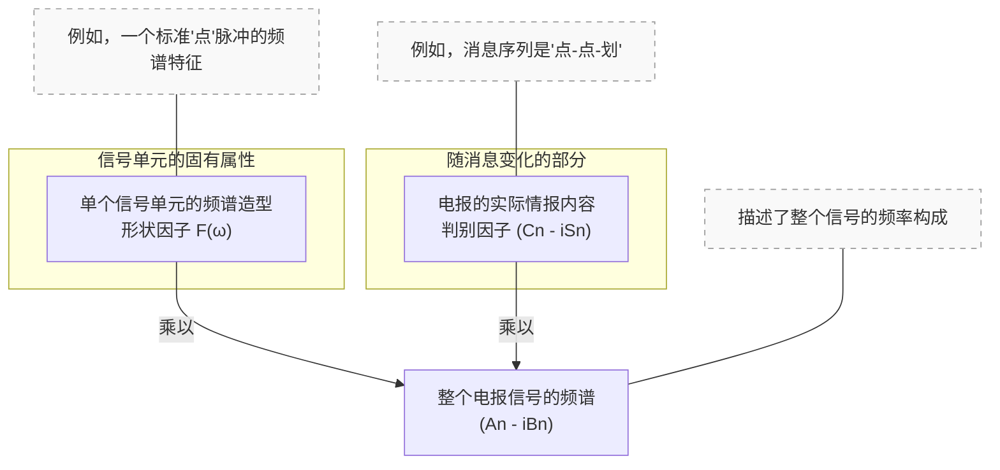
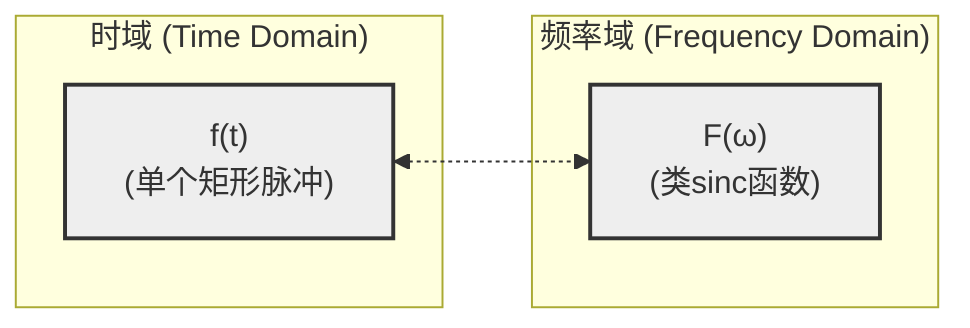
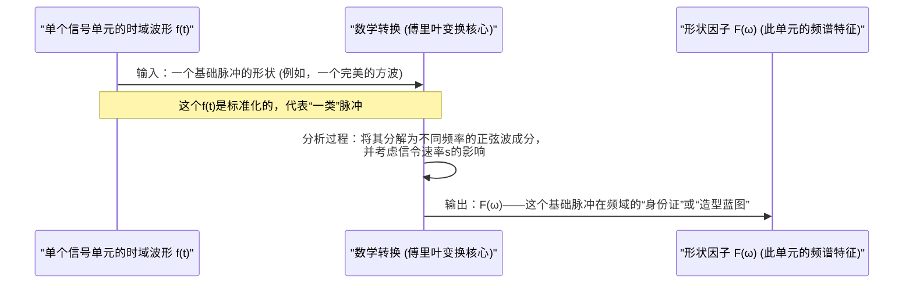

# Chapter 5: 形状因子 (F(ω))


在上一章[信号波形的对偶性](04_信号波形的对偶性_.md)中，我们理解了信号可以从时间域和频率域两个角度进行分析，并且这两个域通过傅里叶变换相互关联。这一章，我们将深入探讨奈奎斯特提出的一个关键的频率域概念：**形状因子 F(ω)**，它帮助我们从根本上理解构成信号的基本单元的“频谱身份证”或“造型特征”。

## 为什么要关注信号单元的“形状”？

想象一下，我们要设计一个电报系统，用来快速发送一系列“点”信号和“划”信号。一个“点”信号可以看作是一个短促的电流脉冲。为了能够快速、清晰地发送信息，我们希望这些脉冲在接收端能够被准确地区分开来，而不是因为发送得太快而相互“模糊”，导致接收端分不清是几个“点”，还是“点”变成了“划”。这种脉冲间的模糊干扰，我们称之为**码间串扰 (Intersymbol Interference, ISI)**。

那么，我们如何定义和设计单个“点”脉冲（或者任何其他基本信号单元），才能在它被快速连续发送时，最大限度地减少码间串扰呢？这就引出了“形状因子 F(ω)”的概念。它描述了单个基础信号单元（比如一个“点”脉冲）在**频率域**应该具有什么样的“造型”或“特征”，才能有助于实现清晰、高效的通信。

## 什么是形状因子 (F(ω))？

**形状因子 F(ω)**，简单来说，就是在频域中，构成我们电报信号的**单个基本信号单元**（比如一个“点”脉冲、一个“划”脉冲，或者数字信号中的一个“1”或一个“0”）的**频谱特征**。它由这个信号单元本身在**时间域的波形 `f(t)`** 决定。

这里的几个关键点需要理解：

1.  **针对单个基本单元**：`F(ω)` 描述的是一个孤立的、标准化的信号单元的特性，而不是整个电报消息。
2.  **频率域的描述**：它告诉我们这个基本信号单元是由哪些频率成分组成的，以及这些成分的相对强度和相位是怎样的。`ω` 代表角频率 (`ω = 2πf`，其中 `f` 是我们通常所说的频率，单位是赫兹Hz)。
3.  **由时域波形决定**：一个信号单元在时间域长什么样（例如，是尖锐的方波，还是平滑的某种曲线），直接决定了它在频率域的 `F(ω)` 是什么样。这是[信号波形的对偶性](04_信号波形的对偶性_.md)的直接体现。
4.  **独立于具体情报**：`F(ω)` 是信号单元固有的“造型”，不随实际传输的“情报”内容（比如这串电报是“SOS”还是“HELLO”）而改变。情报内容是由这些基本单元如何排列组合来表达的。

**一个生动的比喻：邮票模具**

我们可以把形状因子 `F(ω)` 想象成一个制作邮票的**模具**。

*   **模具的形状 (形状因子 `F(ω)`)**：比如，这个模具可能是方形的，也可能是圆形的，或者其他特定形状。这个形状是固定的，代表了单个邮票的基本“造型”。
*   **信号单元的时域波形 `f(t)`**：这可以理解为制造这个特定形状模具所采用的工艺和材料。不同的工艺和材料（不同的 `f(t)`）会造出不同形状的模具（不同的 `F(ω)`）。
*   **邮票上的图案 (情报内容)**：无论邮票上最终印的是风景、人物还是文字（代表实际传输的情报），那个基础模具的形状 (`F(ω)`) 是不变的。情报内容是由后续我们要讨论的[判别因子 (Cn - iSn)](06_判别因子__cn___isn__.md)来决定的。

奈奎斯特的伟大之处在于，他找到了一个数学方法，可以将整个电报信号的频谱特性分解开来。

## 核心公式：频谱的分解

奈奎斯特在其论文中（PDF 第4页，公式(1)之后的解释部分）指出，整个重复电报信号的傅里叶级数系数（代表信号的整体频谱） `(An - iBn)` 可以表示为两个部分的乘积：

`(An - iBn) = F(ω) * (Cn - iSn)`

让我们解读一下这个重要的公式：

*   `(An - iBn)`：这是整个电报信号中，频率为 `ω` 的正弦分量的复数幅度。它完整描述了整个信号在特定频率上的特性。
*   **`F(ω)` (形状因子)**：正如我们所讨论的，这代表了单个、基本信号单元的频谱“造型”。它由该信号单元的时域波形 `f(t)` 和信令速率 `s` 共同决定。
*   `(Cn - iSn)` (**判别因子**)：这部分才真正携带了电报的“情报”。它取决于一系列信号单元的幅度因子 `ah`（例如，+1代表“点”，-1代表“划”，0代表“空号”），即取决于我们具体发送的是什么消息。我们将在下一章[判别因子 (Cn - iSn)](06_判别因子__cn___isn__.md)中详细讨论它。

这个公式的意义非凡：它将信号的基本“构件块”的频谱特性 (`F(ω)`) 与这些构件块如何组合以传递信息 (`Cn - iSn`) 给分离开来了！这为分析和设计通信系统提供了极大的便利。


*图 5.1: 信号频谱的分解，形状因子是其中一部分*

## 示例：一个简单矩形脉冲的形状因子

为了更具体地理解 `F(ω)`，让我们看一个奈奎斯特论文中讨论的例子：直流电报中的单个信号单元。假设这个单元是一个简单的**矩形脉冲**。

*   **时域波形 `f(t)`**：在信号单元的持续时间内，电流（或电压）保持一个恒定值，在其余时间为零。这就像一个最简单的“点”信号。

    ```
    时域中的矩形脉冲 f(t):
          幅度
           ^
           |----*----*----
           |    |    |
           |    |____|
           |
    -------|----------------> 时间 t
                T0 (脉冲宽度)
    ```

*   **形状因子 `F(ω)`**：奈奎斯特在论文第4页推导出，对于这样一个以特定速率 `s` 发送的矩形脉冲，其形状因子 `F(ω)` 为：
    `F(ω) = (8s * sin(ω / 4s)) / ω`

    这个 `sin(x)/x` 形式的函数在数学上被称为 **sinc 函数**（或抽样函数）。它的图形特征是在中心点（`ω=0`时）取得最大值，然后向两侧振荡衰减。


    *图 5.2: 矩形脉冲的形状因子是类sinc函数*

这个例子告诉我们，即使是最简单的矩形脉冲，在频率域也有其特定的“形状”——类sinc函数。不同的时域波形 `f(t)` 会有不同的 `F(ω)`。

## 形状因子 F(ω) 为何如此重要？

理解和运用 `F(ω)` 对于电报传输理论至关重要，主要体现在以下几个方面：

1.  **设计理想的接收信号**：
    为了实现[无失真传输](02_无失真传输_.md)，特别是为了在接收端的判决时刻消除码间串扰，我们希望*接收到的*单个脉冲具有某种理想的形状。例如，在[奈奎斯特准则/最小带宽](03_奈奎斯特准则_最小带宽_.md)中我们提到，如果接收到的脉冲在时间域是一个理想的sinc函数，那么在各个判决时刻就不会有码间串扰。
    一个理想的sinc函数时域脉冲，其对应的*形状因子 `Fr(ω)` 在频率域是一个完美的矩形*（即在某个频率范围 `0` 到 `s` 内幅度恒定，之外为零）。奈奎斯特在其论文的图2a（PDF第6页）就展示了这种理想的接收波形形状因子 `Fr(ω)`。

2.  **指导通信系统（信道）设计**：
    假设我们发送的脉冲具有已知的形状因子 `Fs(ω)`（由发送端硬件决定）。而我们期望在接收端得到的脉冲具有理想的形状因子 `Fr(ω)`。通信信道本身会对信号产生影响，这种影响可以用[传输导纳 (Y(ω))](07_传输导纳__y_ω___.md)来描述。它们之间的关系是（简化形式，见论文PDF第6页）：
    `Fr(ω) = Fs(ω) * Y(ω)`
    这意味着，为了得到理想的 `Fr(ω)`，我们需要的信道特性（或均衡器特性）`Y(ω)` 应该是：
    `Y(ω) = Fr(ω) / Fs(ω)`
    这个关系式告诉工程师如何设计通信线路的滤波器或均衡器，以补偿发送脉冲和信道的非理想特性，从而在接收端获得尽可能接近理想的信号形状。

3.  **实现信号整形 (Signal Shaping)**：
    `F(ω)` 的概念也为在发送端主动“塑造”信号脉冲提供了理论依据。奈奎斯特在论文第9页讨论了“广义波形 (GENERALIZED WAVEFORM)”，并给出了任意时域波形 `f(t)` 的形状因子计算公式：
    `F(ω) = 4s ∫ f(t) * e^(-iωt) dt`
    （这里的积分 `∫ f(t) * e^(-iωt) dt` 就是 `f(t)` 的傅里叶变换，`4s` 是一个与信令速率相关的比例因子）。
    这意味着，我们可以通过精心设计发送信号单元的时域波形 `f(t)`，来得到一个特定的发送形状因子 `Fs(ω)`。这样做的好处是，如果我们的通信信道 `Y(ω)` 不是很理想，我们可以通过调整 `Fs(ω)` 来使得最终接收到的 `Fr(ω)` 尽可能接近理想状态。这就是所谓的“信号整形”或“脉冲赋形”。

## 形状因子 F(ω) 是如何“产生”的？（概念性流程）

`F(ω)` 本质上是对单个信号单元时域波形 `f(t)` 进行傅里叶分析的结果，再乘以奈奎斯特定义的一些与信令速率 `s` 相关的系数。

我们可以用一个简单的流程图来形象地表示这个概念：


*图 5.3: 形状因子 F(ω) 的概念性产生过程*

这个 `F(ω)` 随后与代表实际消息序列的[判别因子 (Cn - iSn)](06_判别因子__cn___isn__.md) 相乘，共同构成了整个电报信号的完整频谱。

## 总结

在本章中，我们深入了解了**形状因子 F(ω)** 这个概念：

1.  **定义**：`F(ω)` 是构成电报信号的**单个基本信号单元**在频率域的“造型”或频谱特征。它由该单元的时域波形 `f(t)` 和信令速率 `s` 决定。
2.  **核心作用**：它允许我们将整个信号的频谱 `(An - iBn)` 分解为 `F(ω) * (Cn - iSn)`，从而将信号单元的固有“形状”与其承载的“情报”分离开来。
3.  **重要性**：
    *   帮助定义和实现理想的接收信号形状，以达成[无失真传输](02_无失真传输_.md)和消除码间串扰。
    *   指导通信系统[传输导纳 (Y(ω))](07_传输导纳__y_ω___.md)的设计。
    *   为在发送端进行信号整形提供了理论基础。
4.  **例子**：一个时域上的矩形脉冲，其 `F(ω)` 是一个类sinc函数。反之，一个理想的（用于无码间串扰的）接收脉冲如果是时域的sinc函数，则其 `F(ω)` 是频域的矩形。

形状因子 `F(ω)` 描述了信号的“模具”，但这个模具里究竟填入了什么“材料”（即具体的情报），则是由我们下一章将要讨论的[判别因子 (Cn - iSn)](06_判别因子__cn___isn__.md)来决定的。敬请期待！

---

Generated by [AI Codebase Knowledge Builder](https://github.com/The-Pocket/Tutorial-Codebase-Knowledge)