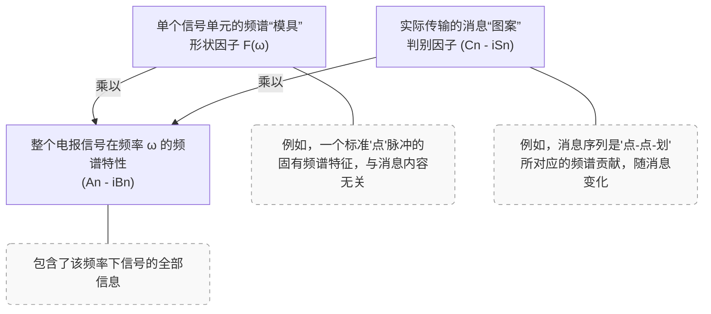
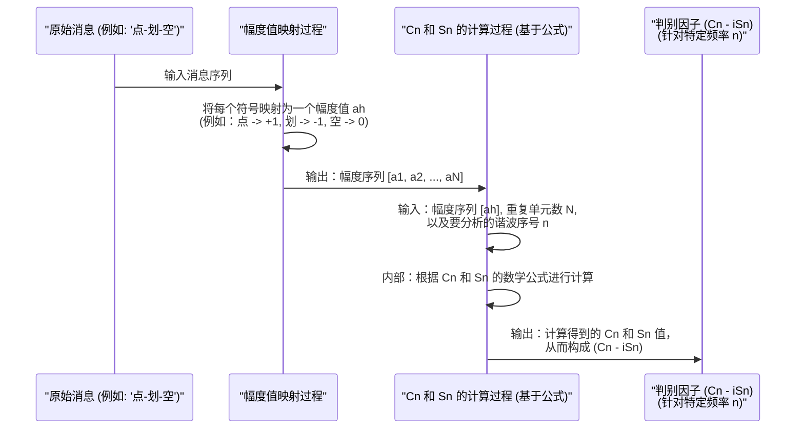

# Chapter 6: 判别因子 (Cn - iSn)

在上一章 [形状因子 (F(ω))](05_形状因子__f_ω___.md) 中，我们学习了 `F(ω)` 如何描述构成电报信号的单个基本单元在频率域的“造型”或“频谱身份证”。我们把它比作制作邮票的模具，这个模具决定了邮票的基本形状。但是，光有模具还不够，我们还需要在邮票上印上具体的图案或文字，比如邮票的面值或者纪念主题，这才是信件要传达的真正“内容”。

那么，在电报信号的频谱中，哪一部分承载着这些实际传输的“情报”或“消息”呢？这就是本章要介绍的“判别因子 (Cn - iSn)”所扮演的角色。

## 判别因子是做什么的？—— 电报的“真实内容”

想象一下，你正在发送一封电报，内容是“SOS”。这个消息是由一系列“点”和“划”组成的。
*   “点”可能用一个正电压脉冲表示。
*   “划”可能用一个负电压脉冲表示。
*   或者，“点”是幅度为 +1 的信号单元，“划”是幅度为 -1 的信号单元，而没有信号（“空号”）时幅度为 0。

这些具体的幅度值 (+1, -1, 0 等) 就是实际携带信息的部分。**判别因子 (Cn - iSn)** 正是与这些幅度值直接相关的，它在频域中代表了信号所承载的实际“情报”或“消息”。

如果说[形状因子 (F(ω))](05_形状因子__f_ω___.md)是邮票的模具，那么**判别因子 (Cn - iSn) 就是邮票上实际印制的图案或文字**。是邮票上的“埃菲尔铁塔”图案，还是“1元”面值，都由判别因子决定。它直接关系到接收端能否正确地恢复出发送的符号序列（比如“SOS”）。

## 核心理念：将“形状”与“内容”分离

奈奎斯特在他的论文中提出了一个非常重要的思想：可以将整个电报信号在某一特定频率 `ω` 的频谱特性 `(An - iBn)` 分解为两部分的乘积。这个关系我们在上一章已经提到过（见论文 PDF 第4页，公式(1)之后的解释部分）：

`(An - iBn) = F(ω) * (Cn - iSn)`

让我们再次回顾这个公式的各个组成部分：

*   `(An - iBn)`：代表整个（可能很长的、重复的）电报信号在特定频率 `ω` 上的完整频谱信息（复数幅度）。`An` 是余弦分量的幅度，`Bn` 是正弦分量的幅度。
*   `F(ω)`：**形状因子**。正如我们在[上一章](05_形状因子__f_ω___.md)所学，它代表单个、基本信号单元（比如一个标准的“点”脉冲）固有的频谱“造型”。它由这个信号单元的时域波形 `f(t)` 和信令速率 `s` 决定，与具体传输的消息内容无关。
*   `(Cn - iSn)`：**判别因子**。这部分是本章的重点。它则完全由实际发送的电报消息——即一连串信号单元的幅度值 `ah`（例如 `a1, a2, a3, ...`）所决定。`Cn` 是判别因子的实部，`Sn` 是判别因子的虚部的相反数。

这个公式的精妙之处在于，它清晰地将信号单元的“物理形态”（由 `F(ω)` 描述）与它所承载的“逻辑信息”（由 `(Cn - iSn)` 描述）分离开来。

*图 6.1: 信号频谱的分解，判别因子承载消息内容*

这种分离使得我们可以独立地研究和设计信号的“形状”以优化传输（例如减少码间串扰），同时又明确了“内容”是如何被编码到信号的频谱中的。

## 判别因子 (Cn - iSn) 是如何确定的？

判别因子 `(Cn - iSn)` 并不是凭空产生的，它是由发送端要发送的一系列信号单元的幅度值 `ah` 决定的。这里的 `ah` 代表第 `h` 个信号单元的幅度。例如：
*   如果我们发送一个“点”，`ah` 可能为 +1。
*   如果我们发送一个“划”，`ah` 可能为 -1。
*   如果是一个“空号”或者没有信号，`ah` 可能为 0。

奈奎斯特在其论文的附录I（PDF 第4页，手稿原文第620页）中给出了 `Cn` 和 `Sn` 的计算公式：

对于一个包含 `N` 个信号单元并不断重复的信号序列：

**`Cn` 的计算公式：**
`Cn = (1/N) * Σ [ah * cos(nπ(2h-1)/N)]`  (对所有 `h` 从 1 到 `N` 求和)

**`Sn` 的计算公式：**
`Sn = (1/N) * Σ [ah * sin(nπ(2h-1)/N)]`  (对所有 `h` 从 1 到 `N` 求和)

让我们来解读这些公式中的符号：
*   `Cn` 和 `Sn`：分别是判别因子 `(Cn - iSn)` 的实部和虚部的相反数，它们都是针对特定的谐波序号 `n`（对应特定频率 `ω = np`，其中 `p` 是信号重复周期的倒数乘以 `2π`）计算的。
*   `N`：一个完整信号序列中包含的信号单元总数。例如，如果我们的电报消息是“点-划-点”，并且这个序列不断重复，那么 `N=3`。
*   `ah`：第 `h` 个信号单元的幅度值。例如，对于“点-划-点”，如果“点”=+1，“划”=-1，则 `a1=+1`, `a2=-1`, `a3=+1`。
*   `n`：谐波的序号（一个整数，表示我们正在分析的是哪个频率分量）。例如，`n=1` 代表基波频率，`n=2` 代表二次谐波，等等。
*   `h`：信号单元的序号，从 1 到 `N`。
*   `Σ`：求和符号，表示将后面表达式对所有 `h` 的值加起来。
*   `cos(...)` 和 `sin(...)`：标准的余弦和正弦函数。

**简单来说，要计算特定频率 `n` 对应的 `Cn` 和 `Sn`：**
1.  遍历消息序列中的每一个信号单元 `ah` (从 `h=1` 到 `N`)。
2.  对于每一个 `ah`，分别乘以一个与 `h`、`n` 和 `N` 相关的 `cos` 值和 `sin` 值。
3.  将所有这些乘积分别累加起来。
4.  最后将累加结果除以 `N`。

这些公式告诉我们，`Cn` 和 `Sn` 是信号幅度序列 `ah` 的加权平均值，权重由三角函数决定。**最关键的一点是：如果消息序列 `ah` 改变了（比如从“SOS”变成“HELLO”），那么计算出来的 `Cn` 和 `Sn` 的值也会相应改变。** 这正是判别因子能够“判别”或“携带”不同信息的原因。

### 一个极其简化的概念示例

假设我们有一个非常短的重复信号序列，`N=2`，代表“点-划”的重复，即 `a1 = +1` (点)，`a2 = -1` (划)。我们想看看对于基波 `n=1`，`C1` 和 `S1` 是如何计算的（这里省略具体三角函数计算，只为说明概念）：

*   `C1 = (1/2) * [ a1 * cos_term_for_h1_n1  +  a2 * cos_term_for_h2_n1 ]`
*   `S1 = (1/2) * [ a1 * sin_term_for_h1_n1  +  a2 * sin_term_for_h2_n1 ]`

将 `a1=+1` 和 `a2=-1` 代入：
*   `C1 = (1/2) * [ (+1) * cos_term_for_h1_n1  +  (-1) * cos_term_for_h2_n1 ]`
*   `S1 = (1/2) * [ (+1) * sin_term_for_h1_n1  +  (-1) * sin_term_for_h2_n1 ]`

如果现在消息变成“点-点”，即 `a1 = +1`, `a2 = +1`：
*   `C1_new = (1/2) * [ (+1) * cos_term_for_h1_n1  +  (+1) * cos_term_for_h2_n1 ]`
*   `S1_new = (1/2) * [ (+1) * sin_term_for_h1_n1  +  (+1) * sin_term_for_h2_n1 ]`

可以看到，由于 `a2` 的变化，`C1` 和 `S1` 的值也跟着变化了。因此，`(C1 - iS1)` 对于“点-划”和“点-点”是不同的，它成功地“携带”了不同的信息。

奈奎斯特论文中的图1（PDF第5页）展示了一个具体的10单元信号（"c signal"：1,0,1,0,0,1,0,0,0,0）的判别因子 `Cn` 和 `Sn` (图中用 `C` 和 `S` 表示，横轴是 `n`) 随谐波序号 `n` 变化的曲线。这清晰地表明了判别因子是如何依赖于具体的信号序列 `ah` 并且随频率（或谐波序号 `n`）变化的。

## 判别因子是如何产生的？（概念流程）

我们可以用一个简单的流程图来理解判别因子 `(Cn - iSn)` 是如何从原始消息中产生的：

*图 6.2: 判别因子 (Cn - iSn) 的概念性产生流程*

这个流程清晰地展示了：
1.  原始消息首先被转换成一串代表各个信号单元的幅度值 `ah`。
2.  然后，对于我们感兴趣的每一个频率分量（由谐波序号 `n` 指定），使用这些 `ah` 值，通过特定的数学公式计算出对应的 `Cn` 和 `Sn`。
3.  这两个值组合起来就构成了该频率下的判别因子 `(Cn - iSn)`，它就是该频率分量上承载的“消息指纹”。

## 为什么判别因子 (Cn - iSn) 如此重要？

判别因子的概念之所以重要，原因如下：

1.  **承载信息**：它是信号频谱中真正携带和区分不同消息的部分。如果接收端能够准确地恢复出各个频率分量的 `(Cn - iSn)`（并且知道所使用的[形状因子 F(ω)](05_形状因子__f_ω___.md)），理论上就能反推出原始的幅度序列 `ah`，进而解码出原始消息。
2.  **分析基础**：将信号频谱分解为 `F(ω)` 和 `(Cn - iSn)` 的乘积，极大地简化了通信系统的分析。我们可以分别研究：
    *   如何设计 `F(ω)`（通过设计单个脉冲的形状）来优化传输特性，比如减少码间串扰，适应信道带宽。
    *   通信系统（由[传输导纳 (Y(ω))](07_传输导纳__y_ω___.md)描述）如何影响 `F(ω)` 和 `(Cn - iSn)`，最终如何影响整个信号的接收。
3.  **信息论的铺垫**：虽然奈奎斯特的这篇论文主要关注的是无失真传输的条件，但这种将信号结构与信息内容分离的思想，为后来香农等人发展信息论中关于信道容量和编码的理论奠定了概念基础。

在接收端，如果系统特性已知（即知道[传输导纳 (Y(ω))](07_传输导纳__y_ω___.md)），并且发送信号的[形状因子 Fs(ω)](05_形状因子__f_ω___.md) 也已知，那么接收到的信号频谱 `(Ar,n - iBr,n)` 可以表示为：
`(Ar,n - iBr,n) = Fs(ω) * Y(ω) * (Cn - iSn)`
或者，如果我们定义接收信号的形状因子 `Fr(ω) = Fs(ω) * Y(ω)`，那么：
`(Ar,n - iBr,n) = Fr(ω) * (Cn - iSn)`

从这个式子可以看出，如果 `Fr(ω)` 已知或可以被测量/估计，那么通过测量接收信号的频谱 `(Ar,n - iBr,n)`，就可以解出 `(Cn - iSn)`，进而恢复原始信息。

## 总结

在本章中，我们学习了**判别因子 (Cn - iSn)** 这个关键概念：

1.  **定义**：判别因子 `(Cn - iSn)` 是在信号的频谱表示中，真正承载实际传输的“情报”或“消息”的部分。
2.  **决定因素**：它由电报消息中一连串信号单元的幅度值 `ah` (例如，+1 代表“点”，-1 代表“划”)，通过特定的数学公式（涉及对 `ah` 的加权求和）计算得出。
3.  **核心作用**：它使得整个信号的频谱 `(An - iBn)` 可以被优雅地分解为[形状因子 F(ω)](05_形状因子__f_ω___.md)（信号单元的固有“造型”）与判别因子 `(Cn - iSn)`（消息的“内容”）的乘积。
4.  **重要性**：
    *   它直接关系到接收端能否正确恢复发送的符号序列。
    *   为通信系统的分析和设计（例如，如何从接收信号中提取信息）提供了清晰的理论框架。

如果说[形状因子 F(ω)](05_形状因子__f_ω___.md) 是我们精心设计的、用于承载信息的“车辆”（比如一辆货车），那么判别因子 `(Cn - iSn)` 就是这辆货车上装载的“货物”（比如一箱苹果或一箱香蕉）。货车的类型 (`F(ω)`) 决定了它能跑多快、多稳，而货物的种类和数量 (`Cn - iSn`) 才是我们真正关心的“内容”。

到目前为止，我们已经讨论了信号本身的“形状”和它承载的“内容”在频域中的表现。但是，信号在从发送端到接收端的过程中，会经过一个实际的通信“线路”或“信道”。这个信道本身对不同频率的信号会有怎样的影响呢？这就是我们下一章 [传输导纳 (Y(ω))](07_传输导纳__y_ω___.md) 将要探讨的核心内容。它将告诉我们，通信系统这条“路”本身对信号的“车辆”和“货物”会产生什么样的作用。

---

Generated by [AI Codebase Knowledge Builder](https://github.com/The-Pocket/Tutorial-Codebase-Knowledge)