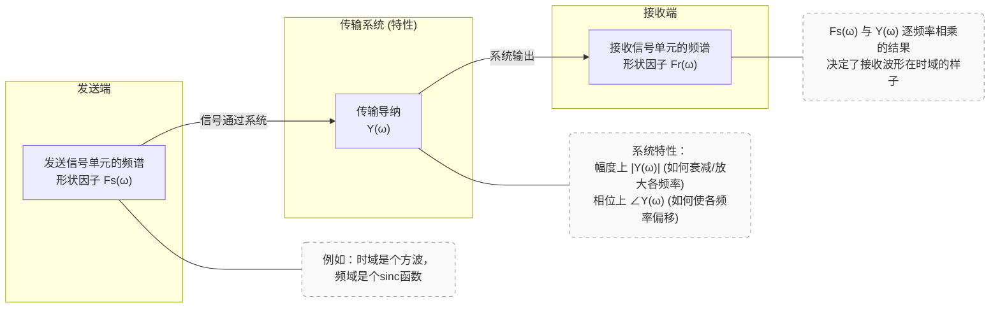
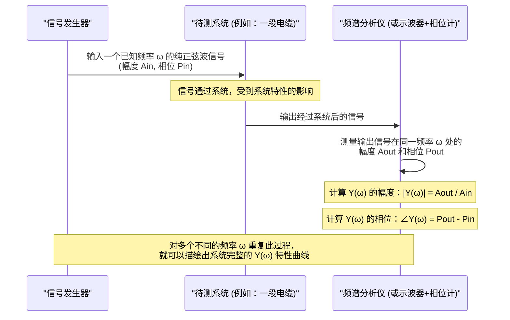

# Chapter 7: 传输导纳 (Y(ω))


欢迎来到奈奎斯特《电报传输理论中的若干问题》论文导读系列的第七章！在上一章[判别因子 (Cn - iSn)](06_判别因子__cn___isn__.md)中，我们学习了信号频谱中真正承载“情报”或“消息”的部分。我们知道了信号的“模具”（[形状因子 F(ω)](05_形状因子__f_ω___.md)）和模具中填充的“内容”（判别因子 Cn - iSn）共同构成了发送信号的完整频谱。

现在，想象一下我们精心制作的信号（包含特定的形状和内容）需要通过一条实际的电报线路（比如长长的电缆）或者一个复杂的通信设备才能到达接收端。这条“路”或这个“设备”本身并不是完美透明的，它会对信号产生影响。那么，我们如何来描述这条“路”或这个“设备”对信号中不同频率成分的“待遇”呢？这就是本章我们要探讨的核心概念——**传输导纳 (Y(ω))**。

## 传输导纳 Y(ω) 是什么？—— 通信系统的“有色眼镜”

想象一下，你戴上了一副有色的太阳镜（这就是我们的“传输系统”）。当你透过这副眼镜看世界时，外界的光线（原始的“发送信号”）会发生一些变化：
*   某些颜色的光可能会被减弱（比如蓝色光透过黄色镜片后会变暗）。
*   整体的色调也可能发生改变（比如白光透过黄色镜片后看起来会偏黄）。
*   最终你看到的，是经过这副眼镜“过滤”和“染色”后的光线（“接收信号”）。

**传输导纳 Y(ω)** 就好比这副有色眼镜的特性说明书。它详细描述了通信系统（如电报线路、滤波器、放大器等）对输入信号的**每一个频率分量 `ω`** 会产生什么样的影响。具体来说，它是一个随频率 `ω` 变化的复数，包含两方面的信息：

1.  **幅度响应 `|Y(ω)|`**：表示系统对频率为 `ω` 的信号分量在**幅度上是放大还是衰减**。
    *   如果 `|Y(ω)| > 1`，表示该频率分量被放大了。
    *   如果 `|Y(ω)| = 1`，表示该频率分量幅度不变地通过。
    *   如果 `|Y(ω)| < 1`，表示该频率分量被衰减了。
    *   回到眼镜的比喻：`|Y(ω)|` 就像镜片对特定颜色光线的透光率。深色镜片对所有颜色光的透光率都较低。

2.  **相位响应 `∠Y(ω)` (或 `arg(Y(ω))`)**：表示系统对频率为 `ω` 的信号分量在**相位上引入了多大的偏移**。
    *   相位偏移可以理解为信号在时间上的延迟。理想情况下，所有频率分量应该有相同的延迟（即相位响应与频率成线性关系），否则会导致波形失真。
    *   回到眼镜的比喻：这有点像光线通过不同厚度的镜片部分时可能产生的微小光程差，虽然不完全一样，但可以帮助理解不同频率成分可能经历不同的“待遇”。

奈奎斯特在其论文中（例如 PDF 第6页）指出，如果我们知道发送信号的[形状因子 (F(ω))](05_形状因子__f_ω___.md) `Fs(ω)`（代表发送信号单元的频谱特性）和系统的传输导纳 `Y(ω)`，那么接收到的信号单元的形状因子 `Fr(ω)` 就可以通过它们相乘得到：

`Fr(ω) = Fs(ω) * Y(ω)`

这个公式非常关键！它告诉我们，系统对信号频谱的影响，在频率域中表现为简单的乘法。


*图 7.1: 传输导纳 Y(ω) 连接发送信号与接收信号的频谱*

所以，`Y(ω)` 就像一个“频率滤波器”，它塑造了信号在传输过程中的频谱。

## 传输导纳 Y(ω) 如何影响信号？

让我们通过一个简单的例子来理解 `Y(ω)` 的作用。假设我们发送一个理想的矩形脉冲，其[形状因子 (F(ω))](05_形状因子__f_ω___.md) `Fs(ω)` 是一个 sinc 函数（中间频率分量强，高频分量逐渐减弱）。现在这个信号要通过一个具有特定 `Y(ω)` 的系统。

**情况一：理想的低通滤波器系统**
*   `Y(ω)` 的特性：
    *   `|Y(ω)| = 1` （幅度不变） 对于 `ω <= ω_cutoff` （截止频率）
    *   `|Y(ω)| = 0` （完全衰减） 对于 `ω > ω_cutoff`
    *   `∠Y(ω) = -ω * t_delay` （线性相位，表示固定延迟，无相位失真）
*   结果 `Fr(ω) = Fs(ω) * Y(ω)`：
    *   `Fs(ω)` 中低于截止频率的部分将保持不变地通过。
    *   `Fs(ω)` 中高于截止频率的部分将被完全滤除。
*   对时域波形的影响：原始的矩形脉冲会变得不那么陡峭，边缘会变得圆滑，脉冲宽度可能会展宽。这是因为信号中的高频成分（对应快速变化）被滤掉了。

**情况二：一个有损耗且高频衰减更严重的线路**
*   `Y(ω)` 的特性：
    *   `|Y(ω)|` 随着 `ω` 的增加而逐渐减小（例如，`|Y(ω)| = 1 / (1 + (ω/ω0)^2)` 类似这样）。
    *   `∠Y(ω)` 可能不再是理想的线性关系，导致相位失真。
*   结果 `Fr(ω) = Fs(ω) * Y(ω)`：
    *   所有频率分量都可能被衰减，且高频分量衰减得更厉害。
    *   不同频率分量会有不同的相位偏移。
*   对时域波形的影响：接收到的脉冲不仅幅度会减小，形状也会发生更严重的畸变，可能出现拖尾、振铃等现象。

通过分析 `Y(ω)`，工程师就能预测信号在通过特定系统后会变成什么样子，这对于判断通信质量至关重要。

## 为什么传输导纳 Y(ω) 如此重要？

理解和利用 `Y(ω)` 的概念对于电报传输理论和通信系统设计至关重要：

1.  **系统分析与预测**：
    知道了系统的 `Y(ω)`，我们就能分析该系统对各种输入信号（只要知道其频谱）的影响。我们可以预测信号在接收端会产生多大的失真。

2.  **系统设计与“均衡”**：
    这是 `Y(ω)` 最强大的应用之一。假设我们**期望**在接收端得到一个具有特定理想[形状因子 (F(ω))](05_形状因子__f_ω___.md) `Fr_ideal(ω)` 的信号（例如，一个能实现[无失真传输](02_无失真传输_.md)的形状，如时域sinc脉冲对应的频域矩形`Fr(ω)`）。我们也知道我们发送信号的形状因子是 `Fs(ω)`。
    那么，为了达到这个目标，我们所需要的整个传输系统的“理想传输导纳” `Y_ideal(ω)` 就应该是：
    `Y_ideal(ω) = Fr_ideal(ω) / Fs(ω)`
    (参考奈奎斯特论文 PDF 第6页)

    现在，如果实际的物理线路（比如电缆）本身的传输导纳是 `Y_channel(ω)`，它通常并不理想。为了补偿 `Y_channel(ω)` 的不良特性，我们可以在发送端或接收端加入一个叫做“均衡器 (Equalizer)”的电路。这个均衡器的传输导纳设为 `Y_eq(ω)`。我们的目标是让整个系统的传输导纳（线路加上均衡器）尽可能接近 `Y_ideal(ω)`：
    `Y_channel(ω) * Y_eq(ω) ≈ Y_ideal(ω)`
    因此，均衡器的设计目标是：
    `Y_eq(ω) ≈ Y_ideal(ω) / Y_channel(ω) = Fr_ideal(ω) / (Fs(ω) * Y_channel(ω))`

    这就好比，如果原来的镜片让东西看起来太暗（`Y_channel(ω)` 幅度衰减大），我们就在它前面再加一个能适度放大光线的镜片（均衡器 `Y_eq(ω)`），使得最终效果刚刚好。

    奈奎斯特在论文的第10页（PDF）也指出了在频率域进行这种计算的优势：
    > "It is seen that in the case of functions of ω the operations consist of the multiplication of two characteristics. ... In the case of the functions of t the computations are much more complex... It is, therefore, as a practical matter, greatly advantageous to arrange the calculations so they can be carried out with functions of ω."
    > **翻译**：“可以看出，在处理 ω 的函数时，操作包括两个特性的相乘。... 而在处理 t 的函数时，计算要复杂得多... 因此，从实践角度来看，将计算安排成可以用 ω 的函数来执行，具有很大的优势。”
    这意味着在频率域用乘法来处理系统特性，比在时域用复杂的卷积运算要简单得多。

## 传输导纳 Y(ω) 是如何确定的？

一个实际通信系统的 `Y(ω)` 可以通过以下方式确定：

1.  **理论计算（针对简单电路）**：
    对于由电阻(R)、电感(L)、电容(C)等元件组成的简单电路，可以通过电路理论（例如，使用复阻抗概念，计算输出电压与输入电压之比，或输出电流与输入电压之比等）推导出其 `Y(ω)` 的数学表达式。

2.  **测量（针对复杂系统或实际线路）**：
    对于复杂的系统或真实的物理线路（如电缆），直接测量其频率响应是更常见的方法。概念上的测量过程如下：


    *图 7.2: 概念性测量传输导纳 Y(ω) 的过程*

    通过这种逐点测量的方法，即使对于非常复杂的系统，我们也能实验性地得到其 `Y(ω)`。

## 传输导纳 Y(ω) 在奈奎斯特论文中的角色

奈奎斯特的论文大量运用了频率域的分析方法。`Y(ω)` (或其等效概念，如电路的相位和幅度特性) 是这种分析的核心。
例如，在讨论如何实现[无失真传输](02_无失真传输_.md)（特别是满足特定判决条件）时，论文常常从期望的接收波形 `Fr(ω)` 出发，结合已知的发送波形 `Fs(ω)`，来反推对系统 `Y(ω)` 的要求（见 PDF 第6页的推导）。
此外，在讨论各种理想[形状因子 (F(ω))](05_形状因子__f_ω___.md)时（如论文图2，PDF 第6页），这些形状因子本身就可以看作是某种理想的 `Y(ω)`（如果假设输入是全通的）或者是通过特定的 `Y(ω)` 实现的。

下面的（伪）代码片段概念性地展示了如果我们已经有了 `Fs(ω)` 和 `Y(ω)` （比如以复数数组的形式，每个元素对应一个频率点），如何计算 `Fr(ω)`：

```python
# 假设 Fs_omega 是一个复数列表，代表发送信号的形状因子在不同频率的值
# Fs_omega[i] = 发送信号在第 i 个频率点的复数形状因子 (包含幅度和相位)
# 假设 Y_omega 是一个类似的复数列表，代表系统的传输导纳
# Y_omega[i] = 系统在第 i 个频率点的复数传输导纳

# 检查 Fs_omega 和 Y_omega 的长度是否相同
if len(Fs_omega) != len(Y_omega):
    print("错误：Fs_omega 和 Y_omega 的频率点数量必须相同！")
else:
    Fr_omega = [] # 用于存储接收信号的形状因子
    for i in range(len(Fs_omega)):
        # 核心：复数乘法
        # 幅度相乘: |Fr[i]| = |Fs[i]| * |Y[i]|
        # 相位想加: ∠Fr[i] = ∠Fs[i] + ∠Y[i]
        fr_i = Fs_omega[i] * Y_omega[i]
        Fr_omega.append(fr_i)

    # Fr_omega 现在包含了接收信号在各个频率点的复数形状因子
    # 之后可以对 Fr_omega 进行傅里叶逆变换得到时域波形 fr(t)
    # print(f"计算得到的接收信号形状因子 Fr(ω): {Fr_omega}") # 概念性输出
```
这个简单的循环展示了奈奎斯特所强调的频率域计算的简洁性：要得到接收信号的频谱特性，只需将发送信号的频谱特性与系统的传输导纳在每个频率上相乘即可。这远比在时域进行卷积运算要直观和容易处理。

## 总结

在本章中，我们学习了**传输导纳 Y(ω)** 这一至关重要的概念：

1.  **定义**：`Y(ω)` 是描述通信系统（如线路、滤波器）对信号各频率分量影响特性的复数函数。它包含幅度响应 `|Y(ω)|`（信号幅度的放大或衰减）和相位响应 `∠Y(ω)`（信号相位的偏移）。
2.  **核心关系**：接收信号的[形状因子 (F(ω))](05_形状因子__f_ω___.md) `Fr(ω)` 等于发送信号的形状因子 `Fs(ω)` 乘以系统的传输导纳 `Y(ω)`，即 `Fr(ω) = Fs(ω) * Y(ω)`。
3.  **作用**：
    *   **预测**：通过 `Y(ω)` 可以预测信号经过系统后的变化。
    *   **设计与补偿**：通过设计具有特定 `Y(ω)` 的均衡器，可以补偿信道的不良特性，以获得期望的接收信号，从而实现[无失真传输](02_无失真传输_.md)。
4.  **确定方法**：可以通过理论计算（简单电路）或实验测量（复杂系统）来得到一个系统的 `Y(ω)`。

传输导纳 `Y(ω)` 是连接发送信号和接收信号的桥梁，它告诉我们信号在“旅途”中会经历怎样的“塑造”。理解了它，我们就能更好地分析现有通信系统的性能，并设计出更高效、更可靠的通信方案。

通过前面七个章节的学习，我们已经初步了解了奈奎斯特论文中关于电报信号在时域和频域的基本特性、无失真传输的目标、实现这一目标的准则，以及描述信号和系统特性的关键参数如形状因子、判别因子和传输导纳。这些概念共同构成了理解电报传输理论的基石。奈奎斯特的这篇经典论文还进一步探讨了载波电报、单边带传输、干扰等更深入的主题，这些都建立在我们已经学习的这些基础之上。希望本系列导读能为你打开一扇通往经典通信理论的大门！

---

Generated by [AI Codebase Knowledge Builder](https://github.com/The-Pocket/Tutorial-Codebase-Knowledge)