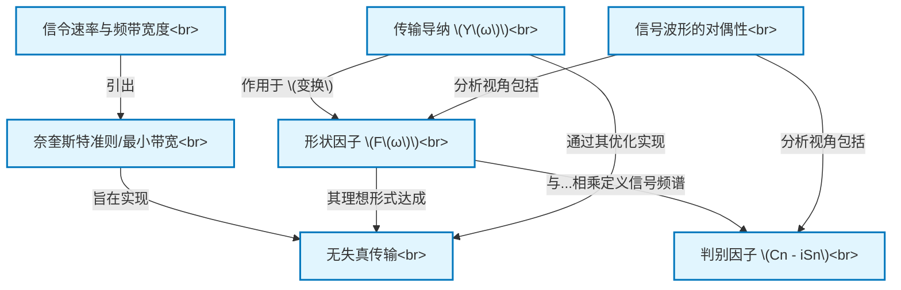

# Tutorial: Nyquist_Certain_Topics_in_Telegraph_Transmission_Theory__AIEE_1928

该项目探讨了奈奎斯特1928年关于电报传输理论的经典论文。它着重阐述了***信令速率***与实现***无失真传输***所需的***频带宽度***之间的核心关系。论文引入了***形状因子***和***判别因子***等概念在频域中分析信号，并使用***传输导纳***来表征传输线路特性。其中一个关键成果是***奈奎斯特准则***，它定义了无失真传输所需的***最小带宽***。此外，论文还讨论了***信号波形的对偶性***，即可以从时间域和频率域两个互补角度分析和处理信号。

**Source Repository:** [None](None)

## Chapters

1. [信令速率与频带宽度
](01_信令速率与频带宽度_.md)
2. [无失真传输
](02_无失真传输_.md)
3. [奈奎斯特准则/最小带宽
](03_奈奎斯特准则_最小带宽_.md)
4. [信号波形的对偶性
](04_信号波形的对偶性_.md)
5. [形状因子 (F(ω))
](05_形状因子__f_ω___.md)
6. [判别因子 (Cn - iSn)
](06_判别因子__cn___isn__.md)
7. [传输导纳 (Y(ω))
](07_传输导纳__y_ω___.md)

---

Generated by [AI Codebase Knowledge Builder](https://github.com/The-Pocket/Tutorial-Codebase-Knowledge)