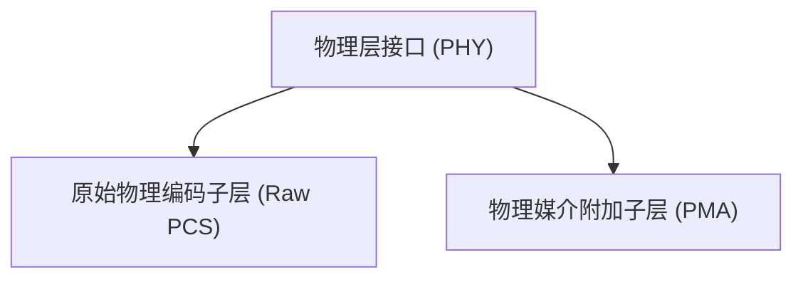
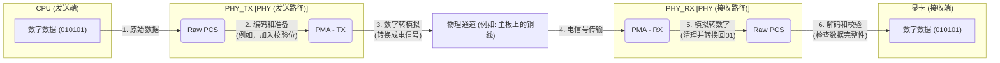

# Chapter 1: 物理层接口 (PHY)


欢迎来到 PCIe 5.0 功能描述教程的第一章！在本章中，我们将一起探索一个非常基础但至关重要的概念：**物理层接口 (PHY)**。

## 为什么需要 PHY？信息的超级信使

想象一下，你正在玩一款画面精美、特效酷炫的最新电脑游戏。你的显卡需要以极快的速度从电脑的中央处理器 (CPU) 和内存 (RAM) 获取海量数据，才能实时渲染出那些令人惊叹的虚拟世界。或者，当你从互联网下载一个大文件时，你的电脑需要快速接收网络信号并将其转换成你能使用的数据。

这些场景都依赖于计算机内部不同组件之间，或者计算机与外部设备之间进行**高速、可靠的数据通信**。但是，CPU 使用的是数字信号（一串串的0和1），而数据传输通常需要通过物理电缆（比如主板上的铜质线路，或者外部的网线）。这两者说的“语言”可不一样！

这就是物理层接口 (PHY) 发挥作用的地方。PHY 就像一个专业的“翻译官”兼“快递员”。它负责：
1.  将计算机内部的数字数据（0和1）“翻译”成能够在物理电缆上传输的电信号。
2.  通过物理电缆将这些电信号高速发送出去。
3.  在接收端，再将接收到的电信号准确无误地“翻译”回数字数据。

简单来说，**PHY 解决了数字世界和物理信号世界之间的鸿沟，使得高速数据传输成为可能。**

正如其名，“物理层接口”指的是它工作在网络通信模型中的最底层——物理层。它直接与物理媒介（如电缆、光纤）打交道。

> 官方描述是这样说的：
> 想象一下PHY是连接两台计算机进行高速数据通信的专用信使系统。它负责将数字数据转换成可以通过物理电缆（如铜线）传输的电信号，并在另一端将这些电信号准确地还原成数字数据。PHY确保了数据包在“信息高速公路”上的可靠收发，它包含了完成这一任务所需的所有子模块，如PMA和Raw PCS。

## PHY 的核心组成：团队合作的力量

一个完整的 PHY 系统为了完成上述复杂的翻译和快递任务，通常由几个关键部分协同工作。在我们的 PCIe 5.0 PHY 中，最重要的两个组成部分是：

1.  **[原始物理编码子层 (Raw PCS)](02_原始物理编码子层__raw_pcs__.md)**:
    *   你可以把 Raw PCS 想象成快递公司的“数据处理中心”。在发送数据前，它会对原始的数字数据进行一些预处理，比如打包（编码，加入一些额外的控制信息，确保数据在传输过程中的完整性和时钟同步）。在接收数据后，它会进行拆包（解码）和检查。Raw PCS 主要处理数据的逻辑层面。

2.  **[物理媒介附加子层 (PMA)](03_物理媒介附加子层__pma__.md)**:
    *   PMA 则是快递公司的“物理运输队”。它负责实际的“体力活”。在发送数据时，PMA 将 Raw PCS 处理好的数字信号转换成真实的电信号（或光信号），并驱动它们到物理线缆上。在接收数据时，PMA 从线缆上接收微弱、可能带有干扰的电信号，将其放大、清理干净，并转换回数字信号交给 Raw PCS。PMA 直接与物理传输媒介打交道。

下图展示了 PHY、Raw PCS 和 PMA 之间的关系：



这个图告诉我们，PHY 是一个整体概念，它包含了 Raw PCS 和 PMA 这两个协同工作的子模块。在接下来的章节中，我们会分别详细学习 Raw PCS 和 PMA。

## PHY 如何工作：一次数据传输的旅程

让我们通过一个简化的例子，看看数据是如何通过 PHY 从发送端到达接收端的：

**场景：CPU 要发送数据给显卡。**



1.  **CPU (发送端)** 准备好要发送的数字数据（一串0和1）。
2.  数据进入发送端的 **PHY**：
    *   首先到达 **Raw PCS**。Raw PCS 对数据进行“打包”和“编码”。比如，它可能会给每8位数据增加2位额外信息（这是一种叫做8b/10b编码的技术，有助于时钟恢复和错误检测），确保数据在长途旅行中不容易出错，并且接收方能正确识别。
    *   编码后的数据被送往 **PMA** 的发送部分（[发送器 (TX)](04_发送器__tx__.md)）。PMA TX 将这些数字信号转换成特定电压和波形的**电信号**。
3.  这些电信号通过**物理通道**（比如主板上的高速差分信号线）传输。
4.  电信号到达接收端（显卡）的 **PHY**：
    *   首先由 **PMA** 的接收部分（[接收器 (RX)](05_接收器__rx__.md)）接收。由于传输过程中信号可能会衰减或受到干扰，PMA RX 会对信号进行**放大**、**清理**（这个过程涉及到[信号均衡 (Equalization)](06_信号均衡__equalization__.md) 技术）和**时钟恢复**（使用[时钟数据恢复 (CDR)](07_时钟数据恢复__cdr__.md) 技术确保能准确地从信号中提取数据和时钟）。然后，它将清理后的电信号转换回**数字信号**。
    *   这些数字信号被送到 **Raw PCS**。Raw PCS 对数据进行“解码”（例如，将之前添加的额外2位信息剥离）和错误校验，还原出原始的数字数据。
5.  **显卡 (接收端)** 成功接收到来自 CPU 的原始数字数据。

整个过程就像一次精心策划的快递服务，确保信息准确、快速地送达目的地。

## PHY 的结构概览

在实际的硬件设计文档中，PHY 通常被描绘成一个包含若干输入输出信号的模块。下面这张图（改编自 `PCiE5_functional_description.pdf` 文档中的 Figure 4-1）展示了一个典型的 PCIe 5.0 PHY 的高层结构：

```
下图是对 DesignWare Cores PCIe 5 PHY 的一个简化表示:

+-----------------------------+
|                             |
|      物理层接口 (PHY)       |
|                             |
|  +-----------------------+  |
|  |  原始物理编码子层     |  |
|  |  (Raw PCS)            |  |
|  |                       |  |
|  |  TX 数据 ------------>|  |  TX 数据 (来自系统)
|  |  TX 时钟 ------------>|  |  TX 时钟 (来自系统)
|  |                       |  |
|  |  RX 数据 <------------|  |  RX 数据 (去往系统)
|  |  RX 时钟 <------------|  |  RX 时钟 (去往系统)
|  +-----------------------+  |
|                             |
|  +-----------------------+  |
|  |  物理媒介附加子层     |  |
|  |  (PMA / SerDes)       |  |
|  |                       |  |
|  |  TX 控制信号 -------->|  |  PMA/SerDes TX 控制
|  |                       |  |
|  |  RX 控制信号 -------->|  |  RX 控制
|  |                       |  |
|  |  电信号 <----------->|  |  物理连接 (到外部)
|  +-----------------------+  |
|                             |
+-----------------------------+

说明: N = 1, 2, 4, 或 8 (代表通道/Lane数量)
```

**对上图的解释：**

*   **物理层接口 (PHY)**：这是我们讨论的主角，它是一个集成的功能块。
*   **原始物理编码子层 (Raw PCS)**：如前所述，负责数据的编码/解码等逻辑处理。它接收来自系统核心逻辑的 `TX data` (发送数据) 和 `TX clock` (发送时钟)，并将处理后的数据传递给 PMA。同时，它从 PMA 接收数据，处理后输出 `RX data` (接收数据) 和 `RX clock` (接收时钟) 给系统核心逻辑。
*   **物理媒介附加子层 (PMA / SerDes)**：负责物理信号的转换和传输。“SerDes”是串行器/解串器 (Serializer/Deserializer) 的缩写，是 PMA 的核心功能之一，负责并行数据和串行数据之间的转换。它有 `TX controls` (发送控制) 和 `RX controls` (接收控制) 信号，用于精细调控物理传输的参数。最终，它通过“物理连接”与外部世界（如另一块芯片或设备）交换电信号。
*   **N = 1, 2, 4, 或 8**：这代表了 PHY 支持的“通道”（Lane）数量。可以把每个 Lane 想象成一条独立的数据传输车道。拥有更多 Lanes 就像高速公路有更多车道一样，可以同时传输更多数据，从而极大地提高总的数据传输速率。例如，PCIe x4 就表示有4个 Lanes。

这个图清晰地展示了 PHY 是如何作为系统数字部分和外部物理传输媒介之间的桥梁。它接收数字世界的指令和数据，将其转换为适合物理传输的形式，反之亦然。

## 总结

在本章中，我们初步认识了物理层接口 (PHY)。我们了解到：

*   PHY 是实现高速数据通信的关键组件，它连接着数字逻辑世界和物理信号世界。
*   它就像一个专业的“翻译官”和“快递员”，负责将数字数据转换为电信号进行传输，并在接收端转换回来。
*   PHY 主要由两个核心部分组成：**[原始物理编码子层 (Raw PCS)](02_原始物理编码子层__raw_pcs__.md)**（负责数据编码解码等逻辑处理）和 **[物理媒介附加子层 (PMA)](03_物理媒介附加子层__pma__.md)**（负责实际的电信号转换和收发）。
*   通过 PHY，计算机内部件或计算机之间可以高效、可靠地交换大量信息。

理解 PHY 的概念是深入学习 PCIe 及其他高速接口技术的基础。

在下一章中，我们将更深入地探讨 PHY 的第一个重要组成部分：**[原始物理编码子层 (Raw PCS)](02_原始物理编码子层__raw_pcs__.md)**。让我们一起看看它是如何为数据的高速旅行做好准备工作的！

---

Generated by [AI Codebase Knowledge Builder](https://github.com/The-Pocket/Tutorial-Codebase-Knowledge)