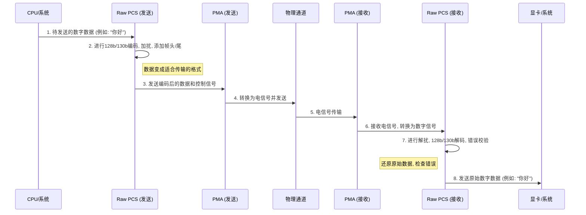

# Chapter 2: 原始物理编码子层 (Raw PCS)


在上一章 [物理层接口 (PHY)](01_物理层接口__phy__.md) 中，我们认识到 PHY 是计算机内部高速数据通信的“翻译官”和“快递员”，它由两个关键部分组成：原始物理编码子层 (Raw PCS) 和物理媒介附加子层 (PMA)。本章，我们将深入探索 PHY 的“数字大脑”——**原始物理编码子层 (Raw PCS)**。

## Raw PCS：PHY 的“数字大脑”与“交通控制中心”

想象一下，我们发送一封非常重要的信件。在信件被快递员（PMA）取走并通过复杂的物流网络（物理通道）发送之前，邮局的调度中心（Raw PCS）需要做很多准备工作：
*   检查信件内容是否符合规定（数据编码）。
*   给信件贴上正确的邮票和地址，确保能被正确投递和追踪（添加帧信息、控制信号）。
*   在特殊情况下，可能还需要协调快递员的路线或工具（管理PMA行为，如校准）。

Raw PCS 在 PCIe PHY 中扮演的正是这样一个角色。它不是直接处理物理电信号的“体力活”（那是 [物理媒介附加子层 (PMA)](03_物理媒介附加子层__pma__.md) 的工作），而是负责所有在此之前和之后的**数字逻辑处理**和**控制协调**。

> 官方描述是这样说的：
> Raw PCS是PHY中的“数字大脑”或“交通管制中心”。它作为软宏（RTL代码）实现，位于PMA之上，负责更高级的数字逻辑处理。就像邮局的调度中心，它管理PMA的行为，例如执行上电校准序列、控制自适应均衡算法，并处理与计算机系统中更高层协议（如链路层）的接口和状态转换。

这意味着 Raw PCS 是一个非常智能的组件，它处理的是“0”和“1”的数字世界，但它的决策和处理直接影响着物理信号的质量和整个数据链路的稳定性。

## Raw PCS 的核心职责

让我们更具体地看看 Raw PCS 这位“调度中心主任”都负责哪些关键任务：

1.  **数据的编码与解码 (Data Encoding/Decoding):**
    *   **发送时 (TX):** 计算机系统内部的数据是原始的二进制流。直接发送这些原始数据可能会遇到问题，比如连续太多的0或1会导致接收端难以恢复时钟信号。Raw PCS 会对这些数据进行编码，例如在 PCIe 中常用的 128b/130b 编码。这种编码方式在每128位有效数据中加入2位额外的同步头，有助于接收端进行时钟恢复和数据对齐，同时也能保证数据流中有足够的状态转换。
    *   **接收时 (RX):** 当数据从 [物理媒介附加子层 (PMA)](03_物理媒介附加子层__pma__.md) 传回来时，Raw PCS 需要进行解码，将编码后的数据还原成原始的二进制数据，并进行错误检查。

2.  **加扰与解扰 (Scrambling/Descrambling):**
    *   为了进一步打乱数据，避免出现重复模式导致电磁干扰 (EMI) 或其他信号问题，Raw PCS 会对数据进行加扰（一种可逆的伪随机化处理）。接收端的 Raw PCS 则执行相应的解扰操作。

3.  **链路初始化与训练 (Link Initialization and Training):**
    *   当 PCIe 设备首次连接或系统启动时，链路需要一个“握手”和“协商”的过程，这就是链路训练。Raw PCS 在这个过程中扮演核心角色，它与对端设备的 Raw PCS 通信，协商链路的速度、宽度（Lanes数量）以及其他参数。它还会指导 [物理媒介附加子层 (PMA)](03_物理媒介附加子层__pma__.md) 进行一系列测试和调整，以确保信号质量最佳。这个过程涉及到 [信号均衡 (Equalization)](06_信号均衡__equalization__.md) 算法的控制。

4.  **电源管理 (Power Management):**
    *   PCIe 支持多种低功耗状态。Raw PCS 负责管理这些状态之间的转换，例如，当链路空闲时，它可以指示 PMA 进入低功耗模式，并在需要时快速唤醒。它还控制着 PHY 内部各种时钟源（如 [锁相环 (MPLL & ROPLL)](08_锁相环__mpll___ropll__.md)）的开关。

5.  **PMA 校准与控制 (PMA Calibration and Control):**
    *   [物理媒介附加子层 (PMA)](03_物理媒介附加子层__pma__.md) 中的模拟电路对温度、电压等环境因素敏感。Raw PCS 负责在系统启动时以及运行过程中，根据需要启动 PMA 的校准程序。这些校准包括接收器偏移校正、时钟电路校准等，以确保 PMA 始终工作在最佳状态。
    *   例如，Raw PCS 会执行 PMA 模拟前端（AFE）的上电校准算法，如 RX AFE 偏移消除、RX 切片器校准、MPLL 校准、RX VCO 校准。

6.  **与更高层协议的接口 (Interface with Higher Layers):**
    *   Raw PCS 是 PHY 与链路层（Link Layer，PCIe 协议栈中更高的一层）之间的桥梁。它接收来自链路层的数据包进行处理和发送，并将从物理链路上接收并处理好的数据包传递给链路层。

7.  **状态监控与错误处理 (Status Monitoring and Error Handling):**
    *   Raw PCS 持续监控链路的状态，例如检测 [时钟数据恢复 (CDR)](07_时钟数据恢复__cdr__.md) 是否失锁。如果检测到错误，它会尝试恢复或向更高层报告。

下图展示了 Raw PCS 在 PHY 中的位置以及它与 PMA 和系统其他部分的交互：

```mermaid
graph TD
    A["系统核心逻辑 / 链路层"] -- "原始数据/控制" --> B["原始物理编码子层 (Raw PCS)"];
    B -- "编码后数据 / PMA控制指令" --> C["物理媒介附加子层 (PMA)"];
    C -- "物理信号" --> D["物理通道"];
    D -- "物理信号" --> E["物理媒介附加子层 (PMA)"];
    E -- "解码前数据 / PMA状态" --> B;
    B -- "解码后数据 / 状态信息" --> A;

    subgraph "PHY["物理层接口 (PHY)"]"
        B
        C
        E
    end
```
从图中可以看出，Raw PCS 位于 PMA 之上，更偏向数字逻辑处理。

## Raw PCS 如何工作：一次数据旅程的“幕后导演”

让我们回顾一下第一章中数据从 CPU 发送到显卡的例子，但这次我们更关注 Raw PCS 的具体行动。

**发送数据 (CPU -> Raw PCS -> PMA -> 显卡):**



1.  **CPU/系统** 准备好要发送的数据块。
2.  **Raw PCS (发送端)** 接收到数据后：
    *   **编码 (Encoding):** 将数据按照 PCIe 规范（例如 128b/130b）进行编码。这不仅仅是转换，还可能包括插入控制字符或序列，用于链路管理、时钟同步等。
    *   **加扰 (Scrambling):** 对编码后的数据进行加扰，以避免长串的相同比特，这有助于减少电磁干扰并帮助接收端的 [时钟数据恢复 (CDR)](07_时钟数据恢复__cdr__.md) 电路更好地工作。
    *   **组帧 (Framing):** 可能还会添加一些帧起始和结束标记。
3.  **Raw PCS (发送端)** 将处理好的数据流交给 [PMA (发送器 TX)](04_发送器__tx__.md)。同时，Raw PCS 也会通过控制信号管理 PMA 的行为，比如设置发送功率、预加重等。
4.  **PMA (发送端)** 将数字信号转换为模拟电信号，并通过物理通道发送出去。
5.  电信号通过**物理通道**传输。
6.  **PMA (接收端)** [接收器 RX](05_接收器__rx__.md) 接收模拟信号，经过放大、均衡、[时钟数据恢复 (CDR)](07_时钟数据恢复__cdr__.md)后，转换回数字信号。
7.  **Raw PCS (接收端)** 接收到来自 PMA 的数字信号后：
    *   **块同步/符号锁定 (Block/Symbol Lock):** 首先确定数据块的边界。
    *   **解扰 (Descrambling):** 进行与发送端相反的解扰操作。
    *   **解码 (Decoding):** 进行例如 130b/128b 的解码，提取出原始数据和控制信息。
    *   **错误检测 (Error Detection):** 检查在传输过程中是否发生了错误。
8.  **Raw PCS (接收端)** 将校验无误的原始数据传递给**显卡/系统**的更高层。

在这个过程中，Raw PCS 就像一位经验丰富的导演，确保每一个环节都精确无误，高效运转。

## Raw PCS 的内部构造：软宏的智慧

与 [物理媒介附加子层 (PMA)](03_物理媒介附加子层__pma__.md) 通常作为硬宏（固定的、优化된物理电路布局）不同，Raw PCS 通常作为**软宏 (Soft Macro)** 实现。这意味着 Raw PCS 的功能主要由**可综合的 RTL (Register Transfer Level) 代码**（通常是 Verilog 或 VHDL 语言）来定义。

这种方式带来了几个好处：
*   **灵活性 (Flexibility):** 设计者可以更容易地修改和更新 Raw PCS 的逻辑，以适应不同的协议版本、修复 bug 或添加新功能，而无需重新设计整个芯片的物理布局。
*   **可移植性 (Portability):** RTL 代码可以在不同的制造工艺和技术节点之间相对容易地移植。

Raw PCS 内部通常包含以下关键逻辑单元（参考 `PCiE5_functional_description.pdf` 中的 Figure 4-10）：

```mermaid
graph LR
    subgraph "RawPCS ["原始物理编码子层 (Raw PCS)"]"
        direction LR
        subgraph "COMMON ["公共模块 (raw_pcs_cmn)"]"
            direction TB
            ROM["程序存储器 (ROM/固件)"]
            SRAM["工作存储器 (SRAM)"]
            BOOT["引导加载器"]
            JTAG_IF["JTAG 接口"]
            CR_IF_TOP["顶层控制寄存器接口"]
        end

        subgraph "LANES ["每通道模块 (raw_pcs_lane) xN"]"
            direction TB
            FSM["状态机 (FSM)"]
            LANE_CR_IF["通道控制寄存器接口"]
            ALGO["校准/均衡算法逻辑"]
        end

        MEM_ARBITER["存储器仲裁器 (raw_pcs_arbt)"]
        CR_ARBITER["控制寄存器仲裁器 (raw_pcs_arbt)"]

        JTAG_IF --> CR_ARBITER
        CR_IF_TOP --> CR_ARBITER
        BOOT --> MEM_ARBITER
        ROM --> MEM_ARBITER
        SRAM <--> MEM_ARBITER
        MEM_ARBITER --> FSM
        CR_ARBITER --> FSM
        CR_ARBITER --> LANE_CR_IF
        FSM --> ALGO
        ALGO --> PMA_CTRL["到PMA的控制信号"]
        PMA_DATA_IN["来自PMA的数据"] --> LANE_CR_IF
        LANE_CR_IF --> DATA_TO_SYS["到系统的数据"]
        DATA_FROM_SYS["来自系统的数据"] --> LANE_CR_IF
        LANE_CR_IF --> PMA_DATA_OUT["到PMA的数据"]

    end

    style COMMON fill:#lightgrey,stroke:#333,stroke-width:2px
    style LANES fill:#lightyellow,stroke:#333,stroke-width:2px
```

*   **公共模块 (raw_pcs_cmn):**
    *   **程序存储器 (ROM/固件 Firmware):** 存储着控制 Raw PCS 行为的固件代码，这些代码定义了各种算法和状态转换，例如上电校准序列、自适应均衡算法的控制逻辑。
    *   **工作存储器 (SRAM):** 固件代码在系统启动时从 ROM 复制到 SRAM 中执行。这允许在需要时对固件进行更新或打补丁。
    *   **引导加载器 (Boot Loader):** 负责在启动时将固件从 ROM 加载到 SRAM。
    *   **JTAG 接口 / 控制寄存器接口 (CR I/F):** 外部系统或调试工具可以通过这些接口访问和配置 Raw PCS 及 PMA 的寄存器，用于测试、诊断和参数设置。

*   **每通道模块 (raw_pcs_lane):**
    *   PCIe 可以有多条通道 (Lane) 并行工作以提高带宽。每个 Lane 都有自己独立的 `raw_pcs_lane` 模块。
    *   **状态机 (Finite State Machines - FSMs):** 这是 Raw PCS 的“大脑”的核心。FSM 根据当前的链路状态和从固件中读取的指令，执行复杂的操作序列，如链路训练、电源状态转换、校准流程等。
    *   **算法逻辑 (Calibration/Equalization Algorithm Logic):** 实现具体的校准和均衡控制算法。

*   **仲裁器 (Arbiters):**
    *   **存储器仲裁器 (Memory Arbiter):** 管理对 SRAM 和 ROM 的访问请求，确保多个模块（如引导加载器、FSM）可以有序地访问存储器。
    *   **控制寄存器仲裁器 (Control Register Arbiter):** 管理对 Raw PCS 和 PMA 内部控制寄存器的访问。因为可能有多个源（例如 JTAG、内部 FSM）想要同时访问寄存器，仲裁器会根据优先级或轮询机制来决定访问顺序。

**Raw PCS 的“固件”：预设的智能程序**

提到 Raw PCS 是“软宏”，并且内部有“程序存储器 (ROM)”和“状态机 (FSM)”，这听起来有点像它内部运行着一个小型的计算机程序。你可以这么理解！

这些“程序”（通常称为固件）是由硬件设计工程师预先编写好的一系列指令和算法，它们指导 FSM 如何应对各种情况：
*   **启动时：** 执行PMA的上电校准序列（例如，RX AFE 偏移消除、MPLL 校准等）。
*   **链路训练时：** 如何与对端设备协商参数，如何调整 [信号均衡 (Equalization)](06_信号均衡__equalization__.md) 设置。
*   **正常工作时：** 如何监控链路质量，如何进行电源管理。
*   **出错时：** 如何尝试恢复，或如何报告错误。

这种基于固件的方法使得 Raw PCS 非常强大和灵活，能够处理 PCIe 协议中定义的复杂逻辑和状态转换。

## Raw PCS 的主要特性总结

根据 `PCiE5_functional_description.pdf` 文档（第172页），Raw PCS 的主要特性可以概括为：

*   **PMA 模拟前端的上电校准算法：** 例如，RX AFE 偏移消除、RX 切片器校准、[MPLL](08_锁相环__mpll___ropll__.md) 校准、RX [VCO](07_时钟数据恢复__cdr__.md) 校准。
    *   *简单来说：* 就像乐队演出前调音一样，Raw PCS 确保 PMA 在开始工作前处于最佳状态。
*   **PMA 中自适应均衡的控制程序：** 当链路启用自适应均衡时，Raw PCS 会控制其行为。
    *   *简单来说：* 如果通信“信道”的条件变差了（例如噪音增大），Raw PCS 会帮助 PMA 调整“耳朵”的灵敏度（[信号均衡 (Equalization)](06_信号均衡__equalization__.md)），以听清对方的声音。
*   **MPLL 和 ROPLL 的上电和断电控制：** 基于各种输入信号（如电源状态 `txX_pstate`、时钟选择 `txX_ropll_refsel` 等）。
    *   *简单来说：* 智能的电源管家，只在需要时才启动那些耗电的精密时钟（[锁相环 (MPLL & ROPLL)](08_锁相环__mpll___ropll__.md)），不用时就关掉以节省能源。
*   **JTAG Tap 控制器：** 用于串行访问寄存器。
    *   *简单来说：* 工程师进行诊断和配置时使用的一个专用“后门”或“调试端口”。
*   **可编程的 RX CDR 解锁检测器：**
    *   *简单来说：* Raw PCS 能够察觉到接收器是否没能成功锁定到输入数据的时钟节拍（[时钟数据恢复 (CDR)](07_时钟数据恢复__cdr__.md) 失锁），并及时采取措施。
*   **寄存器访问仲裁：** 协调 JTAG/CR并行接口与内部校准/自适应程序对寄存器的访问。
    *   *简单来说：* 像一个交通警察，确保大家（内部逻辑、外部接口）在访问共享的设置信息（寄存器）时不会发生冲突，保证秩序。

## 总结

在本章中，我们深入了解了 PCIe PHY 的“数字大脑”——原始物理编码子层 (Raw PCS)。我们学习到：

*   Raw PCS 负责在数据进行物理传输之前和之后的所有数字逻辑处理和控制协调工作。
*   它的核心职责包括数据编码/解码、加扰/解扰、链路初始化与训练、电源管理、PMA 校准控制以及与更高层协议的接口。
*   Raw PCS 通常作为软宏（RTL代码）实现，通过内部的状态机 (FSM) 和固件来执行复杂的算法和控制序列。
*   它管理着 PMA 的行为，确保整个物理层链路高效、稳定地运行。

理解 Raw PCS 的功能对于掌握 PCIe 如何实现高速可靠的数据传输至关重要。它不仅仅是简单的数据转换器，更是一个智能的控制中心。

在了解了 PHY 的“大脑”之后，下一章我们将深入探索 PHY 的“肌肉”和“感官”——**[物理媒介附加子层 (PMA)](03_物理媒介附加子层__pma__.md)**，看看它是如何真正与物理世界打交道，完成信号的发送和接收的。

---

Generated by [AI Codebase Knowledge Builder](https://github.com/The-Pocket/Tutorial-Codebase-Knowledge)