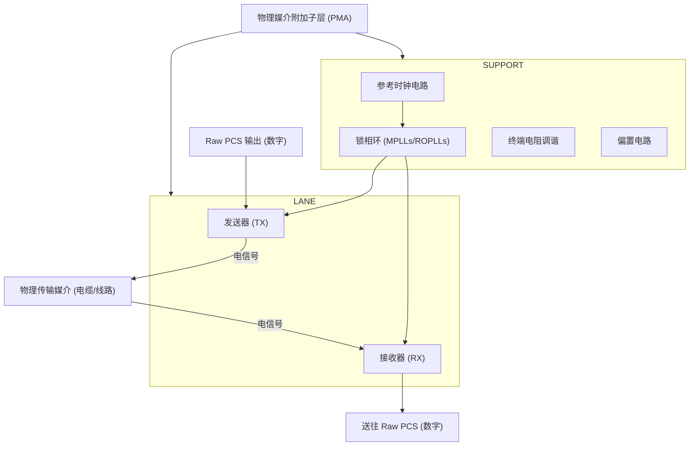
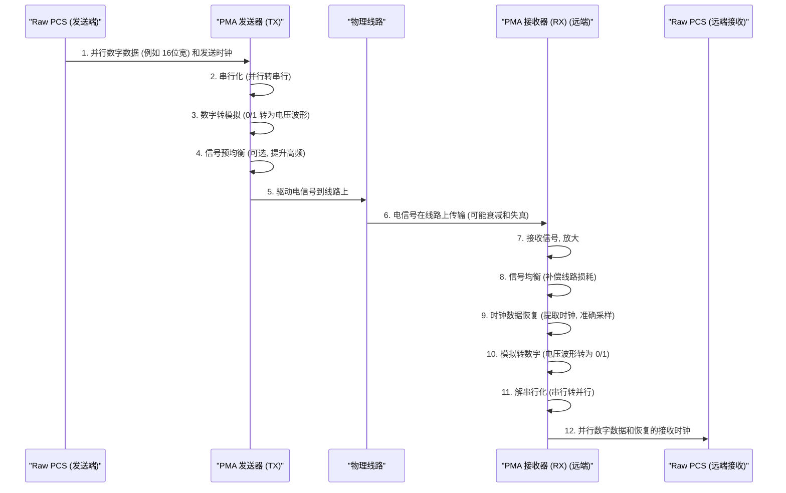

# Chapter 3: 物理媒介附加子层 (PMA)

在上一章 [原始物理编码子层 (Raw PCS)](02_原始物理编码子层__raw_pcs__.md) 中，我们学习了 PHY 的“数字大脑” Raw PCS 是如何对数据进行编码、加扰以及执行各种控制和校准任务的。Raw PCS 精心准备了要发送的数字信息包。但是，这些“0”和“1”的数字信号本身还不能在电脑主板上的铜线或外部电缆中“奔跑”。它们需要被转换成真正的物理电信号。那么，这个关键的转换和物理传输任务由谁来完成呢？

这就是我们本章的主角——**物理媒介附加子层 (PMA)** 的职责所在。

## PMA 是什么？PHY 的“硬件工程师”和“运输队”

想象一下，Raw PCS 是一位建筑设计师，它绘制了精美的建筑蓝图（处理好的数字数据）。而 PMA 则是经验丰富的施工团队和材料供应商，负责将蓝图变成实实在在的建筑（物理电信号），并确保建筑能够稳固地矗立在地面上（物理传输媒介）。

PMA (Physical Medium Attachment) 是物理层接口 (PHY) 中直接与物理传输媒介（比如主板上的铜质导线、连接器或外部电缆）打交道的部分。你可以把它看作是 PHY 中的“硬件工程师”或“物理运输队”。它负责所有与实际电信号处理相关的“体力活”。

> 官方描述（已在引言中给出）：
> PMA是PHY中负责处理实际电信号的“硬件工程师”。它就像信使系统中的运输工具和道路维护队，直接与物理传输媒介（如电缆）打交道。PMA包含了将数据转换成电信号并发射出去的发送器（TX），以及接收电信号并初步处理的接收器（RX）。此外，它还负责关键的时钟生成（如MPLL）和信号的模拟调理。

简单来说，PMA 的核心任务包括：
1.  **将数字信号转换为电信号**：把 Raw PCS 送来的 “0” 和 “1” 转换成特定电压或电流的波形。
2.  **发送电信号**：将转换后的电信号驱动到物理线缆上，使其能够长距离传输。
3.  **接收电信号**：从物理线缆上拾取微弱的、可能带有噪声和失真的电信号。
4.  **将电信号转换回数字信号**：对接收到的电信号进行放大、清理、整形，并从中恢复出原始的 “0” 和 “1”。
5.  **生成和分配高速时钟**：为数据的发送和接收提供精确的“节拍”。

没有 PMA，Raw PCS 处理得再好的数据也只是“纸上谈兵”，无法真正传递出去。

## PMA 的核心职责：连接数字与物理的桥梁

PMA 作为 PHY 的重要组成部分，肩负着多项关键职责，确保数据能够在物理世界中可靠穿梭：

1.  **串并转换 (Serialization/Deserialization - SerDes)**：
    *   **串行化 (Serialization)**：在发送数据时，Raw PCS 通常提供的是并行数据（比如一次传输16位或20位）。为了在高速链路（如PCIe）上高效传输，PMA 需要将这些并行数据转换成串行数据流（一次只传输1位，但速度极快），就像把多车道汇聚到单车道但车速极高的高速公路上。
    *   **解串行化 (Deserialization)**：在接收数据时，PMA 将接收到的串行数据流转换回并行数据，再交给 Raw PCS 处理。
    *   这个过程由 PMA 内部的 SerDes（串行器/解串器）模块完成。

2.  **数模转换 (Digital-to-Analog Conversion) 和模数转换 (Analog-to-Digital Conversion)**：
    *   **发送时 (D/A)**：PMA 的[发送器 (TX)](04_发送器__tx__.md) 部分将来自 Raw PCS 的数字比特流（0和1）转换成模拟电信号。例如，一个“1”可能表示高电压，一个“0”可能表示低电压。
    *   **接收时 (A/D)**：PMA 的[接收器 (RX)](05_接收器__rx__.md) 部分将从线缆接收到的模拟电信号（可能是各种形状和幅度的电压波形）转换回清晰的数字比特流。

3.  **信号驱动与发送 (Signal Driving and Transmission)**：
    *   PMA 的[发送器 (TX)](04_发送器__tx__.md) 必须有足够强大的驱动能力，将电信号以一定的功率推送到物理传输介质上，克服线路的阻抗和衰减。

4.  **信号接收与初步处理 (Signal Reception and Initial Processing)**：
    *   PMA 的[接收器 (RX)](05_接收器__rx__.md) 需要能检测从远端传来的、可能已经变得非常微弱且带有噪声的电信号。它会对这些信号进行放大和初步的清理。

5.  **时钟生成与管理 (Clock Generation and Management)**：
    *   高速数据的精确收发离不开稳定、精准的时钟信号。PMA 内部包含关键的[锁相环 (MPLL & ROPLL)](08_锁相环__mpll___ropll__.md) 电路，它们负责产生和分配各种高速时钟，确保数据发送和接收的同步。

6.  **信号调理 (Signal Conditioning)**：
    *   电信号在物理介质中传输时，会遇到各种挑战，如衰减（信号变弱）、失真（波形变形）、噪声干扰等。PMA 采用多种技术来“调理”信号：
        *   **[信号均衡 (Equalization)](06_信号均衡__equalization__.md)**：在发送端对信号进行预补偿（如预加重），或在接收端对信号进行补偿，以克服传输过程中的损耗，让信号“恢复活力”。
        *   **[时钟数据恢复 (CDR)](07_时钟数据恢复__cdr__.md)**：从接收到的数据信号中提取出时钟信息，确保能准确地在每个比特的“最佳时刻”进行采样判决。

## PMA 的主要组成部分

为了完成上述复杂的任务，一个典型的 PMA（如此项目 `PCiE5_functional_description.pdf` 文档中 Figure 4-2 所示）由几个主要功能块组成。我们可以将其简化理解为：

*   **通道 (Lane) 模块**:
    *   每个 PCIe 通道 (Lane) 都有自己独立的发送和接收路径。PMA 为每个 Lane 都配备了完整的收发功能。
    *   **[发送器 (TX)](04_发送器__tx__.md)**：负责将 Raw PCS 送来的并行数字数据进行串行化，转换成模拟电信号，并经过驱动和可能的预均衡后发送到物理线路上。
    *   **[接收器 (RX)](05_接收器__rx__.md)**：负责接收来自物理线路的模拟电信号，进行放大、[信号均衡 (Equalization)](06_信号均衡__equalization__.md)、[时钟数据恢复 (CDR)](07_时钟数据恢复__cdr__.md)，然后将恢复的串行数字数据解串行化后送给 Raw PCS。

*   **支持 (Support) 模块**:
    *   这是为 PMA 中所有 Lanes 提供公共资源和服务的模块。
    *   **参考时钟电路 (Reference Clock)**：接收外部提供的参考时钟，并进行缓冲和分配。这个参考时钟是所有高速时钟的基础。
    *   **[锁相环 (MPLL & ROPLL)](08_锁相环__mpll___ropll__.md)**：这是 PMA 的“心脏”，根据参考时钟生成 TX 和 RX 所需的各种高精度、高频率的工作时钟。MPLL (Main PLL) 通常是主要的锁相环。ROPLL (Ring Oscillator PLL) 可能是每条通道特有的，用于更灵活的时钟生成。
    *   **终端电阻调谐 (Termination Resistance Tuning)**：为了实现最佳的信号完整性并减少信号反射，物理链路的两端需要精确匹配的终端电阻。PMA 会根据外部参考电阻自动校准内部的终端电阻值。
    *   **偏置电路 (Bandgap based biasing)**：为 PMA 内部的模拟电路提供稳定和精确的基准电压和电流。

这些组件协同工作，构成了 PMA 这个强大的物理接口。我们将在后续章节中分别详细探讨 [发送器 (TX)](04_发送器__tx__.md)、[接收器 (RX)](05_接收器__rx__.md)、[信号均衡 (Equalization)](06_信号均衡__equalization__.md)、[时钟数据恢复 (CDR)](07_时钟数据恢复__cdr__.md) 和 [锁相环 (MPLL & ROPLL)](08_锁相环__mpll___ropll__.md)。

## PMA 是如何工作的：一次电信号的旅程

让我们通过一个简化的例子，看看数据是如何在 PMA 的帮助下，从数字世界进入物理世界，再从物理世界返回数字世界的。

**场景：数据从 Raw PCS 发往远端设备。**

**解说：**

*   **发送路径 (RPCS -> PMA_TX -> Wire):**
    1.  Raw PCS 将准备好的并行数字数据（比如 `0110100101101001`）和相应的发送时钟交给 PMA 的[发送器 (TX)](04_发送器__tx__.md) 部分。
    2.  PMA TX 首先将这些并行数据通过**串行器**转换成一长串的串行比特流（例如，一个接一个地发送 `0`, `1`, `1`, `0`...）。
    3.  然后，这些数字比特被**数模转换器 (DAC)** 转换成真实的模拟电信号。例如，“1” 可能对应 +200mV，“0” 可能对应 -200mV （这是一个差分信号的例子）。
    4.  在发送之前，信号可能会经过**预均衡**处理，比如对信号的某些频率成分进行增强，以预先补偿信号在长距离传输中会发生的高频衰减。
    5.  最后，经过处理的电信号被 TX 内的**驱动器**放大，并强有力地推向物理线路（如主板上的铜走线或外部电缆）。

*   **接收路径 (Wire -> PMA_RX -> RPCS_Remote):**
    6.  电信号经过物理线路传输后，到达远端设备的 PMA [接收器 (RX)](05_接收器__rx__.md)。此时，信号可能已经因为线路损耗而变得微弱，波形也可能因为干扰和失真而不再清晰。
    7.  RX 首先会将微弱的信号进行**放大**。
    8.  接着，**[信号均衡 (Equalization)](06_信号均衡__equalization__.md)** 电路会尝试修复信号的失真，补偿线路造成的损耗，使信号波形尽可能恢复到理想状态，就像给模糊的照片做锐化处理一样。
    9.  **[时钟数据恢复 (CDR)](07_时钟数据恢复__cdr__.md)** 电路是接收端的关键。它会从“看起来乱糟糟”的输入信号中智能地提取出隐藏的时钟节拍，并根据这个节拍在每个数据比特的“最佳采样点”进行判决，确定它是“0”还是“1”。
    10. 经过 CDR 判决后，恢复出来的信号已经是清晰的数字比特了，但还是模拟电压的形式。**模数转换器 (ADC)** 或者比较器会将其彻底转换回标准的数字逻辑电平。
    11. 恢复出来的串行数字比特流会被**解串行器**转换回并行数据。
    12. 最后，PMA RX 将恢复并转换好的并行数字数据以及从数据中恢复出来的接收时钟，一同交给远端的 Raw PCS 进行后续的解码和处理。

整个过程就像一次精密接力，PMA 确保了信息在物理层面的准确传递。

## PMA 的“硬件”特性：硬宏的精密工艺

与主要由RTL代码（软件描述）实现的 [原始物理编码子层 (Raw PCS)](02_原始物理编码子层__raw_pcs__.md) 不同，PMA 通常是以**硬宏 (Hard Macro)** 的形式存在的。

*   **硬宏 (Hard Macro)**：指的是一个已经完成了物理设计、布局布线、并且经过了详细时序和电气特性验证的固定电路模块。你可以把它想象成一个预制好的、高度优化的“黑盒子”零件。芯片设计者在设计整个芯片时，会直接把这个“黑盒子”拿来用，而不能轻易修改其内部结构。

为什么 PMA 通常是硬宏呢？
1.  **模拟电路的敏感性**：PMA 包含大量模拟电路，如放大器、滤波器、锁相环(PLL)等。这些电路的性能对物理布局、元件匹配、噪声、电源稳定性等因素非常敏感。硬宏可以确保这些敏感电路得到最佳的物理实现。
2.  **超高速运行**：PCIe 5.0 的数据速率高达 32 GT/s，甚至更高。在如此高的频率下，信号的延迟、抖动等都必须被精确控制。硬宏的设计经过专门优化，以满足这些严苛的性能要求。
3.  **性能保证**：因为硬宏是预先设计和验证的，所以它的性能（如功耗、速度、信号质量）更有保证。

将 PMA 设计为硬宏，可以确保 PHY 的物理接口部分能够达到协议要求的性能指标，尽管这牺牲了一些灵活性。而 Raw PCS 作为软宏，则提供了逻辑功能上的灵活性和可配置性。这种“软硬结合”的设计是现代高速接口 PHY 的常见做法。

## PMA 的功能概览（参考官方文档）

根据 `PCiE5_functional_description.pdf` 文档（第157页起），PMA 的主要功能可以进一步细化到其核心模块：

*   **每个通道 (Lane) 的构成** (Figure 4-2 on page 158):
    *   **接收器 (RX)** (page 159):
        *   从外部引脚接收差分串行数据。
        *   通过**连续时间线性均衡器 (CTLE)** 补偿信道损耗。
        *   对于超高速率（如 > 6.25 Gbps），使用**判决反馈均衡器 (DFE)** 进一步优化数据眼图。
        *   **时钟数据恢复 (CDR)** 电路从数据中恢复内嵌时钟，使用专用的**压控振荡器 (VCO)**作为恢复时钟的来源。
        *   恢复的时钟用于对接收数据重新定时，并送往解串器。
        *   解串器将串行数据转换为并行数据和并行数据时钟，供 PCS 使用。
        *   支持多种数据速率，通过 `rxX_rate` 等信号配置。
        *   包含RX AFE（模拟前端）校准和均衡自适应等功能。
    *   **发送器 (TX)** (page 164):
        *   从 PCS 接收并行数据。
        *   数据被串行化后送往 TX 驱动器。
        *   TX 驱动器是高速、电压模式、差分输出的。其特性（如幅度、预加重、终端）用户可控。
        *   TX 驱动器输出到一对外部引脚。
        *   包含一个多抽头（例如3抽头）的前馈均衡器 (FFE) 用于信号预加重。
        *   支持多种数据速率，通过 `txX_rate` 等信号配置。
        *   可能包含每通道的环形振荡器锁相环 (ROPLL) 用于灵活的时钟生成。

*   **支持模块 (Support Block)** (page 170):
    *   **参考时钟输入**：可从外部引脚或芯片内部获取。
    *   **参考时钟输出**：可以将参考时钟复制一份输出给其他 PHY 使用。
    *   **主锁相环 (MPLL)**：产生供通道 TX 使用的高频时钟。通常有多个 MPLL（如 MPLL A, MPLL B）以支持不同频率需求或通道分组（bifurcation）。支持扩频时钟 (SSC) 和分数分频。
    *   **终端电阻调谐**：使用外部精密电阻校准 PHY 的高速输入输出的终端阻抗。
    *   **带隙基准偏置**：为 PMA 内的模拟电路提供稳定的参考电压和电流。

这些细节展示了 PMA 是一个高度复杂和精密的模拟与数字混合信号系统。幸运的是，作为初学者，我们首先需要理解它的整体作用和主要功能块，具体的技术细节可以在后续章节中逐步深入。

## 总结

在本章中，我们一起探索了物理媒介附加子层 (PMA)，它是 PHY 中名副其实的“硬件工程师”和“运输队”：

*   PMA 是连接数字世界 (Raw PCS) 和物理传输媒介 (电缆、线路) 的关键桥梁。
*   它的核心任务是将数字信号转换为可在物理介质上传输的电信号，并在接收端将电信号准确地还原为数字信号。
*   PMA 的主要职责包括：串并转换 (SerDes)、数模/模数转换、信号发送与接收、高速时钟生成 ([锁相环 (MPLL & ROPLL)](08_锁相环__mpll___ropll__.md)) 以及信号调理 ([信号均衡 (Equalization)](06_信号均衡__equalization__.md), [时钟数据恢复 (CDR)](07_时钟数据恢复__cdr__.md))。
*   PMA 通常作为**硬宏**实现，以保证其在超高数据速率下的性能和可靠性。
*   它主要由每通道的[发送器 (TX)](04_发送器__tx__.md) 和[接收器 (RX)](05_接收器__rx__.md) 以及公共的支持模块（包含时钟电路和偏置电路等）组成。

理解了 PMA 的总体作用后，我们就更容易明白高速数据是如何克服物理障碍进行传输的。PMA 的每一个组成部分都扮演着不可或缺的角色。

在下一章中，我们将首先聚焦于 PMA 的“发声器官”——**[发送器 (TX)](04_发送器__tx__.md)**，详细了解它是如何将数字信息转换成强大的电信号并将其发送出去的。准备好进入电信号的发送世界吧！

---

Generated by [AI Codebase Knowledge Builder](https://github.com/The-Pocket/Tutorial-Codebase-Knowledge)