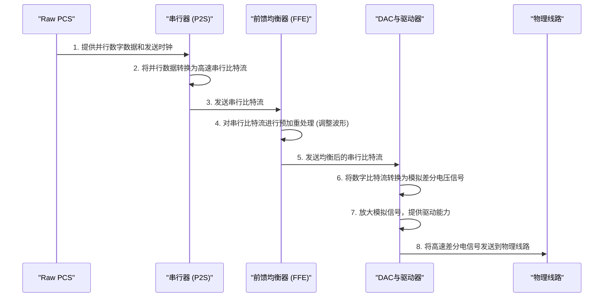

# Chapter 4: 发送器 (TX)


在上一章 [物理媒介附加子层 (PMA)](03_物理媒介附加子层__pma__.md) 中，我们了解到 PMA 是连接数字世界和物理世界的桥梁，它内部包含了负责发送数据的发送器 (TX)、负责接收数据的接收器 (RX) 以及一些重要的支持模块。现在，让我们将目光聚焦于 PMA 中那个充满活力的“播报员”——**发送器 (TX)**，看看它是如何将我们的数字信息清晰、响亮地“喊”出去的。

## TX 是什么？数据的“大嗓门播报员”

想象一下，你的电脑正准备将一个重要的文件发送到网络上，或者显卡需要从CPU那里获取下一帧游戏画面的数据。[原始物理编码子层 (Raw PCS)](02_原始物理编码子层__raw_pcs__.md) 已经将这些原始的“0”和“1”数字数据精心打包和编码完毕。但问题来了，这些数字信号本身并不能直接在冰冷的铜质导线或光纤中自由穿梭。它们需要一个转换和驱动的过程。

**发送器 (Transmitter,简称TX)** 就扮演了这个关键角色。它是 [物理媒介附加子层 (PMA)](03_物理媒介附加子层__pma__.md) 中专门负责将数字数据转换成适合在物理信道上传输的电信号（或光信号），并将其发送出去的部件。

> 官方描述是这样说的：
> TX是PMA中负责将数字数据“喊出去”的部件。好比一个声音洪亮的播报员，它接收来自Raw PCS的并行数据，将其转换成高速串行数据流。在发送前，TX会通过FFE等均衡技术调整信号的波形（如预加重），以优化信号质量，确保数据能够清晰、可靠地传输到远端接收器。

简单来说，TX 的核心任务就是：
1.  从 [原始物理编码子层 (Raw PCS)](02_原始物理编码子层__raw_pcs__.md) 接收处理好的并行数字数据。
2.  将这些并行数据转换成高速的串行数据流。
3.  对串行数据流进行信号调理（例如，预加重），以优化信号在物理介质中传输时的质量。
4.  将调理后的串行数字信号转换成模拟电信号。
5.  以足够的功率将这些电信号驱动到物理传输介质（如电缆或主板走线）上。

没有 TX，数字世界的信息就无法有效地传递到物理世界。

## TX 的核心功能：让数据“说对话，走对路”

为了成功地将数据发送出去，TX 内部集成了几个关键的功能模块，它们协同工作，确保数据信号能以最佳状态踏上旅程。

### 1. 并行到串行转换 (Parallel-to-Serial Conversion)

[原始物理编码子层 (Raw PCS)](02_原始物理编码子层__raw_pcs__.md) 通常是以并行方式提供数据的，例如一次处理 16 位或 20 位数据。这样做在芯片内部处理效率很高。但是，要在芯片外部的物理线缆上高速传输这么多路并行信号，会面临很多挑战，比如布线复杂、信号间干扰、同步困难等。

因此，TX 的首要任务之一就是将这些“并排行进”的并行数据，转换成“单排行进但速度极快”的串行数据流。这个过程由 TX 内部的**串行器 (Serializer, P2S Converter)** 完成。

```mermaid
graph LR
    subgraph "RawPCS ["原始物理编码子层 (Raw PCS)"]"
        P_Data["并行数据 (例如: 16位宽)"]
    end
    subgraph "TX ["发送器 (TX)"]"
        Serializer["串行器 (P2S)"]
        S_Data["串行数据流 (1位宽, 高速)"]
    end
    P_Data -- "输入" --> Serializer;
    Serializer -- "输出" --> S_Data;
```
*图解：并行数据进入串行器，转换成串行数据流。*

可以把串行器想象成一个交通枢纽，它把多条并行车道上的汽车（并行数据位）引导到一条单行道上（串行数据流），但这条单行道的通行速度极快。正如 `PCiE5_functional_description.pdf` 文档第 165 页 (4.2.3.1 TX Serializer) 所述，串行器支持例如 16 位或 20 位的并行接口。

### 2. 信号均衡：前馈均衡 (Feed-Forward Equalization - FFE) 与预加重

电信号在物理信道（如铜线）中传输时，并不是一帆风顺的。信道本身会对信号造成衰减和失真，特别是对高频成分的衰减更为严重。这就像声音在空气中传播，高音调的部分比低音调更容易衰减，导致远处听到的声音变得模糊不清。如果信号波形变得太差，接收端就很难正确识别出原始的“0”和“1”。

为了应对这个问题，TX 在发送信号之前会主动对信号波形进行一些“预先补偿”或“修饰”，这个过程称为**发送均衡 (Transmit Equalization)**。其中一种关键技术就是**前馈均衡 (Feed-Forward Equalization, FFE)**，通常以**预加重 (Pre-emphasis)** 的形式出现。

预加重的思想是：既然知道信号的高频成分会在信道中衰减得更厉害，那么在发送时就提前增强这些高频成分。或者，在数据发生跳变（例如从“0”变到“1”）时，暂时性地提高信号的幅度，而在数据保持不变时，则稍微降低幅度。这样，经过信道衰减后，到达接收端的信号波形会更接近理想状态，数据眼图（一种评估信号质量的图形）会张得更大更清晰。

`PCiE5_functional_description.pdf` 文档第 166 页 (4.2.3.3 TX Equalization) 提到，TX 驱动器实现了一个 3 抽头 (3-tap) 的 FFE。这通常意味着它会考虑当前要发送的比特 (主抽头 C0)、前一个比特 (前导抽头 C-1) 和后一个比特 (后随抽头 C1) 的情况来调整输出信号。

```mermaid
graph TD
    subgraph "TX_FFE ["TX 前馈均衡器 (FFE) 示意"]"
        Input_Bit["输入串行比特"] --> Delay1["延迟1个比特时间 (UI)"];
        Delay1 --> Current_Bit_Node["当前比特 (C0)"];
        Current_Bit_Node --> Sum["加权求和"];
        Input_Bit --> Pre_Cursor_Node["前导比特 (C-1)"];
        Pre_Cursor_Node --> Sum;
        Delay1 --> Delay2["延迟1个比特时间 (UI)"];
        Delay2 --> Post_Cursor_Node["后随比特 (C1)"];
        Post_Cursor_Node --> Sum;
        Sum --> Output_Signal["均衡后的输出信号"];
    end
    style Delay1 fill:#eee,stroke:#333,stroke-width:1px
    style Delay2 fill:#eee,stroke:#333,stroke-width:1px
```
*图解：一个简化的3抽头FFE结构。通过对当前比特、前一个比特和后一个比特进行加权求和来形成最终的输出波形。这些权重 (C0, C-1, C1) 可以通过 `txX_eq_main`, `txX_eq_pre`, `txX_eq_post` 等控制信号进行配置 (参考 PDF Page 166)。*

想象一位经验丰富的演讲者，当他说到一些容易被忽略的关键词时，他会刻意提高音量或者放慢语速，确保听众能清晰地捕捉到这些信息。FFE 的预加重做的就是类似的事情。这个话题我们会在专门的 [信号均衡 (Equalization)](06_信号均衡__equalization__.md) 章节中更详细地讨论。

### 3. 数字到模拟转换 (Digital-to-Analog Conversion) 与信号驱动 (Signal Driving)

经过串行化和FFE处理后，我们得到的仍然是数字信号（一串“0”和“1”的逻辑电平）。要将这些信号发送到物理线缆上，还需要将它们转换成模拟的电压或电流波形。这个任务由**数模转换器 (Digital-to-Analog Converter, DAC)** 完成。

例如，在差分信号系统中（PCIe采用的就是差分信号），一个逻辑“1”可能被转换成一对信号线上的正电压差（比如 +V/2 和 -V/2），而一个逻辑“0”则被转换成负电压差（-V/2 和 +V/2）。

转换成模拟信号后，还需要一个强大的**驱动器 (Driver)**。驱动器就像一个功率放大器，它为模拟信号提供足够的能量，使其能够克服物理线路的阻抗和衰减，清晰地传输到远端的接收器。驱动器的特性，如输出幅度、终端匹配等，都是可控的，以适应不同的信道条件。

`PCiE5_functional_description.pdf` 文档第 164 页 (4.2.3 Transmitter) 描述道：“数据被串行化后发送到 TX 驱动器，这是一个高速、电压模式、差分输出的驱动器。TX 驱动器的特性，如幅度、预加重和终端，是用户可控的。” 同时，第 165 页的 Figure 4-7 展示了 TX 的终端结构，通常是 50 欧姆的匹配电阻，以减少信号反射，保证信号完整性。

```mermaid
graph TD
    subgraph "TX_Driver_Simplified ["TX驱动器与终端 (简化示意)"]"
        direction LR
        Digital_In["来自FFE的数字信号"] --> DAC["数模转换器 (DAC)"];
        DAC --> Driver["驱动器"];
        Driver -- "txX_p (正端)" --> R_P["50Ω"] -- "V_term (终端电压)" --- Output_P["物理线路 P"];
        Driver -- "txX_m (负端)" --> R_M["50Ω"] -- "V_term (终端电压)" --- Output_M["物理线路 M"];
    end
```
*图解：简化的TX驱动器和终端模型。数字信号经DAC转换为模拟信号，再由驱动器放大并匹配终端电阻后输出到物理线路。*

## TX 的工作流程：一次数据发送之旅

现在，让我们将 TX 的各个功能串联起来，看看数据是如何一步步从 [原始物理编码子层 (Raw PCS)](02_原始物理编码子层__raw_pcs__.md) 出发，最终变成物理线路上飞驰的电信号的。



1.  **接收数据**: TX 从 [原始物理编码子层 (Raw PCS)](02_原始物理编码子层__raw_pcs__.md) 接收已经编码和加扰完毕的并行数字数据，以及用于同步发送的TX时钟。
2.  **串行化**: TX 内部的**串行器**将这些并行数据转换成一长串高速的串行比特流。
3.  **前馈均衡 (FFE)**: 串行比特流经过 FFE 电路。FFE 根据预设的均衡系数（如 C0, C-1, C1，这些系数可以通过 `txX_eq_main`, `txX_eq_pre`, `txX_eq_post` 等控制信号进行编程配置，详见 `PCiE5_functional_description.pdf` 第 166 页）对信号波形进行优化，比如增强信号的跳变沿，或者调整不同比特序列下的信号幅度。`PCiE5_functional_description.pdf` 第 167 页的 Figure 4-9 (TX Equalization) 展示了经过均衡后信号的典型波形特征，如预冲幅度 (Pre-Amplitude)、后冲幅度 (Post-Amplitude) 和直流摆幅 (DC Swing)。
4.  **数模转换与驱动**: 经过均衡处理的串行数字信号被送入**数模转换器 (DAC)**，转换成模拟的差分电压信号。随后，这些模拟信号由**驱动器 (Driver)** 放大，并以精确控制的阻抗（通常为 50 欧姆，如 `PCiE5_functional_description.pdf` 第 165 页 Figure 4-7 所示）匹配到物理传输线路，确保信号以最小的反射和最大的能量传输出去。

此外，TX 的运行速率也需要精确控制。这通常涉及到由 [锁相环 (MPLL & ROPLL)](08_锁相环__mpll___ropll__.md)（特别是每通道可能有的 ROPLL，即环形振荡器锁相环，如 `PCiE5_functional_description.pdf` 第 168 页 4.2.3.5 TX Ring-Oscillator Phase-Locked Loop 所述）生成的高频时钟。TX 内部还有速率控制逻辑 (`txX_rate` 信号，见 PDF 第 167 页 4.2.3.4 TX Rate Control)，使其能够支持 PCIe 定义的多种数据传输速率（例如 2.5 GT/s, 5.0 GT/s, 8.0 GT/s, 16 GT/s, 甚至 32 GT/s）。

## 总结

在本章中，我们详细了解了 PCIe PHY 中的重要组成部分——发送器 (TX)。我们学习到：

*   TX 是 PMA 的核心组件之一，负责将来自 Raw PCS 的数字数据转换为适合在物理信道上传输的电信号。
*   其主要功能包括：将并行数据**串行化**，通过**前馈均衡 (FFE)**（如预加重）技术优化信号波形，进行**数模转换**，最后通过**驱动器**将信号发送出去。
*   TX 的参数（如FFE系数、输出幅度）通常是可配置的，以适应不同的信道条件和协议要求。
*   TX 的稳定工作离不开精确的时钟源（如 ROPLL）和速率控制逻辑。

发送器 (TX) 就像一个技艺高超的信号工程师，它确保我们的数据在踏上物理旅程之初，就拥有一个强健的“体魄”和清晰的“嗓音”。

数据已经被成功地“喊”出去了，那么在旅途的另一端，是谁在负责“倾听”并准确地“理解”这些远道而来的信号呢？这正是我们下一章将要探讨的内容：**[接收器 (RX)](05_接收器__rx__.md)**。让我们一起去看看数据是如何被接收和解读的吧！

---

Generated by [AI Codebase Knowledge Builder](https://github.com/The-Pocket/Tutorial-Codebase-Knowledge)