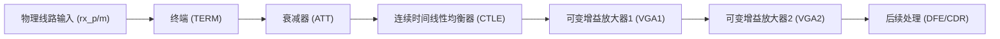
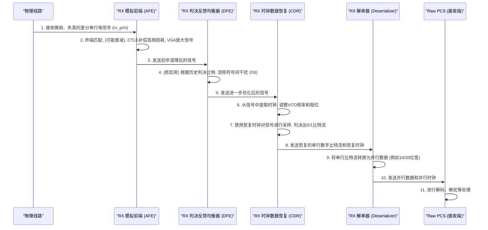

# Chapter 5: 接收器 (RX)


欢迎来到 PCIe 5.0 功能描述教程的第五章！在上一章 [发送器 (TX)](04_发送器__tx__.md) 中，我们学习了数据是如何被精心准备并“播报”出去的。数据信号一旦踏上物理线路的旅程，就会面临各种挑战，比如信号衰减、噪声干扰和波形失真。那么，当这些历经“千辛万苦”的信号到达目的地时，是谁在负责“倾听”、“理解”并准确地将它们还原成原始信息呢？

这正是我们本章的主角——**接收器 (Receiver, 简称 RX)** 的光荣使命。

## RX 是什么？数据的“顺风耳”与“解码大师”

想象一下，你正在用一个老式的收音机收听远方的电台。电台发射的信号在空气中传播了很长一段距离后，到达你的收音机时可能已经非常微弱，并且夹杂着各种“滋滋啦啦”的噪音。你的收音机需要非常灵敏的天线来捕捉这个微弱的信号，然后通过内部的调谐、滤波和放大电路，才能最终让你清晰地听到广播内容。

PCIe PHY 中的**接收器 (RX)** 就扮演着类似的角色。它是 [物理媒介附加子层 (PMA)](03_物理媒介附加子层__pma__.md) 中专门负责“收听”和“理解”传入信号的部件。

> 正如概念描述中所说：
> RX是PMA中专门负责“收听”和“理解”传入信号的部件。就像一个耳朵特别灵敏的接收员，它从电缆上捕捉微弱且可能因长距离传输而失真的高速电信号。然后，RX会通过一系列精密处理，如使用CTLE和DFE进行均衡以消除噪声、利用CDR恢复时钟信息，最终将清理干净的串行数据转换成并行数据，供Raw PCS使用。

简单来说，RX 的核心任务就是：
1.  从物理传输媒介（如电缆或主板走线）上**捕捉**微弱的、可能已失真的高速电信号。
2.  对这些信号进行**清理和修复**，比如放大信号、消除噪声、补偿信号在传输过程中的损失（这个过程涉及到[信号均衡 (Equalization)](06_信号均衡__equalization__.md)）。
3.  从清理后的信号中准确地**恢复出时钟信息**，并根据时钟节拍判断出原始的“0”和“1”（这个过程由[时钟数据恢复 (CDR)](07_时钟数据恢复__cdr__.md) 完成）。
4.  将恢复出来的串行数字数据转换成**并行数据**。
5.  将这些并行数据传递给 [原始物理编码子层 (Raw PCS)](02_原始物理编码子层__raw_pcs__.md) 进行后续的解码和处理。

没有 RX，即使发送端 (TX) 发送了完美的信号，我们也无法在接收端正确解读数据。

## RX 的核心功能：从嘈杂中辨识真谛

为了能够从可能“面目全非”的输入信号中还原出原始数据，RX 内部集成了一系列高度复杂和精密的电路。让我们逐一了解它们的主要功能。

### 1. 模拟前端 (Analog Front End - AFE)：信号的初步接待与调理

当电信号从物理线路进入 RX 时，首先迎接它们的是模拟前端 (AFE)。AFE 负责对信号进行初步的“安检”和“整理”。根据 `PCiE5_functional_description.pdf` 第 159 页的 Figure 4-3 (RX Block Diagram) 和 Figure 4-4 (RX AFE Diagram)，AFE 主要包含以下几个部分：


*图解：简化的RX模拟前端 (AFE) 流程*

*   **终端 (Termination - TERM):**
    *   作用：就像在水管末端安装一个合适的阀门一样，终端电阻确保了信号在进入 RX 时有一个匹配的阻抗。这可以最大限度地减少信号反射，提高信号质量。`PCiE5_functional_description.pdf` 第 160 页的 Figure 4-5 展示了不同的终端模式（接地或浮动）。这个终端电阻值通常会通过 [PMA](03_物理媒介附加子层__pma__.md) 的校准电路（使用外部参考电阻）进行精确调整。
*   **衰减器 (Attenuator - ATT):**
    *   作用：如果输入的信号太强（例如来自短距离传输），直接送给后续电路可能会导致饱和或失真。衰减器会适当减弱信号强度，使其处于后续电路的最佳处理范围。这由 `rxX_eq_att_lvl`信号控制（参考 PDF 第 160 页）。
*   **连续时间线性均衡器 (Continuous-Time Linear Equalizer - CTLE):**
    *   作用：这是对抗信道损耗的第一道防线。我们知道，信号在传输时高频成分衰减得更厉害。CTLE 就像一个音频均衡器，能够有选择地提升信号中被衰减的高频成分，让信号波形尽可能恢复“挺拔”。CTLE 的增强程度（boost）、极点频率（pole）和带宽（bandwidth）可以通过 `rxX_eq_ctle_boost`, `rxX_eq_ctle_pole`, 和 `rxX_rate` 等信号进行编程控制（参考 PDF 第 160 页）。我们将在 [信号均衡 (Equalization)](06_信号均衡__equalization__.md) 章节详细讨论它。
*   **可变增益放大器 (Voltage Gain Amplifiers - VGA1, VGA2):**
    *   作用：经过 CTLE 处理后，信号可能仍然比较微弱。VGA 的作用就是将信号放大到足够的强度，以便后续的判决电路能够准确识别。通常会有多个 VGA 串联（如 VGA1 和 VGA2），以提供更大的增益范围和更精细的控制。增益由 `rxX_eq_vga1_gain` 和 `rxX_eq_vga2_gain` 控制（参考 PDF 第 161 页）。

### 2. 判决反馈均衡器 (Decision Feedback Equalizer - DFE)：进一步精雕细琢

对于更高的数据速率（例如 PCIe 5.0 的 32 GT/s），仅靠 CTLE 可能不足以完全消除信号失真，特别是由于前一个或几个比特对当前比特造成的干扰（称为符号间干扰，ISI）。这时，**判决反馈均衡器 (DFE)** 就派上用场了。

*   作用：DFE 是一种非线性均衡器。它根据已经判决出的历史数据比特，来预测它们对当前比特可能造成的干扰，并从当前输入信号中减去这个干扰，从而“净化”当前比特的信号，使其更容易被正确判决。`PCiE5_functional_description.pdf` 第 159 页提到，当数据速率超过约 6.25 Gbps 时，会使用 DFE 来进一步优化数据眼图。DFE 通常有多个“抽头”(taps)，可以消除多个历史比特带来的影响 (如 PDF 第 161 页所述，DFE 有8个固定抽头和4个浮动抽头)。
*   DFE 可以通过 `rxX_dfe_bypass` 信号或寄存器位来旁路（参考 PDF 第 161 页）。我们也会在 [信号均衡 (Equalization)](06_信号均衡__equalization__.md) 章节深入学习 DFE。

### 3. 时钟数据恢复 (Clock and Data Recovery - CDR)：找准节拍，读出数据

经过 AFE 和 DFE 的“精心调理”后，信号波形变得相对清晰了。但还有一个至关重要的问题：我们应该在什么时候去“看”这个信号，才能准确判断它是“0”还是“1”呢？因为数据是以极高的速度串行传输的，并没有一个单独的时钟信号伴随而来。时钟信息是“隐藏”在数据信号本身的变化中的。

**时钟数据恢复 (CDR)** 电路的任务就是从输入的数据流中提取出这个隐藏的时钟信号，并用这个恢复出来的时钟作为“节拍器”，在每个数据比特的最佳时刻进行采样和判决。

*   `PCiE5_functional_description.pdf` 第 159 页和第 162 页的 Figure 4-6 (RX CDR Diagram) 描述了 CDR 电路。它通常包含一个锁相环 (PLL) 结构，其核心是一个**压控振荡器 (Voltage Controlled Oscillator - VCO)**。CDR 电路会不断调整 VCO 产生的时钟频率和相位，使其与输入数据的“节拍”同步。
*   一旦时钟恢复并锁定，CDR 就会用这个时钟来对均衡后的数据信号进行采样，从而恢复出原始的串行比特流。这个神奇的过程我们会在 [时钟数据恢复 (CDR)](07_时钟数据恢复__cdr__.md) 章节详细探索。

### 4. 解串器 (Deserializer)：化零为整，并行输出

CDR 恢复出来的是一长串高速的串行数据比特。然而，[原始物理编码子层 (Raw PCS)](02_原始物理编码子层__raw_pcs__.md) 通常期望接收并行数据（例如一次16位或20位），因为这样处理效率更高。

**解串器 (Deserializer, S2P Converter)** 的任务就是将这一串串行比特流，按照一定的宽度（例如16位或20位，这取决于接口配置和数据速率）重新组合成并行数据。

*   `PCiE5_functional_description.pdf` 第 162 页 (4.2.1.4 RX Deserialization) 提到，解串器使用恢复出来的高速串行时钟对输入数据进行限定，并使用低速并行时钟进行解串，支持16位或20位接口，以及在较低速率下的8位或10位接口。

### 5. 其他重要辅助功能

*   **速率控制 (Rate Control):** PCIe 支持多种数据传输速率。RX 必须能够适应不同的速率。`rxX_rate` 这样的控制信号（参考 PDF 第 162 页 4.2.1.5 RX Rate Control）允许 RX 配置其内部时钟分频等参数，以正确处理从 1.25 Gbps 到高达 32 Gbps 的数据。
*   **校准 (Calibration):** RX 内部的模拟电路对制造偏差、温度变化等很敏感。为了确保最佳性能，RX AFE 和 DFE 需要进行校准以消除偏移量等。`PCiE5_functional_description.pdf` 第 163 页 (4.2.1.6 RX Calibration) 提到了启动时校准 (Startup Calibration) 和连续校准 (Continuous Calibration)。这些校准过程通常由 [原始物理编码子层 (Raw PCS)](02_原始物理编码子层__raw_pcs__.md) 中的固件控制。
*   **均衡与自适应 (Equalization and Adaptation):** 对于像 PCIe 5.0 这样的高级协议，链路在建立（训练）过程中以及运行期间，都需要动态调整均衡参数以适应信道条件的变化。RX 参与这个自适应过程，调整自身的 AFE 和 DFE 设置，并可能请求远端 TX 调整其均衡参数。这部分内容也由 [原始物理编码子层 (Raw PCS)](02_原始物理编码子层__raw_pcs__.md) 主导（参考 PDF 第 163 页 4.2.1.7 RX Equalization and Adaptation）。

## RX 如何工作：一次数据接收的旅程

现在，让我们把 RX 的这些功能模块串联起来，看看一个远道而来的数据信号是如何被 RX 一步步“拯救”并还原的。

**场景：一个来自远端设备的高速串行差分信号到达 RX。**



1.  **信号到达与初步接待 (AFE)：**
    *   差分信号（`rx_p`, `rx_m`）首先经过**终端匹配**。
    *   如果信号过强，**衰减器 (ATT)** 会降低其幅度。
    *   **CTLE** 电路对信号进行初步的频域均衡，提升高频分量，对抗信道衰减。
    *   **VGA** 将信号放大到合适的幅度。
2.  **精细均衡 (DFE)：**
    *   如果启用了 DFE（通常在高速模式下），经过 AFE 处理的信号会进入 DFE。DFE 利用先前已判决的比特信息来消除当前比特受到的主要干扰。
3.  **时钟恢复与数据判决 (CDR)：**
    *   均衡后的信号（现在波形更清晰了）被送入 CDR 电路。
    *   CDR 的锁相环开始工作，从数据流的跳变中“学习”并恢复出内嵌的时钟信号，同时调整其 VCO，使产生的采样时钟与数据比特精确对齐。
    *   一旦时钟锁定，CDR 就会在每个比特的“最佳观察点”（通常是眼图张开最大的地方）对信号进行采样，并判决它是逻辑“0”还是逻辑“1”。至此，模拟信号被转换成了数字比特流。
4.  **串并转换 (Deserializer)：**
    *   CDR 输出的干净串行数字比特流被送往解串器。
    *   解串器按照预设的并行宽度（例如16位或20位），将串行比特流转换成并行数据字。它还会生成一个相应的并行数据时钟。
5.  **数据交付 (To Raw PCS)：**
    *   最后，恢复出来的并行数据和并行时钟被一起发送给 [原始物理编码子层 (Raw PCS)](02_原始物理编码子层__raw_pcs__.md)。Raw PCS 会继续进行后续的逻辑处理，如块同步、解扰、8b/10b 或 128b/130b 解码、错误校验等，最终还原出应用层需要的数据。

整个过程就像一个高度自动化的精密仪器，将模糊不清的原始输入信号，一步步打磨、解析，最终还原成清晰可用的数字信息。

下图是 `PCiE5_functional_description.pdf` 第 159 页的 Figure 4-3，展示了 RX 的整体框图，其中清晰地标示了 AFE、DFE、CDR 和 Deserializer 等关键部分：

```
+-----------------------------------------------------+
|                      接收器 (RX)                     |
|                                                     |
|  rx_p/m (差分输入)                                   |
|    |                                                |
|    v                                                |
|  +-----------------------+                          |
|  |    RX 模拟前端 (AFE)   |                          |
|  |  +------+  +-----+                               |
|  |  | TERM |->| ATT |-.                             |
|  |  +------+  +-----+ |                             |
|  |      |         |   |                             |
|  |      |         v   |                             |
|  |  +------+  +-----+ | +-----+                     |
|  |  | CTLE |<-'       '->| VGA1|->| VGA2|             |
|  |  +------+            +-----+   +-----+             |
|  +-----------------------+              |             |
|             | (均衡后的模拟信号)         |             |
|             v                             |             |
|  +-----------------------+ <-------------'             |
|  | 判决反馈均衡器 (DFE)  | (VGA输出也可能直接到CDR)     |
|  +-----------------------+                             |
|             | (进一步均衡后的模拟信号)                  |
|             v                                         |
|  +---------------------------------+                  |
|  |   时钟数据恢复 (CDR) 与采样器   |                  |
|  |      (包含 VCO, 锁相逻辑)      |                  |
|  +---------------------------------+                  |
|             | (恢复的串行数字数据和时钟)              |
|             v                                         |
|  +-----------------------+                          |
|  |      解串器 (S2P)      |                          |
|  +-----------------------+                          |
|             |                                         |
|             v                                         |
|  RX 数据 (并行, 至 Raw PCS)                           |
|  RX 时钟 (并行, 至 Raw PCS)                           |
|                                                     |
+-----------------------------------------------------+
```
*注意：上图是根据 Figure 4-3 进行的简化和中文转译，实际电路比这复杂得多。例如，DFE的反馈路径、CDR内部的相位检测器等细节未完全展示。*

## RX 的“硬”实力：精密模拟电路的杰作

与主要由 RTL 代码（软件描述）实现的 [原始物理编码子层 (Raw PCS)](02_原始物理编码子层__raw_pcs__.md) 不同，RX 作为 [物理媒介附加子层 (PMA)](03_物理媒介附加子层__pma__.md) 的一部分，其核心功能（尤其是 AFE、DFE 和 CDR 中的模拟电路）通常是以**硬宏 (Hard Macro)** 的形式存在的。

这意味着 RX 的这些关键部分是经过精心物理设计、布局布线，并针对高性能、低功耗进行优化的固定电路模块。这样做是因为：
*   **模拟电路的敏感性**：RX 中的放大器、滤波器、VCO 等对工艺偏差、噪声、电源波动非常敏感，硬宏设计能更好地控制这些因素。
*   **超高速性能要求**：在数十 GT/s 的速率下，信号的抖动、建立时间等都需要精确控制，硬宏经过专门优化以满足这些严苛要求。

因此，RX 就像一个由顶尖工匠打造的精密仪器，其“硬件”实力是保证数据能被准确接收的基础。

## 总结

在本章中，我们深入了解了 PCIe PHY 中辛勤工作的“顺风耳”和“解码大师”——接收器 (RX)。我们学习到：

*   RX 是 PMA 的核心组件之一，负责从物理线路接收微弱、失真的高速电信号。
*   它的主要任务包括：通过**模拟前端 (AFE)** 进行初步信号调理（终端、衰减、CTLE均衡、VGA放大），通过**判决反馈均衡器 (DFE)** 进一步消除符号间干扰，利用**时钟数据恢复 (CDR)** 电路提取时钟并准确采样数据，最后通过**解串器 (Deserializer)** 将串行数据转换为并行数据送给 Raw PCS。
*   RX 内部包含大量精密的模拟电路，对信号质量至关重要，通常以硬宏形式实现。
*   RX 的许多参数（如均衡设置）和校准过程由 [原始物理编码子层 (Raw PCS)](02_原始物理编码子层__raw_pcs__.md) 控制，以适应不同的信道条件和协议要求。

接收器 (RX) 的强大功能确保了即使在充满挑战的物理环境中，数据也能够被可靠地恢复和解读。它是高速串行通信链路中不可或缺的一环。

现在我们对信号是如何被发送 (TX) 和接收 (RX) 有了大概的了解。但其中提到的“均衡”到底是什么魔法，能让失真的信号“起死回生”呢？在下一章中，我们将专题探讨一个非常关键的技术：**[信号均衡 (Equalization)](06_信号均衡__equalization__.md)**。敬请期待！

---

Generated by [AI Codebase Knowledge Builder](https://github.com/The-Pocket/Tutorial-Codebase-Knowledge)