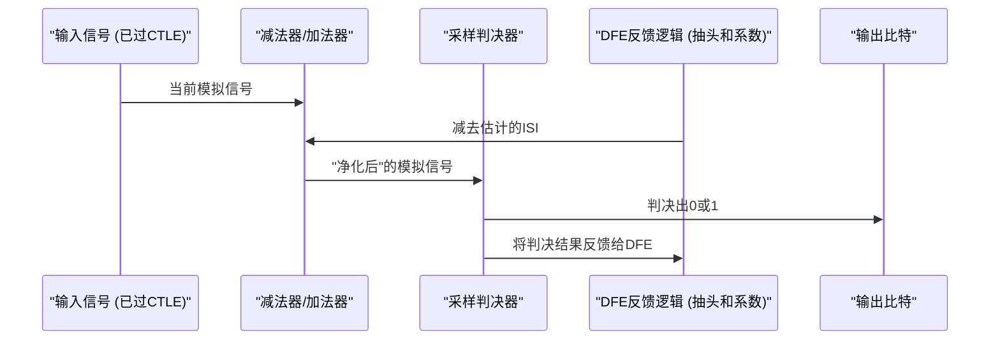

# Chapter 6: 信号均衡 (Equalization)


在上一章 [接收器 (RX)](05_接收器__rx__.md) 中，我们了解了数据信号是如何被“接收”和初步处理的。我们提到了像 CTLE 和 DFE 这样的组件，它们帮助清理信号。但是，为什么信号会变得糟糕？这些“清理”技术具体是如何工作的呢？本章，我们将深入探讨一个至关重要的概念——**信号均衡 (Equalization)**，它就像是高速数据传输的“信号医生”。

## 什么是信号均衡？数据的“高级助听器”

想象一下，你正在通过一根很长的电缆将一个超高清的电影从你的电脑传输到外部硬盘。当数据以极高的速度（比如 PCIe 5.0 的 32 GT/s）在电缆中飞驰时，它并不会完美地保持原样。就像声音在空气中传播得越远，会变得越微弱、越模糊一样，电信号在长距离传输后也会“受伤”。

**信号均衡 (Equalization)** 技术就像是为这些高速数据信号配备的“高级助听器”或“图像锐化工具”。当信号通过长电缆或电路板上的走线传输时，会发生**衰减**（信号变弱）和**失真**（波形变形），如同声音在远处变得模糊不清，或者图像的边缘变得不清晰。

均衡技术的目标就是在信号的**发送端 (TX)** 和/或**接收端 (RX)** 对这些“受伤”的信号进行补偿和修正，努力恢复信号的清晰度和完整性。通过这样做，它可以显著降低**误码率 (Bit Error Rate, BER)**——也就是传输过程中出错的数据比特的比例——从而确保数据传输的可靠性和准确性。

简单来说，没有信号均衡，高速数据传输就像试图在嘈杂的摇滚音乐会中进行清晰对话一样困难。均衡技术帮助我们“滤除噪音”、“增强音量”，让我们能够听清对方在说什么。

## 信号为何会“受伤”？高速传输的挑战

要理解为什么需要均衡，我们首先要看看信号在传输过程中会遇到哪些“敌人”：

1.  **衰减 (Attenuation):**
    *   当电信号在导体中传播时，一部分能量会因为电阻效应而转化为热能，导致信号强度逐渐减弱。距离越长，衰减越严重。
    *   更重要的是，衰减通常与频率有关：**信号的频率越高，衰减得越厉害**。高速数据信号包含大量的高频成分（快速的0/1变化），这些高频成分在传输后会比低频成分（连续的0或1）衰减得更多。
    *   **类比：** 想象你在远处听音乐，低沉的鼓声可能还能听到，但清脆的高音笛声可能已经消失了。

2.  **失真 (Distortion) 与符号间干扰 (Inter-Symbol Interference - ISI):**
    *   由于高频成分衰减更严重，信号的波形会发生变形。原本清晰的方波脉冲（代表0或1）的边沿会变得“圆滑”，脉冲本身也会“展宽”。
    *   当一个数据比特的脉冲展宽并侵入到相邻比特的时间窗口时，就会对相邻比特的判决造成干扰。这就是**符号间干扰 (ISI)**。
    *   **类比：** 想象你在快速地写字，如果每个字母都写得太“胖”或者拖了“尾巴”，字母之间就会挤在一起，难以辨认。或者，在一个回声很重的房间里说话，前一个字的回声会干扰你听清后一个字。

下图展示了一个理想信号、经过信道传输后的受损信号，以及经过均衡后部分恢复的信号：

```mermaid
graph TD
    subgraph "A ["理想信号"]"
    direction LR
        A1(( )) -- "0" --> A2(( )) -- "1" --> A3(( )) -- "0" --> A4(( )) -- "1" --> A5(( ))
    end
    subgraph "B ["受损信号 (衰减与ISI)"]"
    direction LR
        B1(( )) -.-> B2(( )) -.-> B3(( )) -.-> B4(( )) -.-> B5(( ))
    end
    subgraph "C ["均衡后信号"]"
    direction LR
        C1(( )) --> C2(( )) --> C3(( )) --> C4(( )) --> C5(( ))
    end

    A --> B -- "经过传输信道" --> C -- "经过均衡器" --> D{"数据恢复"}

    style A1 stroke-width:0px, fill:transparent
    style A2 stroke-width:0px, fill:transparent
    style A3 stroke-width:0px, fill:transparent
    style A4 stroke-width:0px, fill:transparent
    style A5 stroke-width:0px, fill:transparent
    style B1 stroke-width:0px, fill:transparent
    style B2 stroke-width:0px, fill:transparent
    style B3 stroke-width:0px, fill:transparent
    style B4 stroke-width:0px, fill:transparent
    style B5 stroke-width:0px, fill:transparent
    style C1 stroke-width:0px, fill:transparent
    style C2 stroke-width:0px, fill:transparent
    style C3 stroke-width:0px, fill:transparent
    style C4 stroke-width:0px, fill:transparent
    style C5 stroke-width:0px, fill:transparent

    linkStyle 0 stroke-width:2px,stroke:blue,fill:none
    linkStyle 1 stroke-width:1px,stroke:red,fill:none,stroke-dasharray: 5 5
    linkStyle 2 stroke-width:1.5px,stroke:green,fill:none
```
*   **理想信号：** 清晰的、棱角分明的方波。
*   **受损信号：** 幅度减小（衰减），边沿不再陡峭，脉冲展宽并可能相互重叠（ISI）。
*   **均衡后信号：** 幅度和波形在一定程度上得到恢复，边沿更清晰，为后续的[时钟数据恢复 (CDR)](07_时钟数据恢复__cdr__.md) 创造了更好的条件。

## 均衡技术的“十八般武艺”

为了对抗这些信号“杀手”，工程师们开发了多种均衡技术，主要分为两大类：发送端均衡和接收端均衡。

### 1. 发送端均衡 (Transmit Equalization - TX EQ)

发送端均衡是在信号被发送**之前**就对其进行“预处理”，目的是让信号在经过信道的“摧残”后，到达接收端时能保持较好的形态。最常用的技术是**前馈均衡 (Feed-Forward Equalizer - FFE)**，它通常以**预加重 (Pre-emphasis)** 或 **去加重 (De-emphasis)** 的形式实现。

*   **预加重 (Pre-emphasis):** 既然我们知道高频成分会衰减得更厉害，那就在发送时提前把这些高频成分“喊大声一点”。具体来说，当数据发生跳变时（例如从0到1，或从1到0，这代表了高频分量），TX会短暂地增加信号的幅度。
*   **去加重 (De-emphasis):** 当数据保持不变时（例如连续的0或连续的1，这代表了低频分量），TX会稍微降低信号的幅度。相对于增强高频，这也可以看作是“压低”了低频。
*   **效果：** 经过预加重/去加重处理的信号，在经过信道衰减后，其高频和低频成分的相对强度会更接近理想状态。

在我们的 `PCiE5_functional_description.pdf` 文档中，第 166 页的 Figure 4-8 展示了 [发送器 (TX)](04_发送器__tx__.md) 驱动器采用的 3 抽头 (3-tap) FFE 结构。

```mermaid
graph TD
    subgraph "TX_FFE ["发送端 3抽头FFE (简化)"]"
        InputBit["当前输入比特"] --> MainTapWeight["C0 (主抽头)"];
        InputBit -- "延迟1 UI" --> PreCursorBit["前一个比特"];
        PreCursorBit --> PreTapWeight["C-1 (前导抽头)"];
        InputBit -- "延迟2 UI (或从MainTapWeight延迟1UI)" --> PostCursorBit["后一个比特"];
        PostCursorBit --> PostTapWeight["C1 (后随抽头)"];

        MainTapWeight --> Sum["加权求和"];
        PreTapWeight --> Sum;
        PostTapWeight --> Sum;
        Sum --> OutputSignal["均衡后的输出信号"];
    end
```
*图解：一个3抽头FFE会考虑当前要发送的比特 (C0)、前一个比特 (C-1，也叫pre-cursor tap) 和后一个比特 (C1，也叫post-cursor tap) 的值，通过对它们进行加权求和来调整最终输出的信号幅度。这些权重系数可以通过 `txX_eq_main` (控制C0)、`txX_eq_pre` (控制C-1)、`txX_eq_post` (控制C1) 等寄存器进行编程设置 (参考 `PCiE5_functional_description.pdf` 第 166-167 页)。*

**类比：** 想象你在一个很吵闹的房间里对远处的人说话。为了让他听清，你可能会在说每个字的开头时特别用力（预加重），而在字的中间部分稍微放缓（去加重），这样即使有噪音干扰，对方也能更容易捕捉到你说话的节奏和内容。

### 2. 接收端均衡 (Receive Equalization - RX EQ)

即使发送端做了预补偿，信号到达接收端时仍然可能不够理想。因此，[接收器 (RX)](05_接收器__rx__.md) 也需要具备均衡能力，对接收到的信号进行“修复”。常用的接收端均衡技术有：

#### a. 连续时间线性均衡器 (Continuous-Time Linear Equalizer - CTLE)

*   **是什么：** CTLE 是一种模拟滤波器，它的作用类似于音频播放器上的“高音增强”旋钮。它被设计成能够放大信号中的高频成分，同时对低频成分的放大较少，或者甚至不放大。
*   **为什么：** 因为信道主要衰减高频信号，所以 CTLE 通过反向操作——提升高频——来补偿这种不均衡的衰减。
*   **特点：**
    *   **线性：** 它的输出是输入的线性函数，不会引入新的频率成分。
    *   **连续时间：** 它工作在模拟域，直接处理连续的模拟电压信号。
    *   `PCiE5_functional_description.pdf` 第 160 页提到，RX AFE 中的 CTLE 提供 3-14 dB 的高频增强范围，并且其增强级别 (boost)、极点频率 (pole) 和带宽 (bandwidth) 都是可编程的，通过 `rxX_eq_ctle_boost`、`rxX_eq_ctle_pole` 和 `rxX_rate` 等信号控制。

下图展示了 CTLE 的理想频率响应特性：

```mermaid
graph LR
    subgraph "CTLE_Response ["CTLE 频率响应示意"]"
        YAxis["增益 (dB)"] -- "高频段" --> XAxis["频率 (Hz)"];
        Origin["(0,0)"] -. "低频段" .-> XAxis;
        YAxis -.-> Origin;
        BoostPoint["(高频点, 高增益)"]
        FlatPoint["(低频点, 低增益)"]
        FlatPoint -- "响应曲线" --> BoostPoint;
    end
    style YAxis text-align:left
    style XAxis text-align:right
```
*图解：CTLE 在高频区域提供较大的增益（增强），而在低频区域增益较小。*

**类比：** 你收到一盘录音带，声音听起来很沉闷，高音部分都听不清了。你把录音带放到播放器里，然后调高了“高音 (Treble)”旋钮，声音立刻变得清晰起来。CTLE做的就是类似的事情。

#### b. 判决反馈均衡器 (Decision Feedback Equalizer - DFE)

*   **是什么：** DFE 是一种更强大的均衡器，尤其擅长对付由前几个比特造成的符号间干扰 (ISI)。它是一种**非线性**均衡器。
*   **工作原理：**
    1.  [接收器 (RX)](05_接收器__rx__.md) 对当前接收到的信号进行一次初步的判决，得到一个估计的比特值（0或1）。
    2.  DFE 会记录下最近判决出的几个比特（例如，前1个比特，前2个比特……这些被称为DFE的“抽头”或taps）。
    3.  根据这些已判决的历史比特值，以及每个历史比特对当前信号可能造成的干扰强度（这个强度由DFE的抽头系数决定），DFE 计算出一个“干扰估计值”。
    4.  在对下一个输入信号进行最终判决**之前**，DFE 会从该输入信号中减去这个“干扰估计值”。
*   **效果：** 通过主动消除已知历史比特造成的“拖尾”影响，DFE 可以大大清理当前比特的信号，使其更容易被正确判决。
*   `PCiE5_functional_description.pdf` 第 161 页提到，当数据速率超过约 6.25 Gbps 时，会使用 DFE 来进一步优化数据眼图。该 PHY 的 DFE 有 8 个固定抽头和 4 个浮动抽头，可以补偿长达 20 个单位间隔 (UI) 的 ISI。

下图是 DFE 的简化工作原理示意：


*图解：输入信号首先减去由先前判决比特产生的ISI估计值，然后“净化后”的信号再进行采样判决。判决结果又被反馈回去，用于计算对下一个比特的ISI估计。*

**类比：** 你在听一个人快速报数字，由于房间有回声，前一个数字的尾音总是会和下一个数字混在一起。如果你能记住刚刚听到的数字，并且知道它的回声是什么样的，你就可以在听下一个数字时，主动从听到的声音中“减掉”前一个数字的回声，这样就能更清楚地听到当前的数字了。DFE 就是这样工作的。

## 均衡如何协同工作：链路训练的角色

发送端和接收端的均衡器并不是孤立工作的。它们需要相互配合，并且根据实际的信道（电缆、走线）特性进行调整，才能达到最佳效果。这个动态调整的过程通常发生在**链路训练 (Link Training)** 阶段。

当一个 PCIe 设备（例如显卡）首次连接到系统时，或者系统启动时，它会和对端设备（例如主板上的 PCIe 控制器）进行一系列的通信和测试。在这个过程中：
1.  双方会发送已知的测试码型。
2.  接收方会评估接收到的信号质量，并判断当前的均衡设置是否合适。
3.  如果需要调整，接收方会通过特定的协议消息请求发送方调整其 TX FFE 系数，或者接收方自己调整其 RX CTLE/DFE 设置。
4.  这个过程会迭代进行，直到找到一组能使信号质量达到最佳（或满足协议要求）的均衡参数。

这个复杂的协商和调整过程是由 [原始物理编码子层 (Raw PCS)](02_原始物理编码子层__raw_pcs__.md) 控制的，它会向 [物理媒介附加子层 (PMA)](03_物理媒介附加子层__pma__.md) 中的均衡器（TX FFE, RX CTLE, RX DFE）发出指令来改变设置。`PCiE5_functional_description.pdf` 第 163 页的 "RX Equalization and Adaptation" 和第 172 页关于 Raw PCS 控制自适应程序的部分都描述了这一点。

所以，均衡不仅仅是一次性的设置，更是一个动态的、自适应的过程，确保链路在各种条件下都能稳定可靠地工作。

## 总结

在本章中，我们一起探索了信号均衡的奥秘。我们了解到：

*   信号在高速传输时会因为**衰减**和**失真 (ISI)** 而“受伤”，导致数据传输错误。
*   **信号均衡**技术通过在发送端和/或接收端对信号进行补偿和修正，来对抗这些负面影响。
*   **发送端均衡 (TX EQ)** 主要使用**前馈均衡 (FFE)**，如**预加重/去加重**，在信号发送前就进行优化。
*   **接收端均衡 (RX EQ)** 包括**连续时间线性均衡器 (CTLE)**（类似高音增强）和**判决反馈均衡器 (DFE)**（主动消除历史比特干扰）。
*   这些均衡技术通常在**链路训练**过程中进行动态调整，以适应具体的信道条件。
*   均衡的最终目的是降低误码率，确保高速数据传输的可靠性和完整性。

信号均衡就像是高速公路上的智能交通管理系统，它确保即使路况复杂（信道差），车辆（数据）也能安全、快速地到达目的地。

现在，我们的信号经过均衡处理后，变得更加清晰了。但是，我们还需要从这个模拟信号中准确地提取出原始的数字“0”和“1”，并且找到正确的“节拍”来读取它们。这就要依靠我们下一章的主角了：**[时钟数据恢复 (CDR)](07_时钟数据恢复__cdr__.md)**。让我们一起看看 CDR 是如何从数据信号中“魔法般”地提取出时钟和数据的！

---

Generated by [AI Codebase Knowledge Builder](https://github.com/The-Pocket/Tutorial-Codebase-Knowledge)