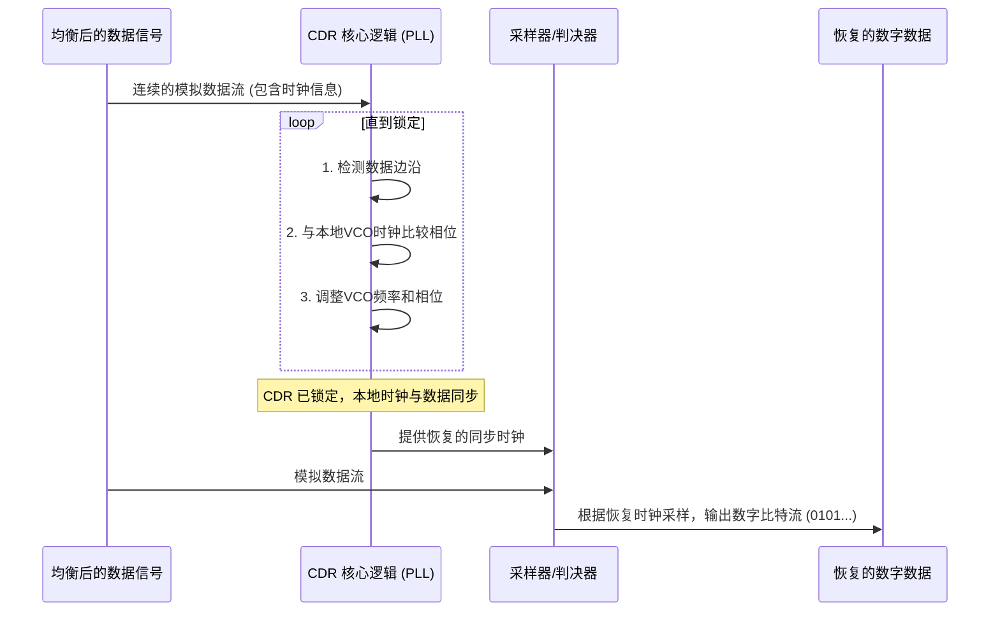

# Chapter 7: 时钟数据恢复 (CDR)


欢迎来到 PCIe 5.0 功能描述教程的第七章！在上一章 [信号均衡 (Equalization)](06_信号均衡__equalization__.md) 中，我们学习了如何通过均衡技术来“修复”在传输过程中受损的信号，让信号波形尽可能恢复清晰。经过均衡处理后，信号的“体质”变强了，更容易被识别。但是，仅仅有清晰的波形还不够。接收器还需要知道在**什么时候**去“读取”这个波形上的每一个数据点（比特），才能准确地判断它是“0”还是“1”。

想象一下，你正在收听一段非常快速的摩尔斯电码。即使每个“嘀”和“嗒”的声音都很清晰，如果你不知道发送者敲击的节奏（也就是时钟），你就无法正确地将这些声音组合成字母和单词。在高速数字通信中，我们也面临类似的问题。

这就是**时钟数据恢复 (Clock and Data Recovery, CDR)** 技术大显身手的地方。CDR 是接收器 (RX) 中的一项核心技术，如同一个聪明的解码器。由于高速串行数据中通常不携带单独的同步时钟信号，CDR 电路必须从接收到的数据流本身智能地提取出时钟信号。这就像通过分析一段快速连续的摩尔斯电码，不仅能解读出信息内容，还能准确判断出发送者敲击的节奏，从而确保数据在正确的时间点被采样和解读。

## 为什么需要 CDR？“隐形”的时钟信号

在像 PCIe 这样的高速串行接口中，数据以极高的速率（例如 32 GT/s，即每秒传输320亿个比特）一位接一位地串行传输。为了节省成本、减少引脚数量和降低信号间干扰，通常**不会**为数据信号单独配备一根传输同步时钟信号的物理线路。

如果发送一个单独的时钟信号，会遇到以下问题：
1.  **时钟与数据的偏斜 (Skew):** 由于物理线路特性、温度变化等因素，时钟信号和数据信号在传输路径上的延迟可能不完全相同。即使它们在发送端是完美同步的，到达接收端时也可能出现时间上的偏差（偏斜）。速率越高，对同步的要求越苛刻，微小的偏斜都可能导致错误。
2.  **额外的引脚和布线:** 增加时钟线会增加芯片的引脚数量和电路板的布线复杂度及成本。
3.  **电磁干扰 (EMI):** 更多的并行高速信号会增加电磁干扰的风险。

因此，设计师们想出了一个聪明的办法：将时钟信息“嵌入”到数据信号本身之中。接收端的 CDR 电路就负责从这个混合了数据和时钟信息的数据流中，将“隐形”的时钟信号“提取”出来，并用这个恢复出来的时钟来准确地采样数据。

## CDR 是如何工作的？“听声辨位”的艺术

CDR 的工作过程可以比作一位经验丰富的音乐家，他不需要看乐谱，只需要听几段旋律，就能准确把握乐曲的节拍，并跟着节拍演奏。CDR 电路的核心是一个叫做**锁相环 (Phase-Locked Loop, PLL)** 的特殊电路，我们将在下一章 [锁相环 (MPLL & ROPLL)](08_锁相环__mpll___ropll__.md) 中详细介绍它。在这里，我们先了解 CDR 利用 PLL 实现其功能的基本步骤：

### 1. 寻找数据中的“节拍”——边沿检测

CDR 电路首先会观察输入的数据流。当数据从“0”跳变到“1”，或者从“1”跳变到“0”时，信号波形上会出现一个“边沿”（上升沿或下降沿）。这些边沿的出现时刻，携带着关于原始发送时钟的节奏信息。为了确保数据流中有足够多的边沿供 CDR 参考，[原始物理编码子层 (Raw PCS)](02_原始物理编码子层__raw_pcs__.md) 会对数据进行编码（例如 PCIe 中的 128b/130b 编码），这种编码方式能保证数据流中不会出现过长的连续“0”或连续“1”，从而确保有足够多的跳变。

### 2. 锁相环 (PLL) 登场——生成并同步本地时钟

CDR 内部的 PLL 就像一个精密的“节拍器制造和校准工厂”。它主要由以下几个部分协同工作（参考 `PCiE5_functional_description.pdf` 第 162 页的 Figure 4-6 RX CDR Diagram）：

*   **相位检测器 (Phase Detector, PD):**
    *   它不断地将输入数据流中的边沿（代表着“远方传来的节拍”）与 PLL 自己内部产生的本地时钟信号的边沿进行比较。
    *   如果本地时钟的节拍超前了或者落后于数据流的节拍，相位检测器就会产生一个“误差信号”，告诉后续电路应该如何调整。

*   **环路滤波器 (Loop Filter, LF):**
    *   相位检测器产生的误差信号可能有些“毛躁”。环路滤波器就像一个“平滑器”，它对误差信号进行处理，滤除噪声，得到一个相对平稳的控制信号。这个控制信号反映了本地时钟与数据时钟之间的平均频率和相位差异。

*   **压控振荡器 (Voltage-Controlled Oscillator, VCO):**
    *   VCO 是一个神奇的元件，它可以产生一个时钟信号，并且这个时钟信号的频率会随着输入控制电压的变化而改变。
    *   环路滤波器输出的平滑控制信号就用来控制 VCO。如果数据节拍比本地时钟快，控制信号会使 VCO 提高频率；反之则降低频率。

```mermaid
graph TD
    A["均衡后的数据信号"] --> PD["相位检测器 (PD)"]
    VCO_CLK["VCO 输出 (本地时钟)"] --> PD
    PD -- "误差信号" --> LF["环路滤波器 (LF)"]
    LF -- "控制电压" --> VCO["压控振荡器 (VCO)"]
    VCO --> VCO_CLK
    VCO_CLK -.->|用于反馈比较| PD
    VCO_CLK --> SAMPLER["采样器/判决器"]
    A --> SAMPLER
    SAMPLER -- "恢复的数字数据" --> OUT["输出给解串器"]
    VCO_CLK -- "恢复的时钟信号" --> OUT_CLK["输出给解串器"]

    subgraph "CDR_Core_Loop ["CDR 核心锁相环路"]"
        direction LR
        PD --> LF --> VCO
    end
```
*图解：简化的 CDR 内部锁相环工作原理。均衡后的数据信号和 VCO 产生的本地时钟都进入相位检测器。相位检测器比较两者的相位差异，产生误差信号。误差信号经过环路滤波器平滑后，去控制 VCO 的频率和相位。这个过程不断循环，直到 VCO 产生的时钟与输入数据的时钟同步。*

### 3. “锁定”节拍——频率与相位同步

通过上述的反馈调整过程，PLL 会不断地微调 VCO 产生的本地时钟的频率和相位，力求使其与输入数据流中内含的时钟节拍完全一致。当本地时钟的频率和相位都与数据流中的平均时钟信息精确匹配时，我们就说 CDR “锁定 (Locked)”了。

`PCiE5_functional_description.pdf` 在第 159 页描述 RX 功能时提到：“CDR 环路调整 VCO 时钟频率和相位，直到频率匹配输入数据并且相位与输入数据对齐。”

### 4. 精准采样——在最佳时刻读取数据

一旦 CDR 锁定成功，它就拥有了一个与发送端时钟同频同相的、高质量的本地恢复时钟。这个恢复时钟就像一把精确的“尺子”，告诉接收器应该在每一个数据比特持续时间的正中间（也就是“数据眼图”张开最大的地方）去对均衡后的模拟信号进行采样判决。

采样判决器（通常是一个比较器或“切片器 Slicer”）会根据恢复时钟的指示，在每个比特的最佳采样时刻“看一眼”模拟信号的电压值，如果电压高于某个阈值，就判为“1”；如果低于阈值，就判为“0”。这样，原始的数字比特流就被准确地恢复出来了。

`PCiE5_functional_description.pdf` 第 159 页也提到：“恢复的时钟用于对接收到的数据进行重新定时，并将其发送到解串器。”

## CDR 工作流程示意

让我们用一个简单的时序图来梳理一下 CDR 的工作过程：



1.  **接收信号：** 经过[信号均衡 (Equalization)](06_信号均衡__equalization__.md) 处理的模拟数据信号进入 CDR 电路。
2.  **锁定过程：** CDR 内部的 PLL 开始工作：
    *   检测数据信号中的电平跳变（边沿）。
    *   将这些边沿的相位与内部 VCO 产生的时钟相位进行比较。
    *   根据比较结果（误差），通过环路滤波器调整 VCO 的输出，使其频率和相位逐渐趋近于数据信号中内含的时钟。
    *   这个过程不断迭代，直到 VCO 输出的时钟与数据信号中的时钟“严丝合缝”地同步起来，即达到“锁定”状态。
3.  **数据采样：** 一旦锁定，CDR 就会使用这个恢复出来的、与数据完美同步的本地时钟，去精确地控制采样器。
4.  **输出结果：** 采样器在每个比特的最佳时刻对模拟信号进行判决，输出恢复的串行数字比特流。这个比特流随后会被送往[接收器 (RX)](05_接收器__rx__.md) 中的解串器，转换成并行数据交给 [原始物理编码子层 (Raw PCS)](02_原始物理编码子层__raw_pcs__.md)。

## CDR 的挑战与重要性

CDR 技术虽然巧妙，但也面临挑战：
*   **抖动 (Jitter):** 实际信号中的边沿位置并不会完美地落在理想时刻，会存在微小的时域晃动，称为抖动。CDR 电路需要具备一定的抖动容忍能力和抖动跟踪能力。
*   **锁定时间 (Lock Time):** CDR 从开始工作到成功锁定需要一定的时间。这个时间需要在系统允许的范围内。
*   **无输入或连续无变化输入:** 如果长时间没有数据输入，或者输入数据长时间保持不变（没有边沿），CDR 可能会失去锁定。这就是为什么需要像 8b/10b 或 128b/130b 这样的线路编码来保证数据流中有足够的边沿。

尽管存在挑战，CDR 仍然是实现高速串行通信（如 PCIe、USB、SATA、以太网等）的基石。没有可靠的 CDR，接收端就无法正确解读高速串行数据，整个通信链路也就无法工作。

`PCiE5_functional_description.pdf` 在第 172 页提到 Raw PCS 的一个特性是“可编程的 RX CDR 解锁检测器”，这意味着 [原始物理编码子层 (Raw PCS)](02_原始物理编码子层__raw_pcs__.md) 能够监控 CDR 是否正常工作，如果 CDR 失锁，它可以检测到并采取相应的措施，例如尝试重新训练链路。

## 概念性代码：CDR 的状态

虽然 CDR 的核心是复杂的模拟和混合信号电路，我们可以用一个非常简化的概念性伪代码来理解其工作状态：

```
// 概念性伪代码 - CDR 工作状态模拟

// 定义CDR的可能状态
enum CdrState {
    INITIALIZING,      // 初始化
    ACQUIRING_LOCK,    // 正在捕获锁定
    LOCKED,            // 已锁定
    TRACKING,          // 跟踪微小变化
    LOST_LOCK          // 丢失锁定
};

CdrState current_cdr_state = CdrState::INITIALIZING;
Clock recovered_clock;       // 恢复出来的时钟
DigitalData output_data_stream; // 恢复出来的数据

// 模拟CDR主循环
function run_cdr(AnalogSignal input_signal) {
    switch (current_cdr_state) {
        case CdrState::INITIALIZING:
            // 执行初始化操作...
            current_cdr_state = CdrState::ACQUIRING_LOCK;
            break;

        case CdrState::ACQUIRING_LOCK:
            // 尝试从 input_signal 的边沿调整内部VCO
            // 直到 recovered_clock 的频率和相位与数据信号同步
            if (try_to_lock_pll(input_signal, recovered_clock)) {
                current_cdr_state = CdrState::LOCKED;
                log("CDR 已成功锁定！");
            } else {
                log("CDR 仍在尝试锁定...");
            }
            break;

        case CdrState::LOCKED:
        case CdrState::TRACKING:
            // 使用 recovered_clock 对 input_signal 进行采样
            DigitalBit current_bit = sample_signal(input_signal, recovered_clock);
            output_data_stream.append(current_bit);

            // 持续微调 recovered_clock 以应对输入信号的微小抖动或频偏
            if (is_still_tracking_well(input_signal, recovered_clock)) {
                current_cdr_state = CdrState::TRACKING;
            } else {
                log("CDR 跟踪出现问题，可能丢失锁定！");
                current_cdr_state = CdrState::LOST_LOCK;
            }
            break;

        case CdrState::LOST_LOCK:
            log("CDR 丢失锁定！需要重新捕获。");
            // 可能需要通知更高层协议，或者尝试重新进入 ACQUIRING_LOCK 状态
            current_cdr_state = CdrState::ACQUIRING_LOCK; // 尝试重新锁定
            output_data_stream.clear(); // 清空之前可能错误的数据
            break;
    }
}
```

**代码解释：**
这段伪代码展示了 CDR 可能经历的几种状态：
*   `INITIALIZING`: CDR刚启动时的初始化阶段。
*   `ACQUIRING_LOCK`: CDR 正在努力使其内部的VCO产生的时钟与输入数据的时钟同步。这是个反复尝试和调整的过程。
*   `LOCKED`: CDR 成功地将本地时钟的频率和相位都锁定到了输入数据流的节拍上。
*   `TRACKING`: 在锁定之后，CDR 仍会持续地对本地时钟进行微小的调整，以跟踪输入信号中可能出现的细微抖动或频率漂移，保持同步。
*   `LOST_LOCK`: 如果输入信号质量太差，或者长时间没有有效的边沿，CDR 可能会无法维持同步，进入失锁状态。此时需要重新尝试锁定。

实际的 CDR 电路比这复杂得多，它涉及到精密的模拟电路设计和复杂的数字控制算法。但这个概念模型有助于我们理解其核心任务和工作流程。

## 总结

在本章中，我们深入了解了时钟数据恢复 (CDR) 的重要性及其工作原理。我们学习到：

*   CDR 是[接收器 (RX)](05_接收器__rx__.md) 中一项从高速串行数据流中提取时钟信号的关键技术。
*   由于高速串行通信通常不发送单独的时钟线，时钟信息被嵌入在数据信号的边沿中。
*   CDR 的核心是**锁相环 (PLL)**，它通过相位检测器、环路滤波器和压控振荡器 (VCO) 的协同工作，产生一个与输入数据同步的本地时钟。
*   一旦锁定，这个恢复出来的时钟就被用来精确地采样数据，从而将模拟信号转换回原始的数字比特流。
*   CDR 的可靠工作对于 PCIe 等高速接口至关重要，它使得在没有独立时钟参考的情况下也能实现准确的数据传输。

时钟数据恢复 (CDR) 就像一位技艺高超的密码破译专家，不仅能读懂信息的内容，更能洞察信息传递的“心跳节奏”。

我们已经知道 CDR 依赖于内部的锁相环 (PLL) 来产生和同步时钟。那么，PHY 中除了 CDR 使用的 PLL，还有哪些重要的 PLL 呢？它们又是如何工作的？在下一章，我们将专门探讨 **[锁相环 (MPLL & ROPLL)](08_锁相环__mpll___ropll__.md)**，揭开这些精密时钟引擎的更多秘密。

---

Generated by [AI Codebase Knowledge Builder](https://github.com/The-Pocket/Tutorial-Codebase-Knowledge)