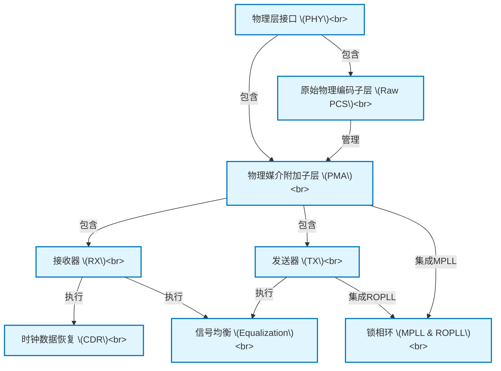

# Tutorial: PCiE5_functional_description

此项目描述了一个 **PCIe 5.0 物理层接口 (PHY)** 的功能。*PHY* 就像一个专用的信使系统，负责在计算机组件之间进行**高速数据通信**。它将数字数据转换为可通过物理电缆传输的电信号，并在另一端将这些电信号准确地还原成数字数据，确保数据可靠收发。整个系统由诸如*物理媒介附加子层 (PMA)*负责实际电信号处理，和*原始物理编码子层 (Raw PCS)*负责数字逻辑控制等关键模块协同工作完成。

**Source Repository:** [None](None)

## Chapters

1. [物理层接口 (PHY)
](01_物理层接口__phy__.md)
2. [原始物理编码子层 (Raw PCS)
](02_原始物理编码子层__raw_pcs__.md)
3. [物理媒介附加子层 (PMA)
](03_物理媒介附加子层__pma__.md)
4. [发送器 (TX)
](04_发送器__tx__.md)
5. [接收器 (RX)
](05_接收器__rx__.md)
6. [信号均衡 (Equalization)
](06_信号均衡__equalization__.md)
7. [时钟数据恢复 (CDR)
](07_时钟数据恢复__cdr__.md)
8. [锁相环 (MPLL & ROPLL)
](08_锁相环__mpll___ropll__.md)

---

Generated by [AI Codebase Knowledge Builder](https://github.com/The-Pocket/Tutorial-Codebase-Knowledge)