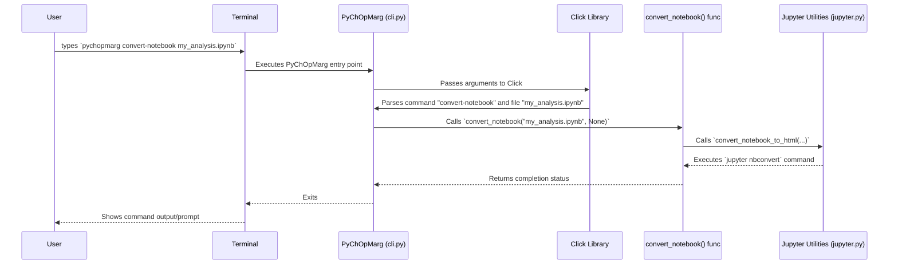

# Chapter 1: Command-Line Interface (CLI)

Welcome to the PyChOpMarg tutorial! We're excited to help you get started. This first chapter introduces a fundamental way to interact with the `PyChOpMarg` tool: the **Command-Line Interface**, or **CLI** for short.

## What's the Point? Why Use a CLI?

Imagine you have a powerful machine, like a fancy coffee maker. You don't necessarily need to understand all the internal plumbing and wiring to make a great cup of coffee. You just need to know which buttons to press on its control panel.

The PyChOpMarg CLI is like that control panel for the `PyChOpMarg` software. It lets you tell `PyChOpMarg` to perform specific tasks **without writing any Python code yourself**. You simply type commands into a special window on your computer called a "terminal" or "command prompt".

Right now, the main things you can do with the `PyChOpMarg` CLI are related to Jupyter notebooks (which are interactive documents containing code and explanations):

1.  **Run a notebook:** Execute the code inside a notebook directly.
2.  **Convert a notebook:** Turn a notebook into a clean HTML report.

*Note: In the future, you'll also be able to run Channel Operating Margin (COM) calculations directly from the CLI using configuration files, but this feature is currently under development.*

Think of the CLI as a quick and easy way to access some of PyChOpMarg's features.

## Opening the "Control Panel": Your Terminal

Before using the CLI, you need to open a terminal (also called a command prompt or shell).

*   **Windows:** Search for `cmd` or `PowerShell`.
*   **macOS:** Search for `Terminal` (usually in Applications > Utilities).
*   **Linux:** Usually `Ctrl+Alt+T` opens a terminal, or search for `Terminal`.

Once you have a terminal window open, you can type commands.

## Using the PyChOpMarg CLI

The basic structure of a `PyChOpMarg` command looks like this:

```bash
pychopmarg [OPTIONS] COMMAND [ARGS]...
```

*   `pychopmarg`: This is the main command that tells your computer you want to use the PyChOpMarg tool.
*   `[OPTIONS]`: Optional settings that modify how a command runs (e.g., specifying an output file name).
*   `COMMAND`: The specific action you want PyChOpMarg to take (e.g., `run-notebook`, `convert-notebook`). These are like the buttons on our coffee maker's control panel.
*   `[ARGS]...`: The specific inputs the command needs (e.g., the name of the notebook file you want to work with).

Let's look at the available "buttons" (commands).

### Getting Help

The simplest command is asking for help!

```bash
pychopmarg --help
```

or

```bash
pychopmarg -h
```

This command lists all available subcommands and explains what they do. You can also get help for a *specific* subcommand:

```bash
pychopmarg run-notebook --help
```

### Running a Jupyter Notebook (`run-notebook`)

Sometimes you have a Jupyter notebook (`.ipynb` file) containing analysis or calculations using PyChOpMarg, and you just want to run all the code in it from top to bottom without opening the Jupyter interface.

**Command:** `run-notebook`
**Argument:** The path to your notebook file.

**Example:**
Imagine you have a notebook named `my_channel_analysis.ipynb` in your current directory.

```bash
pychopmarg run-notebook my_channel_analysis.ipynb
```

**What happens?**
PyChOpMarg will execute all the code cells within `my_channel_analysis.ipynb` in order. If the code produces plots or results, they will be updated directly *inside* the notebook file. It's like hitting "Run All" in the Jupyter interface, but from the command line.

### Converting a Notebook to HTML (`convert-notebook`)

Jupyter notebooks are great for development, but sometimes you want a clean report to share, perhaps without showing all the underlying Python code. This command converts your notebook into an HTML web page.

**Command:** `convert-notebook`
**Argument:** The path to your notebook file.
**Option:** `--out-file` or `-o` (Optional: specify the name for the output HTML file).

**Example 1: Simple Conversion**
Convert `my_channel_analysis.ipynb` to HTML, automatically naming the output `my_channel_analysis.html`.

```bash
pychopmarg convert-notebook my_channel_analysis.ipynb
```

**Example 2: Specifying Output Name**
Convert `my_channel_analysis.ipynb` to an HTML file named `channel_report_v1.html`.

```bash
pychopmarg convert-notebook my_channel_analysis.ipynb -o channel_report_v1.html
```

**What happens?**
PyChOpMarg takes your notebook, runs the `jupyter nbconvert` tool behind the scenes, and creates an HTML file. By default, this HTML file will contain all the text and output (like plots and tables) from your notebook, but it will *hide* the Python code cells, making it look like a clean report.

## Under the Hood: How Does it Work?

You don't *need* to know this to use the CLI, but a little peek inside can be interesting!

1.  **You type `pychopmarg ...`:** Your terminal finds the installed `PyChOpMarg` program.
2.  **Entry Point:** The program starts execution. (Currently, `src/pychopmarg/__main__.py` prints a message because the full CLI/GUI integration is paused, but normally it would immediately hand off control to `src/pychopmarg/cli.py`).
3.  **Click Library:** The `src/pychopmarg/cli.py` file uses a fantastic Python library called `click`. Think of `click` as a helper that automatically understands command-line arguments and options.
4.  **Parsing:** `click` looks at the command you typed (e.g., `run-notebook`) and the arguments/options (e.g., `my_channel_analysis.ipynb`).
5.  **Function Call:** Based on the command, `click` calls the corresponding Python function defined in `cli.py`. For example, typing `pychopmarg run-notebook ...` causes `click` to call the `run_notebook` function.
6.  **Action!:** That function then does the actual work, like calling helper functions in `src/pychopmarg/utility/jupyter.py` to execute or convert the notebook using standard Jupyter tools.

Here's a simplified diagram showing the flow for `pychopmarg convert-notebook my_analysis.ipynb`:



### Code Sneak Peek

Let's look at simplified snippets from `src/pychopmarg/cli.py` to see how `click` is used.

This sets up the main `pychopmarg` command group:

```python
# src/pychopmarg/cli.py (Simplified)
import click
# ... other imports

@click.group() # Tells click this function defines the main command group
@click.version_option() # Automatically adds a --version option
def cli(ctx):
    """PyChOpMarg command line interface."""
    # This part currently raises an error because the GUI is disabled.
    # Normally, if no subcommand is given, it might try to open a GUI.
    if ctx.invoked_subcommand is None:
        raise RuntimeError("Sorry, the PyChOpMarg GUI is currently non-functional.")

# cli = cli() # Creates the command group object
```

This code defines the `convert-notebook` subcommand:

```python
# src/pychopmarg/cli.py (Simplified)
# ... imports and cli setup from above ...
from pychopmarg.utility.jupyter import convert_notebook_to_html
from pathlib import Path
from typing import Optional

@cli.command() # Tells click this function is a subcommand of 'cli'
@click.argument("notebook_file", type=click.Path(exists=True)) # Expects one argument: a path to an existing file
@click.option("--out-file", "-o", type=click.Path(), help="Override the output filename.") # Defines an optional -o argument
def convert_notebook(notebook_file: Path, out_file: Optional[Path] = None):
    """Convert a Jupyter notebook to an HTML report, omitting all code."""
    print(f"Converting {notebook_file}...") # Let the user know what's happening
    # Calls the actual function that does the work
    convert_notebook_to_html(Path(notebook_file), results_path=out_file)
    print("Conversion complete!")
```

*   `@cli.command()`: This "decorator" tells `click` that the `convert_notebook` function corresponds to the `convert-notebook` command typed in the terminal.
*   `@click.argument(...)`: This defines a required input (the notebook filename). `click` handles checking if the file exists.
*   `@click.option(...)`: This defines an optional input (`--out-file` or `-o`).
*   The function parameters (`notebook_file`, `out_file`) automatically receive the values provided by the user on the command line, thanks to `click`.
*   Inside the function, we call the actual logic from `utility/jupyter.py`.

*(Note: The `run` command for COM calculations mentioned in the code comments is currently disabled).*

## Conclusion

You've learned about the PyChOpMarg Command-Line Interface (CLI) – a way to interact with the tool directly from your terminal using simple text commands. It acts like a control panel, letting you perform tasks like running or converting Jupyter notebooks without writing Python scripts. While the direct COM calculation feature via CLI is paused, understanding the CLI is crucial for efficiently using PyChOpMarg's utilities.

In the next chapter, we'll dive into the heart of setting up a COM simulation by exploring the parameters involved.

Next: [Chapter 2: COM Configuration (`COMParams`)](02_com_configuration___comparams___.md)

---

Generated by [AI Codebase Knowledge Builder](https://github.com/The-Pocket/Tutorial-Codebase-Knowledge)