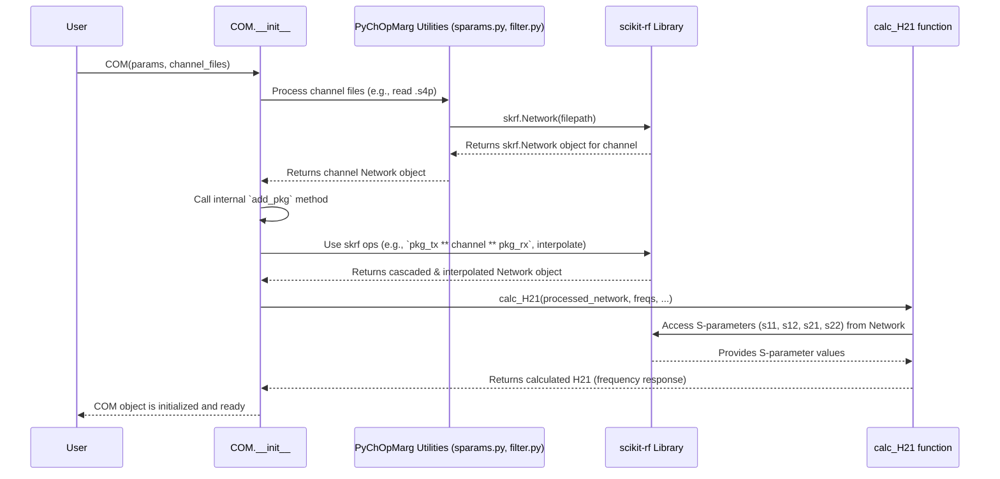

# Chapter 3: Signal Path Representation (S-parameters)

Welcome back! In [Chapter 2: COM Configuration (`COMParams`)](02_com_configuration___comparams___.md), we learned how to define the "rules of the road" for our signal simulation using `COMParams`, which holds settings like speed, noise limits, and equalizer constraints based on standards like IEEE 802.3.

Now that we know the *rules*, we need to describe the actual *road* the signal travels on. This road isn't just a simple wire; it's a complex physical path involving circuit board traces, connectors, cables, and even the tiny connections inside computer chips. How do we accurately describe how this physical path affects our high-speed signal?

## The Problem: Describing the Signal's Journey

Imagine you're sending a musical note (our signal) through a long, complex series of pipes and tunnels (our channel).

*   Some parts of the tunnel might have echoes, bouncing the sound back (signal reflection).
*   Some parts might be padded, muffling the sound (signal loss or attenuation).
*   Crucially, how much echo or muffling occurs might depend on the *pitch* (frequency) of the note! A high note might travel differently than a low note.

We need a precise way to map out this "tunnel" and understand how it affects sounds of *all* different pitches.

## The Solution: S-parameters - The Frequency Map

This is where **S-parameters** (Scattering parameters) come in. Think of S-parameters as a highly detailed **frequency-dependent map** of the signal's journey through the physical channel.

*   **What they store:** For a whole range of different frequencies (like different musical pitches), S-parameters tell us two key things about how the channel behaves at *that specific frequency*:
    1.  **Reflection (Echo):** How much of the signal energy entering the channel bounces back towards the source? (This is often called `S11`).
    2.  **Transmission (Throughput):** How much of the signal energy makes it through the channel to the other end? (This is often called `S21`).
    *   *(Note: S-parameters also describe reverse transmission (`S12`) and reflection at the output (`S22`), but `S11` and `S21` are often the most critical for understanding channel performance).*

*   **Where they come from:** S-parameters are typically measured using specialized equipment (like a Vector Network Analyzer or VNA) or generated by electromagnetic simulation software. They are usually stored in standard text files called **Touchstone files**, which often have extensions like `.s2p` (2-port), `.s4p` (4-port, common for differential channels), or `.sNp` (N-port, like `.s32p` for complex backplanes).

In `PyChOpMarg`, these S-parameter files provide the fundamental description of the physical channel we want to analyze.

## Using S-parameters in PyChOpMarg

`PyChOpMarg` doesn't reinvent the wheel for handling S-parameters. It relies heavily on a powerful Python library called **`scikit-rf`** (often imported as `rf`). Here's the workflow:

1.  **Input:** You provide the path(s) to your Touchstone file(s) when setting up the COM calculation. This might be a single `.s4p` file for the main channel or a set of files describing the main path and any interfering "aggressor" paths.
2.  **Reading:** `PyChOpMarg` uses `skrf` to read the Touchstone file(s). `skrf` parses the text data and creates a `Network` object in Python, which holds all the S-parameter information (magnitude and phase at each frequency point in the file).
3.  **Manipulation (Cascading):** Often, the signal path involves multiple pieces, like the main circuit board trace *plus* the connections inside the chip packages at both ends. `PyChOpMarg` uses `skrf` to mathematically **cascade** these different S-parameter models together, effectively simulating connecting them end-to-end to get the S-parameters of the *complete* path.
4.  **Interpolation:** The frequencies listed in your S-parameter file might not perfectly align with the frequencies needed for the COM simulation (defined by the `fstep` in your [COM Configuration (`COMParams`)](02_com_configuration___comparams___.md)). `PyChOpMarg` uses `skrf` to **interpolate** the S-parameter data, estimating the reflection and transmission values at the exact frequencies required for the calculation.
5.  **Calculating H21:** The final step is to use these processed (cascaded and interpolated) S-parameters to calculate the overall **frequency response** of the channel, often denoted as **H21(f)**. H21(f) represents the complex ratio (magnitude and phase) of the output signal voltage to the input signal voltage at each frequency *f*. This H21 is the essential "map" of the signal path that the [COM Calculation Engine (`COM` class)](04_com_calculation_engine___com__class__.md) needs.

### Example: Setting up the Channel

Let's see how you tell `PyChOpMarg` which S-parameter files represent your channel. This usually happens when you initialize the main `COM` object (which we'll explore fully in the next chapter).

```python
# Import Path object for handling file paths
from pathlib import Path
# Import the COM parameters we defined in Chapter 2
from pychopmarg.config.ieee_8023dj import IEEE_8023dj
# Import the main COM class (more details in Chapter 4)
from pychopmarg.com import COM

# --- Define the S-parameter files for our channel ---
# Assume these files exist on our computer
thru_channel_file = Path("data/channels/example_thru.s4p")
fext_aggressor_file = Path("data/channels/example_fext.s4p")
next_aggressor_file = Path("data/channels/example_next.s4p")

# --- Group the files by type (THRU, FEXT, NEXT) ---
# COM needs to know which channel is the main one ('THRU')
# and which are potential interferers ('FEXT', 'NEXT')
channel_files = {
    "THRU": [thru_channel_file],      # The main signal path
    "FEXT": [fext_aggressor_file],  # Far-End Crosstalk aggressor(s)
    "NEXT": [next_aggressor_file],  # Near-End Crosstalk aggressor(s)
}

# --- Initialize the COM object ---
# We pass both the simulation rules (IEEE_8023dj) from Chapter 2
# and the channel description (channel_files) using S-parameters.
print("Initializing COM calculator...")
com_calculator = COM(com_params=IEEE_8023dj, channels=channel_files)
print("COM object created!")

# --- What happened inside? ---
# When COM(...) was called, PyChOpMarg automatically:
# 1. Used the 'skrf' library to read example_thru.s4p, example_fext.s4p, etc.
# 2. Combined (cascaded) internal package models with these channel models.
# 3. Interpolated the S-parameters to the simulation frequencies.
# 4. Calculated the H21 frequency response for the 'THRU' channel.
# 5. Processed the FEXT and NEXT channels similarly.
# Now, 'com_calculator' is ready for the main simulation steps.
```

In this example, we didn't directly interact with `skrf`, but `PyChOpMarg` used it extensively behind the scenes when the `COM` object was created, processing our S-parameter files to prepare the channel model (`H21`) needed for the analysis.

## Under the Hood: How S-parameters Become H21

Let's peek behind the curtain to see the steps involved when `PyChOpMarg` processes your S-parameter files:

1.  **Input:** The user provides the `COMParams` (rules) and a dictionary mapping channel types (`THRU`, `FEXT`, `NEXT`) to lists of `Path` objects pointing to Touchstone files.
2.  **Reading:** The `COM` class initialization process calls utility functions (often found in `src/pychopmarg/utility/sparams.py`). These utilities use `skrf.Network(filepath)` to read each Touchstone file provided. `skrf` parses the file format and returns an `skrf.Network` object containing the S-parameter data.
3.  **Package Cascading:** For each channel network read from the files, the `COM` class calls its internal `add_pkg` method. This method takes the channel's `skrf.Network` object and uses `skrf`'s cascading capabilities (often represented by the `**` operator in `skrf`) to mathematically connect pre-defined S-parameter models of the transmitter (Tx) and receiver (Rx) packages to the ends of the channel model. This creates a new `skrf.Network` object representing the *complete* path from chip to chip.
4.  **Interpolation & H21 Calculation:** The `add_pkg` method (or functions it calls like `calc_H21` in `src/pychopmarg/utility/filter.py`) then uses the cascaded `skrf.Network` object. It first interpolates the S-parameters onto the precise frequency grid required by the simulation (defined in `COMParams`). Then, it uses the interpolated S-parameters (S11, S12, S21, S22) along with termination conditions (reflection coefficients `gamma1`, `gamma2`) in a specific formula (like IEEE 802.3 eq. 93A-18) to calculate the channel's voltage transfer function, **H21(f)**.
5.  **Storage:** The calculated H21 (a complex number for each frequency) for the `THRU` channel, along with processed information for `FEXT` and `NEXT` channels, is stored within the `COM` object, ready for the next stages of the COM calculation.

Here’s a simplified diagram of the process:



### Code Sneak Peek

Let's look at conceptual snippets showing how `skrf` might be used inside `PyChOpMarg`.

**1. Reading an S-parameter File:**

```python
# Simplified view inside PyChOpMarg's channel processing utilities
import skrf as rf
from pathlib import Path

channel_filepath = Path("data/channels/example_thru.s4p")
network_obj = None

# Use skrf to read the Touchstone file into a Network object
try:
    # skrf handles parsing the standard Touchstone format
    network_obj = rf.Network(str(channel_filepath))
    print(f"Successfully read: {channel_filepath.name} using skrf")
    # network_obj now holds S-parameters (freq, S11, S12, S21, S22)
except Exception as e:
    print(f"Error reading {channel_filepath.name} with skrf: {e}")

# This 'network_obj' is now ready for further processing.
```

**2. Cascading Package Models:**

```python
# Simplified view of adding package models inside COM.add_pkg
# Assume 'channel_network' is the skrf.Network object read from the file
# Assume 'pkg_tx_network' and 'pkg_rx_network' are skrf Networks for packages

# The '**' operator in skrf performs network cascading (like connecting wires)
# complete_path_network = pkg_tx_network ** channel_network ** pkg_rx_network

# print("Cascaded Tx Package + Channel + Rx Package using skrf.")
# 'complete_path_network' now represents the full physical path.

# (Actual PyChOpMarg code uses pre-calculated package models self.sPkgTx/Rx)
# _ntwk = self.sPkgTx ** sChnlInterp ** self.sPkgRx # From com.py
```

**3. Calculating H21 (Conceptual):**

```python
# Simplified view of getting H21 from the final network
# Assume 'processed_network' is the cascaded & interpolated skrf.Network
# Assume 'simulation_frequencies' is the required list/array of frequencies
# Assume 'gamma1_tx', 'gamma2_rx' are termination reflection factors

# H21_response = some_function_using_sparams(processed_network,
#                                            simulation_frequencies,
#                                            gamma1_tx, gamma2_rx)

# print("Calculated H21 frequency response from S-parameters.")
# 'H21_response' would be an array of complex numbers.

# (Actual PyChOpMarg code calls utility.calc_H21 which implements the formula)
# H21 = calc_H21(self.freqs, _ntwk, self.gamma1_Tx, self.gamma2_Rx) # From com.py
```

These snippets illustrate how `PyChOpMarg` leverages `skrf` to turn raw S-parameter files into the processed channel frequency response (H21) needed for COM analysis.

## Conclusion

You've now learned how `PyChOpMarg` represents the physical signal path: using **S-parameters**. These act like a frequency-by-frequency map showing how signals reflect and transmit through components like cables, connectors, and PCB traces. We saw that `PyChOpMarg` uses the powerful **`skrf`** library under the hood to read Touchstone files (`.sNp`), combine different path segments (cascading), adjust data to needed frequencies (interpolation), and ultimately calculate the channel's frequency response **H21(f)**.

We now have the two main ingredients for our simulation:
1.  The rules and settings defined by [COM Configuration (`COMParams`)](02_com_configuration___comparams___.md).
2.  The description of the physical path (H21) derived from S-parameters.

With these in hand, we're ready to see how they come together in the heart of the simulation.

Next: [Chapter 4: COM Calculation Engine (`COM` class)](04_com_calculation_engine___com__class__.md)

---

Generated by [AI Codebase Knowledge Builder](https://github.com/The-Pocket/Tutorial-Codebase-Knowledge)