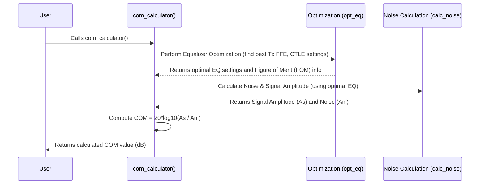

# Chapter 4: COM Calculation Engine (`COM` class)

Welcome back! In [Chapter 3: Signal Path Representation (S-parameters)](03_signal_path_representation__s_parameters__.md), we learned how the physical path our signal travels through is described using S-parameters, which `PyChOpMarg` processes (using `skrf`) to understand the channel's frequency response (H21).

We now have the two key ingredients for our simulation:
1.  The **rules and settings** for the simulation, like speed, noise limits, and equalizer capabilities, stored in a [COM Configuration (`COMParams`)](02_com_configuration___comparams___.md) object.
2.  The **description of the physical path** the signal takes (H21), derived from S-parameter files.

But how do we actually combine these ingredients and *run* the simulation to get the final result – the Channel Operating Margin (COM) value?

## The Problem: Putting It All Together

Imagine you're a master chef. You have a complex recipe from a famous cookbook (like the IEEE 802.3 standard). You also have the specific ingredients listed in the recipe (like baud rate, noise limits from `COMParams`) and the specific piece of equipment you'll be cooking with (like a unique oven represented by our channel's S-parameters/H21).

Just having the recipe and ingredients isn't enough. You need someone (or something) to actually *follow* the recipe, step-by-step, using the ingredients and equipment, to prepare the final dish. This involves mixing, heating (applying equalization), accounting for imperfections (calculating noise), and finally tasting (determining the COM value).

## The Solution: `COM` - The Master Chef

This is exactly the role of the **`COM` class** in `PyChOpMarg`. It's the **heart of the library**, the **master chef** that orchestrates the entire COM calculation process.

Think of the `COM` class as the central coordinator:

1.  **It takes the recipe:** It needs the `COMParams` object containing all the simulation settings.
2.  **It takes the ingredients/equipment:** It needs the S-parameter files describing the physical channel.
3.  **It follows the instructions:** It executes the complex steps defined by the IEEE 802.3 standard. This involves:
    *   Processing the S-parameters to get the channel response (H21, as seen in Chapter 3).
    *   Generating an initial signal pulse response (covered in [Chapter 5: Pulse Response Generation](05_pulse_response_generation_.md)).
    *   Applying and optimizing signal processing (equalization) to clean up the signal (covered in [Chapter 6: Equalization Optimization](06_equalization_optimization_.md)).
    *   Calculating the effects of various noise sources and interference (covered in [Chapter 7: Noise Calculation (`NoiseCalc`)](07_noise_calculation___noisecalc___.md)).
4.  **It delivers the result:** It calculates the final COM value (in decibels, dB), which tells us how much signal quality margin the channel has. A higher COM value is better.

## Using the `COM` Class

Using the `COM` class involves two main steps:

1.  **Initialization:** Creating an instance of the `COM` class. This is where you provide the "recipe" (`COMParams`) and the "ingredients" (channel S-parameter files).
2.  **Calculation:** Calling the `COM` instance like a function to trigger the full calculation process.

Let's see a simple example:

```python
# --- Step 0: Imports ---
from pathlib import Path
# Import the pre-defined parameters for IEEE 802.3dj (our "recipe")
from pychopmarg.config.ieee_8023dj import IEEE_8023dj
# Import the COM class itself (our "master chef")
from pychopmarg.com import COM

# --- Step 1: Define Channel Files (our "ingredients") ---
# Assume these files exist (from Chapter 3 example)
thru_channel_file = Path("data/channels/example_thru.s4p")
fext_aggressor_file = Path("data/channels/example_fext.s4p")
next_aggressor_file = Path("data/channels/example_next.s4p")

# Group the files by type
channel_files = {
    "THRU": [thru_channel_file],      # Main signal path
    "FEXT": [fext_aggressor_file],  # Far-End Crosstalk aggressor(s)
    "NEXT": [next_aggressor_file],  # Near-End Crosstalk aggressor(s)
}

# --- Step 2: Initialize the COM Engine ---
# Create the 'master chef' instance, giving it the recipe and ingredients
print("Initializing the COM calculation engine...")
# We pass the standard's rules (IEEE_8023dj) and the channel files
com_calculator = COM(com_params=IEEE_8023dj, channels=channel_files)
print("COM engine initialized!")

# --- Step 3: Run the Calculation ---
print("Starting the COM calculation...")
# Call the instance like a function to run the full process
# This can take some time depending on the channel complexity!
com_value_db = com_calculator()
print(f"Calculation complete!")
print(f"The calculated COM is: {com_value_db:.2f} dB")
```

**What happens here?**

1.  We import the necessary pieces: `Path` for file handling, our `COMParams` recipe (`IEEE_8023dj`), and the `COM` class itself.
2.  We define the paths to our S-parameter files, just like in Chapter 3.
3.  We **initialize** the `COM` class by calling `COM(...)`. We pass our `COMParams` object (`IEEE_8023dj`) and the dictionary of channel files (`channel_files`). During this initialization, `PyChOpMarg` already does some pre-processing, like reading the S-parameters and calculating the initial H21 using `skrf` (as discussed in Chapter 3).
4.  We **run the calculation** by calling the created object `com_calculator()` as if it were a function. This triggers the main sequence of steps: equalization optimization, noise calculation, and finally the COM computation.
5.  The call returns the calculated COM value in dB, which we print.

This simple structure lets you run a complex COM analysis with just a few lines of code, hiding the intricate details of the IEEE standard within the `COM` class.

## Under the Hood: A Glimpse Inside the Kitchen

You don't need to know the exact internal workings to use the `COM` class, but understanding the main steps can be helpful. When you call the `com_calculator()` instance, here's a simplified view of what happens:

1.  **Optimize Equalization (`opt_eq`):** The `COM` object first tries to find the best settings for the available equalizers (like the Transmitter Feed-Forward Equalizer (Tx FFE) and the Receiver Continuous-Time Linear Equalizer (CTLE)) to clean up the signal as much as possible, according to the rules in `COMParams`. This involves iterating through different settings and evaluating a Figure of Merit (FOM). (More details in [Chapter 6: Equalization Optimization](06_equalization_optimization_.md)).
2.  **Calculate Noise (`calc_noise`):** Once the best equalization is determined, the `COM` object calculates the total effective noise and interference (`Ani`) at the receiver's decision point. This includes noise from the transmitter, jitter, crosstalk from neighboring channels, and receiver noise, all processed through the channel and equalizers. (More details in [Chapter 7: Noise Calculation (`NoiseCalc`)](07_noise_calculation___noisecalc___.md)). It also determines the final signal amplitude (`As`).
3.  **Compute COM:** Finally, it uses the calculated signal amplitude (`As`) and the total noise/interference (`Ani`) to compute the COM value using a simple formula (essentially the signal-to-noise ratio in dB): `COM = 20 * log10(As / Ani)`.

Here's a simplified sequence diagram showing the flow when you call the `COM` object:



### Code Sneak Peek (`src/pychopmarg/com.py`)

Let's peek at simplified parts of the `COM` class definition in `src/pychopmarg/com.py`.

**1. Initialization (`__init__`)**

This method sets up the `COM` object when you create it. It takes the parameters and channel files, reads the S-parameters (using `skrf`), calculates the channel response (H21), and prepares internal variables.

```python
# Simplified from src/pychopmarg/com.py
import skrf as rf
from pathlib import Path
from pychopmarg.config.template import COMParams
# ... other imports ...
from pychopmarg.utility import sdd_21, calc_H21

class COM():
    # ... internal variables declared here ...

    def __init__(
        self,
        com_params: COMParams, # The "recipe" (settings)
        channels: Path | dict[str, list[Path]], # The channel S-param files
        # ... other optional arguments like debug flags ...
    ) -> None:
        """Initializes the COM calculation engine."""
        self.com_params = com_params # Store the parameters

        # --- Process Channel Files (Simplified) ---
        # (Actual code handles s32p or dict of s4p)
        ntwks = [] # List to hold network objects and types
        if isinstance(channels, dict):
            for chtype, file_list in channels.items():
                for fname in file_list:
                    # Use skrf to read the S-parameter file
                    network = rf.Network(str(fname))
                    # Convert to single-ended differential pair (SDD21)
                    sdd_network = sdd_21(network)
                    ntwks.append((sdd_network, chtype)) # Store network and type

        # --- Calculate Frequency/Time Vectors ---
        # (Calculates self.f and self.t based on com_params.fb, fstep, M)
        # ... setup self.f (frequencies), self.t (time) ...

        # --- Pre-calculate Package Models & H21 ---
        # (Sets up self._sPkgTx, self._sPkgRx package models)
        # ... setup package models ...
        # Calls self.add_pkg for each network in ntwks
        # self.add_pkg cascades packages and calculates H21 using calc_H21
        self.chnls = list(map(self.add_pkg, ntwks))

        # --- Setup Equalizer Structures ---
        # (Prepares Tx FFE combinations, Rx FFE structures)
        # ... setup EQ variables ...

        print("COM Internal Setup Complete.")
        # ... other initialization ...
```

*   The `__init__` method takes the `COMParams` and `channels` you provide.
*   It uses `skrf` (often via helper functions like `sdd_21`) to read and process the S-parameter files.
*   It calls internal methods like `add_pkg` which handle cascading package models and calculating the initial channel transfer function `H21` (using `calc_H21`).
*   It sets up internal frequency (`self.f`) and time (`self.t`) vectors based on the `COMParams`.
*   It prepares data structures needed for equalization optimization later.

**2. Calculation (`__call__`)**

This special method makes the `COM` object callable like a function. It orchestrates the main calculation steps.

```python
# Simplified from src/pychopmarg/com.py
import numpy as np
# ... other imports like NoiseCalc, optimize functions ...

class COM():
    # ... __init__ and other methods ...

    def __call__(
        self,
        do_opt_eq: bool = True, # Flag to enable/disable EQ optimization
        # ... other optional arguments for fine-tuning ...
    ) -> float:
        """Calculate the COM value."""

        # Step 1: Optimize Equalization
        print("Optimizing Equalization...")
        # Calls self.opt_eq, which internally iterates through EQ settings
        # and calls self.calc_fom (Figure of Merit calculation)
        # The best settings (gDC, gDC2, tx_ix, rx_taps) are stored internally
        success = self.opt_eq(do_opt_eq=do_opt_eq)
        if not success:
            raise RuntimeError("EQ optimization failed!")
        print("Equalization Optimized.")

        # Step 2: Calculate Noise and Signal Amplitude
        print("Calculating Noise...")
        # Calls self.calc_noise using the optimized EQ settings
        # This function calculates various noise components (ISI, J, XT, N, Tx)
        # and the final signal amplitude As
        As, Ani, cursor_ix = self.calc_noise(cursor_ix=self.fom_rslts['cursor_ix'])
        print("Noise Calculation Complete.")

        # Step 3: Compute COM
        com_db = 20 * np.log10(As / Ani) # The final COM formula
        self.com_rslts["COM"] = com_db # Store result internally

        print(f"COM Calculation Finished: {com_db:.2f} dB")
        return com_db

    # --- Helper Methods (Simplified Signatures) ---
    def opt_eq(self, do_opt_eq: bool = True, ...) -> bool:
        """Finds and sets the optimum linear equalization parameters."""
        # Contains loops iterating through Tx FFE, gDC, gDC2 settings
        # Calls self.calc_fom(...) inside loops
        # Stores best results in self.gDC, self.tx_ix, self.rx_taps etc.
        # ... implementation details ...
        pass

    def calc_noise(self, ...) -> tuple[float, float, int]:
        """Calculates interference, noise (Ani), and signal amplitude (As)."""
        # Uses optimized EQ settings (self.gDC, self.tx_ix, etc.)
        # Generates pulse response with final EQ
        # Calculates varTx, varISI, varJ, varXT, varN
        # Computes probability distributions (pISI, pN, pXT)
        # Finds Ani based on target DER_0
        # ... implementation details ...
        pass

    def calc_fom(self, ...) -> float:
         """Calculates Figure of Merit for a given EQ setting."""
         # Called by opt_eq during optimization loops
         # Uses either PRZF or MMSE method (from optimize.py)
         # ... implementation details ...
         pass

    def add_pkg(self, ntwk) -> tuple:
        """Adds package models and calculates H21."""
        # Uses skrf for cascading (self.sPkgTx ** channel ** self.sPkgRx)
        # Calls utility.calc_H21(...)
        # ... implementation details ...
        pass
```

*   The `__call__` method coordinates the main workflow.
*   It calls helper methods like `opt_eq` (which itself calls `calc_fom` repeatedly) to find the best equalizer settings.
*   It then calls `calc_noise` to determine the final signal (`As`) and noise (`Ani`) levels using those optimal settings.
*   Finally, it calculates the COM value in dB.

These internal methods (`opt_eq`, `calc_noise`, `calc_fom`, `add_pkg`) contain the bulk of the complex logic based on the IEEE standard, utilizing concepts we'll explore in the upcoming chapters.

## Conclusion

You've now met the **`COM` class**, the central calculation engine of `PyChOpMarg`. It acts like a master chef, taking the simulation settings ([COM Configuration (`COMParams`)](02_com_configuration___comparams___.md)) and the channel description (derived from [Signal Path Representation (S-parameters)](03_signal_path_representation__s_parameters__.md)) as inputs. By calling the initialized `COM` object, you trigger a complex sequence of steps defined by the IEEE standard—including equalization optimization and noise calculation—to produce the final COM value.

While the `COM` class orchestrates the process, understanding the steps it performs internally is key to mastering `PyChOpMarg`. One of the first steps inside the calculation is figuring out how the signal pulse looks after passing through the channel.

Next: [Chapter 5: Pulse Response Generation](05_pulse_response_generation_.md)

---

Generated by [AI Codebase Knowledge Builder](https://github.com/The-Pocket/Tutorial-Codebase-Knowledge)