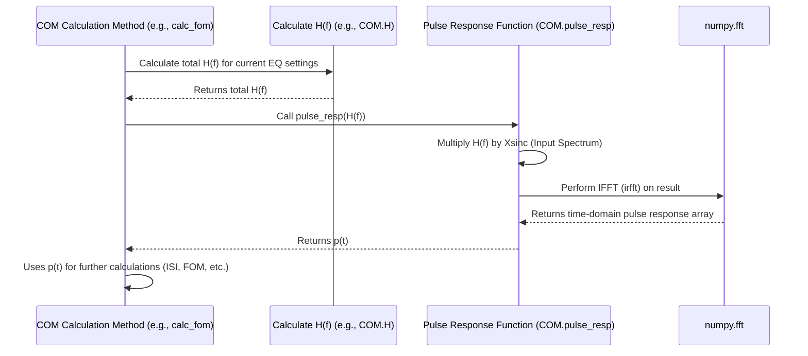

# Chapter 5: Pulse Response Generation

Welcome back! In [Chapter 4: COM Calculation Engine (`COM` class)](04_com_calculation_engine___com__class__.md), we met the `COM` class, the "master chef" that orchestrates the entire Channel Operating Margin calculation using the simulation rules ([COM Configuration (`COMParams`)](02_com_configuration___comparams___.md)) and the channel description (derived from [Signal Path Representation (S-parameters)](03_signal_path_representation__s_parameters__.md)).

Now, let's peek inside the "kitchen" and look at one of the very first things the `COM` class needs to figure out: what does a single, sharp signal pulse look like *after* it has traveled through the entire system? This resulting shape is called the **Pulse Response**.

## The Problem: Hearing the Echo

Imagine you're standing in a large, empty concert hall. If you clap your hands sharply *once* (that's our input pulse), you'll hear the sound travel out, bounce off the walls, ceiling, and floor, and eventually fade away. The sound you hear over time – the initial clap plus all the echoes and reverberations – is the hall's "pulse response."

Why is this useful? By listening carefully to that echo, you can learn a lot about the hall: Is it large or small? Are the walls hard (sharp echoes) or soft (muffled sound)? Are there weird reflections causing flutter?

In the world of high-speed signals, sending an idealized, single sharp pulse through the *entire* system (the physical channel from [Chapter 3: Signal Path Representation (S-parameters)](03_signal_path_representation__s_parameters__.md), plus the chip packages, plus any signal-cleaning circuits called equalizers) gives us the system's **Pulse Response**. This resulting signal shape, observed over time, tells us crucial things:

*   **Loss:** How much weaker is the main pulse compared to the input?
*   **Dispersion:** Does the pulse get spread out and smeared over time?
*   **Reflections:** Are there mini-echoes (bumps and wiggles) appearing after the main pulse due to signals bouncing back and forth?

Understanding this pulse response is fundamental. It's like getting the system's fingerprint in the time domain. We absolutely need it to figure out how much interference one pulse causes for the *next* pulse (Inter-Symbol Interference or ISI) and to find the best settings for the equalizers trying to clean up the signal (especially for techniques like PRZF mentioned in the [COM Calculation Engine (`COM` class)](04_com_calculation_engine___com__class__.md)).

## The Solution: Calculating the Pulse Response `p(t)`

How do we mathematically calculate this "echo" or pulse response, usually denoted as `p(t)` (where `t` represents time)? We use a common engineering trick involving the frequency domain:

1.  **Ideal Input:** We start with a perfect, idealized input pulse in the time domain. Think of it as a single "1" at time zero, followed by all "0"s.
2.  **Input Spectrum:** We transform this ideal time-domain pulse into the frequency domain using the Fast Fourier Transform (FFT). This tells us the pulse's frequency content (how much energy it has at different frequencies). In `PyChOpMarg`, this is often pre-calculated and stored as `Xsinc`.
3.  **System's Frequency Map (H(f)):** We need the overall frequency response of the *entire* system, often denoted `H(f)`. This `H(f)` combines:
    *   The channel's response `H21(f)` (from S-parameters, Chapter 3).
    *   The effect of the chip packages.
    *   The effect of the transmitter's output filter (`Ht`).
    *   The effect of the receiver's input filter (`Hr`).
    *   *Crucially*, the effect of any **equalizers** (like CTLE or Tx FFE) that are currently active. (We'll learn more about these in [Chapter 6: Equalization Optimization](06_equalization_optimization_.md)).
4.  **Multiplication in Frequency:** The magic step! We multiply the input pulse's spectrum (from step 2) by the system's overall frequency response `H(f)` (from step 3). This tells us how the system modifies the frequency content of the input pulse.
5.  **Back to Time (IFFT):** We take the result from step 4 and transform it *back* to the time domain using the Inverse Fast Fourier Transform (IFFT).

The time-domain signal we get from step 5 is the **pulse response `p(t)`**! It's the shape of our original ideal pulse after it has passed through the complete system, including all its losses, dispersions, reflections, and the effects of equalization.

## Using Pulse Response Generation in PyChOpMarg

You typically won't call a function to *just* get the pulse response yourself. Instead, the [COM Calculation Engine (`COM` class)](04_com_calculation_engine___com__class__.md) calculates it internally whenever it needs it. This happens frequently, especially during:

*   **Equalization Optimization:** When trying different equalizer settings, the `COM` class calculates the pulse response for *each setting* to see how well that setting cleans up the signal (e.g., in the `calc_fom` method).
*   **Noise Calculation:** After finding the best equalizer settings, the `COM` class calculates the final pulse response to determine the remaining ISI and other noise components (e.g., in the `calc_noise` method).

The `COM` class has helper methods to do this calculation. The core logic often resides in a method like `pulse_resp`, which takes the system's frequency response `H(f)` as input and returns the time-domain pulse response `p(t)`.

### Conceptual Code Snippet

Here's a *highly simplified* idea of what happens inside the `pulse_resp` method:

```python
import numpy as np

# Assume 'H_system_freq_response' is the overall H(f) of the system
# (calculated elsewhere, includes channel, packages, EQ etc.)
# H_system_freq_response = ... # Complex array representing H(f)

# Assume 'Xsinc' is the pre-calculated frequency spectrum of the ideal input pulse
# Xsinc = ... # Complex array representing input pulse spectrum

# 1. Multiply the input spectrum by the system's frequency response
output_spectrum = Xsinc * H_system_freq_response

# 2. Transform the result back to the time domain using IFFT
# 'irfft' is Inverse Real Fast Fourier Transform
pulse_response_time_domain = np.fft.irfft(output_spectrum)

# 3. Trim or adjust the length if needed to match the simulation time vector
# (Simplified - actual code might involve careful indexing)
# final_pulse_response = pulse_response_time_domain[:expected_length]

# 'final_pulse_response' now holds the p(t) we wanted!
# print("Calculated pulse response p(t)")
```

*   **Input:** The crucial input is `H_system_freq_response`, which represents how the *entire* system (channel + packages + current EQ settings) affects signals at different frequencies. It also uses the pre-calculated `Xsinc` (input pulse spectrum).
*   **Process:** It performs the frequency-domain multiplication and then uses `np.fft.irfft` (Inverse Real FFT) to get back to the time domain.
*   **Output:** The result is `pulse_response_time_domain` (or `final_pulse_response`), a NumPy array of numbers representing the pulse's voltage level at different points in time. This array *is* `p(t)`.

The `COM` class might call a related method like `gen_pulse_resps` which uses this core `pulse_resp` logic repeatedly to calculate the pulse response for the main channel *and* any interfering crosstalk channels, using the currently selected equalizer settings.

## Under the Hood: The Calculation Flow

Let's trace the steps when the `COM` class needs to calculate a pulse response, for example, during the Figure of Merit (FOM) calculation inside equalizer optimization.

1.  **Need Arises:** The `COM` instance (specifically, a method like `calc_fom`) needs the pulse response `p(t)` corresponding to the *current* set of equalizer settings being tested (e.g., a specific Tx FFE setting and CTLE gain).
2.  **Calculate H(f):** It first calculates the *total* system frequency response `H(f)` for these specific settings. This involves combining the channel's `H21`, package models, and the frequency responses of the active Tx FFE (`Htx`) and CTLE (`Hctf`) filters. (The `COM.H(...)` method often handles this).
3.  **Call `pulse_resp`:** It calls the internal `pulse_resp` method, passing this calculated `H(f)`.
4.  **Frequency Multiplication:** Inside `pulse_resp`, the input `H(f)` is multiplied by the pre-stored `Xsinc` (the ideal input pulse's spectrum).
5.  **IFFT:** `pulse_resp` uses `numpy.fft.irfft` to transform the result back into the time domain.
6.  **Return `p(t)`:** The `pulse_resp` method returns the resulting time-domain array `p(t)`.
7.  **Use `p(t)`:** The calling method (e.g., `calc_fom`) now uses this `p(t)` for its calculations (e.g., finding the peak, calculating ISI).

Here's a simplified diagram of this flow:



### Code Sneak Peek (`src/pychopmarg/com.py`)

Let's look at the actual `pulse_resp` method within the `COM` class in `src/pychopmarg/com.py`. (Simplified for clarity).

```python
# Simplified from src/pychopmarg/com.py within the COM class

import numpy as np

class COM():
    # ... (other methods like __init__, __call__, H, etc.) ...
    # Assume self.Xsinc holds the input pulse spectrum
    # Assume self.times holds the simulation time points

    def pulse_resp(self, H: np.ndarray) -> np.ndarray:
        """
        Return the unit pulse response, p(t), corresponding to the given
        voltage transfer function, H(f), according to (93A-24).

        Args:
            H: The voltage transfer function, H(f). (Complex array)
               (This already includes channel, package, EQ effects)

        Returns:
            The pulse response p(t). (Real array)
        """
        # Ensure H has the expected length (matches frequency points)
        assert len(H) == len(self.freqs), "H(f) length mismatch!"

        # Multiply the system response H(f) by the input pulse spectrum Xsinc
        output_spectrum = self.Xsinc * H

        # Perform Inverse Real FFT to get back to time domain
        p = np.fft.irfft(output_spectrum)

        # Trim the result to match the length of our simulation time vector
        # (The IFFT might produce slightly more points than needed)
        return p[:len(self.times)]

    def gen_pulse_resps(self, apply_eq: bool = True, ...) -> list[np.ndarray]:
        """
        Generate pulse responses for all networks (THRU, FEXT, NEXT).
        (Simplified signature)

        Keyword Args:
            apply_eq: Include linear EQ when True.
                Default: True
            ... (other args to specify EQ settings like tx_ix, Hctf, rx_taps) ...

        Returns:
            List of pulse responses [p_thru(t), p_fext1(t), p_next1(t), ...]
        """
        pulse_resps = []
        # Loop through all channels (self.chnls stores H21 for THRU, FEXT, NEXT)
        for (_, ntype), H21 in self.chnls: # Simplified loop
            # Calculate the total H(f) for this channel type and current EQ
            if apply_eq:
                # Get current EQ settings (tx_ix, Hctf, rx_taps, etc.)
                # Special handling for NEXT (no Tx FFE)
                current_tx_ix = self.tx_ix if ntype != 'NEXT' else 0
                # Calculate total H = Htx * H21 * Hr * Hctf * Hrx_ffe
                total_H = self.H(H21, current_tx_ix, ...) # Pass current EQ settings
            else:
                # If not applying EQ, just use the channel response H21
                total_H = H21 # (This is useful for debugging/visualization)

            # Call the core pulse_resp function with the calculated total H(f)
            pr = self.pulse_resp(total_H)

            # Apply specified amplitude scaling (A_v, A_fe, A_ne from COMParams)
            if ntype == 'THRU':
                pr *= self.com_params.A_v
            elif ntype == 'NEXT':
                pr *= self.com_params.A_ne
            else: # FEXT
                pr *= self.com_params.A_fe

            pulse_resps.append(pr)

        return pulse_resps
```

*   The `pulse_resp` method takes the *total* system frequency response `H` (which already includes channel and equalization effects passed in by the caller).
*   It performs the multiplication `self.Xsinc * H`.
*   It calls `np.fft.irfft` to get the time-domain response `p`.
*   It trims `p` to the correct length based on `self.times`.
*   The `gen_pulse_resps` method acts as a wrapper. It iterates through the different channels (main signal, crosstalk aggressors). For each channel, it calculates the appropriate total `H(f)` based on the channel's `H21` and the *currently selected* equalizer settings (unless `apply_eq=False`), then calls `pulse_resp` to get the `p(t)` for that specific channel and configuration. It also applies standard-defined amplitude scaling (`A_v`, `A_fe`, `A_ne`).

## Conclusion

You've now learned about **Pulse Response Generation**! It's like clapping in a hall and listening to the echo. We calculate the time-domain pulse response `p(t)` by seeing how the entire system's frequency response `H(f)` (channel + packages + equalization) modifies an ideal input pulse. This calculation, done via frequency-domain multiplication and an IFFT, gives us a critical "fingerprint" of the system's behavior in time.

While you don't usually calculate `p(t)` directly, the [COM Calculation Engine (`COM` class)](04_com_calculation_engine___com__class__.md) relies heavily on this internally generated pulse response to assess signal quality, measure interference (ISI), and, as we'll see next, to optimize the very equalizers that shape it.

Next: [Chapter 6: Equalization Optimization](06_equalization_optimization_.md)

---

Generated by [AI Codebase Knowledge Builder](https://github.com/The-Pocket/Tutorial-Codebase-Knowledge)