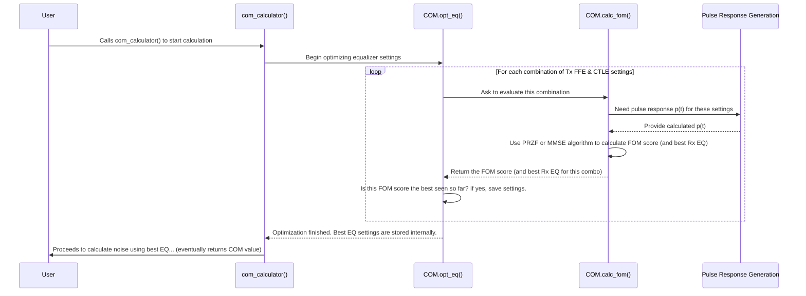

# Chapter 6: Equalization Optimization

Welcome back! In [Chapter 5: Pulse Response Generation](05_pulse_response_generation_.md), we learned how `PyChOpMarg` calculates the shape of a single signal pulse (`p(t)`) after it travels through the channel and any initial filters. This pulse response often looks quite distorted compared to the clean pulse we sent – it might be weaker, spread out, and have weird echoes.

Now, how do we *fix* this distortion? Can we make the received signal cleaner and easier to understand? That's where **Equalization Optimization** comes in.

## The Problem: Cleaning Up Garbled Signals

Imagine you're listening to music playing through an old, cheap speaker connected by a long, tangled wire (our channel). The music sounds muffled, maybe some notes are too quiet, others too loud, and there might be annoying echoes. This is similar to what happens to high-speed electrical signals traveling through circuit boards and cables – they get distorted.

To fix the music, you might use an audio equalizer – a device with sliders or knobs that let you boost or cut different frequencies (like bass and treble) or adjust timings. Similarly, in high-speed communication systems, we have electronic circuits called **equalizers** designed to compensate for the distortion introduced by the channel. Common types include:

*   **Tx FFE (Transmitter Feed-Forward Equalizer):** Adjusts the signal *before* it's sent.
*   **Rx CTLE (Receiver Continuous-Time Linear Equalizer):** An analog filter at the receiver.
*   **Rx FFE (Receiver Feed-Forward Equalizer):** A digital filter at the receiver.
*   **DFE (Decision Feedback Equalizer):** A clever receiver filter that cancels out echoes from previous bits.

Each equalizer has settings (like tap weights for FFEs/DFE, or gain settings for CTLE). The big question is: **What are the *best* settings for these equalizers for a *specific* channel to make the signal as clean as possible?** Finding these manually would be like randomly twisting dozens of knobs on a complex audio system – incredibly difficult!

## The Solution: Automatic Equalization Optimization

`PyChOpMarg` solves this problem by performing **Equalization Optimization**. Think of it as having an expert audio engineer built right into the software. This "engineer" knows about the available equalizers (defined in the [COM Configuration (`COMParams`)](02_com_configuration___comparams___.md)) and their allowed settings (e.g., min/max tap weights, available CTLE gains).

Its goal is to automatically find the combination of equalizer settings that results in the **highest signal quality**. It measures this quality using a specific score called a **Figure of Merit (FOM)**. To find the best settings, it uses sophisticated strategies (algorithms) like:

*   **PRZF (Pulse Response Zero Forcing):** Tries to make the pulse response nice and sharp at the sampling point and zero everywhere else.
*   **MMSE (Minimum Mean Squared Error):** Tries to minimize the overall difference (error) between the equalized signal and an ideal signal, considering both distortion and noise.

The result of this optimization is the set of "magic knob settings" for the Tx FFE, CTLE, Rx FFE, and DFE that work best for the given channel.

## The Equalizers: A Quick Look

Let's briefly understand what these equalizers do, using our audio analogy:

*   **Tx FFE (Transmitter Feed-Forward Equalizer):** This is like trying to speak extra clearly or pre-adjusting your voice *before* speaking into a bad microphone, knowing the microphone will distort it in a certain way. It pre-shapes the transmitted pulse to counteract the channel's distortion.
*   **Rx CTLE (Receiver Continuous-Time Linear Equalizer):** This is like turning up the "treble" knob on your stereo. Channels often lose high-frequency parts of the signal more than low-frequency parts. The CTLE boosts these weakened high frequencies at the receiver. It has settings like `gDC` and `gDC2` that control the amount of boost.
*   **Rx FFE (Receiver Feed-Forward Equalizer):** Similar to the Tx FFE, but it operates on the signal *after* it has gone through the channel. It's another digital filter trying to sharpen the received pulse.
*   **DFE (Decision Feedback Equalizer):** This is the cleverest one! Imagine hearing an echo shortly after someone speaks. If you *know* what they just said, you could mentally subtract that echo when listening for the *next* word. The DFE does something similar: after it decides what the *previous* bit was (a '1' or a '0'), it calculates the "echo" (Inter-Symbol Interference or ISI) that bit would cause for the *current* bit and subtracts it. This requires knowing the previous bits, hence "feedback".

Remember, the [COM Configuration (`COMParams`)](02_com_configuration___comparams___.md) tells `PyChOpMarg` which of these equalizers are available for a given standard, how many "taps" (adjustable settings) they have, and the minimum/maximum values those taps or gains can take.

## How PyChOpMarg Does It: The Optimization Process

This crucial step is handled automatically by the [COM Calculation Engine (`COM` class)](04_com_calculation_engine___com__class__.md), specifically inside a method called `opt_eq` (short for "optimize equalization"), which gets called when you run the main COM calculation. Here's the simplified process:

1.  **Try Combinations:** The `opt_eq` method systematically goes through many allowed combinations of settings for the available equalizers. For example, it might try different Tx FFE tap weights combined with different CTLE gain settings (`gDC`, `gDC2`).
2.  **Evaluate Each Combo:** For *each* combination of settings it tries:
    *   It calculates the resulting [Pulse Response Generation](05_pulse_response_generation_.md) `p(t)`.
    *   It then calls another internal method, `calc_fom` (calculate Figure of Merit), passing it this `p(t)`.
    *   `calc_fom` uses the selected algorithm (PRZF or MMSE) to analyze the `p(t)` and computes a **Figure of Merit (FOM)** score. This score represents how "good" the signal looks with this specific EQ setting (e.g., how sharp is the pulse? How much noise and interference is left?).
    *   *Note:* Often, the `calc_fom` step using PRZF or MMSE will *also* determine the best settings for the *receiver* equalizers (Rx FFE, DFE) that work optimally with the *current* transmitter/CTLE settings being tested.
3.  **Find the Best:** `opt_eq` keeps track of the FOM score for every combination it tries. It remembers the combination of settings (Tx FFE, CTLE, and the corresponding best Rx FFE/DFE found by `calc_fom`) that resulted in the **highest** FOM score.
4.  **Save the Winner:** After checking all the necessary combinations, `opt_eq` stores the winning equalizer settings (e.g., the best `tx_ix`, `gDC`, `gDC2`, `rx_taps`, `dfe_taps`) inside the `COM` object itself (in variables like `self.tx_ix`, `self.gDC`, `self.rx_taps`, etc.).

These "best" settings are then used immediately afterwards for the final noise calculation ([Chapter 7: Noise Calculation (`NoiseCalc`)](07_noise_calculation___noisecalc___.md)) and the ultimate COM value computation.

## Using Equalization Optimization: It's Automatic!

The best part for a beginner is that you usually don't need to do anything special to make this happen! Equalization optimization is a core part of the standard COM calculation flow. When you initialize the `COM` object and then call it to get the result, the optimization happens automatically behind the scenes.

```python
# --- Step 0: Imports ---
from pathlib import Path
from pychopmarg.config.ieee_8023dj import IEEE_8023dj
from pychopmarg.com import COM

# --- Step 1: Define Channel Files ---
channel_files = {
    "THRU": [Path("data/channels/example_thru.s4p")],
    "FEXT": [Path("data/channels/example_fext.s4p")],
    "NEXT": [Path("data/channels/example_next.s4p")],
}

# --- Step 2: Initialize the COM Engine ---
print("Initializing the COM calculation engine...")
com_calculator = COM(com_params=IEEE_8023dj, channels=channel_files)
print("COM engine initialized!")

# --- Step 3: Run the Calculation ---
print("Starting the COM calculation (includes Equalization Optimization)...")
# THIS single call automatically runs opt_eq internally!
com_value_db = com_calculator() 
print(f"Calculation complete!")
print(f"The calculated COM is: {com_value_db:.2f} dB")
```

In this code, the line `com_value_db = com_calculator()` triggers the entire process described above. The `COM` object finds the best equalizer settings for the `example_thru.s4p` channel according to the `IEEE_8023dj` rules, and then uses those settings to calculate the final `com_value_db`.

*(Advanced Note: You *can* tell `PyChOpMarg` to skip optimization (`do_opt_eq=False`) or manually provide specific equalizer settings if needed for advanced analysis, but for standard COM calculations, the automatic optimization is what you typically want.)*

## Under the Hood: The Optimization Workflow

Let's visualize the process when you call `com_calculator()`:



This diagram shows that `opt_eq` orchestrates the search, `calc_fom` does the evaluation for each setting (using the pulse response from [Chapter 5: Pulse Response Generation](05_pulse_response_generation_.md)), and the best overall settings are stored.

### Code Sneak Peek (`src/pychopmarg/com.py`)

Let's look at simplified code snippets to see how this is structured.

**1. The Optimizer Orchestrator (`opt_eq`)**

This method loops through the primary equalizer settings (Tx FFE, CTLE) and calls `calc_fom` to evaluate each combination.

```python
# Simplified from src/pychopmarg/com.py within COM class
class COM():
    # ... other methods ...
    def opt_eq(self, do_opt_eq: bool = True, ...) -> bool:
        """Finds and sets the optimum linear equalization parameters."""
        if do_opt_eq:
            fom_max = -1000.0 # Initialize best score found so far
            # Loop through possible CTLE settings (from COMParams)
            for _gDC2 in self.com_params.g_DC2:
                for _gDC in self.com_params.g_DC:
                    # Calculate CTLE's frequency response for this setting
                    _Hctle = self.calc_Hctf(_gDC, _gDC2) 
                    
                    # Loop through possible Tx FFE settings (pre-calculated combos)
                    for _tx_ix in range(self.num_tx_combs):
                        
                        # Calculate Figure of Merit for this Tx/CTLE combo
                        # This call often determines best Rx FFE/DFE internally too!
                        fom = self.calc_fom(_tx_ix, _Hctle, ...) 
                        
                        # Check if this combination gives a better score
                        if fom > fom_max:
                            fom_max = fom
                            # Remember this combination's settings as the current best
                            gDC_best = _gDC
                            gDC2_best = _gDC2
                            tx_ix_best = _tx_ix
                            # Get the best Rx FFE/DFE found by calc_fom for this combo
                            rx_taps_best = self.fom_rslts['rx_taps'] 
                            dfe_tap_weights_best = self.fom_rslts['dfe_tap_weights']
                            # ... save other results from fom_rslts if needed ...
            
            # After checking all combos, store the absolute best settings found
            self.gDC = gDC_best 
            self.gDC2 = gDC2_best
            self.tx_ix = tx_ix_best
            self.rx_taps = rx_taps_best # Best Rx FFE taps
            self.dfe_taps = dfe_tap_weights_best # Best DFE taps
            # ... store other overall best results ...
            return True # Indicate success
        else:
            # Logic for when optimization is skipped...
            return True 
```

*   The nested loops iterate through the defined possibilities for CTLE (`gDC`, `gDC2`) and Tx FFE (`_tx_ix`).
*   Inside the loops, `calc_fom` is called to get the quality score (`fom`) for that specific combination.
*   The code keeps track of the settings (`gDC_best`, `tx_ix_best`, etc.) that produced the highest `fom`.
*   Finally, the overall best settings are saved in the `COM` object's instance variables (`self.gDC`, `self.tx_ix`, `self.rx_taps`, etc.).

**2. The Evaluator (`calc_fom`)**

This method takes a specific set of Tx/CTLE settings, gets the pulse response, and uses PRZF or MMSE to calculate the FOM score. It often also determines the best Rx FFE/DFE settings for *that* Tx/CTLE configuration.

```python
# Simplified from src/pychopmarg/com.py within COM class
from pychopmarg.optimize import mmse, przf # Import the optimization algorithms

class COM():
    # ... other methods ...
    def calc_fom(self, tx_ix: int, Hctf: Cvec, ...) -> float:
         """Calculates Figure of Merit (FOM) for a given EQ setting."""
         
         # 1. Generate the pulse response for these Tx/CTLE settings
         #    (Typically done *before* applying Rx FFE/DFE)
         pulse_resps_preFFE = self.gen_pulse_resps(tx_ix=tx_ix, Hctf=Hctf, 
                                                   rx_taps=self.null_rx_ffe, ...) # Use placeholder for Rx FFE
                                                   
         # 2. Choose the optimization algorithm (based on self.opt_mode)
         if self.opt_mode == OptMode.PRZF:
             # Call the PRZF algorithm from optimize.py
             # It takes the pulse response and constraints (tap limits etc.)
             # It returns the best Rx FFE taps, DFE taps, and maybe other info
             rx_taps, dfe_taps, pr_samps = przf(pulse_resps_preFFE[0], self.nspui, 
                                                self.nRxTaps, self.nRxPreTaps, len(self.com_params.dfe_min),
                                                self.com_params.rx_taps_min, self.com_params.rx_taps_max, 
                                                self.com_params.dfe_min, self.com_params.dfe_max, ...) 
             
             # Now, calculate the FOM based on the PRZF result (signal vs noise/ISI)
             As = ... # Calculate signal amplitude
             varTx, varISI, varJ, varXT, varN = ... # Calculate noise/interference variances
             fom = 10 * np.log10(As**2 / (varTx + varISI + varJ + varXT + varN)) # PRZF FOM formula

             # Store the optimized Rx taps found by przf for opt_eq to use
             self.fom_rslts['rx_taps'] = rx_taps
             self.fom_rslts['dfe_tap_weights'] = dfe_taps
             # Store other intermediate PRZF results if needed
             self.fom_rslts['As'] = As 
             self.fom_rslts['varISI'] = varISI # etc.

         elif self.opt_mode == OptMode.MMSE:
             # Prepare a NoiseCalc helper object needed by MMSE
             theNoiseCalc = NoiseCalc(...) 
             # Call the MMSE algorithm from optimize.py
             mmse_results = mmse(theNoiseCalc, self.nRxTaps, self.nRxPreTaps, ...) 
             fom = mmse_results["fom"] # Get the FOM score directly from MMSE result
             
             # Store the optimized Rx taps found by mmse for opt_eq to use
             self.fom_rslts['rx_taps'] = mmse_results["rx_taps"]
             self.fom_rslts['dfe_tap_weights'] = mmse_results["dfe_tap_weights"]
             # Store other intermediate MMSE results if needed
             self.fom_rslts['mse'] = mmse_results['mse'] # etc.
         else:
              raise ValueError("Unsupported optimization mode")

         # Return the calculated FOM score for this Tx/CTLE combination
         return fom
```

*   `calc_fom` first gets the pulse response for the given Tx/CTLE setting (using `gen_pulse_resps` from Chapter 5).
*   It then calls either the `przf` or `mmse` function (imported from `src/pychopmarg/optimize.py`). These functions contain the core mathematical logic for each algorithm.
*   These algorithms calculate the FOM score and often simultaneously find the best corresponding Rx FFE and DFE tap weights.
*   The results (FOM score, best Rx taps, best DFE taps, and maybe other intermediate values like noise variances) are stored temporarily in `self.fom_rslts` so the outer `opt_eq` loop can access them.
*   The function returns the `fom` score.

The actual implementation of the PRZF and MMSE algorithms lives in `src/pychopmarg/optimize.py`.

## Conclusion

In this chapter, we explored **Equalization Optimization**. We learned that high-speed signals get distorted, and equalizers (like Tx FFE, CTLE, Rx FFE, DFE) are used to clean them up. `PyChOpMarg` acts like an expert engineer, automatically finding the *best* settings for these equalizers by trying different combinations and evaluating them using a Figure of Merit (FOM), calculated via algorithms like PRZF or MMSE. This complex optimization happens automatically when you run the main COM calculation using the [COM Calculation Engine (`COM` class)](04_com_calculation_engine___com__class__.md).

Now that `PyChOpMarg` has found the optimal equalizer settings to make the signal as good as possible, the next logical step is to figure out exactly how much noise and interference *still remains* even after this optimal equalization. This is crucial for calculating the final COM value.

Next: [Chapter 7: Noise Calculation (`NoiseCalc`)](07_noise_calculation___noisecalc__.md)

---

Generated by [AI Codebase Knowledge Builder](https://github.com/The-Pocket/Tutorial-Codebase-Knowledge)