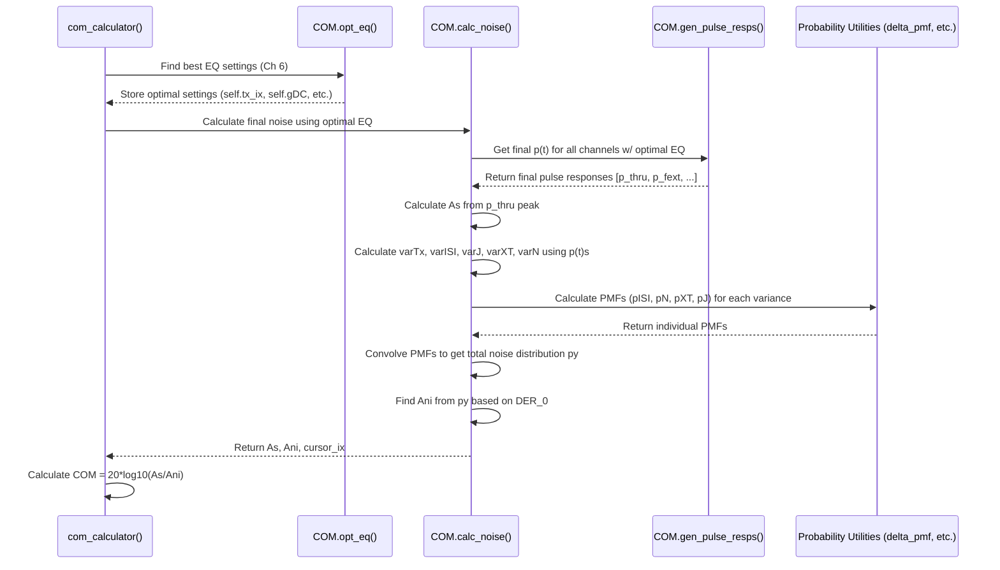

# Chapter 7: Noise Calculation (`NoiseCalc`)

Welcome back! In [Chapter 6: Equalization Optimization](06_equalization_optimization_.md), we saw how `PyChOpMarg` cleverly adjusts electronic filters (equalizers) to clean up the distorted signal as much as possible. It finds the best "knob settings" to make the signal shape (`p(t)`) look sharp and clean.

But even with the best equalization, real-world communication is never perfectly clean. There's always some leftover "static" or interference. How do we measure exactly how much interference remains *after* we've done our best to clean the signal up?

## The Problem: How Much Static is Left?

Imagine you've used an fancy audio equalizer to make music coming through a cheap speaker sound much better. You boosted the treble, maybe cut some muddy bass. It sounds clearer, but it's not perfect. You might still hear a faint hiss (thermal noise), maybe some crackle from a loose wire (like transmitter noise), or perhaps interference from a nearby radio station (crosstalk).

Similarly, even after optimizing the equalizers in our high-speed signal path, several sources of noise and interference remain:

*   **Transmitter Noise (`SNR_TX`):** The sender itself isn't perfect and adds some noise.
*   **Timing Jitter (`sigma_Rj`, `A_DD`):** Tiny variations in the timing of the signal pulses.
*   **Receiver Noise (`eta_0`):** Random electronic noise generated within the receiver circuitry (like hiss).
*   **Crosstalk (FEXT/NEXT):** Interference bleeding over from signals traveling on nearby wires or traces.
*   **Residual ISI:** The equalization might not have perfectly cancelled *all* the echoes (Inter-Symbol Interference) from previous pulses.

To determine the final signal quality margin (COM), we absolutely *need* to quantify how strong each of these remaining interference sources is.

## The Solution: `NoiseCalc` - The Interference Investigator

Think of this part of `PyChOpMarg` as the **interference investigator**. Its job is to meticulously identify every source of "static" or noise that affects the signal *after* the optimal equalization from [Chapter 6: Equalization Optimization](06_equalization_optimization_.md) has been applied. It then calculates the strength (specifically, the *variance* or power) of each noise source and figures out their combined effect.

The primary goal is to determine two key numbers:

1.  **`As` (Signal Amplitude):** How strong is the main part of our signal pulse at the sampling instant, *after* equalization?
2.  **`Ani` (Aggregated Noise and Interference):** What is the *total* effective amplitude of all the combined noise and interference sources that could cause errors?

These two values, `As` and `Ani`, are the final ingredients needed to calculate the COM value itself, typically using the formula: `COM (dB) = 20 * log10(As / Ani)`.

## How PyChOpMarg Calculates Noise

This calculation happens automatically within the [COM Calculation Engine (`COM` class)](04_com_calculation_engine___com__class__.md), inside a method typically called `calc_noise`. This method is called *after* the `opt_eq` method (from Chapter 6) has found the best equalizer settings. Here's the general idea:

1.  **Get Final Pulse Response:** First, it generates the final pulse response `p(t)` using the *optimal* equalizer settings found previously. This includes the pulse responses for the main signal (`THRU`) and any crosstalk aggressors (`FEXT`, `NEXT`).
2.  **Determine Signal Amplitude (`As`):** It looks at the main signal's pulse response (`p_thru(t)`) and finds the height of the main peak (the cursor). This height, scaled appropriately, becomes the signal amplitude `As`.
3.  **Calculate Individual Noise Variances:** It calculates the statistical variance (a measure of power or strength) for each noise source:
    *   `varTx`: Variance due to transmitter noise (`SNR_TX`).
    *   `varISI`: Variance due to residual Inter-Symbol Interference (echoes not cancelled by the DFE/FFE).
    *   `varJ`: Variance due to timing jitter (`sigma_Rj`, `A_DD`).
    *   `varXT`: Variance due to crosstalk from all FEXT and NEXT aggressors.
    *   `varN`: Variance due to receiver thermal noise (`eta_0`).
    These calculations use the final pulse responses and parameters from the [COM Configuration (`COMParams`)](02_com_configuration___comparams___.md).
4.  **Combine Noise Probabilistically:** Simply adding the variances isn't quite right because the noise sources might affect the signal in complex ways. `PyChOpMarg` uses a more sophisticated approach involving probability distributions (specifically, Probability Mass Functions or PMFs). It determines the probability distribution of the voltage noise caused by each source and then combines these distributions (using a mathematical operation called convolution) to get the probability distribution of the *total* noise (`py`).
5.  **Find Effective Noise Amplitude (`Ani`):** It looks at the combined noise probability distribution (`py`) and finds the voltage level (`Ani`) such that the probability of the noise exceeding the signal's decision threshold is equal to the target error rate (`DER_0`) specified in `COMParams`. This `Ani` represents the effective amplitude of all noise and interference.

## Using Noise Calculation: It's Automatic!

Just like equalization optimization, noise calculation is typically handled automatically by the main `COM` object. You don't need to call a separate `NoiseCalc` function.

```python
# --- Step 0: Imports ---
from pathlib import Path
from pychopmarg.config.ieee_8023dj import IEEE_8023dj
from pychopmarg.com import COM

# --- Step 1: Define Channel Files ---
channel_files = {
    "THRU": [Path("data/channels/example_thru.s4p")],
    "FEXT": [Path("data/channels/example_fext.s4p")],
    "NEXT": [Path("data/channels/example_next.s4p")],
}

# --- Step 2: Initialize the COM Engine ---
print("Initializing the COM calculation engine...")
com_calculator = COM(com_params=IEEE_8023dj, channels=channel_files)
print("COM engine initialized!")

# --- Step 3: Run the Calculation ---
print("Starting the COM calculation...")
# This single call runs opt_eq (Chapter 6) AND THEN calc_noise (this chapter)!
com_value_db = com_calculator()
print(f"Calculation complete!")
print(f"The calculated COM is: {com_value_db:.2f} dB")
```

When `com_calculator()` is called:
1.  `opt_eq` runs first to find the best equalizer settings (Tx FFE, CTLE, Rx FFE, DFE).
2.  Then, `calc_noise` runs, using those best settings to calculate the final `As` and `Ani`.
3.  Finally, the COM value is computed using `As` and `Ani`.

## Under the Hood: The Investigator at Work

Let's trace the flow when the `COM` object calculates the noise:

1.  **Trigger:** The main `COM.__call__` method, after finishing `opt_eq`, calls the `calc_noise` method.
2.  **Inputs:** `calc_noise` implicitly uses the optimal equalizer settings (`self.gDC`, `self.tx_ix`, `self.rx_taps`, `self.dfe_taps` etc.) stored by `opt_eq`. It might also take the optimal cursor location (`cursor_ix`) found during optimization.
3.  **Pulse Responses:** It calls `gen_pulse_resps` (from [Chapter 5: Pulse Response Generation](05_pulse_response_generation_.md)) using the optimal EQ settings to get the final `p(t)` for all channels (THRU, FEXT, NEXT).
4.  **Signal `As`:** It identifies the peak value (`vic_curs_val`) in the final `p_thru(t)` at the `cursor_ix` and calculates `As`.
5.  **Noise Variances:** It performs calculations based on formulas in the IEEE standard (like 93A-30 to 93A-35) to find `varTx`, `varISI`, `varJ`, `varXT`, `varN`. This involves analyzing the shapes of the final pulse responses.
6.  **Probability Combination:** It calculates the probability distribution (PMF) for each noise source (e.g., `pISI`, `pN`, `pXT`, `pJ`) using helper functions (like `delta_pmf`). It then convolves these PMFs together to get the total noise distribution `py`.
7.  **Noise Amplitude `Ani`:** It analyzes the cumulative sum of `py` to find the voltage level `Ani` corresponding to the target `DER_0`.
8.  **Output:** `calc_noise` returns the calculated `As`, `Ani`, and the final `cursor_ix`.

Here's a simplified sequence diagram:



*(Note: Sometimes, noise calculation steps are also performed *during* equalization optimization within `calc_fom` when using the PRZF method, but the *final* noise calculation described here happens in `calc_noise` after optimization is complete.)*

### Code Sneak Peek (`src/pychopmarg/com.py`)

Let's look at a highly simplified version of the `calc_noise` method inside the `COM` class.

```python
# Simplified from src/pychopmarg/com.py within COM class
import numpy as np
# Import helper functions for probability calculations
from pychopmarg.utility import delta_pmf, calc_hJ, filt_pr_samps

class COM():
    # ... (other methods like __init__, __call__, opt_eq, gen_pulse_resps) ...

    def calc_noise(
        self,
        cursor_ix: Optional[int] = None, # Cursor location from optimization
    ) -> tuple[float, float, int]:
        """
        Calculate the interference and noise (Ani) and signal amplitude (As).
        (Simplified Docstring)
        """
        # --- Step 1: Get Final Pulse Responses (using optimal EQ stored in self) ---
        # Note: DFE effect is handled explicitly later, not in gen_pulse_resps here.
        pulse_resps = self.gen_pulse_resps(dfe_taps=self.empty_array)
        vic_pulse_resp = pulse_resps[0] # Main signal p(t)

        # --- Step 2: Determine Signal Amplitude (As) ---
        if cursor_ix is None:
            # Find cursor location if not provided (e.g., using Muller-Mueller)
            cursor_ix = self.find_cursor_location(vic_pulse_resp) # Placeholder name
        vic_curs_val = vic_pulse_resp[cursor_ix] # Value at cursor time
        As = self.com_params.RLM * vic_curs_val / (self.com_params.L - 1)

        # --- Setup for probability calculations ---
        ymax = 1.1 * As # Range for voltage histograms/PMFs
        npts = 2 * min(int(ymax / 0.00001), 1_000) + 1 # Number of bins (odd)
        y = np.linspace(-ymax, ymax, npts) # Voltage bins
        ystep = y[1] - y[0] # Bin width
        pDelta = np.zeros(npts); pDelta[npts // 2] = 1.0 # PMF of zero noise

        # --- Step 3: Calculate Individual Noise Variances & PMFs ---
        # (Simplified calculations - actual code uses IEEE formulas)
        # - Thermal Noise (varN), Tx Noise (varTx), Jitter Noise (varJ) -> Combined Gaussian
        varN = self.calculate_thermal_noise_variance() # Placeholder
        varTx = self.calculate_tx_noise_variance(vic_curs_val) # Placeholder
        hJ = calc_hJ(vic_pulse_resp, As, cursor_ix, self.nspui) # Slopes for Jitter
        varJ = self.calculate_jitter_variance(hJ) # Placeholder
        varG = varTx + varJ + varN # Combined Gaussian variance
        # Convert Gaussian variance to PMF (pG)
        pG = np.exp(-y**2 / (2 * varG)) / np.sqrt(2 * np.pi * varG) * ystep
        # Jitter also has a deterministic part (pJ from A_DD)
        _, pJ = delta_pmf(filt_pr_samps(self.com_params.A_DD * hJ, ymax), L=self.com_params.L, y=y)
        # Combine Gaussian and deterministic Jitter PMFs (pN)
        pN = np.convolve(pG, pJ, mode='same'); pN /= pN.sum()

        # - Residual ISI (varISI -> pISI)
        # Get ISI samples (hISI) after optimal DFE application
        hISI = self.calculate_residual_isi_samples(vic_pulse_resp, vic_curs_val, cursor_ix) # Placeholder
        varISI = self.calculate_isi_variance(hISI) # Placeholder
        _, pISI = delta_pmf(filt_pr_samps(hISI, ymax), L=self.com_params.L, y=y)

        # - Crosstalk (varXT -> pXT)
        pXT = pDelta # Start with no crosstalk noise
        varXT_total = 0
        for xt_pulse_resp in pulse_resps[1:]: # Loop through FEXT/NEXT
             xt_samps = self.get_crosstalk_samples(xt_pulse_resp) # Placeholder
             varXT_single = self.calculate_xt_variance(xt_samps) # Placeholder
             varXT_total += varXT_single
             _, pk = delta_pmf(filt_pr_samps(xt_samps, ymax), L=self.com_params.L, y=y)
             pXT = np.convolve(pXT, pk, mode='same') # Convolve each aggressor
        pXT /= pXT.sum()

        # --- Step 4: Combine Noise Probabilistically ---
        # Convolve all the individual noise PMFs
        py = np.convolve(np.convolve(pISI, pN, mode='same'), pXT, mode='same')

        # --- Step 5: Find Effective Noise Amplitude (Ani) ---
        Py = np.cumsum(py); Py /= Py[-1] # Cumulative probability
        # Find the voltage 'y' where cumulative probability crosses DER_0
        Ani = -y[np.where(Py >= self.com_params.DER_0)[0][0]]

        # Store results for debugging/reporting if needed
        self.com_rslts['As'] = As
        self.com_rslts['Ani'] = Ani
        # ... store variances, PMFs, etc. ...

        # --- Return final values ---
        return (As, Ani, cursor_ix)

    # Placeholder functions for simplified variance calculations
    def find_cursor_location(self, p): return np.argmax(p)
    def calculate_thermal_noise_variance(self): return 1e-9 # Dummy value
    def calculate_tx_noise_variance(self, peak): return peak**2 * 10**(-self.com_params.SNR_TX / 10) # Approx
    def calculate_jitter_variance(self, hJ): return 1e-9 # Dummy value
    def calculate_residual_isi_samples(self, p, peak, cix): return np.random.randn(10)*0.01 # Dummy values
    def calculate_isi_variance(self, hISI): return np.sum(hISI**2)*0.1 # Dummy value
    def get_crosstalk_samples(self, p_xt): return p_xt[::self.nspui] # Simplified
    def calculate_xt_variance(self, xt_samps): return np.sum(xt_samps**2)*0.1 # Dummy value
```

*   The `calc_noise` method uses the optimal `cursor_ix` found earlier.
*   It calls `gen_pulse_resps` to get the final `p(t)` shapes based on the optimal EQ stored in `self`.
*   It calculates the signal amplitude `As` from the main pulse peak.
*   It calculates the variance of different noise sources (`varTx`, `varN`, `varJ`, `varISI`, `varXT`) based on standard formulas (represented by placeholder functions here).
*   It converts these variances into probability distributions (PMFs like `pG`, `pJ`, `pISI`, `pXT`) using helper functions like `delta_pmf`.
*   It **convolves** these PMFs together to get the total noise distribution `py`.
*   It finds the noise amplitude `Ani` from the cumulative distribution `Py` based on the target error rate `DER_0`.
*   It returns `As` and `Ani` (and `cursor_ix`).

*(Note: The `NoiseCalc` class defined in `src/pychopmarg/noise.py` is often used as a helper object, especially within the `mmse` optimization function, to bundle parameters needed for noise calculations *during* optimization. However, the final calculation after optimization typically happens within `COM.calc_noise` as shown above.)*

## Conclusion

You've now learned about the crucial **Noise Calculation** step performed by `PyChOpMarg`. Acting as an "interference investigator," it meticulously quantifies all remaining noise sources (transmitter noise, jitter, thermal noise, crosstalk, residual ISI) *after* the optimal equalization settings have been applied ([Chapter 6: Equalization Optimization](06_equalization_optimization_.md)).

This process calculates the final signal amplitude (`As`) and the total effective noise amplitude (`Ani`) by combining the effects of all noise sources probabilistically. These two values, `As` and `Ani`, are precisely what the [COM Calculation Engine (`COM` class)](04_com_calculation_engine___com__class__.md) needs to compute the final Channel Operating Margin (COM) result, telling us how much signal quality headroom the channel has according to the standard.

With this understanding of how noise is calculated, you now have a complete picture of the core concepts involved in a COM simulation using `PyChOpMarg`, from setting up the parameters and channel, to optimizing equalization, and finally, quantifying the noise to determine the margin.

---

Generated by [AI Codebase Knowledge Builder](https://github.com/The-Pocket/Tutorial-Codebase-Knowledge)