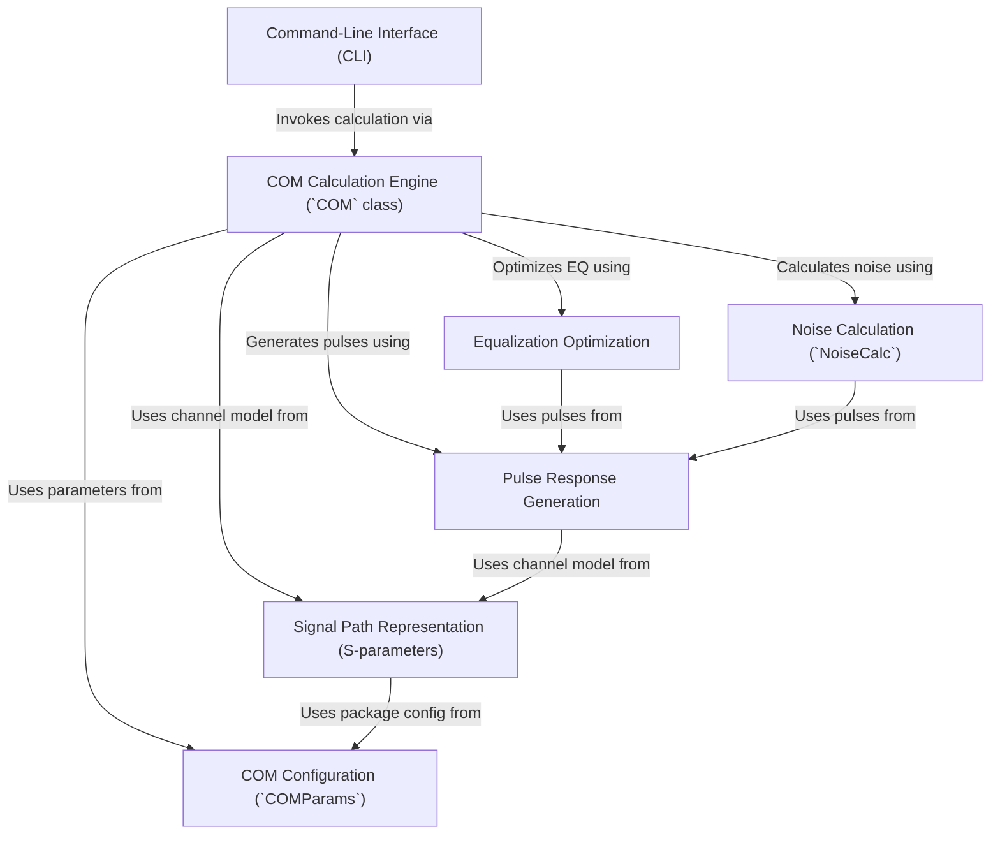

# Tutorial: PyChOpMarg

*PyChOpMarg* calculates the **Channel Operating Margin (COM)** for high-speed communication channels.
It essentially determines the *signal quality* and robustness against noise and distortion, following specific **IEEE standards**.
The core engine takes channel data (like **S-parameters**) and configuration settings, applies **equalization**, calculates **noise**, and outputs the COM value (in dB).

**Source Repository:** [None](None)

## Chapters

1. [Command-Line Interface (CLI)
](01_command_line_interface__cli__.md)
2. [COM Configuration (`COMParams`)
](02_com_configuration___comparams___.md)
3. [Signal Path Representation (S-parameters)
](03_signal_path_representation__s_parameters__.md)
4. [COM Calculation Engine (`COM` class)
](04_com_calculation_engine___com__class__.md)
5. [Pulse Response Generation
](05_pulse_response_generation_.md)
6. [Equalization Optimization
](06_equalization_optimization_.md)
7. [Noise Calculation (`NoiseCalc`)
](07_noise_calculation___noisecalc___.md)

---

Generated by [AI Codebase Knowledge Builder](https://github.com/The-Pocket/Tutorial-Codebase-Knowledge)