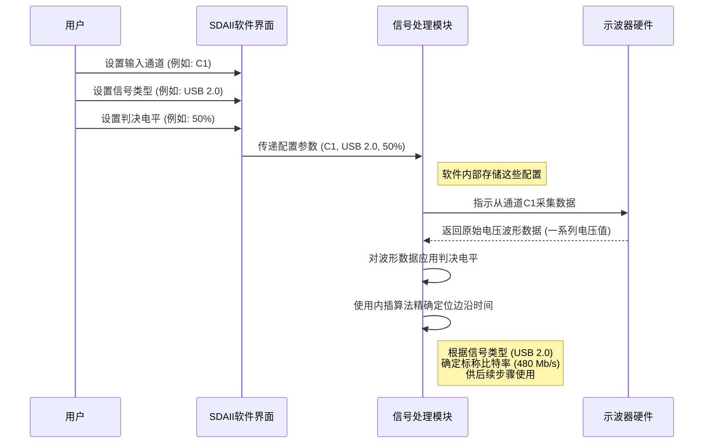

# Chapter 1: 信号设置与输入


欢迎来到 `pdfs` 项目的入门教程！在数据分析的奇妙旅程开始之前，我们需要进行一些基础的准备工作。本章将向您介绍如何进行“信号设置与输入”，这是使用 SDAII (Serial Data Analysis II) 软件进行分析的第一步。

想象一下，您是一位大厨，准备烹饪一道佳肴。在真正开始炒菜之前，您需要做什么呢？没错，您需要准备好所有食材——比如，从哪个篮子里拿出胡萝卜，从哪个盘子里取出肉片——并且设定好炉火的温度。如果食材拿错了，或者炉火太大太小，那么最终的菜肴很可能不尽如人意。

同样地，在进行串行数据分析时，**信号设置与输入**就扮演着“准备食材”和“设定炉火”的角色。您需要明确地告诉SDAII软件：
*   我们要分析的信号是从示波器的哪个**通道**输入的？
*   这个信号属于哪种**类型**？（例如，它是我们日常使用的 USB 信号，还是用于网络通讯的以太网信号，或者是其他标准信号？）
*   判断信号是高电平还是低电平的“**门槛**”（我们称之为**判决电平**）应该设置在哪里？

这些设置看起来可能很简单，但它们是后续所有精确测量的基石。只有正确地完成了这些初始设置，我们才能确保后续的[时钟恢复](02_时钟恢复_.md)、[眼图分析](04_眼图分析_.md)和[抖动分析](06_抖动分析_.md)等高级操作能够得到准确可靠的结果。

让我们通过一个具体的例子开始：假设我们要分析一个 USB 2.0 信号，检查它的基本电气特性是否符合标准。

## 核心概念

在进行设置之前，我们先来了解几个核心概念：

### 1. 信号输入源 (Signal Inputs)

这部分设置告诉SDAII软件从哪里获取原始的波形数据。

*   **通道选择**: 您的信号是通过探头连接到示波器的某个物理输入通道上的（例如，通道1，通道2等）。您需要指定这个通道。
*   **输入方式**:
    *   **单端信号 (Single-ended)**: 信号由一根导线相对于地传输。如果选择这种方式，通常在SDAII中选择“1 Input”。
    *   **差分信号 (Differential)**: 信号由两根导线传输，它们上面的信号大小相等，极性相反。许多高速信号（如USB、HDMI、以太网）都采用差分形式，因为它能更好地抵抗噪声。如果您的信号是差分的：
        *   若使用差分探头，它会自动处理两路信号，您可以选择“1 Input (or Diff. Probe)”并指定探头连接的通道。
        *   若使用两个单端探头分别探测差分对的两根线（例如，Input1 和 Input2），则可以选择“Input1 - Input2”的模式，软件会自动计算它们的差值作为实际的差分信号。

好比告诉厨师：“请从标有‘C1’的篮子里拿食材”，或者“请同时拿起‘C1’和‘C2’篮子里的食材，并将它们混合处理”。

根据操作手册 `Operator's Manual SDAIISoftware.txt` 第7页的 "Serial Data Inputs" 部分所述：
> If you are using a differential probe or if your signal is connected by one coaxial cable, use the 1 Input (or Diff. Probe) button and select the input source.
> If you have a differential signal transmitted on two coaxial cables or two single-ended probes, use the Input1 - Input2 button and select the input channels used.

**中文解读**:
> 如果您使用差分探头，或者您的信号通过一根同轴电缆连接，请使用“1 Input (or Diff. Probe)”按钮并选择输入源。
> 如果您的差分信号通过两根同轴电缆或两个单端探头传输，请使用“Input1 - Input2”按钮并选择所用的输入通道。

### 2. 信号类型 (Signal Types)

指定信号类型非常重要，因为它能帮助SDAII软件：
*   **自动设置标称比特率 (Nominal Bit Rate)**: 例如，如果您选择“USB 2.0 High Speed”，软件可能就知道其标称速率是 480 Mb/s。这个速率是后续[时钟恢复](02_时钟恢复_.md)的重要参数。
*   **加载预设模板 (Masks)**: 许多标准信号都有对应的眼图模板。选择正确的信号类型后，在进行[眼图模板测试](05_眼图模板测试_.md)时，软件可以自动加载合适的模板。
*   **配置特定参数**: 某些信号标准有特定的分析要求，选择信号类型有助于软件进行针对性设置。

常见的信号类型包括 USB、PCI Express、SATA、以太网等。如果您的信号不属于任何标准类型，通常也可以选择“Custom”（自定义）并手动输入比特率等参数。

这就像告诉厨师：“我们今天要做的是‘川菜’”。厨师就会知道大致的烹饪风格、可能用到的调料和火候要求。

操作手册 `Operator's Manual SDAIISoftware.txt` 第7页的 "Signal Types" 部分提到：
> The signal type defines the compliance masks and bitrate for the selected standard.
> When you touch the Signal Type field, a pop-up table of standard signal types is shown.

**中文解读**:
> 信号类型定义了所选标准的合规性模板和比特率。
> 当您点击信号类型字段时，会显示一个标准信号类型的弹出列表。

### 3. 判决电平 (Crossing Levels / Thresholds)

判决电平是数字信号分析中的一个至关重要的参数。它是一个电压值，SDAII软件用这个电压值作为“分界线”来判断信号是处于高电平（逻辑 '1'）还是低电平（逻辑 '0'）。当信号从低于此电平跨越到高于此电平，就被认为是一个上升沿；反之则为下降沿。

*   **绝对电平 (Absolute Level)**: 您直接指定一个固定的电压值，例如 1.65 V。
*   **相对电平 (Relative Level / Percent)**: 您指定一个百分比，例如 50%。软件会自动计算信号幅度的中间点作为判决电平。例如，如果信号在 0V 和 3.3V 之间摆动，50% 的判决电平就是 1.65V。这种方式对于信号直流偏置可能发生变化的场景比较有用。
*   **寻找电平 (Find Level)**: 很多软件提供一个“Find Level”按钮，它可以自动分析当前采集到的信号，并估算出一个合适的判决电平值（通常是信号高低电平的中间值）。
*   **迟滞 (Hysteresis)**: 这是一个高级设置。想象一下，如果信号在判决电平附近有很多噪声毛刺，软件可能会错误地检测到很多额外的边沿。迟滞设置了一个“缓冲区域”：信号不仅要越过判决电平，还要越过一个额外的量（迟滞值），才能被认为完成了一次有效的电平翻转。这有助于滤除噪声，防止误判。

判决电平的设置直接影响所有基于边沿定时的测量，如抖动、眼宽等。设置不当会导致测量结果出现巨大偏差。

这就像设定一把尺子的零刻度线。如果零刻度线标错了，那么所有的长度测量都会不准确。

操作手册 `Operator's Manual SDAIISoftware.txt` 第7-8页的 "Crossing Levels" 部分详细描述了这一点：
> The Crossing level section of the Signal Input dialog determines the voltage level where the arrival time of each edge of the signal is measured.
> ... The Level Type can be either absolute or relative.
> ... The Hysteresis entry box sets the hysteresis level to use for edge detection... prevents the software from finding false edges...

**中文解读**:
> “信号输入”对话框中的“判决电平”部分决定了测量信号各边沿到达时间的电压水平。
> ... 电平类型可以是绝对值或相对值。
> ... “迟滞”输入框用于设置边沿检测所用的迟滞电平... 防止软件因噪声或信号中的其他小毛刺而找到错误的边沿。

## 如何进行信号设置与输入 (以SDAII为例)

现在我们已经了解了基本概念，让我们看看如何在SDAII软件中进行这些设置。通常，这些设置位于一个专门的“信号输入设置”(Setup Signal Inputs) 对话框中。

1.  **启动SDAII分析**:
    在示波器软件的主菜单中，通常可以通过类似 `Analysis → Serial Data` 的路径来打开SDAII分析模块。

2.  **打开信号输入设置**:
    在SDAII的主界面上，会有一个类似流程图的界面，找到并点击标有“Setup Signal Inputs”（设置信号输入）或类似文字的按钮。这将打开“信号输入”(Signal Input) 对话框。

     *(请注意: 此处为概念图链接占位符，实际应替换为SDAII界面的截图或描述)*
    *(根据手册第6页的图示，SDAII对话框有一个 "Setup Signal Inputs" 按钮)*

3.  **配置信号输入对话框**:
    在“信号输入”对话框中，您会看到对应我们前面讨论的几个概念的设置区域。

    *   **串行数据输入 (Serial Data Input(s))**:
        *   假设我们的USB 2.0信号是一个差分信号，通过一个差分探头连接到示波器的通道1 (C1)。
        *   我们会选择 `1 Input (or Diff. Probe)` （单个输入或差分探头）选项。
        *   然后在下方的 `Data` (数据) 或 `Input1` (输入1) 字段中，选择 `C1` 作为输入源。

    *   **信号类型 (Signal Type)**:
        *   点击“Signal Type”字段，会弹出一个列表。
        *   从列表中找到并选择与您的信号最匹配的类型。对于我们的例子，我们会寻找 “USB 2.0 High Speed” 或类似的选项。如果没有精确匹配，选择一个通用的USB选项，或者选择“Custom”（自定义）并手动输入比特率（USB 2.0 High Speed 是 480 Mb/s）。

    *   **判决电平 (Crossing Level)**:
        *   **电平类型 (Level is / Level Type)**: 选择 `Absolute` (绝对值) 或 `Percent` (百分比)。对于初学者，使用 `Percent` 并设置为 `50%` 通常是一个不错的起点。或者，可以尝试点击 `Find Level` (寻找电平) 按钮，让软件自动推荐一个值。
        *   **电平值 (Abs Level / Percent Level)**: 如果选择“Absolute”，则输入具体的电压值（例如 `0 V`，如果信号是NRZ且在0V附近交叉）。如果选择“Percent”，则输入百分比（例如 `50`%）。
        *   **迟滞 (Hysteresis)**: 初学者通常可以保持默认值。手册建议默认值为 `500 mdiv` (即0.5个垂直格)。如果信号眼图闭合严重或噪声很大，可能需要调整此值。

    下面是一个简化的“信号输入”对话框示意图，标注了关键设置项：

    ```
    +---------------------------------------------------+
    | 信号输入设置 (Signal Input Setup)                 |
    +---------------------------------------------------+
    |                                                   |
    | [串行数据输入 (Serial Data Input(s))]             |
    |   (*) 单个输入 (例如: C1)  ( ) 输入1-输入2       |
    |       数据源: [ C1  ▼]                           |
    |                                                   |
    | [信号类型 (Signal Type)]                          |
    |   类型: [ USB 2.0 HS (480Mb/s) ▼]                |
    |   标称速率: 480 Mb/s (自动或手动输入)             |
    |                                                   |
    | [判决电平 (Crossing Level)]                       |
    |   电平类型: ( ) 绝对值  (*) 百分比                |
    |   电平值:   [ 50 ] %                             |
    |   [ 自动寻找电平 (Find Level) ] 按钮             |
    |   迟滞:     [ 0.5 ] div                          |
    |                                                   |
    |                       [ 确定 (OK) ] [ 取消 (Cancel) ] |
    +---------------------------------------------------+
    ```
    *(这是一个基于文本的示意图，实际界面会更图形化)*

    完成这些设置后，点击“确定”(OK) 保存。现在，SDAII软件就知道了它要处理的是什么信号，以及如何初步解读这个信号的电平高低了。

## 内部实现机制 (简单一瞥)

您可能会好奇，当您在界面上点击几下之后，软件内部发生了什么？让我们简单了解一下：

1.  **用户配置**: 您通过图形界面选择了输入通道、信号类型和判决电平。
2.  **参数存储**: SDAII软件会将这些配置参数（例如，通道C1，类型USB，判决电平50%）记录下来。
3.  **数据采集**: 当您启动分析时，SDAII会指示示波器硬件从您指定的通道（如C1）采集原始的电压波形数据。这会得到一系列随时间变化的电压值。
4.  **电平比较与边沿检测**:
    *   软件会遍历采集到的波形数据点。
    *   对于每个数据点，它会将其电压值与您设定的**判决电平**进行比较。
    *   当信号电压从判决电平之下穿越到判决电平之上时，软件记录一个上升沿。反之，则记录一个下降沿。
    *   **迟滞 (Hysteresis)** 设置在这里发挥作用：信号需要明显地越过判决电平（超过迟滞值定义的范围），才能确认一次有效的边沿转换，这有助于忽略判决电平附近的微小噪声波动。
5.  **时间戳记录**: 对于每个检测到的边沿，软件都会精确记录其发生的时间点。为了获得比示波器采样间隔更精确的时间，软件通常会使用**内插算法** (Interpolation)。例如，即使实际采样点没有恰好落在判决电平上，软件也可以通过前后采样点的值估算出精确的过零时间。
6.  **利用信号类型信息**: 您选择的**信号类型**所关联的标称比特率信息，将为后续的[时钟恢复](02_时钟恢复_.md)模块提供一个初始的参考时钟频率。

下面是一个简化的序列图，展示了这个过程：



手册中（第14页，“SDA Edge Time Determination”图示相关部分）也提到了边沿时间确定的细节，虽然那部分更侧重于时钟恢复的上下文，但其核心的判决电平应用和内插思想是共通的：
> interpolation is necessary in order to accurately determine crossing times. ... A cubic interpolation is used, followed by a linear fit to the interpolated data to find the precise time that a data signal edge traverses the crossing level...

**中文解读**:
> 为了精确确定穿越时间，内插是必要的。... 使用三次内插，然后对内插后的数据进行线性拟合，以找到数据信号边沿穿过判决电平的精确时间...

简单来说，软件通过您设定的“尺子”（判决电平）和“放大镜”（内插算法），仔细地检查原始信号，找出每一个0和1之间的转变时刻。

## 总结

在本章中，我们学习了进行串行数据分析的第一步——**信号设置与输入**。这包括：
*   指定信号从哪个**输入通道**来。
*   告诉软件信号的**类型**，以便它能利用该类型的标准信息。
*   设定关键的**判决电平**，作为区分数字信号高低电平的基准。

这些看似基础的步骤，如同打好地基对于建造高楼大厦一样重要。正确的信号设置是所有后续高级分析（如眼图、抖动测试）能够得出准确结论的前提。

现在我们已经告诉SDAII如何理解原始信号了，下一步我们将学习如何从这些信号中提取出时钟信息，这是进行更高级分析的关键。让我们进入 [第 2 章：时钟恢复](02_时钟恢复_.md) 的学习。

---

Generated by [AI Codebase Knowledge Builder](https://github.com/The-Pocket/Tutorial-Codebase-Knowledge)