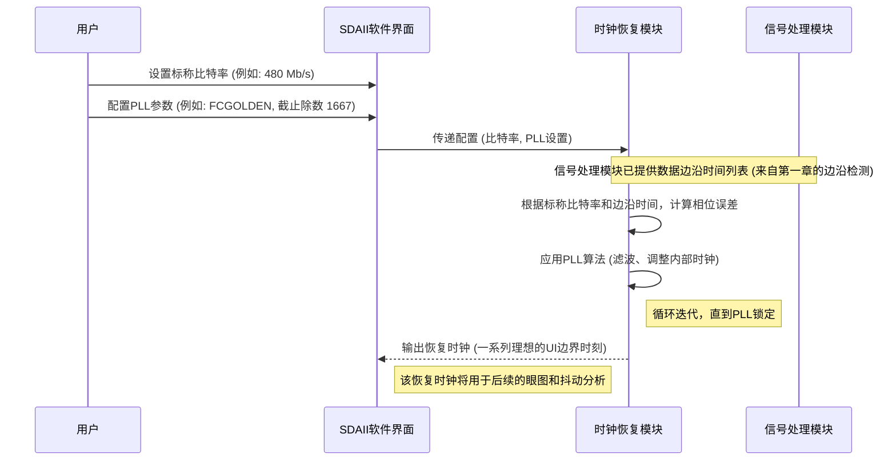

# Chapter 2: 时钟恢复


在上一章 [信号设置与输入](01_信号设置与输入_.md) 中，我们学习了如何告诉SDAII软件我们要分析的是什么信号，以及如何初步判断信号的高低电平。这就像我们已经准备好了食材，并设定好了基本的烹饪工具。现在，我们要进入一个更智能的步骤：即使没有明确的节拍器，我们也要让SDAII软件能够准确地“读取”数据流中的每一个“音符”。这就是“时钟恢复”技术要解决的问题。

## 什么是时钟恢复？为什么它如此重要？

想象一下，您正在收听一段摩尔斯电码。发送方快速地敲击着点（.）和划（-），但并没有同时给您一个节拍器告诉您每个点或划应该在什么时候开始和结束。您的大脑需要根据接收到的信号本身，去推断出发送方发送信号的节奏。

在高速数字通信中，情况与此类似。数据以一连串的0和1的形式高速传输，但很多时候，这些数据信号本身并不附带一个独立的、精确的时钟信号来告诉接收端何时去读取每一位数据。**时钟恢复 (Clock Recovery)** 技术，就像一位聪明的破译员，能够直接从这些连续的数据流中分析并“提取”或“重建”出原始的时钟节拍。

**核心作用**：时钟恢复的目的是为系统提供一个精确的时间基准，使得即使在没有独立时钟信号的情况下，也能准确地在每个数据位的中心位置进行采样判决，从而正确地解读数据是 '0' 还是 '1'。

在SDAII软件中，成功地恢复出时钟是进行后续高级分析（如[眼图分析](04_眼图分析_.md)和[抖动分析](06_抖动分析_.md)）的绝对前提。没有准确的时钟，我们就无法定义什么是“一个数据位的时间长度”（单位间隔，Unit Interval, UI），也就无法衡量信号的质量。

## 如何在SDAII中进行时钟恢复设置？

SDAII软件提供了一个专门的对话框来配置时钟恢复的参数。通常，在SDAII的主流程图中，点击“Setup Clock Recovery”（设置时钟恢复）按钮即可进入相关设置界面。

根据操作手册 `Operator's Manual SDAIISoftware.txt` 第11页的 "SetUp Clock Recovery" 部分，我们需要关注以下几个关键设置：

### 1. 数据比特率 (Bit Rate)

首先，SDAII需要知道它正在处理的数据大概有多快。这个“速度”就是比特率，单位通常是 Mb/s (兆比特每秒) 或 Gb/s (吉比特每秒)。

*   **自动获取**: 如果您在 [信号设置与输入](01_信号设置与输入_.md) 步骤中选择了标准的**信号类型**（例如 USB 2.0 High Speed），SDAII通常会自动填入该标准的标称比特率 (例如 480 Mb/s)。
*   **手动输入/查找**: 如果是自定义信号，或者您想覆盖自动设置，可以手动输入比特率。SDAII通常还提供一个 “Find Rate Now”（立即寻找速率）的按钮，它可以分析当前输入信号的特征，尝试自动检测出比特率。

**为什么重要？** 比特率是时钟恢复算法的起点。它告诉算法一个数据位大概应该持续多长时间。

### 2. 时钟恢复源 (Clock Source)

SDAII允许您选择时钟的来源：

*   **从数据中恢复时钟 (Recover clock from data)**: 这是最常见的情况，也是时钟恢复技术的核心。SDAII会分析输入的数据信号本身，从中提取时钟信息。在SDAII的流程图界面中，通常有一个多路选择开关，默认情况下它会选择从数据信号中恢复时钟（手册中描述为“红色路径”）。
*   **使用外部参考时钟 (Use an explicit reference clock)**: 在某些特殊情况下，您可能有一个独立的、与数据同步的外部时钟信号连接到示波器的另一个通道。此时，您可以切换设置，让SDAII使用这个外部时钟作为参考。如果选择了这种方式，"Setup Ref. Clock" 按钮会被激活，允许您配置这个外部参考时钟的输入和判决电平等。

对于大多数串行数据分析场景，我们会选择从数据中恢复时钟。

### 3. 锁相环设置 (PLL Setup)

这是时钟恢复的核心部件。**锁相环 (PLL, Phase-Locked Loop)** 是一种电子电路或算法，它能产生一个输出信号，该信号的相位与输入参考信号的相位相关。在时钟恢复中，PLL会“锁定”到输入数据流中的周期性特征，从而生成一个与数据同步的稳定时钟。

我们将在下一章 [锁相环 (PLL)](03_锁相环__pll__.md) 中详细探讨PLL的原理。目前，您只需要了解在SDAII中可以配置PLL的一些基本特性：

*   **PLL 类型 (PLL Type)**: 不同的通信标准可能要求使用特定类型的PLL模型。SDAII内置了多种标准PLL模型，例如：
    *   `FCGOLDEN`: 光纤通道 (Fibre Channel) 标准中定义的“黄金PLL”模型，通常是默认选项。其截止频率通常设置为比特率的 1/1667。
    *   `PCI-Express`: 针对不同版本的PCI Express标准。
    *   `Custom`: 允许用户自定义PLL的参数，如阶数（一阶或二阶）、极点频率、阻尼因子等。
*   **PLL 带宽 (PLL Bandwidth) / 截止除数 (Cutoff Divisor)**: PLL带宽决定了恢复出来的时钟能多快地跟踪输入数据速率的变化。
    *   较宽的带宽意味着PLL能跟踪更高频率的速率变化，从而将这些变化从抖动测量中“滤除”。
    *   较窄的带宽则意味着PLL对高速率变化不敏感，这些变化会被视为数据抖动的一部分。
    *   对于 `FCGOLDEN` PLL，通常通过设置“截止除数”（Cutoff Divisor）来间接设定带宽。例如，默认值1667意味着PLL的截止频率是 `比特率 / 1667`。

**为什么重要？** 正确配置PLL参数，使其尽量模拟真实接收端设备中的PLL特性，对于获得准确的抖动和眼图测量结果至关重要。

下面是一个简化的“时钟恢复设置”对话框示意图：

```
+---------------------------------------------------+
| 时钟恢复设置 (Clock Recovery Setup)               |
+---------------------------------------------------+
|                                                   |
| [数据或比特率 (Data or Bit Rate)]                 |
|   标称速率: [ 480 Mb/s     ▼] (来自信号类型或手动) |
|   [ 立即寻找速率 (Find Rate Now) ] 按钮           |
|                                                   |
| [参考时钟 (Reference Clock)]                      |
|   (☑) 从数据恢复时钟 (默认)                      |
|   ( ) 使用外部参考时钟 (需额外配置)             |
|                                                   |
| [锁相环设置 (PLL Setup...)] --> 点击打开详细PLL配置 |
|   PLL 类型: [ FCGOLDEN          ▼]                |
|   PLL 截止除数: [ 1667 ] (例如)                  |
|   [ PLL 开启 (PLL On) ] ☑                         |
|                                                   |
|                       [ 确定 (OK) ] [ 取消 (Cancel) ] |
+---------------------------------------------------+
```
*(这是一个基于文本的示意图，实际界面会更图形化，并且PLL详细配置通常在子对话框中)*

完成这些设置后，SDAII就有了从数据中提取“节拍”的指导方针了。

## 时钟恢复的内部机制 (简单一瞥)

当您配置好参数并启动分析后，SDAII内部是如何工作的呢？

### 1. 高层步骤

1.  **边沿检测**: 首先，SDAII利用您在 [信号设置与输入](01_信号设置与输入_.md) 中设定的**判决电平**，找到输入数据信号中所有发生电平跳变（从0到1或从1到0）的边沿，并精确记录这些边沿发生的时间点 (通常使用内插算法提高精度)。
2.  **初始时钟估计**: 根据用户设定的**标称比特率**，SDAII对时钟周期有一个初始的估计值 (例如，480 Mb/s 对应大约 2.083 ns 的时钟周期)。
3.  **PLL 运行**:
    *   软件PLL开始工作。它将观察到的数据边沿的实际到达时间与根据当前恢复时钟所“期望”的边沿到达时间进行比较。
    *   两者之间的差异被称为**相位误差 (Phase Error)**。
    *   这个相位误差会经过一个**环路滤波器 (Loop Filter)** (由PLL类型和带宽参数定义) 处理。
    *   滤波后的误差信号被用来调整PLL内部振荡器的频率和相位，使其产生的恢复时钟更接近数据的真实节拍。
4.  **锁定与跟踪**: 这个比较、滤波、调整的过程不断重复。最终，PLL会“锁定”到数据的平均速率和相位上。即使数据的速率有缓慢的漂移 (例如由扩频时钟SSC引起)，PLL也能够跟踪这些变化。
5.  **生成理想时钟**: 一旦PLL锁定，它就会生成一个“干净”的恢复时钟信号。这个恢复时钟实际上是一系列理想的时刻点，标记了每个数据位 (UI) 的开始和结束。这个恢复时钟将作为所有后续测量的时间基准。

### 2. 序列图示例

下面是一个简化的序列图，展示了时钟恢复的主要流程：



### 3. 更深入的理解 (参考手册)

操作手册 `Operator's Manual SDAIISoftware.txt` 在第14-16页的 "Clock Recovery Theory" 部分对此有更详细的描述。

*   **数字相位检测器 (Digital Phase Detector)**: 手册提到，创建时钟信号的第一步是创建一个数字相位检测器。这实际上就是我们之前讨论的，通过判决电平和内插来精确确定数据边沿穿过阈值的时刻 (参考手册图 "SDA Edge Time Determination", p.15)。

*   **PLL 实现**: 手册第15页的图 "Clock Recovery Implementation Using a PLL" 展示了一个反馈控制环路。
     *(这是一个占位符，实际应参考手册中的图。该图显示了输入数据边沿时间与恢复时钟边沿时间比较，产生误差，误差经过滤波器，然后调整时钟周期。)*

    这个图的核心思想是：
    1.  **比较器 (Comparator)**: 将“下一个数据边沿的测量时间”与“恢复时钟预测的下一个边沿时间”进行比较。
    2.  **误差 (Error)**: 它们之间的差值就是相位误差 `xk`。
    3.  **滤波器 (Filter)**: 这个误差信号会通过一个滤波器（例如，手册中提到的“黄金PLL”使用的一阶IIR滤波器）。滤波器的特性由用户设置的PLL类型和带宽决定。滤波器的作用是平滑误差信号，并决定PLL对误差的响应速度。
        手册中提到了黄金PLL一阶滤波器的公式 (p.16):
        `yk = yk-1 + (xk - yk-1)/n`  (简化形式，实际可能略有不同)
        这里，`yk` 是第 `k` 次迭代的校正值，`xk` 是第 `k` 个数据边沿与对应时钟边沿的误差，`n` 是PLL截止除数。这个公式的含义是，当前的校正量，是在上一次校正量的基础上，加上当前（误差减去上一次校正）的一小部分。这使得PLL逐步调整。
    4.  **调整时钟 (Clock Period Correction)**: 滤波后的误差被用来调整下一个恢复时钟周期的长度，从而使得恢复时钟逐渐向数据信号的真实时序对齐。

简单来说，时钟恢复就像一个非常灵敏的调谐过程。SDAII不断地听取数据信号的“节拍”，并微调自己的“内部节拍器”（恢复时钟），直到两者完美同步。这个“内部节拍器”一旦校准完毕，就可以用来精确地度量原始数据信号中的每一小段“音乐”了。

把它想象成您在尝试跟着一位鼓手打拍子。如果鼓手稍微加快或减慢了节奏（数据速率的变化），您会下意识地调整自己打拍子的速度来跟上他。这里的您，就扮演了PLL的角色，而您打出的拍子，就是恢复出来的时钟。

## 总结

在本章中，我们探讨了**时钟恢复**这一关键概念。我们了解到：
*   时钟恢复是从没有明确时钟参考的数据信号中提取定时信息的过程。
*   它对于准确解码数据和进行后续的信号质量分析 (如眼图、抖动) 至关重要。
*   在SDAII中，我们需要配置**比特率**、选择**时钟源**，并设置**PLL参数**（如类型和带宽）来实现有效的时钟恢复。
*   其内部机制主要依赖于一个软件**锁相环 (PLL)**，它通过一个反馈循环来不断调整恢复时钟的相位和频率，使其与输入数据同步。

正确地设置和理解时钟恢复，是掌握串行数据分析的又一个重要里程碑。有了准确的恢复时钟，我们才能定义数据位的边界，进而评估信号的各种性能指标。

在下一章中，我们将更深入地学习时钟恢复中最重要的核心部件之一：[第 3 章：锁相环 (PLL)](03_锁相环__pll__.md)。

---

Generated by [AI Codebase Knowledge Builder](https://github.com/The-Pocket/Tutorial-Codebase-Knowledge)