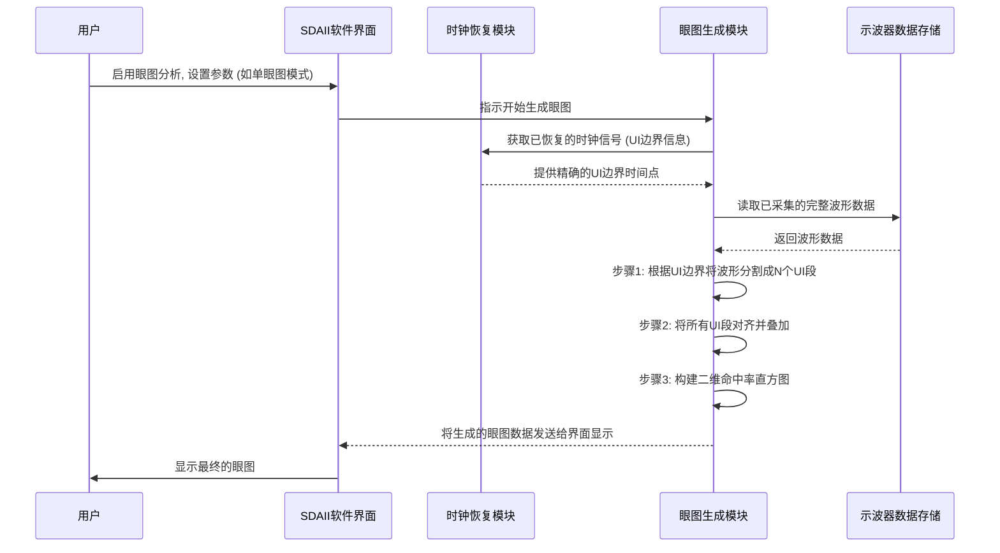

# Chapter 4: 眼图分析


在上一章 [锁相环 (PLL)](03_锁相环__pll__.md) 中，我们深入了解了锁相环如何帮助我们从数据信号中“锁定”并恢复出时钟信号。拥有一个稳定和准确的恢复时钟，就像有了一把精确的尺子，为我们后续的分析打下了坚实的基础。现在，我们将利用这把“尺子”来做一件非常酷的事情——绘制信号的“健康快照”，也就是进行眼图分析。

## 什么是眼图？它为什么如此重要？

想象一下，您是一位医生，想快速了解一位运动员的心脏在高强度运动时的整体表现。您可能会让他跑步，并同时记录下他每一次心跳的波形。如果您把成百上千次心跳的波形，按照心跳的节律（由恢复时钟确定）对齐并叠加在一起，会形成一个什么样的图案呢？这个图案会清晰地显示出心跳的典型形状、稳定程度以及任何异常波动。

**眼图 (Eye Diagram)** 对于数字信号来说，就扮演着类似的角色。根据我们之前提供的定义：
> 眼图是将数字信号在很多个时间单位内的波形叠加起来，形成一个看起来像“眼睛”的图案。这个“眼睛”张开得越大、越清晰，就代表信号质量越好，数据传输越不容易出错。它就像是给信号拍的一张“健康快照”，让工程师能直观地判断信号的整体表现，并测量其幅度、抖动等特性。

简单来说，眼图是评估高速数字信号质量的一种非常直观和强大的图形工具。它能够帮助工程师快速判断：
*   信号的幅度是否足够？
*   信号的上升下降沿是否干净利落？
*   信号是否存在过多的噪声？
*   信号的时序抖动是否在可接受范围内？

一个“漂亮”的眼图，其中“眼睛”张开得又大又清晰，通常意味着信号质量好，数据传输可靠。相反，如果“眼睛”模糊不清、闭合严重，则表明信号质量差，可能会导致数据传输错误。

**核心用例**：假设您正在设计一款新的USB设备，需要确保其发送的信号符合USB标准，能够被其他设备正确接收。通过查看USB信号的眼图，您可以快速评估信号的整体电气特性，例如幅度、抖动和噪声，判断它是否“健康”。

## 眼图的关键特征

一个典型的眼图（针对NRZ非归零编码信号）看起来像一只睁开的眼睛。这个“眼睛”的各个部分都蕴含着关于信号质量的重要信息：

```mermaid
graph LR
    subgraph "眼图形状"
        A --- B --- C --- D --- A
        E --- F --- G --- H --- E
        B --- F
        D --- H
        I((交叉点))
        J((交叉点))
        style A fill:#fff,stroke:#333,stroke-width:0px
        style B fill:#fff,stroke:#333,stroke-width:0px
        style C fill:#fff,stroke:#333,stroke-width:0px
        style D fill:#fff,stroke:#333,stroke-width:0px
        style E fill:#fff,stroke:#333,stroke-width:0px
        style F fill:#fff,stroke:#333,stroke-width:0px
        style G fill:#fff,stroke:#333,stroke-width:0px
        style H fill:#fff,stroke:#333,stroke-width:0px
        style I fill:#fff,stroke:#333,stroke-width:0px
        style J fill:#fff,stroke:#333,stroke-width:0px
    end
    T1[时间 (UI)]
    V1[电压]

    subgraph "标注"
        L1["眼高<br>(Eye Height)"] --- M1
        L2["眼宽<br>(Eye Width)"] --- M2
        L3["抖动<br>(Jitter)"] --- M3
        L4["噪声<br>(Noise)"] --- M4
        L5["上升/下降时间<br>(Rise/Fall Time)"] --- M5
        style L1 fill:#fff,stroke:#333,stroke-width:0px
        style L2 fill:#fff,stroke:#333,stroke-width:0px
        style L3 fill:#fff,stroke:#333,stroke-width:0px
        style L4 fill:#fff,stroke:#333,stroke-width:0px
        style L5 fill:#fff,stroke:#333,stroke-width:0px
        style M1 fill:#fff,stroke:#333,stroke-width:0px
        style M2 fill:#fff,stroke:#333,stroke-width:0px
        style M3 fill:#fff,stroke:#333,stroke-width:0px
        style M4 fill:#fff,stroke:#333,stroke-width:0px
        style M5 fill:#fff,stroke:#333,stroke-width:0px
    end
    
    linkStyle 0 stroke-width:2px,stroke:blue;
    linkStyle 1 stroke-width:2px,stroke:blue;
    linkStyle 2 stroke-width:2px,stroke:blue;
    linkStyle 3 stroke-width:2px,stroke:blue;
    linkStyle 4 stroke-width:2px,stroke:blue;
    linkStyle 5 stroke-width:2px,stroke:blue;
    linkStyle 6 stroke-width:2px,stroke:blue;
    linkStyle 7 stroke-width:2px,stroke:blue;
    linkStyle 8 stroke-width:2px,stroke:blue;
    linkStyle 9 stroke-width:2px,stroke:blue;

    %% Positioning the labels relative to the eye shape would be complex in Mermaid text.
    %% The diagram above is conceptual.
    %% A real eye diagram would have continuous traces.
    %% M1, M2, M3, M4, M5 are just placeholders for where the lines would point on the eye.
```

*   **单位间隔 (Unit Interval, UI)**: 这是眼图的水平时间轴的基本单位，代表一个比特的标称持续时间。它是由[时钟恢复](02_时钟恢复_.md)过程确定的。通常眼图会显示一个或两个UI的宽度。
*   **眼高 (Eye Height)**: 指“眼睛”在垂直方向上张开的程度。眼高越大，信号的噪声容限越好，即抵抗噪声干扰的能力越强。眼图上下边缘的“粗细”反映了信号的垂直噪声和幅度变化。
*   **眼宽 (Eye Width)**: 指“眼睛”在水平方向上最宽的部分。眼宽越大，信号的时序容限越好。眼图左右交叉点区域的“粗细”反映了信号的时序抖动 (Jitter)。
*   **交叉点 (Crossing Points)**: 信号从低电平跳变到高电平（上升沿）和从高电平跳变到低电平（下降沿）相互交叉的区域。理想情况下，交叉点应该清晰且位于UI的特定百分比位置（例如50%的判决电平）。交叉点的模糊程度也反映了抖动。
*   **上升/下降时间 (Rise/Fall Time)**: 眼图中倾斜的边沿反映了信号电平从低到高或从高到低的转换速度。边沿越陡峭，转换速度越快。
*   **眼图的轮廓和亮度 (Contours and Intensity)**: 现代示波器通常使用颜色编码或亮度变化来显示眼图中不同区域的信号轨迹密度。轨迹越密集（即信号通过该区域的次数越多），颜色越亮或越“热”。这有助于识别信号最常处于的状态和路径。

## 如何在SDAII中查看和设置眼图？

SDAII软件提供了强大的眼图分析功能。让我们看看如何进行基本设置来显示一个眼图。

1.  **启用眼图测量**:
    在SDAII的主分析流程图中，通常会有一个专门用于眼图的部分。您需要先启用眼图测量。
    *   根据手册第3页和第17页 ( "EyeMeasure Dialog" )，您需要在SDAII主对话框中勾选 "Enable Eye Meas." (启用眼图测量) 复选框。
    *   然后，点击 "Setup Eye Measurements" (设置眼图测量) 按钮，会打开眼图测量设置对话框 (`EyeMeasure Dialog`)。

2.  **眼图测量设置 (`EyeMeasure Dialog`)**:
    在这个对话框中（参考手册第17页），您可以配置眼图的显示方式和相关参数。对于初学者，我们关注几个基本设置：

    *   **眼图模式 (Eye Modes, p.18)**:
        *   SDAII提供多种眼图模式，例如 `SingleEye` (单眼图), `DualEyeTransition/Non-Transition` (双眼图-跳变/非跳变) 等。
        *   对于初次观察，`SingleEye` 是最常用的模式。它会将所有捕获到的UI叠加在一起形成一个眼图。
        *   选择 `Mode` 字段，然后从弹出菜单中选择 `SingleEye`。

    *   **垂直自动调整 (Vertical AutoFit, p.17)**:
        *   这个选项 `Vertical AutoFit checkbox` (垂直自动调整复选框) 允许软件自动缩放眼图的垂直轴，使得眼图能够很好地适应显示区域。
        *   通常，对于归一化的模板 (下一章内容)，它会被自动勾选。对于绝对值模板，它可能是禁用的。一般保持默认即可。

    *   **模板 (Masks, p.17)**:
        *   眼图经常与“模板”一起使用，以进行合格/不合格测试。我们将在下一章 [眼图模板测试](05_眼图模板测试_.md) 中详细讨论模板。目前，您可以暂时忽略 `Mask Type` (模板类型) 和 `Mask Margin` (模板裕量) 的设置。

3.  **眼图配置 (`EyeDiagram Configuration Dialog`)**:
    完成基本设置后，通常在眼图测量对话框的右侧或通过相关按钮可以进入更详细的眼图显示配置（参考手册第19页）。

    *   **显示眼图 (ShowEye, p.19)**: 确保这个选项被勾选，眼图才会被显示出来。
    *   **眼图风格 (EyeStyle, p.20)**:
        *   `Color-graded` (颜色灰度/彩色余晖): 这是非常常用且推荐的风格。它用不同的颜色或亮度来表示信号轨迹在每个像素点的出现频率。出现频率高的地方颜色更“亮”或更“热”，反之则更“暗”或更“冷”。这能非常直观地显示信号的统计分布特性。
        *   `Analog persistence` (模拟余晖): 模拟传统模拟示波器的余晖效果。
        对于初学者，`Color-graded` 模式能提供更多信息。
    *   **上采样 (Upsample, p.20)**:
        *   有时，如果示波器的采样率与信号的比特率之间存在特定倍数关系，或者采集的数据点不够多，眼图中可能会出现“空隙”。
        *   `Upsample` (上采样) 设置可以通过内插增加数据点，从而“填补”这些空隙，使眼图看起来更连续。通常可以从较小的值（如1或2）开始，如果需要再增加。

4.  **查看眼图参数 (`EyeParameters Dialog`)**:
    除了直观的图形，SDAII还可以从眼图中提取许多有用的数值参数（参考手册第21页）。
    *   在眼图测量设置对话框中，通常可以找到一个 "Eye Parameters" (眼图参数) 的区域或按钮，点击后可以配置显示哪些参数。
    *   对于初学者，可以关注以下几个核心参数：
        *   **`Eye Height` (眼高, p.22)**: 衡量眼睛垂直张开的程度。
        *   **`Eye Width` (眼宽, p.22)**: 衡量眼睛水平张开的程度。
        *   **`Eye Crossing` (眼交叉点, p.22)**: 交叉点在垂直方向上的百分比位置。

    这些参数会以表格形式显示出来，为您提供信号质量的量化指标。

下面是一个简化的SDAII眼图设置流程示意：

```
SDAII 主对话框:
  [ ] Enable Jitter Meas.   [☑] Enable Eye Meas. --> 点击 [Setup Eye Measurements] 按钮

眼图测量设置 (EyeMeasure Dialog):
  Eye Modes:
    Mode: [ SingleEye ▼ ]
  Masks:
    Mask Type: (暂不设置)
  [☑] Vertical AutoFit

  (右侧或子对话框) 眼图配置 (EyeDiagram Configuration Dialog):
    [☑] ShowEye
    EyeStyle: [ Color-graded ▼ ]
    Upsample: [ 1 ]

  (右侧或子对话框) 眼图参数 (EyeParameters Dialog):
    显示参数:
      [☑] Eye Height
      [☑] Eye Width
      [☑] Eye Crossing
```
*(这是一个基于文本的示意图，实际SDAII界面会是图形化的)*

完成以上设置后，SDAII就会处理采集到的数据，并显示出信号的眼图。您就可以像一位经验丰富的医生一样，通过观察这个“眼睛”的形状来诊断信号的健康状况了。

## 眼图是如何形成的？(内部机制)

您可能会好奇，SDAII软件是如何将一长串连续的电压波形变成一个直观的眼图的呢？这个过程非常巧妙，主要依赖于我们在前几章学习到的[时钟恢复](02_时钟恢复_.md)技术。

操作手册的 "EyeAnalysis Theory" (眼图分析理论，第24-25页) 部分对此有很好的解释。

1.  **前提：准确的时钟恢复**:
    这是形成高质量眼图的基石。SDAII利用[锁相环 (PLL)](03_锁相环__pll__.md)从输入数据信号中恢复出时钟。这个恢复时钟精确地定义了每个**单位间隔 (UI)** 的边界。

2.  **数据分段 (Segmentation)**:
    一旦有了恢复时钟，SDAII就会将采集到的长串波形数据，沿着恢复时钟标定的UI边界，“切割”成许多独立的小段。每一小段的长度通常是一个UI（或两个UI，取决于显示设置）。
    *   手册第25页提到: "SDAII measures eye patterns without using a trigger. This is done using the software clock recovery ... to divide the data record into segments along the time values of the clock."
    *   中文解读: “SDAII在不使用触发器的情况下测量眼图。这是通过使用软件时钟恢复...将数据记录沿时钟的时间值分割成段来实现的。”

3.  **对齐与叠加 (Alignment and Superposition)**:
    接下来，所有这些被切割出来的UI小段波形，会被对齐（通常是它们的起始时间点对齐）然后叠加显示在同一个坐标系下。
    *   手册第25页提到: "The samples are positioned relative to the recovered clock edge times, and the segments delimited by the clock (the unit intervals or bits) are overlayed by aligning the clock delimited boundaries."
    *   中文解读: “采样点相对于恢复的时钟边沿时间进行定位，由时钟界定的段（单位间隔或比特）通过对齐时钟界定的边界进行叠加。”

4.  **构建二维“热力图” (Building a Persistence Map / 2D Histogram)**:
    叠加显示的过程，实际上是在构建一个二维的“命中率地图”或“持久性图”。
    *   想象眼图的显示区域被划分成很多微小的像素格。
    *   当一个UI段的波形经过某个像素格时，该像素格的“命中次数”就增加一次。
    *   经过成千上万个UI段的叠加后，每个像素格都会记录下有多少信号轨迹穿过它。
    *   手册第24页提到: "Eye diagrams are persistence maps, where each pixel in the map takes on a color that indicates how frequently a signal has passed through the time (within a UI) and voltage specified for that pixel."
    *   中文解读: “眼图是持久性图，其中图中的每个像素都呈现一种颜色，该颜色指示信号通过该像素指定的时间（在一个UI内）和电压的频率。”

5.  **可视化 (Visualization)**:
    最后，这个二维的命中率地图被可视化出来。如果选择了 `Color-graded` (颜色灰度) 风格，那么命中次数多的像素会显示为“热”色（如红色、黄色），命中次数少的像素显示为“冷”色（如蓝色、紫色），或者用不同的亮度来表示。这就形成了我们看到的带有丰富细节的眼图。

这个过程可以用一个简化的序列图来表示：



**与传统方法的区别**: 手册第24页 ("Eye Diagramming in Older Oscilloscopes") 还提到了传统示波器生成眼图的方法，那种方法通常依赖于用数据时钟作为触发信号，多次采集叠加。这种方法的缺点是会包含示波器本身的触发抖动。SDAII使用软件时钟恢复和单次长采集进行分析，避免了触发抖动的影响，能更真实地反映信号本身的特性。

## 总结

在本章中，我们一起探索了“眼图分析”这个强大的工具：
*   **眼图**是通过叠加大量信号的单位间隔 (UI) 波形而形成的，它像一张信号的“健康快照”。
*   通过观察眼图的**眼高、眼宽、交叉点**等特征，我们可以直观地评估信号的幅度、噪声和抖动等质量指标。
*   我们学习了如何在SDAII软件中进行基本的眼图**设置**，包括启用眼图测量、选择眼图模式（如 `SingleEye`）和显示风格（如 `Color-graded`）。
*   我们还了解了眼图形成的**内部机制**：依赖于精确的[时钟恢复](02_时钟恢复_.md)，将信号分割成UI段，然后对齐叠加，最终形成一个二维的信号轨迹密度图。

掌握了眼图分析，您就拥有了一双“火眼金睛”，能够快速洞察数字信号的质量。但是，仅仅“看”可能还不够，有时候我们需要更客观的标准来判断一个眼图是否“合格”。

在下一章中，我们将学习如何使用“尺子”来衡量眼图——[第 5 章：眼图模板测试](05_眼图模板测试_.md)，看看信号是否满足特定标准的要求。

---

Generated by [AI Codebase Knowledge Builder](https://github.com/The-Pocket/Tutorial-Codebase-Knowledge)