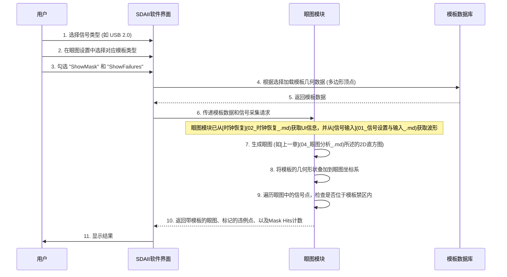

# Chapter 5: 眼图模板测试


在上一章 [眼图分析](04_眼图分析_.md) 中，我们学会了如何通过观察眼图的“眼睛”形状来直观地评估信号的健康状况。眼图为我们提供了一个整体的信号质量快照，但有时候，我们还需要一个更客观、更标准化的方法来判断信号是否“合格”，尤其是在需要确保信号符合特定通信标准（如USB、PCI Express等）的场景下。这时，“眼图模板测试”就派上用场了。

## 什么是眼图模板测试？为什么它如此重要？

想象一下，您正在生产一批精密零件，每个零件都需要符合非常严格的尺寸和形状标准。您会怎么做呢？您可能会使用一个标准形状的“模板”或“卡尺”，将每个零件都用这个模板去比对一下。如果零件能够完美地嵌入模板的轮廓，或者不触碰到模板的禁止区域，那么它就是合格的。

**眼图模板测试 (Eye Mask Testing)** 的原理与此非常相似。根据我们前面提供的概念描述：
> 眼图模板测试是在眼图上覆盖一个预先定义好的“禁止区域”轮廓（模板），用以判断信号波形是否符合特定通信标准的要求。如果信号的任何部分触碰到了这个禁止区域，就意味着测试可能不通过。这就像用一个标准形状的尺子去检查产品，快速判断其是否合格。

简单来说，眼图模板就是画在眼图显示区域的一个或多个多边形区域。这些区域定义了信号波形**不应该**进入的“禁区”。如果眼图中的任何信号轨迹触碰或者进入了这些禁区，就称为“模板违例 (Mask Violation)” 或 “模板命中 (Mask Hit)”，表明信号可能不符合规范。

**核心用例**：假设您正在调试一个高速串行总线（比如 SATA 硬盘接口）的信号。该总线的标准规范中通常会定义一个眼图模板。您需要使用这个标准模板来测试您的信号，以确保它产生的眼图“足够干净”，没有任何部分侵入模板的禁止区域。只有通过了模板测试，才能保证您的设备能够与其他符合该标准的设备可靠通信。

一个“健康”的信号，其眼图应该完全处于模板的“安全区域”内，如下图所示（概念图）：

```mermaid
graph LR
    subgraph "眼图与模板"
        M1---M2---M3---M4---M5---M6---M1 % 模板六边形轮廓
        M2---M7
        M6---M7
        
        % 模拟眼图轨迹 (应该在模板内部)
        E1---E2---E3---E4---E1
        E5---E6---E7---E8---E5
        E2---E6
        E4---E8

        style M1 fill:#ccc,stroke:#f00,stroke-width:2px,opacity:0.3
        style M2 fill:#ccc,stroke:#f00,stroke-width:2px,opacity:0.3
        style M3 fill:#ccc,stroke:#f00,stroke-width:2px,opacity:0.3
        style M4 fill:#ccc,stroke:#f00,stroke-width:2px,opacity:0.3
        style M5 fill:#ccc,stroke:#f00,stroke-width:2px,opacity:0.3
        style M6 fill:#ccc,stroke:#f00,stroke-width:2px,opacity:0.3
        style M7 fill:#ccc,stroke:#f00,stroke-width:2px,opacity:0.3
        
        % 将模板区域涂色，表示“禁止区域”
        %% Mermaid 不直接支持区域填充，这里用虚线框和颜色示意
        %% 真正的模板是实心的禁止区域

        style E1 fill:#fff,stroke:#333,stroke-width:0px
        style E2 fill:#fff,stroke:#333,stroke-width:0px
        style E3 fill:#fff,stroke:#333,stroke-width:0px
        style E4 fill:#fff,stroke:#333,stroke-width:0px
        style E5 fill:#fff,stroke:#333,stroke-width:0px
        style E6 fill:#fff,stroke:#333,stroke-width:0px
        style E7 fill:#fff,stroke:#333,stroke-width:0px
        style E8 fill:#fff,stroke:#333,stroke-width:0px

        P1["模板 (禁止区域)"] --> M1
        P2["眼图信号"] --> E2
        
        label1[眼图通过模板测试]
        style label1 fill:#fff,stroke-width:0px,font-size:12px
    end
    
    linkStyle 0 stroke-width:2px,stroke:red;
    linkStyle 1 stroke-width:2px,stroke:red;
    linkStyle 2 stroke-width:2px,stroke:red;
    linkStyle 3 stroke-width:2px,stroke:red;
    linkStyle 4 stroke-width:2px,stroke:red;
    linkStyle 5 stroke-width:2px,stroke:red;
    linkStyle 6 stroke-width:2px,stroke:red;
    
    linkStyle 7 stroke-width:2px,stroke:blue;
    linkStyle 8 stroke-width:2px,stroke:blue;
    linkStyle 9 stroke-width:2px,stroke:blue;
    linkStyle 10 stroke-width:2px,stroke:blue;
    linkStyle 11 stroke-width:2px,stroke:blue;
    linkStyle 12 stroke-width:2px,stroke:blue;
    linkStyle 13 stroke-width:2px,stroke:blue;
    linkStyle 14 stroke-width:2px,stroke:blue;
```
如果信号质量差，眼图可能会触碰到模板的边缘，甚至穿过模板，这意味着测试失败。

## 如何在SDAII中进行眼图模板测试？

SDAII软件提供了便捷的眼图模板测试功能。通常，这些设置位于我们上一章接触到的“眼图测量设置” (`EyeMeasure Dialog`) 对话框及其相关的子对话框中。

让我们参考操作手册 `Operator's Manual SDAIISoftware.txt` 来了解如何配置：

1.  **选择并加载模板 (Mask Type)**:
    *   首先，您需要告诉SDAII要使用哪个标准模板。在SDAII主对话框中，点击 `Setup Eye Measurements` (设置眼图测量) 进入 `EyeMeasure Dialog` (眼图测量对话框)。
    *   在该对话框的 `Masks` (模板)区域 (手册第17页)，您会找到 `Mask Type` (模板类型) 这个选项。
    *   点击 `Mask Type`，会弹出一个列表，其中包含了SDAII支持的各种通信标准的预定义模板 (例如 USB 2.0, PCI Express Gen3, SATA 等)。
        *   **小提示**：还记得在 [第 1 章：信号设置与输入](01_信号设置与输入_.md) 中，我们选择了 `Signal Type` (信号类型) 吗？SDAII非常智能，当您选择了特定的信号类型后，它通常会自动在 `Mask Type` 中预选一个对应的标准模板 (手册第7页 "Signal Types" 和第19页 "MaskTesting" 均有提及)。
        *   如果您的信号不属于任何标准，或者您想使用自定义模板，SDAII也可能支持加载用户定义的模板文件 (手册第19页提到模板存储在 `EyeMaskProps.mdf` 数据库中，可以通过 `MaskDatabase Editor` 编辑)。对于初学者，我们通常选用预定义的标准模板。

2.  **设置模板裕量 (Mask Margin)** (可选):
    *   在 `Masks` (模板) 区域，您可能还会看到 `X` 和 `Y` 方向的 `Margin` (裕量) 设置 (手册第18页)。
    *   模板裕量允许您在标准模板的基础上，对其进行收缩或扩展。
        *   设置一个**正百分比**的裕量，会使模板的禁止区域向内收缩 (即“尺子”变小了)，从而使测试标准**更宽松**。
        *   设置一个**负百分比**(如果支持)或通常是**将X, Y值设为大于0%** (根据手册描述 “As you enlarge the mask's margin...bringing the mask closer to the crossing points...This reduces the amount of jitter that can still pass” p.18)，这意味着模板的禁止区域向外扩展或向中心靠拢 (即“尺子”变大了，或者说标准更严格了)，信号需要有更好的质量才能通过。
    *   对于标准的符合性测试，通常将裕量设置为0%，即使用原始的标准模板。在研发阶段，工程师可能会调整裕量来评估信号的鲁棒性。

3.  **显示模板和违例点 (ShowMask, ShowFailures)**:
    *   配置好模板类型和裕量后，我们需要在眼图上实际显示出这个模板，并高亮显示任何违例点。
    *   这通常在 `EyeDiagram Configuration Dialog` (眼图配置对话框) 中设置 (手册第19页)，该对话框可以从 `EyeMeasure Dialog` 中进入。
        *   勾选 `ShowMask` (显示模板) 复选框，模板的轮廓就会叠加显示在眼图上。
        *   勾选 `ShowFailures` (显示失败/违例) 复选框。如果信号的任何部分触碰了模板的禁止区域，这些“命中点”会以醒目的颜色（例如红色）标记出来。

4.  **查看测试结果 (Mask Hits 参数)**:
    *   除了视觉上的判断，SDAII还会提供量化的测试结果。
    *   在 `EyeParameters Dialog` (眼图参数对话框) 中 (手册第21页)，您可以找到并启用 `Mask Hits` (模板命中数) 这个参数 (手册第23页)。
    *   `Mask Hits` 会统计在采集到的所有数据中，信号轨迹触碰到模板禁止区域的总次数。如果 `Mask Hits` 为0，则表示信号通过了模板测试。任何大于0的计数值都表示测试失败。
    *   还有一个相关的参数是 `Mask Out` (模板未命中数)，它表示落在模板安全区域内的样本数量。

下面是一个简化的SDAII眼图模板测试设置流程示意：

```
SDAII 主对话框:
  ...
  [☑] Enable Eye Meas. (启用眼图测量) --> 点击 [Setup Eye Measurements] (设置眼图测量)

眼图测量设置 (EyeMeasure Dialog):
  Eye Modes:
    Mode: [ SingleEye ▼ ] (或其他适用模式)
  Masks (模板):
    Mask Type: [ USB 2.0 HS ▼ ] (选择合适的标准模板)
    X Margin: [ 0 ] % (X方向裕量)
    Y Margin: [ 0 ] % (Y方向裕量)
    [ ] Margin only center area (仅中心区域应用裕量)
  ...

  (右侧或子对话框) 眼图配置 (EyeDiagram Configuration Dialog):
    [☑] ShowEye (显示眼图)
    [☑] ShowMask (显示模板)
    [☑] ShowFailures (显示失败/违例点)
    EyeStyle: [ Color-graded ▼ ]
    ...

  (右侧或子对话框) 眼图参数 (EyeParameters Dialog):
    显示参数:
      ...
      [☑] Mask Hits (模板命中数)
      [☑] Mask Out (模板未命中数)
      ...
```
*(这是一个基于文本的示意图，实际SDAII界面会是图形化的)*

完成这些设置后，当SDAII处理信号数据并显示眼图时，您会看到模板叠加在眼图上。如果信号有任何部分进入了模板的“红色禁区”，这些点会被高亮，并且 `Mask Hits` 参数会显示一个非零值。

## 眼图模板的内部机制

那么，SDAII内部是如何实现眼图模板测试的呢？

1.  **模板的定义与存储**:
    *   眼图模板本质上是由一系列坐标点（顶点）定义的一个或多个多边形。这些多边形构成了“禁止进入”的区域。
    *   这些模板的定义信息（坐标、适用的比特率等）通常存储在一个数据库文件中。手册第19页提到SDAII使用 `EyeMaskProps.mdf` 文件，并且可以通过 `MaskDatabase Editor` 工具进行编辑。
    *   模板可以是“**绝对模板 (Absolute masks)**”或“**归一化模板 (Normalized masks)**” (手册第19页)。
        *   **绝对模板**: 其坐标单位是实际的电压值 (如伏特 V) 和时间值 (如皮秒 ps)。这种模板对示波器的垂直和水平刻度设置很敏感。
        *   **归一化模板**: 其坐标单位是相对于眼图的逻辑高电平、低电平以及单位间隔 (UI) 的百分比或比例。这种模板更具通用性，不太受具体电压摆幅的影响。例如，一个归一化模板可能定义其上边界在眼图逻辑“1”电平的80%处，下边界在逻辑“0”电平的20%处，宽度为0.7 UI等。

2.  **眼图的生成**:
    *   正如我们在 [第 4 章：眼图分析](04_眼图分析_.md) 中学到的，SDAII首先通过[时钟恢复](02_时钟恢复_.md)获得精确的UI边界，然后将长数据记录分割成许多UI段，并将它们叠加起来形成一个二维的“命中率直方图”或“持久性图”。每个像素记录了信号轨迹穿过它的次数。

3.  **模板叠加与碰撞检测**:
    *   软件将选定的模板（根据其坐标定义）“画”在眼图的同一显示平面上。
    *   然后，SDAII会检查眼图中的每一个有信号轨迹存在的点（即直方图中计数不为零的像素），判断这个点是否落在了模板定义的“禁止区域”内。
    *   如果任何一个眼图上的信号点位于模板的禁止区域内，就被记录为一次“模板命中 (Mask Hit)”。

4.  **结果呈现**:
    *   `ShowMask` 选项使得模板的轮廓可见。
    *   `ShowFailures` 选项会将所有检测到的“命中点”用特殊颜色标记出来。
    *   `Mask Hits` 参数会累加所有采集周期内的总命中次数。

下面是一个简化的序列图，展示了这个过程：



可以把这个过程想象成：您先用很多墨水点画出了一幅“眼睛”的图案（眼图），然后拿一个中间镂空的标准形状的卡纸（模板）盖在图案上。如果墨水点有任何部分从卡纸的镂空区域（安全区）溢出到了卡纸本身覆盖的区域（禁区），那么就说明您的图案“不合格”。SDAII软件做的就是这个精确的“比对”工作。

## 总结

在本章中，我们学习了**眼图模板测试**，这是评估数字信号是否符合标准的一个重要方法：
*   眼图模板定义了一个信号波形不应进入的**“禁止区域”**。
*   如果信号轨迹触碰到模板，则测试**可能不通过**，表明信号质量存在问题。
*   我们了解了如何在SDAII中**选择和加载模板** (通常基于信号类型)，如何设置**模板裕量**，以及如何**显示模板和违例点**。
*   关键的输出是视觉上的模板叠加图和量化的 `Mask Hits` (模板命中数) 参数。
*   其内部机制包括加载模板的几何定义，生成眼图的2D直方图，然后进行**碰撞检测**，判断信号点是否落入模板禁区。

眼图模板测试为我们提供了一个客观、可重复的标准来衡量信号的质量。通过模板测试，我们可以更有信心地判断一个设计是否满足通信规范的要求。

然而，眼图和模板测试主要关注信号的幅度和整体形状。对于信号在时间轴上的晃动——也就是抖动——我们需要更专门的分析方法。

在下一章，我们将深入探讨信号质量的另一个关键方面：[第 6 章：抖动分析](06_抖动分析_.md)。

---

Generated by [AI Codebase Knowledge Builder](https://github.com/The-Pocket/Tutorial-Codebase-Knowledge)