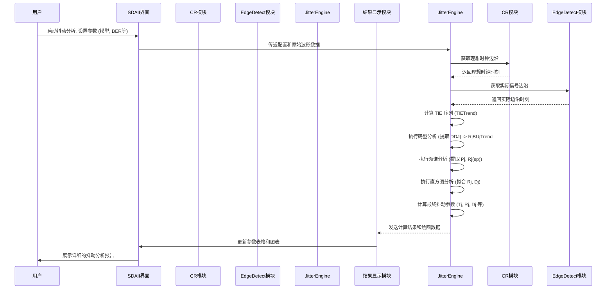

# Chapter 6: 抖动分析


在上一章 [眼图模板测试](05_眼图模板测试_.md) 中，我们学习了如何使用标准模板来客观地判断信号眼图是否合格。眼图模板为我们提供了一个“是”或“否”的快速判断。然而，当信号不合格，或者我们想更深入地理解信号在时间轴上的不稳定性时，我们就需要进行更精细的分析——这就是本章的主题：抖动分析。

## 什么是抖动？为什么它如此重要？

还记得我们之前提到的概念吗？
> 抖动指的是数字信号在理想时间点上发生的微小“晃动”或“提前/延迟”。想象一位鼓手，如果他每次敲鼓的时间点都有点小偏差，那就是抖动。

在高速数字通信中，数据以极快的速度传输。如果“鼓点”（数字信号的边沿）不够准时，接收端就可能在错误的时间点去读取数据，把“1”误判为“0”，或者把“0”误判为“1”，从而导致数据传输错误。

**核心用例**：假设您正在设计一个用于数据中心的高速服务器组件，它需要通过一条极快的串行链路（比如PCI Express或以太网）与其他部件通信。为了确保数据能够准确无误地高速传输，您必须严格控制信号的抖动。SDAII的抖动分析功能就能帮助您：
1.  精确测量出信号中存在的各种抖动。
2.  将抖动分解成不同的组成部分，从而找出抖动的主要来源。
3.  预测在给定的抖动水平下，系统可能发生的误码率 (Bit Error Rate, BER)。

理解并控制抖动，对于保证高速数据链路的可靠性至关重要。

## 抖动的关键概念

在我们开始使用SDAII进行抖动分析之前，先来了解一些关于抖动的核心概念。

### 1. 时间间隔误差 (Time Interval Error, TIE)

这是抖动测量的基础。**时间间隔误差 (TIE)** 指的是数字信号的实际边沿到达时间，与其期望的理想到达时间之间的差异。
*   **理想时间**: 由[时钟恢复](02_时钟恢复_.md)系统（通常是[锁相环 (PLL)](03_锁相环__pll__.md)）根据数据的平均比特率“预测”出来的每个比特应该开始或结束的精确时刻。
*   **实际时间**: 信号边沿真正穿过[判决电平](01_信号设置与输入_.md)的时刻。

如果一个边沿比理想时间来得早，TIE就是负值；如果来得晚，TIE就是正值。SDAII会测量一长串数据中每一个边沿的TIE值，形成一个TIE数据序列，这个序列就是后续所有抖动分析的基础。

### 2. 抖动的分解 (Jitter Components)

抖动并不是单一的现象，它可以根据其特性和来源分解为不同的组成部分。理解这些组成部分有助于我们诊断抖动的根本原因。SDAII的核心功能之一就是进行这种抖动分解。

```mermaid
graph TD
    Tj[总抖动 (Tj)] --> Rj[随机抖动 (Rj)];
    Tj --> Dj[确定性抖动 (Dj)];
    Dj --> Pj[周期性抖动 (Pj)];
    Dj --> DDj[数据相关抖动 (DDJ)];
    DDj --> ISI[码间干扰 (ISI)];
    DDj --> DCD[占空比失真 (DCD)];

    style Tj fill:#f9f,stroke:#333,stroke-width:2px
    style Rj fill:#lightgrey,stroke:#333,stroke-width:2px
    style Dj fill:#bbf,stroke:#333,stroke-width:2px
    style Pj fill:#ccf,stroke:#333,stroke-width:2px
    style DDj fill:#ccf,stroke:#333,stroke-width:2px
    style ISI fill:#ddf,stroke:#333,stroke-width:2px
    style DCD fill:#ddf,stroke:#333,stroke-width:2px
```

*   **总抖动 (Total Jitter, Tj)**:
    *   信号在特定误码率 (BER) 下可能出现的最大时间偏差（峰峰值）。例如，Tj @ 10<sup>-12</sup> BER 表示在一万亿个比特中，预计由于抖动导致错误的最大时间窗口。
    *   它是我们最关心的总体指标，因为它直接关系到系统能否可靠工作。

*   **随机抖动 (Random Jitter, Rj)**:
    *   **特性**: 无界的、不可预测的抖动，通常具有高斯分布（像钟形曲线）。
    *   **来源**: 主要由电路中的热噪声、散粒噪声等随机物理过程引起。
    *   **比喻**: 想象鼓手非常专注，但偶尔一阵微风吹过，轻轻地影响了他的鼓槌，导致一些微小且无法预测的偏差。
    *   Rj通常用均方根 (RMS) 值表示。虽然Rj本身是无界的，但它对Tj的贡献会随着误码率要求的降低而增加。

*   **确定性抖动 (Deterministic Jitter, Dj)**:
    *   **特性**: 有界的、可预测或具有特定模式的抖动。
    *   **来源**: 由系统中的特定因素造成，例如码间干扰、电源噪声耦合、串扰等。
    *   **比喻**: 鼓手可能有一些固定的坏习惯，比如在敲某个特定节奏组合时总是会快一点或慢一点。
    *   Dj 通常用峰峰值 (pk-pk) 表示。确定性抖动可以进一步细分为：

    *   **数据相关抖动 (Data-Dependent Jitter, DDJ)**:
        *   **特性**: 抖动的大小和模式取决于传输的数据序列。
        *   **来源**:
            *   **码间干扰 (Inter-Symbol Interference, ISI)**: 前一个比特的残留能量影响了当前比特的判决。例如，一长串“0”之后紧跟一个“1”，这个“1”的边沿可能会因为之前的“0”而发生偏移。比喻：鼓手在演奏一串快速的鼓点后，紧接着的一个重音可能会因为前面的动作惯性而稍微不准。
            *   **占空比失真 (Duty Cycle Distortion, DCD)**: 逻辑“1”的脉冲宽度与逻辑“0”的脉冲宽度不一致（对于理想的50%占空比信号而言）。比喻：鼓手敲击鼓面的持续时间与他抬起鼓槌的休息时间不成比例。
        *   DDJ通常与传输线的带宽限制、阻抗不匹配等因素有关。

    *   **周期性抖动 (Periodic Jitter, Pj)**:
        *   **特性**: 抖动呈现周期性变化，即以某个特定频率重复出现。
        *   **来源**: 通常由周期性的干扰源引起，例如开关电源的噪声、时钟信号的串扰、或者某些电路的振荡。
        *   **比喻**: 想象表演场地旁边有一台机器，它发出规律的震动，每隔一段时间就干扰一下鼓手，导致他的鼓点也出现周期性的偏差。

### 3. 抖动可视化工具

SDAII提供多种图形化工具来帮助我们理解抖动：

*   **抖动趋势图 (TIE Track / Jitter Track)**:
    *   将每个边沿的TIE值按时间顺序绘制出来。这可以直观地显示抖动随时间的变化情况，有助于发现低频漂移或周期性成分。

*   **抖动直方图 (Jitter Histogram)**:
    *   统计TIE值在不同时间偏差区间的出现次数。
    *   对于高斯分布的Rj，直方图会呈现钟形。
    *   Dj成分则可能使直方图出现多个峰值或不对称的尾部。
    *   SDAII通常会显示TIE直方图（包含所有抖动）和Rj+BUj直方图（移除了DDJ之后的抖动）。

*   **抖动频谱 (Jitter Spectrum)**:
    *   对TIE数据进行快速傅里叶变换 (FFT)，得到抖动在频域上的分布。
    *   频谱图中的尖峰通常对应周期性抖动 (Pj) 的频率及其谐波。这有助于找出Pj的干扰源。

*   **浴缸曲线 (Bathtub Curve)**:
    *   显示误码率 (BER) 与采样时刻相对于理想位置的偏移之间的关系。
    *   曲线的形状像一个浴缸，中间平坦的部分表示在该时间窗口内采样可以获得较低的误码率。曲线越宽，系统的时序容限越大。
    *   浴缸曲线是根据抖动模型（Rj和Dj）外推得到的，用于预测在极低误码率下的总抖动 (Tj)。

## 如何在SDAII中进行抖动分析？

现在我们对抖动的基本概念有了一些了解，让我们看看如何在SDAII软件中进行抖动分析。

1.  **启用抖动测量**:
    *   在SDAII的主分析流程图中，找到并勾选 "Enable Jitter Meas." (启用抖动测量) 复选框。
    *   然后，点击 "Setup Jitter Measurements" (设置抖动测量) 按钮，这将打开抖动测量的主设置对话框 (`JitterMeasure Dialog`)。(参考手册第3页, 第26页)

     *(请注意: 此处为概念图链接占位符)*

2.  **抖动测量设置 (`JitterMeasure Dialog` 及相关子对话框)**:
    `JitterMeasure Dialog` (手册第26页) 本身就是一个流程图，展示了抖动分析的各个步骤。点击流程图中的模块可以配置相应的参数。

    *   **核心参数设置 (通常在 `JitterParameters` 对话框中，手册第35页)**:
        *   **抖动模型 (Jitter Model / Fit)**: SDAII使用数学模型来从测量的TIE数据中分离Rj和Dj。常用的模型是 `Dual-Dirac NQ-Scale`。
            *   `Dual-Dirac NQ-Scale`: 一种基于直方图尾部拟合的方法，对各种类型的抖动都有较好的鲁棒性。通常是初学者的好选择。
            *   `Dual-Dirac Spectral`: 基于频谱分析来确定Rj，然后拟合Dj。在某些情况下收敛更快，但可能对特定类型的Dj（如串扰）不太准确。
            选择哪个模型会影响Rj和Dj的分解结果。对于初学者，可以先使用默认的 `NQ-Scale`。
        *   **目标误码率 (Log10BER)**: 设置您关心的误码率水平，例如 `1E-12` (即10<sup>-12</sup>)。总抖动 (Tj) 是在该BER下计算的。
        *   **要显示的抖动参数**: 在这里勾选您希望SDAII计算并显示的具体抖动参数，例如：
            *   `Tj @ BER` (总抖动)
            *   `Rj` (随机抖动 RMS)
            *   `Dj (d-d)` (确定性抖动 峰峰值)
            *   `Pj (pk-pk)` (周期性抖动 峰峰值)
            *   `DDJ` (数据相关抖动)
            *   `ISI` (码间干扰)
            *   `DCD` (占空比失真)

    *   **查看抖动趋势图 (在 `JitterTrack` 对话框中，手册第30页)**:
        *   勾选 `ShowTIETrack` 来显示原始的时间间隔误差随时间变化的曲线。
        *   还可以显示 `ShowRjBUjTrack` (移除了DDJ后的抖动趋势) 和 `ShowPLLTrack` (PLL跟踪的抖动)。

    *   **查看抖动直方图 (在 `JitterHistogram Analysis` 对话框中，手册第34页)**:
        *   勾选 `ShowTIEHistogram` 来显示包含所有抖动成分的TIE直方图。
        *   勾选 `ShowRj+BUjHistogram` 来显示移除了DDJ后的抖动直方图。
        *   `ShowQ-Fit for RjBUj` 可以显示用于拟合高斯尾部的Q标度图，有助于评估Rj。
        *   `ShowBathtub` 可以显示浴缸曲线。

    *   **查看抖动频谱 (在 `JitterSpectrum` 对话框中，手册第31页)**:
        *   勾选 `ShowRjBUjSpectrum` 来显示抖动的频谱图（通常已移除DDJ）。
        *   `ShowPeakThreshold` 和 `ShowPeaks` 可以帮助识别频谱中的显著峰值，这些通常对应Pj。
        *   `ShowPjInv.FFT` 可以将识别出的Pj峰值转换回时域波形，帮助观察Pj的形态。

    *   **码型分析 (在 `PatternAnalysis` 对话框中，手册第29页)**:
        *   这个模块用于分析和量化数据相关抖动 (DDJ)。
        *   如果您的信号包含重复码型，SDAII可以尝试自动找到它 (`FindPattern`)。
        *   勾选 `ShowDDjPlot` 可以显示每个码型转换对平均TIE的影响。
        *   `ShowISIPlot` 可以显示一个移除了随机噪声和抖动的平均眼图，更清晰地揭示ISI。

    下面是一个简化的SDAII抖动分析设置流程示意图：

    ```
    SDAII 主对话框:
      ...
      [☑] Enable Jitter Meas. (启用抖动测量) --> 点击 [Setup Jitter Measurements] (设置抖动测量)

    抖动测量主对话框 (JitterMeasure Dialog - 这是一个流程图):
      [TIETrend (背景计算)] --> [JitterFilter (可选)] --> [PatternAnalysis] --> [JitterTrack] --> [JitterSpectrum] --> [JitterHistogram] --> [JitterParameters]
      (点击每个方块进入对应设置)

    例如，点击 [JitterParameters] 进入参数设置:
      Jitter Parameters Dialog:
        Fit: [ Dual-Dirac NQ-Scale ▼ ] (选择抖动模型)
        Log10BER: [ -12 ] (目标误码率 10^-12)
        显示参数:
          [☑] ShowTj
          [☑] ShowRj
          [☑] ShowDjdd
          [☑] ShowPj
          [☑] ShowDDj
          [☑] ShowISI
          [☑] ShowDCD
          ...

    例如，点击 [JitterSpectrum] 进入频谱设置:
      Jitter Spectrum Dialog:
        [☑] ShowRjBUjSpectrum
        [☑] ShowPeakThreshold
        [☑] ShowPeaks
        ...
    ```
    *(这是一个基于文本的示意图，实际SDAII界面是图形化的，并且包含更多选项)*

    完成这些设置后，SDAII会处理采集到的长波形数据，进行复杂的计算和分解，最终在表格中显示出各项抖动参数的值，并绘制出相关的趋势图、直方图和频谱图。

## 抖动分析的内部机制 (简单一瞥)

SDAII的抖动分析是一个复杂的过程，但我们可以将其简化为几个主要步骤。手册的第26-35页详细描述了这些内容。

1.  **前提：精确的时钟恢复与边沿检测**:
    *   首先，SDAII必须从输入信号中恢复出一个精确的参考时钟。这在 [时钟恢复](02_时钟恢复_.md) 章节中讨论过，核心是 [锁相环 (PLL)](03_锁相环__pll__.md)。这个恢复时钟定义了每个比特的理想时间边界。
    *   然后，SDAII需要精确检测到输入信号的每一个实际边沿（0到1或1到0的跳变）发生的时间。这依赖于在 [信号设置与输入](01_信号设置与输入_.md) 中设定的判决电平，并通常使用内插算法来提高时间精度。

2.  **计算时间间隔误差 (TIE) 趋势**:
    *   对于每一个检测到的实际边沿，SDAII计算其与对应理想时钟边沿的时间差，这就是TIE值。
    *   所有这些TIE值按时间顺序排列，形成一个**TIE趋势 (TIETrend)**。这是所有后续抖动分析的原始数据。(手册第26页)

3.  **抖动分解过程 (根据手册第26-27页的流程)**:
    *   **(可选) 抖动滤波 (`JitterFilter`)**: 用户可以对TIE趋势应用一个数字带通滤波器，以关注特定频段的抖动或滤除某些不希望的成分。
    *   **码型分析 (`PatternAnalysis`) 与DDJ提取**:
        *   软件尝试识别数据中的重复码型。
        *   对于每种独特的码型转换（例如，从比特序列`010`到`1`的边沿，和从`110`到`1`的边沿），计算其平均TIE值。这些平均TIE值与总体平均TIE的偏差就是数据相关抖动 (DDJ) 的一部分。
        *   从原始TIE趋势中减去这些与码型相关的平均偏移，得到一个“净化”后的抖动趋势，称为 **`RjBUjTrend`** (随机抖动 + 有界不相关抖动趋势)。这里BUj主要是指周期性抖动Pj。
    *   **抖动跟踪图 (`JitterTrack`)**: `TIETrend` 和 `RjBUjTrend` 可以被绘制成时间序列图。
    *   **抖动频谱分析 (`JitterSpectrum`)**:
        *   对 `RjBUjTrend` (或原始 `TIETrend`，取决于配置) 进行FFT变换，得到抖动频谱。
        *   通过设定阈值来识别频谱中的显著峰值，这些峰值被认为是周期性抖动 (Pj)。可以对这些峰值进行逆FFT (PjInvFFT) 来观察Pj在时域的波形。
        *   频谱的“基底噪声”部分被用来估算随机抖动的一个分量 `Rj(sp)` (频谱法Rj)。
    *   **抖动直方图分析 (`JitterHistogram Analysis`)**:
        *   为 `TIETrend` 和 `RjBUjTrend` 分别创建直方图。
        *   使用选定的抖动模型 (如 `Dual-Dirac NQ-Scale`) 对 `RjBUjHistogram` 的尾部进行拟合，以分离出随机抖动 (Rj) 的高斯分布和确定性抖动 (Dj) 的有界分布。
    *   **抖动参数计算 (`JitterParameters`)**:
        *   根据上述分解结果，计算出最终的Tj, Rj, Dj, Pj, DDJ, ISI, DCD 等参数。
        *   Tj通常是通过将Rj的概率密度函数 (PDF) 与Dj的PDF进行卷积，然后找到对应目标BER的宽度来外推得到的。

下面是一个简化的抖动分析流程的序列图：



这个过程就像一位经验丰富的侦探在分析一桩复杂的案件。侦探首先收集所有线索（TIE数据），然后根据线索的性质进行分类（DDJ, Pj），排除一些固定模式的干扰，最后通过统计分析和模型拟合（直方图和频谱分析）来找出主要的“罪犯”（Rj和残余的Dj），并评估总体风险（Tj）。

SDAII软件通过其复杂的算法和模型，自动化了这个“侦破”过程，为工程师提供了强大而深入的抖动洞察能力。

## 总结

在本章中，我们深入探讨了**抖动分析**这一高级主题：
*   我们理解了**抖动**是对高速数字信号质量至关重要的时间不稳定性。
*   学习了抖动的核心概念，包括**时间间隔误差 (TIE)**，以及抖动的主要组成部分：**总抖动 (Tj)**、**随机抖动 (Rj)** 和 **确定性抖动 (Dj)**（包括其子类 **DDJ, ISI, DCD, Pj**）。
*   我们了解了SDAII中用于抖动分析的各种可视化工具，如**抖动趋势图、直方图、频谱图和浴缸曲线**。
*   我们熟悉了在SDAII中进行抖动分析的基本设置步骤，包括启用测量、选择**抖动模型**、设定**目标BER**，以及查看和解读各种**抖动参数和图表**。
*   我们还对SDAII进行抖动分析的复杂**内部机制**（TIE计算、抖动分解、模型拟合）有了初步的了解。

抖动分析是确保高速数字系统稳定可靠运行的关键环节。通过SDAII提供的强大工具，工程师可以有效地测量、理解和诊断信号抖动问题，从而优化设计，提高产品质量。

---

至此，我们已经完成了 `pdfs` 项目（SDAII软件）入门教程的所有章节。从最初的[信号设置与输入](01_信号设置与输入_.md)，到[时钟恢复](02_时钟恢复_.md)和[锁相环 (PLL)](03_锁相环__pll__.md)的原理，再到直观的[眼图分析](04_眼图分析_.md)和客观的[眼图模板测试](05_眼图模板测试_.md)，最后到本章深入的抖动分析，您已经对使用SDAII进行串行数据分析的核心流程和关键概念有了全面的了解。

希望这个系列教程能够帮助您入门串行数据分析的世界。实践是最好的老师，请打开您的SDAII软件，动手尝试分析一些真实的信号吧！随着经验的积累，您会越来越熟练地运用这些工具来解决实际工程问题。祝您在数据分析的旅程中不断进步！

---

Generated by [AI Codebase Knowledge Builder](https://github.com/The-Pocket/Tutorial-Codebase-Knowledge)