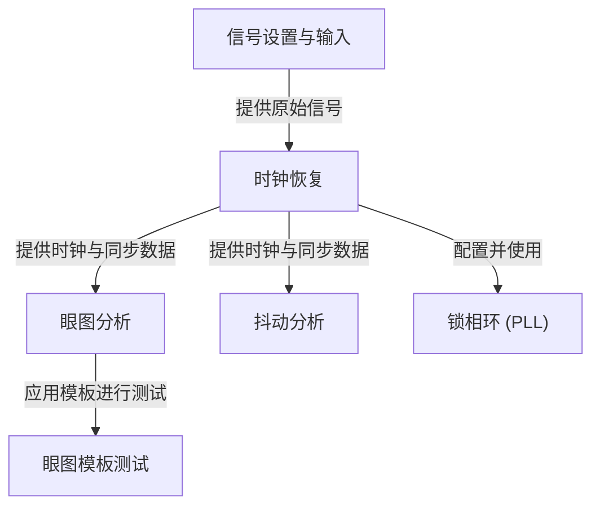

# Tutorial: pdfs

SDAII 软件是一款用于分析高速串行数字信号的专业工具。
它帮助工程师评估信号质量，首先通过对原始信号进行 **时钟恢复** 来精确提取数据传输的“节拍”，这一过程常利用 *锁相环 (PLL)* 进行优化。
基于恢复的时钟和同步后的数据，软件可以进行 **眼图分析**，生成直观的“眼睛”图形来展示信号的整体健康状况，并可在此基础上执行 *眼图模板测试* 以确保信号符合特定标准。
同时，软件还能执行 **抖动分析**，量化信号在时间上的微小“晃动”，帮助诊断潜在问题。所有分析都始于用户对输入信号的正确*信号设置与输入*。

**Source Repository:** [None](None)

## Chapters

1. [信号设置与输入
](01_信号设置与输入_.md)
2. [时钟恢复
](02_时钟恢复_.md)
3. [锁相环 (PLL)
](03_锁相环__pll__.md)
4. [眼图分析
](04_眼图分析_.md)
5. [眼图模板测试
](05_眼图模板测试_.md)
6. [抖动分析
](06_抖动分析_.md)

---

Generated by [AI Codebase Knowledge Builder](https://github.com/The-Pocket/Tutorial-Codebase-Knowledge)