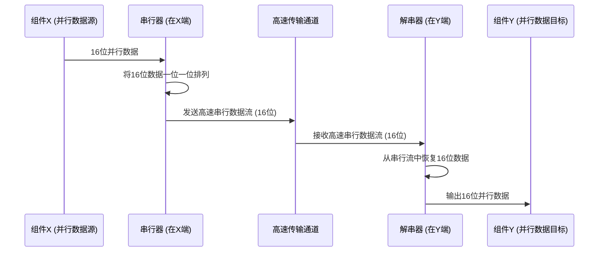

# Chapter 1: 串行器/解串器 (SerDes)


欢迎来到 `Serializer_Deserializer_Component_Design` 项目的教程！在本章中，我们将一起探索电子系统中一个非常重要且有趣的概念：“串行器/解串器”，通常简称为 SerDes。

## 为什么需要 SerDes？—— 一个高速公路的例子

想象一下，在我们的电脑、手机或者任何现代电子设备内部，有海量的数据需要从一个地方快速传输到另一个地方。比如，CPU 需要把处理好的图像数据显示到屏幕上，或者硬盘需要把电影数据读取到内存中播放。

如果我们要传输很多数据位（比如 64 位），一个直接的想法是为每一位数据都铺设一条“车道”（物理线路）。这就像一个拥有 64 条车道的并行公路。在低速情况下，这或许可行。但当数据传输速度越来越快时，问题就来了：

1.  **空间占用大**：64 条线路会占用电路板上大量的空间，芯片也需要很多引脚来连接这些线路。
2.  **布线复杂**：这么多线挤在一起，很容易互相干扰，导致信号质量下降。
3.  **同步困难**：在极高的速度下，要保证所有 64 条“车道”上的数据同时到达目的地，非常困难。任何微小的延迟差异都会导致数据错乱。

那么，有没有更好的办法呢？这就是 SerDes 发挥作用的地方！

**SerDes (串行器/解串器)** 就像一个“双向翻译官”。它能把多条并行的数据“车道”在发送时合并成一条（或几条）高速的串行“单行道”进行传输，然后在接收端再把这条“单行道”的数据恢复（解串）成原来的多条并行“车道”。

这样做的好处显而易见：
*   **显著减少所需的物理连接线数量和芯片引脚**：从 64 条车道变成 1 条车道，大大节省了空间。
*   **节省电路板空间**：线路少了，电路板可以做得更小巧。
*   **有助于在高速下保持信号质量**：管理一条高速单行道比管理多条并行车道更容易控制信号干扰和同步问题。

## SerDes 的核心组成

一个完整的 SerDes 系统主要包含两个部分：串行器（Serializer）和解串器（Deserializer）。

### 1. 串行器 (Serializer)

**串行器**位于数据发送端。它的主要工作是将并行数据转换成串行数据。

*   **功能**：接收多路并行输入的数据位。
*   **处理**：按照一定的顺序，一位接一位地将这些并行数据发送到一个单一的高速输出通道上。
*   **类比**：想象一个繁忙路口的交通协管员，他指挥着来自多个方向的车流（并行数据）有序地、一辆接一辆地进入一条快速路（串行数据流）。

```mermaid
graph LR
    subgraph 串行器 (Serializer)
        P_In1[并行数据输入 A] --> MUX
        P_In2[并行数据输入 B] --> MUX
        P_InN[并行数据输入 ...] --> MUX
        MUX[并行转串行模块 PISO] -- 发送时钟驱动 --> S_Out[串行数据输出 (A, B, ...)]
    end
```
上图简单展示了串行器的概念：多个并行数据线进入一个“并行转串行模块”（通常基于移位寄存器 PISO），然后输出单条串行数据线。

### 2. 解串器 (Deserializer)

**解串器**位于数据接收端。它的任务正好与串行器相反，是将串行数据转换回并行数据。

*   **功能**：接收来自单一高速输入通道的串行数据位。
*   **处理**：按照发送时约定的顺序，将串行数据流中的每一位数据分配到对应的并行输出通道上。
*   **类比**：这位交通协管员在快速路的出口，将快速路上单排行驶的车流（串行数据流）重新分流到各个目的地的普通车道（并行数据）。

```mermaid
graph LR
    subgraph 解串器 (Deserializer)
        S_In[串行数据输入 (A, B, ...)] -- 接收时钟驱动 --> DEMUX[串行转并行模块 SIPO]
        DEMUX --> P_Out1[并行数据输出 A]
        DEMUX --> P_Out2[并行数据输出 B]
        DEMUX --> P_OutN[并行数据输出 ...]
    end
```
上图简单展示了解串器的概念：单条串行数据线进入一个“串行转并行模块”（通常基于移位寄存器 SIPO），然后恢复成多条并行数据线。

## SerDes 如何工作？（简化流程）

让我们通过一个简化的例子来看看 SerDes 是如何工作的。假设我们要发送两个字节的数据（共 16 位），从组件 X 发送到组件 Y。



**在发送端 (组件X)：**
1.  **并行数据准备好**：组件X准备好了 16 位并行数据。
2.  **串行器介入**：串行器接收这 16 位数据。它会使用一个高速时钟，把这 16 位数据按顺序一个接一个地通过单条高速线路发送出去。想象一下，如果并行数据是 `D0, D1, D2, ..., D15`，串行器会先发 `D0`，然后是 `D1`，以此类推，直到 `D15`。

**在接收端 (组件Y)：**
1.  **解串器接收**：解串器通过同一条高速线路接收到这一串连续的数据位。
2.  **时钟的关键作用**：为了正确地识别每一个数据位，解串器需要知道何时开始读取一个新位，以及一个位持续多长时间。这通常涉及到从接收到的数据流中恢复时钟信号，这个过程我们会在后续的章节 [时钟数据恢复 (CDR)](03_时钟数据恢复__cdr__.md) 中详细学习。
3.  **串行转并行**：解串器使用恢复出来的时钟，将串行数据流一位一位地“捕捉”下来，并重新组合成 16 位的并行数据。
4.  **数据送达**：恢复后的 16 位并行数据被传递给组件Y。

## SerDes 的内部“魔法”一瞥

虽然我们把 SerDes 比作“翻译官”或“交通协管员”，但它的内部实现依赖于精密的电子电路。让我们参考一下 `Serializer_Deserializer_Component_Design.pdf` 文档中的图 2.2（SerDes 功能框图），来概念性地了解一下 SerDes 的主要功能模块。

（请参考 `Serializer_Deserializer_Component_Design.pdf` 第 11 页的图 2.2）

**发送端 (Transmitter) 的主要模块（简化）：**

*   **FIFO (先进先出缓冲器)**：用于临时存储待发送的并行数据，确保数据流的平稳。
*   **编码器 (例如 8B/10B Encoder)**：在数据串行化之前，有时会进行编码。例如 8B/10B 编码，它将 8 位数据转换为 10 位码字。这样做有几个好处：
    *   确保数据流中有足够的电平跳变，方便接收端进行[时钟数据恢复 (CDR)](03_时钟数据恢复__cdr__.md)。
    *   保持直流平衡，减少信号失真。
    *   提供一些错误检测能力。
*   **串行器 (Serializer)**：核心模块，执行并行到串行的转换。通常由一个并行加载、串行移出的移位寄存器（PISO - Parallel-In, Serial-Out）和相关控制逻辑构成，并由一个高速时钟驱动。

**接收端 (Receiver) 的主要模块（简化）：**

*   **时钟数据恢复 (CDR - Clock and Data Recovery)**：这是解串器中最关键和复杂的部分之一。它从接收到的串行数据流中提取出时钟信号，并用这个时钟来准确地对数据进行采样。我们将在 [时钟数据恢复 (CDR)](03_时钟数据恢复__cdr__.md) 章节深入学习。
*   **解串器 (Deserializer)**：核心模块，执行串行到并行的转换。通常由一个串行加载、并行移出的移位寄存器（SIPO - Serial-In, Parallel-Out）和相关控制逻辑构成，由CDR恢复的时钟驱动。
*   **解码器 (例如 8B/10B Decoder)**：如果发送端进行了编码，接收端就需要相应的解码器将数据恢复成原始格式。
*   **字对齐 (Word Alignment) 和 FIFO**：确保接收到的数据字节能够正确地组合成原始的数据字，并通过 FIFO 缓冲后输出。

为了达到极高的数据传输速率，现代 SerDes 设计还会采用更先进的技术，例如 [多电平信令 (例如 PAM-4)](02_多电平信令__例如_pam_4__.md)，它允许一个符号（Symbol）携带多个数据位，从而在相同的符号率下实现更高的数据率。我们将在下一章详细讨论。

## 常见应用

你可能每天都在不知不觉中使用着 SerDes 技术！许多常见的高速接口都依赖于它：
*   **PCI Express (PCIe)**：电脑主板上连接显卡、SSD 等高速组件的总线。
*   **SATA / SAS**：连接硬盘驱动器和固态硬盘。
*   **USB 3.0 及更高版本**：高速通用串行总线。
*   **Ethernet (千兆及以上)**：有线网络连接。
*   **HDMI / DisplayPort**：高清视频和音频传输。

在这些应用中，SerDes 技术使得我们能够用更少的线缆实现更快的数据传输，让我们的设备更小巧、更强大。

## 总结

在本章中，我们初步认识了串行器/解串器 (SerDes)。我们了解到：

*   SerDes 是一种用于高速数据传输的关键组件，它能在并行数据和串行数据之间进行转换。
*   它主要由发送端的串行器和接收端的解串器组成。
*   使用 SerDes 可以显著减少连接线、芯片引脚和电路板空间，并有助于在高速下保持信号完整性。
*   SerDes 内部涉及到编码/解码、时钟数据恢复等复杂技术。
*   SerDes 技术广泛应用于各种现代电子设备的高速接口中。

现在我们对 SerDes 有了基本的了解。在下一章中，我们将探讨一种用于在 SerDes 中实现更高数据速率的技术：[多电平信令 (例如 PAM-4)](02_多电平信令__例如_pam_4__.md)。这将帮助我们理解 SerDes 如何在有限的带宽内“塞进”更多的数据。

---

Generated by [AI Codebase Knowledge Builder](https://github.com/The-Pocket/Tutorial-Codebase-Knowledge)