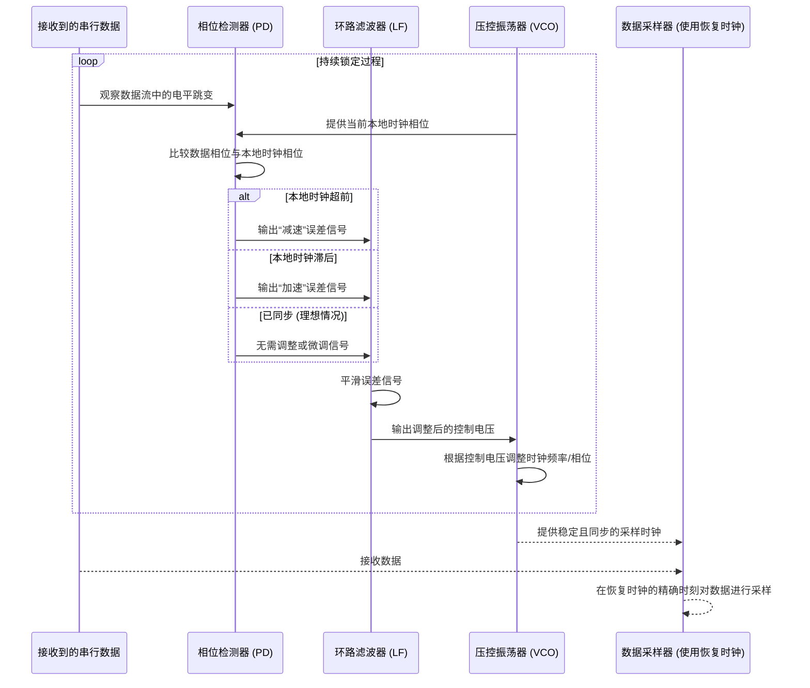

# Chapter 3: 时钟数据恢复 (CDR)


欢迎来到 `Serializer_Deserializer_Component_Design` 项目教程的第三章！在上一章 [第二章：多电平信令 (例如 PAM-4)](02_多电平信令__例如_pam_4__.md) 中，我们学习了像 PAM-4 这样的多电平信令技术如何通过在每个信号符号中承载更多比特来提高数据传输速率。然而，PAM-4 信号具有多个电压电平，这使得接收端在何时对信号进行采样变得至关重要。如果采样时间稍有偏差，就很容易将一个电平误判为另一个，导致数据错误。那么，接收器是如何精确地知道何时“读取”这些复杂信号中的每一位的呢？这就是本章的主角——时钟数据恢复 (CDR)——要解决的问题。

## 为什么需要 CDR？—— 跟着节拍跳舞

想象一下，你正在收听一段通过无线电波发送过来的摩斯密码。发送方按照一定的节拍（时钟）发送点 (dot) 和划 (dash)。如果你不知道这个节拍，你可能会在两个点之间错误地停顿，或者把一个长划拆成几个短点。你需要找到发送方发送信号的“节奏”，才能正确解读信息。

在高速串行数据传输中，情况类似。数据一位接一位地高速传来，但通常**不会**有一条单独的线缆来传输时钟信号。原因在于，在极高的速度下，单独传输时钟信号会遇到很多问题，比如时钟信号和数据信号之间可能因为线缆长度、温度变化等因素产生延迟差异（称为“时钟偏移”或“skew”），导致接收端无法同步。

那么，接收端如何知道每一位的开始和结束呢？答案是：**时钟信号被巧妙地“嵌入”到了数据流本身之中**。**时钟数据恢复 (Clock and Data Recovery, CDR)** 电路就是 SerDes 接收端的“千里眼”和“顺风耳”，它的核心任务就是从这个混合了数据和时钟信息的高速串行信号中，精确地“提取”出原始的时钟节拍。只有恢复了这个时钟信号，接收器才能准确地知道在何时对数据流中的每一位进行采样，从而确保数据被正确无误地读取。

可以把 CDR 模块想象成一个聪明的“侦探”或是一位经验丰富的舞者。舞者不需要乐队指挥明确地每拍都敲击指挥棒，而是能从音乐的旋律和节奏变化中（数据流的跳变）找到正确的节拍，并据此完美地踩点起舞（准确采样数据）。

## CDR 的核心目标

CDR 电路的主要目标可以概括为：
1.  **频率同步**：使接收端本地生成的时钟频率与发送端发送数据时使用的时钟频率完全一致。
2.  **相位对齐**：使接收端本地生成的时钟的相位（也就是时钟脉冲的“起跳点”）与输入数据流中每一位的最佳采样点（通常是数据位的中心位置，眼图的“眼睛”张开最大的地方）精确对齐。

一旦 CDR 电路成功“锁定”（lock）到输入数据的时钟，它就能为解串器的其余部分提供一个稳定、准确的采样时钟。

## CDR 是如何工作的？（基于锁相环 PLL 的简化原理）

大多数现代 CDR 电路的核心都是一个称为**锁相环 (Phase-Locked Loop, PLL)** 的反馈控制系统。虽然 PLL 的具体实现可能很复杂，但其基本工作原理对于初学者来说是可以理解的。

一个典型的基于 PLL 的 CDR 电路主要包含以下几个部分：

```mermaid
graph LR
    subgraph CDR 电路 (基于PLL)
        DataIn[串行数据输入] --> PD[相位检测器 (PD)]
        VCO_Clock[本地恢复时钟] --> PD
        PD -- 相位误差信号 --> LF[环路滤波器 (LF)]
        LF -- 控制电压 --> VCO[压控振荡器 (VCO)]
        VCO -- 本地恢复时钟 --> Data_Sampler[数据采样/判决逻辑]
        VCO -- 本地恢复时钟 --> RecoveredClockOut[恢复时钟输出]
        DataIn --> Data_Sampler
        Data_Sampler --> RecoveredDataOut[恢复的并行数据 (经过解串后)]
    end
```

让我们一步步来看这些模块是如何协同工作的：

1.  **相位检测器 (Phase Detector, PD)**：
    *   这是 CDR 的“眼睛”。它同时观察输入的串行数据流和本地压控振荡器 (VCO) 生成的时钟信号。
    *   它的工作是比较这两者之间的**相位差异**。具体来说，它会查看数据流中信号电平发生跳变（从0到1，或从1到0，或者在 PAM-4 中从一个电平跳到另一个电平）的时刻，与本地时钟的边沿（通常是上升沿或下降沿）进行比较。
    *   如果本地时钟“跑得快了”（超前于数据跳变），PD 会产生一个指示“减速”的信号。
    *   如果本地时钟“跑得慢了”（滞后于数据跳变），PD 会产生一个指示“加速”的信号。
    *   如果两者完美同步，理论上 PD 不会产生调整信号（或产生一个表示“保持当前状态”的信号）。
    *   我们将在下一章 [第四章：多电平相位检测器](04_多电平相位检测器_.md) 中更详细地探讨相位检测器，特别是针对 PAM-4 等多电平信号的相位检测器。在 `Serializer_Deserializer_Component_Design.pdf` 文档的第14页图2.4中，展示了一些数字相位检测器的例子，例如 Alexander 相位检测器。

2.  **环路滤波器 (Loop Filter, LF)**：
    *   PD 输出的“加速”或“减速”信号通常是一些短脉冲或者数字信号。环路滤波器就像一个“缓冲器”或“平滑器”。
    *   它接收来自 PD 的误差信号，并将其转换成一个相对平滑的直流电压（或电流）。这个电压的大小反映了需要对本地时钟进行的调整量。
    *   环路滤波器对于 PLL 的稳定性以及它如何响应输入数据中时钟频率或相位的快速变化（即其“跟踪特性”）至关重要。

3.  **压控振荡器 (Voltage-Controlled Oscillator, VCO)**：
    *   这是 CDR 的“心脏”，负责产生接收端本地的采样时钟。
    *   顾名思义，VCO 的输出时钟频率是由其输入控制电压（来自环路滤波器）决定的。
    *   如果环路滤波器输出一个较高的控制电压，VCO 的频率就会增加（时钟变快）。
    *   如果控制电压较低，VCO 的频率就会降低（时钟变慢）。

**整个反馈环路的工作流程：**



1.  **启动与搜寻**：当接收器刚开始接收数据时，VCO 产生的本地时钟频率和相位可能与输入数据中的嵌入时钟有较大差异。
2.  **相位比较**：PD 检测到这种差异，并输出相应的误差信号。
3.  **滤波与控制**：LF 对误差信号进行滤波，生成一个控制电压。
4.  **VCO 调整**：VCO 根据这个控制电压调整其输出时钟的频率和相位，试图减小与输入数据时钟的差异。
5.  **迭代与锁定**：这个“比较-滤波-调整”的过程不断重复。通过这个负反馈机制，VCO 的输出时钟会逐渐被“拉向”并最终“锁定”到输入数据流的频率和相位上。当达到“锁定”状态时，本地恢复的时钟就能准确地跟踪输入数据的时钟了。

`Serializer_Deserializer_Component_Design.pdf` 文档的第13页图2.3a 展示了一个典型的反馈型时钟数据恢复架构，它清楚地描绘了相位检测器、环路滤波器和VCO是如何连接在一起形成反馈回路的。

一旦 CDR 电路锁定，恢复出来的时钟就可以用来驱动数据采样逻辑（例如，在 [第二章：多电平信令 (例如 PAM-4)](02_多电平信令__例如_pam_4__.md) 中提到的 ADC），在每个数据符号的最佳时刻进行采样。同时，这个恢复的时钟也用于后续的解串器将串行数据转换回并行数据。

## CDR 与 PAM-4 的挑战

对于像 PAM-4 这样的多电平信令，CDR 的设计面临更大的挑战：
1.  **更小的“眼睛”**：PAM-4 信号的眼图在垂直方向上被分成了三个较小的“眼睛”（相比于传统二进制信号的一个大眼睛）。这意味着每个电平之间的判决门限更窄，对采样时刻的精确度要求更高。CDR 必须非常精确地恢复时钟，以确保在“眼睛”张开最大的瞬间进行采样。
2.  **复杂的跳变**：PAM-4 信号的跳变不仅仅是从低到高或从高到低，它可以是从四个电平中的任意一个跳到另一个。相位检测器需要能够有效地从这些更复杂的跳变中提取时钟信息。
3.  **对抖动的敏感性**：由于判决门限变小，PAM-4 系统对[抖动 (Jitter)](05_抖动__jitter__.md)（时钟信号在时间上的微小不期望的偏移）更加敏感。CDR 电路本身需要具有良好的抖动抑制能力，并且不能引入过多的额外抖动。

## 另一种架构：相位拾取 (Phase-Picking)

除了基于 PLL 的反馈架构，还有一种称为“相位拾取”或“前馈式”的 CDR 架构，在 `Serializer_Deserializer_Component_Design.pdf` 的第13页图2.3b 中有所提及。这种架构通常使用多路并行的、相位略有偏移的时钟去对输入数据进行过采样（oversampling），然后通过一个判决逻辑来选择其中采样质量最好的那个数据点（例如，选择看起来最像在数据“眼睛”中心的采样点）。这种架构的优点是没有反馈环路固有的带宽限制和锁定时间问题，但可能在相位量化精度和功耗方面有所取舍。对于非常高速的应用，基于 PLL 的 CDR 仍然是主流。

## 总结

在本章中，我们探索了时钟数据恢复 (CDR) 的基本概念：

*   CDR 是 SerDes 接收端的关键技术，用于从没有独立时钟线的串行数据流中提取时钟信号。
*   其核心目标是实现接收端本地时钟与发送端时钟在频率和相位上的同步。
*   大多数 CDR 电路基于锁相环 (PLL)，主要由相位检测器 (PD)、环路滤波器 (LF) 和压控振荡器 (VCO) 组成，通过负反馈机制实现时钟的锁定。
*   恢复出来的时钟用于精确地采样输入数据，并驱动后续的解串过程。
*   对于 PAM-4 等多电平信令，由于其信号特性（多电平、小眼图），对 CDR 的精度和性能提出了更高的要求。

理解了 CDR 的重要性和基本工作原理后，我们自然会好奇，作为 CDR 核心部件之一的相位检测器，在面对像 PAM-4 这样的多电平信号时，是如何工作的呢？这正是我们下一章 [第四章：多电平相位检测器](04_多电平相位检测器_.md) 将要深入探讨的内容。敬请期待！

---

Generated by [AI Codebase Knowledge Builder](https://github.com/The-Pocket/Tutorial-Codebase-Knowledge)