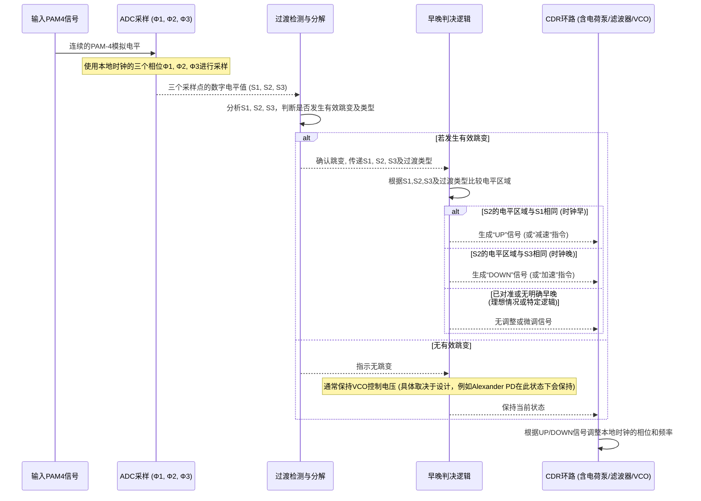

# Chapter 4: 多电平相位检测器


欢迎来到 `Serializer_Deserializer_Component_Design` 项目教程的第四章！在上一章 [时钟数据恢复 (CDR)](03_时钟数据恢复__cdr__.md) 中，我们了解到 CDR 电路的核心任务是从输入数据流中提取时钟信号，而相位检测器 (PD) 在这个过程中扮演着“眼睛”的角色，负责比较本地时钟与输入数据的相位差异。传统的相位检测器通常处理二进制信号（只有高/低两种电平）。但是，当我们使用像 [多电平信令 (例如 PAM-4)](02_多电平信令__例如_pam_4__.md) 这样的技术在每个符号中传输更多比特时，信号不再是简单的二进制，而是具有多个电压等级。那么，CDR 系统该如何处理这种更复杂的信号呢？这就需要一种更“聪明”的相位检测器——多电平相位检测器。

本章将介绍在 `Serializer_Deserializer_Component_Design` 项目论文中设计的一种新型多电平相位检测器。

## 为什么需要多电平相位检测器？—— 更“敏锐”的裁判

想象一下，在 [多电平信令 (例如 PAM-4)](02_多电平信令__例如_pam_4__.md) 中，一个信号符号可以代表多个比特，例如 PAM-4 信号有四个不同的电压等级。传统的二进制相位检测器就像一个只能判断球是否出界（对应时钟早于或晚于数据跳变）的裁判。但对于多电平信号，情况更复杂：

1.  **电平间隔更小**：在相同的总电压摆幅内要区分四个电平，意味着相邻电平间的“安全区”变小了。
2.  **跳变类型更多**：信号不仅仅是从低到高或从高到低跳变，它可以是从四个电平中的任意一个跳到另一个（例如，从电平0到电平3，或者从电平1到电平2）。

这就好比裁判不仅要判断是否出界，还要能精确识别运动员完成了哪个难度的动作，并且动作是否标准。多电平相位检测器就是这样一个更“敏锐”的裁判，它专门设计来应对多电平信号的这些挑战，帮助 CDR 系统更精确地调整时钟，以正确恢复数据。

根据 `Serializer_Deserializer_Component_Design.pdf` 文档（参见其摘要部分，第 i 页，以及第三章，第31页起），本项目提出了一种新颖的多电平相位检测器，其关键特点是结合了**高速闪速ADC前端**和**全数字检测逻辑**。

## 多电平相位检测器的核心思想与组成

这种新型多电平相位检测器的设计借鉴了传统二进制信号中常用的 Alexander 相位检测器的一些思想（一种判断数据跳变相对于时钟边沿是提前还是滞后的方法），但对其进行了调整以适应多电平信号。

其核心工作流程可以概括为：使用多个（通常是三个）不同相位的时钟对输入的 PAM-4 信号进行采样，然后通过数字逻辑分析这些采样点的电平值来判断本地时钟相对于输入数据是“早”了还是“晚”了。

参考 `Serializer_Deserializer_Component_Design.pdf` 文档中的图 3.3（第33页），一个多电平相位检测器主要由以下部分构成：

```mermaid
graph TD
    subgraph 多电平相位检测器
        Input_PAM4[PAM-4 模拟信号输入] --> Flash_ADC[高速闪速 ADC]
        Flash_ADC -- ADC输出 (数字化的电平值) --> Digital_Logic[全数字检测逻辑]
        Local_Clock_Phases[本地时钟的多相输出 (例如 Φ1, Φ2, Φ3)] --> Flash_ADC
        Digital_Logic -- 早/晚信号 --> Charge_Pump[电荷泵 (CDR环路的一部分)]
    end
    subgraph 全数字检测逻辑
        TDD[过渡检测与分解]
        ELSG[早/晚信号生成]
    end
    Flash_ADC -- 采样值 --> TDD
    TDD -- 过渡类型 --> ELSG
    Flash_ADC -- 采样值 --> ELSG

```

让我们逐个了解这些关键组件：

### 1. 高速闪速 ADC (Flash ADC) 前端

*   **作用**：由于输入的 PAM-4 信号是模拟的（具有多个连续的电压等级），数字逻辑电路无法直接处理。闪速 ADC (Analog-to-Digital Converter) 的任务就是快速地将这些模拟电压值转换成数字代码。例如，对于 PAM-4 的四个电平，ADC 会输出对应的数字表示（比如 `00`, `01`, `10`, `11`）。
*   **为什么是“闪速”？** 因为数据传输速率非常高，ADC 必须足够快，才能在每个符号周期内完成转换。闪速 ADC 通过并行比较输入电压与一组参考电压来实现高速转换。
*   **参考资料**：`Serializer_Deserializer_Component_Design.pdf` 的 3.3 节（第37页）详细介绍了其采用的2位闪速ADC。图 3.11（第41页）展示了ADC对于斜坡输入信号的输出，清晰地显示了四个数字编码（例如，文档中的 `1.2V` 以下为`00`，`1.2V-1.4V` 为 `01`，`1.4V-1.6V` 为 `10`，`1.6V` 以上为 `11`，具体阈值取决于设计）。

**简单来说**：ADC 就像一个快速的“翻译官”，把模拟的电压语言“翻译”成数字电路能懂的数字语言。

### 2. 全数字检测逻辑

一旦 ADC 将采样点的电压转换成数字形式，接下来的相位判断就完全由数字逻辑电路完成。这部分主要包含两个子模块（参考 PDF 图 3.3 和 3.6）：

#### a. 过渡检测与分解 (Transition Detection and Decomposition)

*   **作用**：这个模块分析由 ADC 采样得到的连续几个数据点的数字电平值，以判断信号是否发生了有效的电平跳变，并且识别跳变的类型。
*   **PAM-4 的过渡类型**：对于 PAM-4 信号，不仅仅是二进制的 0->1 或 1->0。`Serializer_Deserializer_Component_Design.pdf` 的图 3.5（第35页）将 PAM-4 的跳变分为三种主要类型：
    *   **Type 1**: 相邻电平之间的跳变（例如，从电平0 (`00`) 到电平1 (`01`)，幅度差为1个单位）。
    *   **Type 2**: 跨一个中间电平的跳变（例如，从电平0 (`00`) 到电平2 (`10`)，幅度差为2个单位）。
    *   **Type 3**: 从最低电平到最高电平（或反之）的跳变（例如，从电平0 (`00`) 到电平3 (`11`)，幅度差为3个单位）。
*   **如何检测**：如图 3.6（第35页）所示，通过比较不同采样时刻（例如 Φ1 和 Φ3 时刻）的 ADC 输出数字值，数字逻辑（如比较器、逻辑门）可以判断是否发生跳变以及跳变的幅度，从而确定是哪种类型的过渡。

**简单来说**：这个模块像是在观察一系列快照（采样点），判断两张快照之间是否有明显变化，并描述这个变化的“剧烈程度”。

#### b. 早/晚信号生成 (Early/Late Signal Generation)

*   **作用**：在确认发生有效过渡后，这个模块根据特定的采样点组合来判断本地恢复时钟的相位是超前（Early）还是滞后（Late）于输入数据的最佳采样点。
*   **基于三点采样 (Φ1, Φ2, Φ3)**：该设计通常使用三个不同相位的时钟（Φ1, Φ2, Φ3，由本地VCO产生并有固定相位差）来对输入信号进行采样。`Serializer_Deserializer_Component_Design.pdf` 的图 3.4（第34页）解释了其工作原理：
    *   Φ1 和 Φ3 可以看作是数据采样点，而 Φ2（位于 Φ1 和 Φ3 中间）可以看作是边沿或过渡采样点。
    *   **时钟早 (Early)**：如果 Φ2 时刻采样到的电平值 与 Φ1 时刻采样到的电平值 相同（都属于前一个数据符号的电平区域），则认为时钟“早”了。
    *   **时钟晚 (Late)**：如果 Φ2 时刻采样到的电平值 与 Φ3 时刻采样到的电平值 相同（都属于当前数据符号的电平区域，假设数据已跳变），则认为时钟“晚”了。
    *   **已锁定**：当数据成功锁定时，早信号和晚信号会交替出现或达到某种平衡，通过电荷泵和环路滤波器平均后，VCO的控制电压将趋于稳定。
*   **数字逻辑实现**：如图 3.7（第36页）所示（图中为针对thermometer code的例子，但原理类似），早/晚信号是由比较ADC在 Φ1, Φ2, Φ3 时刻的数字输出生成的。例如，通过比较 S2 (Φ2的采样值) 与 S1 (Φ1的采样值) 和 S3 (Φ3的采样值) 的数字表示。
*   **输出**: 生成“UP”（加速时钟）或“DOWN”（减速时钟）的脉冲信号，送给 [时钟数据恢复 (CDR)](03_时钟数据恢复__cdr__.md) 环路中的电荷泵和环路滤波器。

**简单来说**：这个模块根据“中间”采样点更像“前一个”数据还是“后一个”数据，来决定是提醒CDR“快一点”还是“慢一点”。

## 多电平相位检测器如何工作？（简化流程）

让我们通过一个简化的例子，看看这个多电平相位检测器是如何帮助 CDR 系统调整时钟的。



1.  **信号输入**：PAM-4 模拟信号进入多电平相位检测器。
2.  **ADC 采样**：闪速 ADC 使用本地恢复时钟的三个不同相位（例如，Φ1、Φ2、Φ3，其中 Φ2 理论上应位于数据眼的中心，Φ1 提前半个符号周期，Φ3 滞后半个符号周期）对输入信号进行采样。ADC 将每个采样点的模拟电压转换为相应的2位数字代码（例如，`00`, `01`, `10`, `11`）。
    *   `S1`: Φ1 时刻的2位数字采样值。
    *   `S2`: Φ2 时刻的2位数字采样值。
    *   `S3`: Φ3 时刻的2位数字采样值。
3.  **过渡检测**：数字逻辑分析 `S1` 和 `S3`（或相关的采样组合），以确定在这些采样点之间是否发生了有效的电平转换，并可能识别转换的类型（Type 1, 2, or 3）。如果没有发生转换（例如，连续的相同符号 `00, 00, 00`），则PD通常会保持先前的状态，不发出调整指令。
4.  **早/晚判断**：
    *   如果检测到有效过渡（例如，`S1` 代表旧数据，`S3` 代表新数据），则比较 `S2` 与 `S1` 和 `S3`。
    *   根据 `Serializer_Deserializer_Component_Design.pdf` 图 3.4 的描述：
        *   若 `S2` 的电平区域与 `S1` 的相同，则判断为**时钟早 (Early)**。这意味着采样时钟的边沿（由Φ2代表）太靠前了，采样到了前一个数据符号。
        *   若 `S2` 的电平区域与 `S3` 的相同，则判断为**时钟晚 (Late)**。这意味着采样时钟的边沿太靠后了，采样到了当前（已跳变完成的）数据符号。
5.  **输出调整信号**：根据早/晚判断结果，生成相应的控制信号（例如，"UP" 表示时钟晚了，需要加速；"DOWN" 表示时钟早了，需要减速）给 CDR 环路中的电荷泵。
6.  **CDR 环路调整**：电荷泵、环路滤波器和 VCO 协同工作，根据这些 UP/DOWN 信号调整本地时钟的频率和相位，使其逐渐对准输入数据的最佳采样点。

`Serializer_Deserializer_Component_Design.pdf` 的图 3.13（第43页）展示了早/晚信号生成和信号分解模块的仿真输出，图 3.15（第44页）则显示了在不同采样偏移下相位检测器的输出特性。这些图表表明，当采样点偏离符号中心时，相位检测器能够正确地产生相应的早或晚指示。

### 示例：PAM-4 电平与早/晚判断

假设 PAM-4 的四个电平数字化后为 0, 1, 2, 3。
输入数据序列中发生了一次从 电平0 (`00`) 到 电平1 (`01`) 的跳变 (Type 1)。
ADC 在 Φ1, Φ2, Φ3 时刻的采样结果 (理想无噪声情况下) 可能为：
*   **情况1：时钟早 (Early)**
    *   S1 (Φ1采样) = 0 (`00`)
    *   S2 (Φ2采样) = 0 (`00`)  <-- Φ2 采样到了跳变前的电平
    *   S3 (Φ3采样) = 1 (`01`)
    *   判断：S2 与 S1 相同，输出 "Early" 信号。

*   **情况2：时钟晚 (Late)**
    *   S1 (Φ1采样) = 0 (`00`)
    *   S2 (Φ2采样) = 1 (`01`)  <-- Φ2 采样到了跳变后的电平
    *   S3 (Φ3采样) = 1 (`01`)
    *   判断：S2 与 S3 相同，输出 "Late" 信号。

*   **情况3：时钟理想对准 (Φ2 恰好在跳变中间)**
    *   S1 (Φ1采样) = 0 (`00`)
    *   S2 (Φ2采样) = ? (可能是一个中间值，ADC会将其判决为最接近的有效电平，或者此时早晚信号都不被强烈激活，或者交替激活)
    *   S3 (Φ3采样) = 1 (`01`)
    *   理想情况下，CDR锁定后，早晚信号会达到平衡。

## 优势与特点

这种结合高速闪速ADC前端和全数字检测逻辑的多电平相位检测器具有以下优势：
*   **专为多电平信号设计**：能够有效处理 PAM-4 等复杂信号的相位检测。
*   **全数字后续处理**：ADC 之后的逻辑完全是数字的，这带来了传统数字电路的好处：
    *   **对工艺迁移不敏感 (Portability)**：数字逻辑更容易在不同的制造工艺之间移植。
    *   **潜在的低功耗**：相比复杂的模拟电路，精心设计的数字逻辑可能实现更低的功耗。
    *   **抗噪声能力**：数字信号本质上比模拟信号更能抵抗噪声和干扰（一旦信号被正确数字化）。
*   **高速性能**：闪速 ADC 的并行特性使其适合高速应用。

## 总结

在本章中，我们学习了一种专为多电平信号（如 PAM-4）设计的相位检测器。我们了解到：
*   传统二进制相位检测器不适用于具有多个电压等级和复杂跳变的多电平信号。
*   论文中提出的新型多电平相位检测器采用高速闪速 ADC 将模拟输入信号转换为数字表示，然后使用全数字逻辑进行过渡检测和早/晚相位判断。
*   这种方法利用三点采样（Φ1, Φ2, Φ3）来比较数据采样点和边沿采样点，从而确定时钟的相位误差。
*   其全数字检测逻辑部分使其具有良好的工艺可移植性和潜在的低功耗优势。

这种先进的相位检测器是实现高精度[时钟数据恢复 (CDR)](03_时钟数据恢复__cdr__.md) 的关键，特别是在采用[多电平信令 (例如 PAM-4)](02_多电平信令__例如_pam_4__.md) 的高速 SerDes 系统中。

然而，即使拥有了如此精密的相位检测器和 CDR 系统，高速数据传输仍然面临一个巨大的挑战——信号在时间上的微小、不期望的晃动，即“抖动”。在下一章 [抖动 (Jitter)](05_抖动__jitter__.md) 中，我们将深入探讨什么是抖动，它的来源，以及它如何影响 SerDes 系统的性能。

---

Generated by [AI Codebase Knowledge Builder](https://github.com/The-Pocket/Tutorial-Codebase-Knowledge)