# Chapter 5: 抖动 (Jitter)


在上一章 [第四章：多电平相位检测器](04_多电平相位检测器_.md) 中，我们学习了在先进的 [时钟数据恢复 (CDR)](03_时钟数据恢复__cdr__.md) 系统中，多电平相位检测器如何精确地比较本地时钟与输入的多电平信号（如 [多电平信令 PAM-4](02_多电平信令__例如_pam_4__.md)）之间的相位差异。然而，即使我们拥有了如此精密的相位检测技术，高速数据传输依然面临一个普遍且棘手的敌人——那就是本章的主角：“抖动”。

## 什么是抖动？—— 节拍不稳的鼓手

想象一下，你正在欣赏一支乐队的演奏。如果鼓手技艺精湛，他敲击鼓点的节奏会非常稳定和精准，让整个乐队的演奏和谐流畅。但如果鼓手状态不佳，敲鼓的节奏时快时慢，不再那么精准，那么其他乐手就很难跟上，整个音乐听起来就会有些混乱。

在数字信号的世界里，**抖动 (Jitter)** 就好比这位节拍不稳的鼓手。它是指**数字信号在时间轴上的不期望的随机或确定性偏移，即信号的实际出现时间与其理想的、预期的标称时间之间的微小偏差。**

在高速的 [串行器/解串器 (SerDes)](01_串行器_解串器__serdes__.md) 系统中，数据比特流以极高的速度传输。接收端需要在精确的时刻对这些比特进行采样，以判断它是 ‘0’ 还是 ‘1’（或者在 PAM-4 中是哪个电平）。如果信号的边沿（从低到高或从高到低的跳变时刻）因为抖动而提前或延迟到达，接收端的采样时钟就可能在错误的时间点进行采样。

例如，如果一个数据比特的理想持续时间是 100 皮秒 (picoseconds, ps)，我们期望它在第 0ps 开始，在第 100ps 结束。但由于抖动，它可能在第 -5ps 就提前到来了，或者在第 +8ps 才姗姗来迟。

`Serializer_Deserializer_Component_Design.pdf` (第18页，图 2.7) 直观地展示了抖动与单位间隔 (UI, Unit Interval) 的关系。单位间隔是指单个数据比特的理想时间长度。

```mermaid
---
title: 图例：理想信号与带抖动的信号边沿
---
gantt
    dateFormat  X
    axisFormat %Lps
    section 理想信号 (Ideal Signal)
    理想比特1边沿 :milestone, ideal_edge1, 0, 0
    理想比特2边沿 :milestone, ideal_edge2, 100, 0
    理想比特3边沿 :milestone, ideal_edge3, 200, 0
    理想比特4边沿 :milestone, ideal_edge4, 300, 0
    理想比特1周期 :ideal_b1, 0, 100
    理想比特2周期 :ideal_b2, 100, 100
    理想比特3周期 :ideal_b3, 200, 100


    section 带抖动的信号 (Signal with Jitter)
    实际比特1边沿 (早) :milestone, actual_edge1, -5, 0
    实际比特2边沿 (晚) :milestone, actual_edge2, 108, 0
    实际比特3边沿 (早) :milestone, actual_edge3, 197, 0
    实际比特4边沿 (准) :milestone, actual_edge4, 300, 0
    实际比特1周期 :actual_b1, -5, 113
    实际比特2周期 :actual_b2, 108, 89
    实际比特3周期 :actual_b3, 197, 103

    %% Y轴标签说明：
    %% 'milestone' 用于标记精确的时间点（边沿）
    %% 'ideal_b1, 0, 100' 表示从时间0ps开始，持续100ps
    %% 实际信号的边沿位置相对理想位置发生了偏移，并且每个比特的持续时间也可能变化
```


上图示意了一个理想的数字信号边沿序列和带有抖动的实际信号边沿序列。可以看到，实际信号的跳变边沿并不总是精确地落在理想的时间点上。这种偏差就是抖动。

## 为什么抖动是个大问题？

在高速数据传输中，抖动是一个关键的负面因素，因为它会直接影响系统的性能和可靠性：

1.  **采样错误导致误码 (Bit Errors)**：如果抖动过大，接收端的采样时钟可能会在数据尚未稳定或者已经开始向下一个比特跳变的时刻进行采样。这会导致接收器错误地判断数据值（例如，把 ‘1’ 误判为 ‘0’），从而产生误码 (Bit Error)。误码率 (BER) 是衡量通信系统可靠性的一个重要指标，高抖动通常意味着高误码率。
2.  **减小有效数据眼图 (Eye Diagram)**：工程师常用“眼图”来评估高速信号的质量。理想情况下，眼图的“眼睛”应该张得很大很清晰，表示有足够的时间和电压余量来进行可靠采样。抖动会导致眼图在水平方向（时间轴）上闭合，使得“眼睛”变小。眼睛越小，系统对噪声和其他干扰就越敏感，采样就越困难。对于 [多电平信令 (例如 PAM-4)](02_多电平信令__例如_pam_4__.md) 来说，由于其固有的多电平特性使得垂直方向的眼高已经减小，时间上的抖动会进一步恶化信号质量，使其更难正确解码。

    ```mermaid
    graph LR
        subgraph 无抖动时的眼图 (理想情况)
            A1[" "] -- 高电平路径1 --> A2[" "]
            A1_b[" "] -- 高电平路径2 --> A2_b[" "]
            A3[" "] -- 低电平路径1 --> A4[" "]
            A3_b[" "] -- 低电平路径2 --> A4_b[" "]
            style A1 fill:#fff,stroke:#fff,stroke-width:0px
            style A2 fill:#fff,stroke:#fff,stroke-width:0px
            style A1_b fill:#fff,stroke:#fff,stroke-width:0px
            style A2_b fill:#fff,stroke:#fff,stroke-width:0px
            style A3 fill:#fff,stroke:#fff,stroke-width:0px
            style A4 fill:#fff,stroke:#fff,stroke-width:0px
            style A3_b fill:#fff,stroke:#fff,stroke-width:0px
            style A4_b fill:#fff,stroke:#fff,stroke-width:0px
            %% 模拟一个清晰的眼图形状
            Path_H1( ) --- Path_H2( )
            Path_L1( ) --- Path_L2( )
            Path_H1 -- 上升/下降沿 --> Path_L1
            Path_H1 -- 上升/下降沿 --> Path_L2
            Path_H2 -- 上升/下降沿 --> Path_L1
            Path_H2 -- 上升/下降沿 --> Path_L2
            EyeOpenSpace["眼<br/>(采样区域)"]
            style EyeOpenSpace fill:#lightblue,stroke:#333
            text1["眼高<br/>(电压余量)"]
            text2["眼宽<br/>(时间余量)"]
            style text1 fill:#fff,stroke:#fff
            style text2 fill:#fff,stroke:#fff
        end
        subgraph 有抖动时的眼图
            B1[" "] -- 高电平模糊带 --> B2[" "]
            B3[" "] -- 低电平模糊带 --> B4[" "]
            style B1 fill:#fff,stroke:#fff,stroke-width:0px
            style B2 fill:#fff,stroke:#fff,stroke-width:0px
            style B3 fill:#fff,stroke:#fff,stroke-width:0px
            style B4 fill:#fff,stroke:#fff,stroke-width:0px
            %% 模拟一个因抖动而闭合的眼图
            Path_H1_J( ) -. 抖动导致边沿不确定 .- Path_H2_J( )
            Path_L1_J( ) -. 抖动导致边沿不确定 .- Path_L2_J( )
            Path_H1_J -- 模糊的上升/下降沿 --> Path_L1_J
            Path_H1_J -- 模糊的上升/下降沿 --> Path_L2_J
            Path_H2_J -- 模糊的上升/下降沿 --> Path_L1_J
            Path_H2_J -- 模糊的上升/下降沿 --> Path_L2_J
            EyeClosedSpace["变小的眼<br/>(采样困难)"]
            style EyeClosedSpace fill:pink,stroke:red
            text3["眼高减小"]
            text4["眼宽显著减小"]
            style text3 fill:#fff,stroke:#fff
            style text4 fill:#fff,stroke:#fff
        end
    ```
    *图例：抖动对眼图的影响。左边是理想情况，右边是抖动导致眼图在时间和幅度上都恶化。*

3.  **影响 [时钟数据恢复 (CDR)](03_时钟数据恢复__cdr__.md) 的性能**：CDR 电路需要从数据流的跳变中提取时钟。如果数据跳变时刻本身就“飘忽不定”（即存在抖动），CDR 电路就更难锁定到正确的时钟频率和相位，或者即使锁定了，恢复出来的时钟也可能带有抖动，影响后续的数据采样。

## 抖动的分类

为了更好地理解和应对抖动，工程师们通常将其分解为不同的组成部分。根据 `Serializer_Deserializer_Component_Design.pdf` 文档第18页的图 2.8，抖动主要可以分为两大类：**随机抖动 (Random Jitter, RJ)** 和 **确定性抖动 (Deterministic Jitter, DJ)**。

```mermaid
graph TD
    TJ[总抖动 (Total Jitter, TJ)] --> RJ[随机抖动 (Random Jitter, RJ)]
    TJ --> DJ[确定性抖动 (Deterministic Jitter, DJ)]
    DJ --> PJ[周期性抖动 (Periodic Jitter, PJ)]
    DJ --> DDJ[数据相关抖动 (Data-Dependent Jitter, DDJ)]
    DJ --> BUJ[有界不相关抖动 (Bounded Uncorrelated Jitter, BUJ)]
    DDJ --> DCD[占空比失真 (Duty Cycle Distortion, DCD)]
    DDJ --> ISI[符号间干扰 (Inter-Symbol Interference, ISI)]

    classDef category fill:#e6e6fa,stroke:#333,stroke-width:2px;
    class TJ,RJ,DJ,PJ,DDJ,BUJ,DCD,ISI category;
```
*图：抖动的主要分类 (概念源自 PDF 文档中的图 2.8)*

让我们简单了解一下这些主要的抖动类型：

### 1. 随机抖动 (Random Jitter, RJ)

*   **特点**：随机抖动是不可预测的，没有固定的模式。它通常被建模为高斯分布（像钟形曲线）。这意味着微小的抖动偏移比较常见，而大的抖动偏移则很少发生，但理论上其幅度是**无界的**。
*   **来源**：`Serializer_Deserializer_Component_Design.pdf` (第19页，2.4.1节) 指出，RJ 的常见来源包括：
    *   **热噪声 (Thermal Noise)**：由电子在导体中的随机热运动引起，普遍存在于所有电子元器件中。想象一下水分子在加热时无规则地剧烈运动。
    *   **散粒噪声 (Shot Noise)**：由电流中离散的电荷载流子（电子或空穴）通过势垒（如PN结）时的随机性引起。就像雨点打在屋顶上，虽然整体有雨量，但每一滴雨落下的时间和位置是随机的。
    *   **闪烁噪声 (Flicker Noise / 1/f Noise)**：一种低频噪声，其功率谱密度与频率成反比。在半导体器件中普遍存在。
*   **影响**：RJ 会导致信号边沿在一个围绕理想位置的小范围内随机波动。它往往是高速系统误码率的最终限制因素。

### 2. 确定性抖动 (Deterministic Jitter, DJ)

*   **特点**：确定性抖动是可预测和可重复的，通常与特定的信号模式、系统设计或外部干扰有关。它的幅度是**有界的**，即它不会超过某个最大值。
*   **来源**：DJ 的来源多种多样，它可以进一步细分为以下几种主要类型：

    #### a. 周期性抖动 (Periodic Jitter, PJ)
    *   **特点**：PJ 是以固定频率重复出现的抖动。可以把它想象成鼓手在稳定敲击的同时，旁边还有一个节拍器以稍微不同的固定频率发出干扰声，导致鼓点周期性地偏离。
    *   **来源**：`Serializer_Deserializer_Component_Design.pdf` (第21页，2.5.1节) 提到，PJ 通常由外部耦合进来的周期性干扰信号引起，例如：
        *   电源噪声（如开关电源的开关频率纹波）。
        *   其他时钟信号或高频数字信号通过串扰 (crosstalk) 耦合到当前信号。
        *   电磁干扰 (EMI)。
    *   **影响**：PJ 会导致信号边沿相对于理想位置周期性地来回摆动，如 PDF 图 2.9 (第21页) 所示概念。
        ```mermaid
        ---
        title: 图例：周期性抖动对理想时钟的影响 (概念图)
        ---
        gantt
            dateFormat X
            axisFormat %Lps
            section 理想时钟边沿 (Ideal Clock Edges)
            理想边沿1   :crit, ideal_e1, 0, 10
            理想边沿2   :crit, ideal_e2, 100, 10
            理想边沿3   :crit, ideal_e3, 200, 10
            理想边沿4   :crit, ideal_e4, 300, 10

            section 受PJ影响的时钟边沿 (Edges with Periodic Jitter)
            实际边沿1 (早) :crit, actual_e1, -5, 10
            实际边沿2 (晚) :crit, actual_e2, 110, 10
            实际边沿3 (早) :crit, actual_e3, 195, 10
            实际边沿4 (晚) :crit, actual_e4, 310, 10
            %% 说明: 'crit' 只是为了标记关键时刻，'0, 10' 表示从0开始，持续10个单位的标记块
            %% 重点是边沿相对于理想位置的周期性提前或滞后
        ```
        *图解：理想时钟边沿是等间隔的，而受周期性抖动影响的时钟边沿则会围绕理想位置周期性地提前或推迟。*

    #### b. 数据相关抖动 (Data-Dependent Jitter, DDJ)
    *   **特点**：DDJ 的抖动量取决于正在传输的数据序列的模式。也就是说，某些特定的比特序列（比如一长串 ‘0’ 之后突然出现一个 ‘1’）可能会比其他序列产生更大的抖动。
    *   **来源**：DDJ 主要由以下两种效应引起：
        *   **占空比失真 (Duty Cycle Distortion, DCD)**：
            *   **定义**：DCD 是指数字信号的高电平持续时间与低电平持续时间不一致的现象。对于一个理想的、占空比为50%的时钟信号，高电平和低电平应该各占一半时间。如果高电平时间比低电平长（或短），就存在DCD。`Serializer_Deserializer_Component_Design.pdf` (第23页，2.5.2.1节) 对此有详细描述。
            *   **来源**：
                *   信号上升时间和下降时间不对称。
                *   信号路径中存在直流偏置 (DC offset)，如 PDF 图 2.10 (第23页) 所示，一个正的DC偏置会导致高电平时间变长，负偏置则相反。
                *   驱动器或接收器内部的电路不对称。
            *   **影响**：DCD 会导致数据眼图在时间上不对称，压缩有效采样窗口，尤其是在时钟的上升沿和下降沿都被用来采样数据时（双边沿采样）。PDF 图 2.11 (第25页) 展示了DCD如何导致数据采样的时间裕量降低。
                ```mermaid
                graph TD
                    subgraph 理想信号 (50% 占空比)
                        IdealPulse[高低电平时间相等 T_high = T_low]
                        Time1(0) --> Time2(T/2) --> Time3(T) --> Time4(3T/2)
                        Level1[高] --> Level2[低] --> Level3[高]
                        Time1 -- T_high --> Time2
                        Time2 -- T_low --> Time3
                        Time3 -- T_high --> Time4
                    end
                    subgraph 有DCD的信号 (例如高电平时间 > 低电平时间)
                        DCDPulse[高电平时间 > 低电平时间 T_high' > T_low']
                        Time1_d(0) --> Time2_d(T_high') --> Time3_d(T_high'+T_low') --> Time4_d(2T_high'+T_low')
                        Level1_d[高] --> Level2_d[低] --> Level3_d[高]
                        Time1_d -- T_high' (更长) --> Time2_d
                        Time2_d -- T_low' (更短) --> Time3_d
                        Time3_d -- T_high' (更长) --> Time4_d
                    end
                    linkStyle 0 stroke-width:0px,fill:none;
                    linkStyle 4 stroke-width:0px,fill:none;
                ```
                *图解：占空比失真 (DCD) 导致高电平脉冲宽度和低电平脉冲宽度不再相等。*

        *   **符号间干扰 (Inter-Symbol Interference, ISI)**：
            *   **定义**：ISI 是指当前传输的符号（数据比特）受到其前面一个或多个符号的“拖尾”影响的现象。想象一下，你在水面快速划过手指，前一个指划产生的涟漪还没完全消失，就影响了后一个指划的形状。
            *   **来源**：`Serializer_Deserializer_Component_Design.pdf` (第26页，2.5.2.2节) 指出 ISI 的主要原因包括：
                *   **传输介质的带宽限制**：实际的线缆、PCB走线等都有频率相关的损耗，高频分量衰减比低频分量更严重。这会导致信号边沿变缓，使得一个比特的能量“泄露”到相邻比特的时隙中。
                *   **阻抗不匹配导致的反射**：信号在传输路径中遇到阻抗不连续时会发生反射，反射回来的信号叠加在后续的信号上，造成干扰。
            *   **影响**：ISI 会使得信号的形状和幅度根据前面的比特序列发生变化，导致眼图在垂直和水平方向上都闭合，增加误码风险。例如，一长串的 ‘0’ 之后紧跟一个 ‘1’，这个 ‘1’ 的幅度可能无法迅速达到标准高电平，或者其边沿会比较模糊。

    #### c. 有界不相关抖动 (Bounded Uncorrelated Jitter, BUJ)
    *   **特点**：BUJ 是一种幅度有界，但与数据模式或任何已知的周期性干扰源不相关的抖动。它通常由一些难以归类的、零星的干扰事件引起。
    *   **来源**：可能包括串扰（但不是周期性的那种）、一些特定的电路行为等。
    *   **影响**：在抖动分析中，BUJ 通常贡献较小，但也是总抖动的一部分。

## 单位间隔 (Unit Interval, UI)

在讨论抖动时，我们经常会提到“单位间隔 (Unit Interval, UI)”。
*   **定义**：UI 是指在理想情况下，一个数据符号（例如，一个比特）所占据的时间长度。它是数据速率的倒数。
    *   例如，如果数据速率是 1 Gbps (每秒 10<sup>9</sup> 比特)，那么 1 UI = 1 / (1 × 10<sup>9</sup>) 秒 = 1 纳秒 (ns) = 1000 皮秒 (ps)。
    *   如果数据速率是 10 Gbps，那么 1 UI = 100 ps。
*   **抖动与UI的关系**：抖动通常用 UI 的百分比或一小部分来表示。例如，抖动可能是 0.1 UI 或 10 ps (对于10 Gbps信号)。UI 越小（即数据速率越高），对抖动的容忍度就越低。因为同样绝对值的抖动（比如 5ps），在 100ps 的 UI 中占比 (5%) 要比在 1000ps 的 UI 中占比 (0.5%) 大得多，对眼图的相对影响也更大。
`Serializer_Deserializer_Component_Design.pdf` 第18页的图2.7清晰地标示了单位间隔。

## 如何看待和处理抖动？

在 SerDes 系统设计中，抖动是一个必须认真对待的问题。通常采取的策略包括：
1.  **源头控制**：尽量减少抖动的产生。例如，使用高质量的振荡器作为时钟源，优化电源设计以减少噪声，精心设计PCB布局以减少串扰和反射，使用预加重/均衡技术来补偿信道损耗以减少ISI。
2.  **抖动容限设计**：接收端的 [时钟数据恢复 (CDR)](03_时钟数据恢复__cdr__.md) 电路需要设计得足够“强壮”，能够跟踪和容忍一定程度的抖动。
3.  **抖动预算**：在系统设计时，会为各个部分（发送器、信道、接收器）分配抖动预算，确保总的累积抖动在可接受范围内。
4.  **抖动测试与分析**：通过专门的测试设备（如高速示波器、BERT分析仪）或[内建自测试 (BIST)](06_内建自测试__bist__.md) 电路来测量和分析抖动，评估系统性能。`Serializer_Deserializer_Component_Design.pdf` 的图1.2 (第5页) 就展示了眼图和浴缸曲线 (Bathtub Curve) 的关系，浴缸曲线常用于分析抖动分布和预测误码率。

## 总结

在本章中，我们学习了数字信号传输中的一个重要概念——抖动 (Jitter)：
*   抖动是数字信号在时间轴上的不期望偏移，影响数据传输的准确性。
*   它会导致采样错误、误码，并使眼图闭合，恶化信号质量。
*   抖动主要分为随机抖动 (RJ) 和确定性抖动 (DJ)。
    *   RJ 不可预测，无界，主要来源于热噪声、散粒噪声等。
    *   DJ 可预测，有界，包括周期性抖动 (PJ)、数据相关抖动 (DDJ)（其中包含占空比失真 DCD 和符号间干扰 ISI）等。
*   单位间隔 (UI) 是衡量抖动影响的重要参考。
*   管理抖动需要从源头控制、CDR设计、抖动预算和测试分析等多方面入手。

理解了抖动的概念和影响后，我们可能会思考，在复杂的 SerDes 芯片内部，我们如何去测试和验证这些高速信号的特性，包括它们所带有的抖动呢？这正是我们下一章 [第六章：内建自测试 (BIST)](06_内建自测试__bist__.md) 将要探讨的内容。BIST 技术为芯片在制造后甚至在现场运行时进行自我检测提供了强大的手段。

---

Generated by [AI Codebase Knowledge Builder](https://github.com/The-Pocket/Tutorial-Codebase-Knowledge)