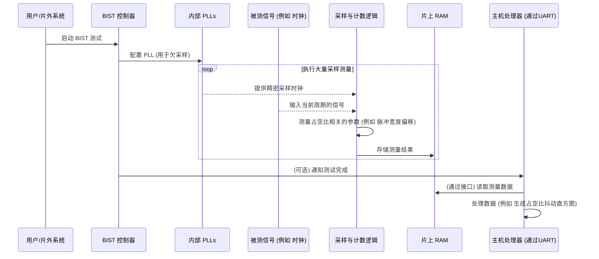

# Chapter 6: 内建自测试 (BIST)


在上一章 [抖动 (Jitter)](05_抖动__jitter__.md) 中，我们了解了信号在时间上的不期望偏移是如何影响高速数据传输的。抖动，特别是像占空比失真 (DCD) 这样的确定性抖动，会严重降低系统性能。那么，我们如何有效地检测和测量这些在复杂芯片（如 [串行器/解串器 (SerDes)](01_串行器_解串器__serdes__.md)）内部发生的细微失真呢？这一章，我们将介绍一种强大的技术——内建自测试 (BIST)。

## 为什么需要 BIST？—— 让芯片自己“体检”

想象一下，我们设计并制造了一块非常复杂的 SerDes 芯片。这块芯片将用于服务器、网络交换机或高性能计算机中，每秒需要传输数十亿甚至上百亿比特的数据。我们如何确保每一片出厂的芯片都功能完好，性能达标呢？

传统的方法是使用昂贵且复杂的**外部自动测试设备 (Automatic Test Equipment, ATE)**。这些设备像大型医疗仪器一样，通过许多探针连接到芯片的引脚上，给芯片施加测试信号，然后分析输出信号来判断芯片是否合格。

然而，随着 SerDes 芯片的速率越来越高，引脚越来越多，这种外部测试方法面临诸多挑战：
1.  **成本高昂**：高速 ATE 非常昂贵，这会增加芯片的最终成本。
2.  **测试时间长**：对每个芯片进行详尽的测试会花费很多时间，影响生产效率。
3.  **信号完整性问题**：在极高的频率下（例如 10 Gbps 或更高），通过探针和测试夹具连接到芯片本身就会引入额外的信号失真和[抖动 (Jitter)](05_抖动__jitter__.md)，使得测试结果可能无法准确反映芯片的真实性能。就好比给一位短跑冠军测速，如果跑道上布满了障碍物（测试设备引入的干扰），测出来的成绩肯定不准。
4.  **在役测试困难**：一旦芯片被集成到最终产品中（比如一块主板），如果出现问题，再想用大型 ATE 进行测试就非常困难了。

那么，有没有一种方法能让芯片自己完成一部分甚至大部分的测试工作呢？答案就是**内建自测试 (Built-In Self-Test, BIST)**。

**内建自测试 (BIST)** 是一种集成电路的设计技术，它允许芯片或系统利用其内部的附加电路来进行自我功能测试和诊断，而无需或减少对昂贵、复杂的外部自动测试设备（ATE）的依赖。就像许多现代电器（如洗衣机、空调）都自带了故障诊断程序，按一个特定的按钮组合，设备就能自行检查主要功能是否正常，并可能显示一个错误代码来指示问题所在。

在 `Serializer_Deserializer_Component_Design` 项目的论文中，提出的 BIST 组件专注于测量 SerDes 中信号的**占空比抖动 (Duty Cycle Jitter)**，这是一种常见的[抖动 (Jitter)](05_抖动__jitter__.md) 类型，即占空比失真 (DCD)。通过在芯片内部集成产生测试辅助信号（例如高精度采样时钟）和分析电路，该 BIST 方案旨在提供一种更准确、可扩展且成本效益高的测试方法。

## BIST 的核心理念

一个典型的 BIST 系统通常包含以下几个核心部分：

```mermaid
graph TD
    subgraph 芯片内部 (On-Chip)
        TPG[测试模式/信号生成器 (TPG)] --> DUT[被测电路 (DUT)]
        DUT --> ORA[输出响应分析器 (ORA)]
        TC[测试控制器 (TC)] --> TPG
        TC --> ORA
        TC --> DUT
        ORA -- 测试结果 (通过/失败 或 测量数据) --> Output_Interface[输出接口 (例如 JTAG, 简单总线)]
    end
    Output_Interface --> External_System[外部系统/ATE (读取结果)]

    classDef bist_component fill:#lightyellow,stroke:#333,stroke-width:2px;
    class TPG,ORA,TC,DUT,Output_Interface bist_component;
```

*   **被测电路 (Device Under Test, DUT)**：这是芯片中需要被测试功能的部分，例如 SerDes 的发送器、接收器或[时钟数据恢复 (CDR)](03_时钟数据恢复__cdr__.md) 电路。
*   **测试模式/信号生成器 (Test Pattern Generator, TPG)**：这部分电路负责在 BIST 模式下产生被测电路所需的输入激励信号。对于某些 BIST，它可能产生特定的数字码流；对于本论文中专注于测量的 BIST，它可能更多地指内部用于精密测量的辅助信号源，例如用于[欠采样技术 (Undersampling)](07_欠采样技术__undersampling__.md) 的高精度采样时钟。
*   **输出响应分析器 (Output Response Analyzer, ORA)**：这部分电路负责捕获被测电路在测试激励下的输出响应，并将其与预期的正确响应进行比较（对于逻辑测试），或者对信号特性进行测量和量化（对于参数测试，如本论文中的抖动测量）。
*   **测试控制器 (Test Controller, TC)**：这是一个控制单元，负责协调整个 BIST 过程，包括启动测试、控制 TPG 和 ORA 的操作、以及收集测试结果。

## 论文中 BIST 的工作重点：测量占空比抖动

`Serializer_Deserializer_Component_Design.pdf` (参考其摘要部分，第 i 页，以及第四章，第51页起) 中描述的 BIST 组件主要用于精确测量 SerDes 信号的**占空比抖动**。占空比是指信号在一个周期内高电平持续时间与整个周期时间的比例。理想情况下，许多时钟信号的占空比是 50%。占空比的偏差或抖动（即 DCD）会影响数据采样的准确性，尤其是在双边沿采样或[多电平信令 (例如 PAM-4)](02_多电平信令__例如_pam_4__.md) 系统中。

该 BIST 设计的关键特性和技术包括：

1.  **基于[欠采样技术 (Undersampling)](07_欠采样技术__undersampling__.md)**：
    *   这是一种核心技术，我们将在下一章详细学习。简单来说，欠采样使用一个频率略低于或与被测信号某个分频频率有微小偏移的采样时钟来对高速信号进行采样。这样做可以等效地将高速信号“拉伸”或“变换”到一个较低的频率上进行分析，从而降低了对分析电路速度的要求。
    *   PDF 文档的图 4.5 (第53页) 展示了欠采样的一个例子。

2.  **利用大数定律 (Law of Large Numbers)**：
    *   为了提高测量精度，BIST 会进行大量的采样和测量。根据大数定律，当样本数量足够大时，样本均值会趋近于真实的总体均值。这意味着通过多次测量并取平均，可以减少随机误差的影响，得到更可靠的结果。
    *   PDF 文档的第49页 (4.2节) 讨论了大数定律的应用。

3.  **多锁相环 (PLL) 采样增强精度**：
    *   BIST 设计利用了 FPGA 内部可用的多个 PLL（锁相环）来产生高精度的、相位可控的采样时钟。使用多个 PLL 或一个 PLL 的多个输出来进行采样，可以进一步提高测量结果的统计显著性和准确性。
    *   PDF 文档的图 4.6 (第54页) 展示了多 PLL 欠采样的概念。

4.  **全数字化实现**：
    *   该 BIST 的核心测量和分析逻辑是全数字的。这使得设计更容易在不同的制造工艺之间移植，并且通常比模拟电路具有更好的抗噪声能力和更低的功耗。

5.  **直方图分析**：
    *   BIST 电路收集大量的占空比测量数据。这些数据随后可以被读出，并通过软件（例如 PDF 中提到的 PERL 脚本，第58页）处理成直方图。直方图能够直观地显示占空比抖动的分布情况，例如抖动的均值、峰峰值和标准差等。
    *   PDF 文档的图 4.9 到图 4.14 (第61-63页) 展示了多种测量结果的直方图。

## 简化版 BIST 结构与工作流程 (用于占空比抖动测量)

基于 `Serializer_Deserializer_Component_Design.pdf` 第四章的描述，我们可以构想一个简化的 BIST 结构，用于测量输入信号（例如，来自 [时钟数据恢复 (CDR)](03_时钟数据恢复__cdr__.md) 的恢复时钟）的占空比抖动：

```mermaid
graph TD
    subgraph 芯片内部BIST模块 (On-Chip BIST Module)
        InputSignal[被测信号 (例如 恢复时钟)] --> SamplingFFs[采样触发器阵列]
        PLL_Controller[PLL 控制器] --> Internal_PLLs[内部多个PLLs]
        Internal_PLLs -- 精密采样时钟 (欠采样) --> SamplingFFs
        SamplingFFs -- 采样数据 --> CounterLogic[计数器逻辑 (测量脉宽/偏移)]
        CounterLogic -- 测量值 (例如 周期偏移) --> RAM[存储器 (RAM)]
        BIST_Ctrl[BIST 控制器 (状态机)] --> PLL_Controller
        BIST_Ctrl --> CounterLogic
        BIST_Ctrl --> RAM
        RAM -- 存储的数据 --> Output_Interface[输出接口 (如UART/JTAG)]
    end
    Output_Interface --> ExternalHost[外部主机 (用于数据处理和直方图生成)]

    classDef component fill:#lightgreen,stroke:#333,stroke-width:2px;
    class InputSignal,Internal_PLLs,SamplingFFs,CounterLogic,RAM,BIST_Ctrl,PLL_Controller,Output_Interface component;
```
*图：简化的占空比抖动测量 BIST 结构 (概念源自 PDF 图 4.4 和图 4.7)*

**工作流程简述：**

1.  **启动BIST**：用户或外部系统通过特定指令激活 BIST 控制器。
2.  **PLL配置**：BIST 控制器配置内部的 PLL(s) 以产生用于[欠采样技术 (Undersampling)](07_欠采样技术__undersampling__.md) 的精密采样时钟。这个采样时钟的频率会与被测信号的频率（或其某个整数倍）有一个微小的、精确控制的差异。
3.  **信号采样**：被测的高速信号（例如，一个本应是50%占空比的时钟）被送入采样触发器。这些触发器使用来自 PLL 的欠采样时钟进行采样。
4.  **脉冲宽度/偏移测量**：
    *   由于欠采样的效应，被测信号的每个周期在“等效时间”上被拉长了。计数器逻辑可以利用这一点来精确测量每个周期内高电平的持续时间（T_high）和低电平的持续时间（T_low），或者直接测量它们之间的差异（例如，周期偏移 = T_high - T_low，理想50%占空比时应为0）。
    *   PDF 文档第55页描述道：“通过使用上/下计数器来测量时钟周期两个相位的长度偏移，从而测量恢复时钟的占空比。”
5.  **数据存储**：成千上万个这样的测量结果（例如，每个周期的偏移值）被存储在芯片内部的 RAM 中。
6.  **数据读取与分析**：测试完成后，存储在 RAM 中的原始数据可以通过一个简单的接口（如 PDF 中提到的 UART，第52页）被读出到外部主机。外部主机上的软件（例如 PERL 脚本）对这些数据进行处理，生成占空比抖动的直方图。

**一个简单的例子：**

假设我们正在测试一个理想频率为 1 GHz (周期 1 ns)，理想占空比为 50% (高电平 0.5 ns, 低电平 0.5 ns) 的时钟信号。
*   BIST 启动，通过欠采样技术对这个时钟进行多次测量。
*   某一次测量，它可能发现高电平持续时间为 0.505 ns (对应偏移 +0.005 ns)。
*   另一次测量，高电平持续时间为 0.498 ns (对应偏移 -0.002 ns)。
*   ... 成千上万次这样的测量 ...
*   所有这些偏移值 (+0.005 ns, -0.002 ns, ...) 被收集起来。
*   最终生成的直方图会显示这些偏移值是如何分布的。如果抖动很小，大部分值会集中在 0 ns 附近。如果抖动较大，分布会比较宽。



## 论文中 BIST 的优势

根据 `Serializer_Deserializer_Component_Design.pdf` 文档，这种针对占空比抖动测量的 BIST 设计带来了以下好处 (参考摘要第i页，以及第4章)：
*   **更高的测量精度**：通过欠采样和大数定律的应用，可以达到皮秒级的分辨率。
*   **可扩展性**：全数字化的设计使得 BIST 逻辑更容易随着工艺的进步而升级和扩展。
*   **成本效益高**：减少了对昂贵外部 ATE 的依赖，降低了测试成本。
*   **区域效率 (Area Efficient)**：纯数字实现通常比复杂的模拟测试电路占用更少的芯片面积 (PDF 第45页)。
*   **良好的可移植性**：数字设计更容易在不同的半导体制造技术之间移植。

## 内部实现一瞥 (基于PDF第四章)

虽然我们不深入具体的 Verilog/VHDL 代码 (PDF中未提供)，但我们可以从 PDF 的描述中了解其关键的数字构建模块：

*   **锁相环 (PLLs)**：论文中提到使用了 Altera Stratix FPGA 上的 PLL。这些 PLL 用于生成高精度、频率和相位可调的采样时钟，这是[欠采样技术 (Undersampling)](07_欠采样技术__undersampling__.md) 的基础。 (PDF 表4.1, 第54页)
*   **采样触发器 (Sampling Flip-Flops)**：用于在 PLL 提供的采样时钟边沿捕捉被测信号的状态。
*   **计数器逻辑 (Counter Logic)**：核心的测量单元。PDF 第57页的图4.8展示了一个“占空比计数器控制器”的状态机。这个控制器管理一个或多个计数器，这些计数器根据被测信号的边沿进行启动、停止或改变计数方向，从而量化脉冲宽度或它们之间的差异。
    *   例如，一个上/下计数器可以在信号为高电平时向上计数，在信号为低电平时向下计数。在一个完整的理想周期后，如果占空比是50%，计数器的最终值应为0。任何非零值都表示占空比的偏移。
*   **存储器 (RAM)**：通常是双端口 RAM，用于存储大量的测量结果，同时允许 BIST 控制器写入和外部接口读取。 (PDF 第55页)
*   **BIST 控制器**：一个状态机（如图4.8），负责整个测试流程的顺序控制，包括初始化 PLL、使能计数器、控制 RAM 的读写、以及与外部接口通信。

下面是一个非常简化的伪代码，概念性地展示计数器控制器可能如何工作的一个片段：

```
// 伪代码: 占空比测量核心逻辑 (概念)
状态 = 等待上升沿;
当前计数值 = 0;

循环 (直到收集足够样本) {
    等待被测信号边沿;

    如果 (状态 == 等待上升沿 && 检测到上升沿) {
        // 重置/启动用于测量高电平的计数器 (或开始向上计数)
        启动高电平计数器;
        状态 = 测量高电平;
    } 否则 如果 (状态 == 测量高电平 && 检测到下降沿) {
        // 停止高电平计数器，得到T_high
        T_high_值 = 读取高电平计数器值;
        // 重置/启动用于测量低电平的计数器 (或开始向下计数)
        启动低电平计数器;
        状态 = 测量低电平;
    } 否则 如果 (状态 == 测量低电平 && 检测到上升沿) {
        // 停止低电平计数器，得到T_low
        T_low_值 = 读取低电平计数器值;
        // 计算偏移值
        偏移值 = T_high_值 - T_low_值; // (或 T_high_值 - 预设的理想一半周期值)
        存储到RAM(偏移值);
        状态 = 等待上升沿; // 为下一个周期做准备
    }
    // ... 其他状态和错误处理 ...
}
```
**请注意**：这只是一个高度简化的概念性伪代码。实际实现会复杂得多，并需要精确处理欠采样时钟和被测信号之间的关系。PDF 图4.8中的状态机（`INIT`, `UpCount`, `DownCount`, `Store`, `RamRdy`, `SetCount`）提供了更具体的控制流程。`UpCount` 和 `DownCount` 状态暗示了使用一个计数器来累积高电平和低电平之间的差异。

## 总结

在本章中，我们了解了内建自测试 (BIST) 的基本概念和重要性：

*   BIST 允许芯片进行自我测试，减少了对昂贵外部测试设备的依赖。
*   它对于测试高速、复杂的 SerDes 芯片尤为重要，因为这些芯片难以通过传统外部方式精确测试。
*   `Serializer_Deserializer_Component_Design` 项目中提出的 BIST 组件专注于精确测量 SerDes 信号的占空比抖动。
*   该 BIST 利用了[欠采样技术 (Undersampling)](07_欠采样技术__undersampling__.md)、大数定律、多 PLL 采样和全数字逻辑等技术来实现高精度、可扩展和低成本的测量。
*   测量的结果（通常是大量的周期偏移值）被存储起来，并可用于生成直方图，以分析抖动的统计特性。

我们已经看到，所讨论的 BIST 设计严重依赖于一种称为“欠采样”的技术。那么，欠采样究竟是如何工作的？它为什么能帮助我们测量高速信号的微小抖动呢？这正是我们下一章 [欠采样技术 (Undersampling)](07_欠采样技术__undersampling__.md) 将要深入探讨的内容。

---

Generated by [AI Codebase Knowledge Builder](https://github.com/The-Pocket/Tutorial-Codebase-Knowledge)