# Chapter 7: 欠采样技术 (Undersampling)

欢迎来到 `Serializer_Deserializer_Component_Design` 项目教程的第七章！在上一章 [内建自测试 (BIST)](06_内建自测试__bist__.md) 中，我们探讨了芯片如何利用内部电路进行自我测试，特别是用于精确测量 SerDes 信号的占空比抖动。我们提到，该 BIST 设计的一个核心技术就是“欠采样”。那么，欠采样究竟是什么？它又是如何帮助我们用“慢”方法测量“快”信号的呢？本章将为你揭开欠采样的神秘面纱。

## 为什么要使用欠采样？—— 用慢动作捕捉极速瞬间

想象一下，在 [串行器/解串器 (SerDes)](01_串行器_解串器__serdes__.md) 这样的高速通信系统中，信号的变化速度快得惊人，可能每秒钟变化几十亿甚至上百亿次！如果我们想精确测量这些高速信号的特性，比如它们的[抖动 (Jitter)](05_抖动__jitter__.md)、占空比或者眼图张开程度，通常需要非常高速、非常昂贵的测试设备。这些设备内部的模数转换器 (ADC) 和其他测量电路必须能够跟上被测信号的飞快节奏。

但如果我们的测试设备或者芯片内部的 [内建自测试 (BIST)](06_内建自测试__bist__.md) 电路没有那么高的速度怎么办？难道就束手无策了吗？

**欠采样技术 (Undersampling)** 提供了一种巧妙的解决方案。它的核心思想是：**使用一个频率远低于被测高频信号的采样时钟来进行采样。**

这听起来有点反直觉。我们通常认为，要准确捕捉一个快速变化的信号，采样速度必须足够快才行（根据奈奎斯特采样定理，至少是被测信号最高频率的两倍）。但欠采样技术却反其道而行之，它利用了信号处理中的一个有趣现象——“混叠 (Aliasing)”，将高频信号“变换”到一个较低的频率上进行观察和测量，从而允许我们使用相对低速的硬件来分析高速信号。

## 什么是欠采样？—— 风扇叶片的慢动作摄影

理解欠采样最经典的例子就是用一个慢动作相机（或者说，快门速度足够快，但每秒拍摄帧数较低的相机）去拍摄一个高速旋转的风扇叶片。

*   **高速风扇 (被测高频信号)**：风扇叶片转得非常快，肉眼很难看清单个叶片在某一时刻的确切位置和姿态。
*   **慢动作相机 (低频采样时钟)**：我们的相机每秒钟可能只能拍几张照片，远低于风扇叶片每秒旋转的圈数。
*   **单次快门 (采样动作)**：虽然相机拍摄频率低，但它每一次按下快门（进行一次采样）的曝光时间非常短（即采样器的“孔径时间”短，或者说采样器前端带宽足够高），足以清晰地捕捉到叶片在那个**特定瞬间**的位置。

现在，关键来了：
如果相机的拍摄频率与风扇的旋转频率没有任何简单的整数倍关系，或者稍微错开一点，那么：
*   第一张照片可能捕捉到叶片在 0 度角的位置。
*   由于相机拍摄频率比风扇转速慢很多，当相机准备拍第二张时，叶片可能已经转了 N 圈又过了一点点角度，比如到了 10 度角的位置。
*   第三张照片可能捕捉到叶片在 20 度角的位置。
*   以此类推...

虽然相机每次只能看到叶片在一个离散瞬间的状态，但通过在叶片旋转到不同（但有规律递增的）角度时多次拍摄，我们最终会得到一系列叶片在不同位置的清晰图像。将这些图像按顺序播放，我们就能看到叶片仿佛在“慢动作”旋转，从而能够仔细观察它的形状、是否有晃动（抖动）、以及转动是否均匀（占空比）等特性。

这就是欠采样的精髓：**通过以一个与高频信号周期有特定偏移关系的低频时钟进行采样，我们可以在一个等效的“慢时间”尺度上重建出原始高频信号的波形特征。**

`Serializer_Deserializer_Component_Design.pdf` 文档的第45页 (4.1节 “采样定理和混叠”) 详细讨论了采样和混叠的理论基础。图 4.1 (第47页) 和图 4.2 (第48页) 分别从频域和时域解释了混叠现象。当采样频率低于信号最高频率的两倍时（违反奈奎斯特采样定理），原始信号的频谱会被“折叠”或“混叠”到较低的频率范围。欠采样正是巧妙地利用了这种混叠效应。

## 欠采样是如何工作的？

让我们更深入地理解欠采样的工作机制。假设我们有一个周期性的高频输入信号 `f_in`，我们用一个频率为 `f_s` 的时钟去采样它，其中 `f_s` 远小于 `f_in`。

为了实现有效的欠采样并重建波形，`f_s` 的选择通常遵循以下关系：
`f_s = (M / N) * f_in ± f_alias_desired` (这是一个泛化的关系，实际应用中会简化)

更常见且易于理解的一种欠采样方式是**谐波欠采样 (Harmonic Undersampling)** 或 **等效时间采样 (Equivalent-Time Sampling)**：
采样频率 `f_s` 被设定为被测信号频率 `f_in` 的某个整数分之一（即某个子谐波）附近，但有一个微小的频率偏移 `Δf`。
例如，可以设置 `f_s = f_in / K - Δf` 或者 `f_s = f_in / K + Δf`，其中 `K` 是一个整数，`Δf` 是一个远小于 `f_s` 和 `f_in` 的小频率差。

这样做的结果是，每一次采样脉冲相对于被测信号的同一相位点的到达时间都会有一个固定的、微小的延迟（或提前）。

参考 `Serializer_Deserializer_Component_Design.pdf` 文档中的图 4.5 (第53页 "Undersampling Example of Recovered Clock Signal")，它非常形象地展示了这个过程：

```mermaid
%% --- 这是一个对 PDF 图 4.5 的概念性重绘和解释，并非直接复制 ---
%% 假设被测高速时钟 (Recovered Clock) 的周期是 T_in
%% 采样时钟 (PLL Clock / Sampling Clock) 的周期是 T_s
%% 关键点：T_s 比 T_in 略长一点点 (T_s = T_in + ΔT) 或 T_s 比 N*T_in 略长/短一点点
%% 这里为了简化，我们假设 T_s 约等于 T_in，但 T_s = T_in + ΔT (ΔT很小)

gantt
    title 欠采样原理示意图 (概念类似 PDF 图 4.5)
    dateFormat X
    axisFormat %s

    section 被测高速信号 (f_in)
    理想边沿1  :crit, e1, 0, 0
    理想边沿2  :crit, e2, 10, 0  % 假设T_in = 10个单位时间
    理想边沿3  :crit, e3, 20, 0
    理想边沿4  :crit, e4, 30, 0
    理想边沿5  :crit, e5, 40, 0
    信号周期1  :p1, 0, 10
    信号周期2  :p2, 10, 10
    信号周期3  :p3, 20, 10
    信号周期4  :p4, 30, 10

    section 低速采样时钟 (f_s)
    采样点1 (S1) :milestone, s1, 1, 0  % 假设第一个采样点在 T_in 的 1/10 处
    采样点2 (S2) :milestone, s2, 12, 0 % 假设 T_s = 11 (T_in + 1)。S2 相对 T_in第二个周期的起点，向前移动了 1 个单位
                                       % 即，S2 采样在第二个 T_in 周期的 2/10 处
    采样点3 (S3) :milestone, s3, 23, 0 % T_s = 11。S3 采样在第三个 T_in 周期的 3/10 处
    采样点4 (S4) :milestone, s4, 34, 0 % T_s = 11。S4 采样在第四个 T_in 周期的 4/10 处

    %% 注：上述时间单位是示意性的，关键在于采样点在原始信号波形上的相对位置逐渐“滑动”
    %% S1 采样了原始信号第1个周期的 t1 位置
    %% S2 采样了原始信号第M个周期的 t1+Δt 位置 (等效于原始信号第1个周期的 t1+Δt 位置)
    %% S3 采样了原始信号第P个周期的 t1+2Δt 位置 (等效于原始信号第1个周期的 t1+2Δt 位置)
```

**对图 4.5 (及以上示意图) 的解释：**

*   **"Recovered Clock Signal" (被测高速信号)**：这是我们要测量的高频信号，假设其周期为 `T_in`。
*   **"PLL Clock" (用于采样的低频时钟)**：这个时钟的周期 `T_s` 被有意设置得与 `T_in` (或 `T_in` 的整数倍) 有一个微小的差异。在图 4.5 的描述中提到：“PLL 时钟周期比恢复时钟的周期稍微长一点 (PLL clock period is slightly larger than that of the recovered clock)”。这意味着 `T_s = T_in + ΔT`，其中 `ΔT` 是一个很小的时间差。
*   **采样点的“行走” (Stepping)**：
    *   第一次采样（例如在 `t=T_s` 时刻），我们可能采样到被测信号的第 `k` 个周期的某个相位点 `Φ_0`。
    *   由于 `T_s` 比 `T_in` 长一点点 (`ΔT`)，当第二次采样发生时（在 `t=2*T_s` 时刻），被测信号已经进行到了第 `k+1` 个周期的 `Φ_0 + ΔT` 相位点 (如果考虑信号已经完整地过去了 `T_in`，则是在下一个周期的 `Φ_0` 之后 `ΔT` 的位置)。
    *   也就是说，每个后续的采样点都会在被测信号波形上向“前”移动一小步 `ΔT` (相对于前一个采样点在原始信号一个周期内的等效位置)。
*   **重建波形**：经过多次采样后，我们就得到了一系列在被测信号不同相位点上的采样值。如果我们把这些采样值按照它们在原始信号一个周期内的等效时间顺序排列起来，就能重建出原始高频信号在一个周期内的波形，但这个重建过程是在一个“拉伸”了的等效时间轴上完成的。这个“拉伸”的比例因子与 `T_in` 和 `ΔT` (或 `f_in` 和 `Δf`) 有关。

**简单来说，欠采样就像用一把尺子（低频采样时钟）去测量一个快速滚动的轮子（高频信号）上标记的图案。每次尺子接触轮子时（采样），只记录下接触点图案的一小部分。但因为轮子在滚动，每次接触的点都会稍微错开一点。收集足够多的接触点记录，就能拼出轮子上一整圈的图案。**

这种“拉伸”效应使得我们可以用较低速度的ADC（模数转换器）和数字逻辑来处理和分析这些采样点，因为这些采样点是以较低的速率 (`f_s`) 获得的，并且它们代表的有效信号变化也较慢。

## 欠采样在 SerDes BIST 中的应用

正如我们在 [内建自测试 (BIST)](06_内建自测试__bist__.md) 章节中讨论的，欠采样技术对于在芯片内部实现对高速 SerDes 信号的精确测量至关重要。`Serializer_Deserializer_Component_Design.pdf` 中描述的 BIST 组件就利用欠采样来测量占空比抖动。

*   **测量抖动**：通过欠采样得到的“慢动作”波形，我们可以更精确地观察信号边沿的实际位置与理想位置的偏差，从而量化[抖动 (Jitter)](05_抖动__jitter__.md)。
*   **测量占空比**：同样，可以通过分析重建波形中高电平的持续时间和低电平的持续时间来精确计算占空比。PDF 第55页中提到，BIST 电路通过上/下计数器来测量时钟周期两个相位（高电平和低电平）的长度偏移，从而测量占空比。这个测量是在欠采样获得的等效低速信号上进行的。
*   **构建眼图**：通过对信号在不同判决电平和时间点进行大量欠采样，可以逐步构建出信号的眼图，而无需极高速的实时示波器。

**优势：**
1.  **降低硬件成本和复杂度**：可以使用速度较低（因此成本更低、功耗更小）的 ADC 和数字处理电路。这对于资源受限的芯片内部 BIST 尤为重要。
2.  **高时间分辨率**：尽管采样时钟频率低，但通过精确控制采样时钟与被测信号之间的微小频率/相位偏移 (`Δf` 或 `ΔT`)，欠采样可以实现非常高的时间分辨率，远高于采样时钟本身的周期。例如，`ΔT` 可以做到皮秒级别，从而实现皮秒级的时间测量精度。

## 实现欠采样的关键点

要成功实现并有效利用欠采样技术，有几个关键因素需要考虑：

1.  **精确的时钟控制**：
    *   采样时钟 `f_s` 的频率和相位必须相对于被测信号 `f_in` 非常稳定和精确。通常需要高精度的锁相环 (PLL) 来生成这个采样时钟。在 [内建自测试 (BIST)](06_内建自测试__bist__.md) 章节中，我们看到论文中使用了 FPGA 内部的多个 PLL (参考 PDF 表 4.1, 第54页) 来生成这样的精密采样时钟。
    *   `Δf` 或 `ΔT` 的选择决定了等效时间轴的“拉伸因子”以及完成一次完整波形扫描所需的采样点数。

2.  **采样器的模拟带宽**：
    *   这是一个非常重要的概念，初学者容易混淆。虽然欠采样的**采样速率** (`f_s`) 很低，但是执行采样动作的那个元器件（例如，ADC 的采样保持前端，或者一个触发器的输入级）本身的**模拟带宽**必须足够高，才能准确地捕捉到高速输入信号在采样瞬间的真实电压值。
    *   回到风扇的例子：相机每秒拍的张数可以很少（低采样率），但每次快门打开和关闭的速度必须非常快（高模拟带宽/短孔径时间），否则拍出来的叶片就是模糊一片，而不是清晰的瞬间冻结。
    *   如果采样器的带宽不足，即使进行了欠采样，重建出来的波形也会失真。

3.  **对被测信号频率的先验知识**：
    *   为了正确设置采样时钟频率 `f_s` 以获得期望的混叠频率或扫描步长，通常需要大致知道被测信号的频率 `f_in`。

4.  **触发和同步**：
    *   在某些欠采样示波器应用中，需要一个稳定的触发信号来同步采样过程，确保每次扫描都从信号的同一“起点”开始。在 BIST 应用中，通常是通过 PLL 精确控制 `f_s` 和 `f_in` 的关系来实现隐式同步。

## 总结与展望

在本章中，我们深入探讨了欠采样技术的基本原理和应用：

*   欠采样是一种使用远低于被测信号频率的采样时钟来对高频信号进行采样的技术。
*   它巧妙地利用了“混叠”效应，将被测高频信号在等效时间上“拉伸”，从而可以在一个较慢的时间尺度上观察和测量其特性。
*   关键在于精确控制采样时钟与被测信号之间的频率/相位关系，使得采样点能够在高频信号的波形上“逐步扫描”。
*   欠采样技术使得我们可以用相对低速、低成本的硬件（如 ADC、数字逻辑）来实现对高速信号（如 SerDes 中的抖动、占空比）的高精度、高时间分辨率测量。
*   实现欠采样需要高精度的时钟源、具有足够模拟带宽的采样器，并且通常需要对被测信号频率有所了解。
*   在 `Serializer_Deserializer_Component_Design` 项目中，欠采样是其 [内建自测试 (BIST)](06_内建自测试__bist__.md) 模块实现精确占空比抖动测量的核心技术。

通过本系列教程，我们从 [串行器/解串器 (SerDes)](01_串行器_解串器__serdes__.md) 的基本概念出发，学习了 [多电平信令 (例如 PAM-4)](02_多电平信令__例如_pam_4__.md) 如何提高传输效率，[时钟数据恢复 (CDR)](03_时钟数据恢复__cdr__.md) 和 [多电平相位检测器](04_多电平相位检测器_.md) 如何精确地从复杂信号中提取时钟和数据，了解了信号杀手 [抖动 (Jitter)](05_抖动__jitter__.md) 的危害与分类，并探索了如何通过 [内建自测试 (BIST)](06_内建自测试__bist__.md) 及本章介绍的欠采样技术来在芯片内部对这些高速特性进行有效测试。

希望这一系列章节能帮助你对 SerDes 系统中的一些关键设计和测试挑战有一个初步的、友好的认识。高速串行通信是一个充满挑战和创新的领域，未来还会有更多激动人心的技术等待我们去探索！

---

Generated by [AI Codebase Knowledge Builder](https://github.com/The-Pocket/Tutorial-Codebase-Knowledge)