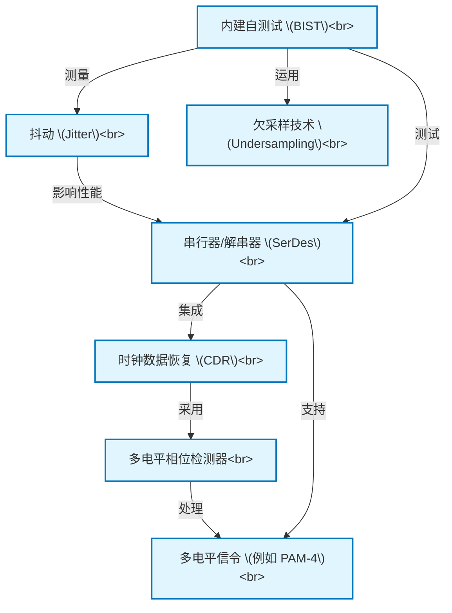

# Tutorial: Serializer_Deserializer_Component_Design

本项目旨在**设计和测试**用于*高速数据传输*的**串行器/解串器 (SerDes) 组件**。
研究重点包括一种新颖的、用于*多电平信号*的**时钟数据恢复 (CDR)** 系统中的**多电平相位检测器**，以及一种增强型的**内建自测试 (BIST)** 组件，该组件专注于测量 SerDes 的*占空比抖动*，并运用了**欠采样技术**来提高测试精度和效率。

**Source Repository:** [None](None)

## Chapters

1. [串行器/解串器 (SerDes)
](01_串行器_解串器__serdes__.md)
2. [多电平信令 (例如 PAM-4)
](02_多电平信令__例如_pam_4__.md)
3. [时钟数据恢复 (CDR)
](03_时钟数据恢复__cdr__.md)
4. [多电平相位检测器
](04_多电平相位检测器_.md)
5. [抖动 (Jitter)
](05_抖动__jitter__.md)
6. [内建自测试 (BIST)
](06_内建自测试__bist__.md)
7. [欠采样技术 (Undersampling)
](07_欠采样技术__undersampling__.md)

---

Generated by [AI Codebase Knowledge Builder](https://github.com/The-Pocket/Tutorial-Codebase-Knowledge)