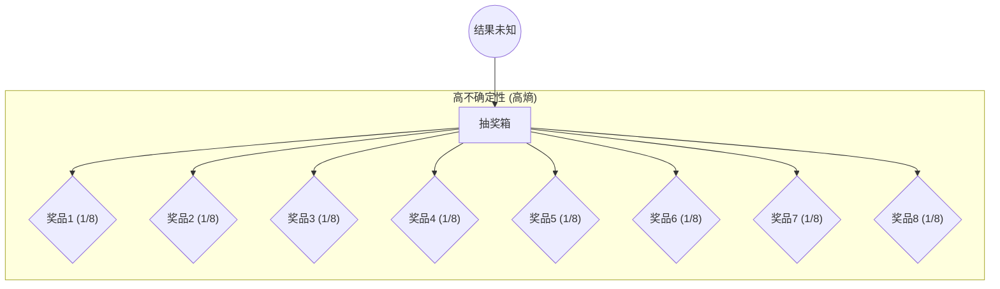
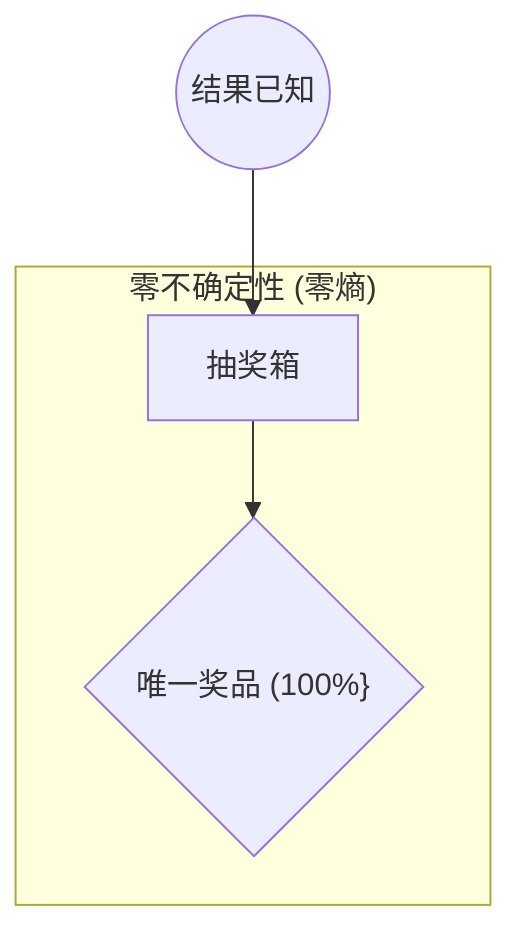

# Chapter 1: 信息度量 (熵)


欢迎来到香农-韦弗数学理论的入门教程！在本章中，我们将一起探索信息论的基石概念之一：**信息度量，也就是“熵”**。

想象一下，你面前有一个抽奖箱。在揭晓抽中哪个奖项之前，你的心情是怎样的？是不是充满了不确定性？如果抽奖箱里有很多选项，而且每个选项被抽中的可能性都差不多，那么你的不确定感就会很强。相反，如果箱子里只有一个选项，或者某个选项中奖的概率特别高，那结果就几乎没什么悬念了。

克劳德·香农，这位信息论的奠基人，就用一种数学的方式来描述这种“不确定性”。他认为，“信息”的本质就是消除不确定性。而衡量这种不确定性大小的工具，就是我们本章要学习的**熵 (Entropy)**。

## 什么是信息和熵？

在日常生活中，我们说“信息”时，通常指的是消息的内容和含义。比如，“明天会下雨”这条信息告诉了我们天气情况。但在香农的信息论中，“信息”的定义有所不同。它不关注信息的具体含义，而是关注信息所能消除的**不确定性**。

**熵**，就是用来量化这种不确定性的数学度量。它的单位通常是**比特 (bit)**。

让我们回到抽奖箱的例子：

*   **情况一：高度不确定性 (高熵)**
    假设抽奖箱里有 8 个不同的奖品，每个奖品被抽中的概率完全相同 (都是 1/8)。在你抽出奖品之前，你完全不知道会是哪一个，不确定性非常大。这种情况下，熵值就比较高。



*   **情况二：较低不确定性 (较低熵)**
    假设抽奖箱里仍然有 8 个奖品，但是奖品 A 被抽中的概率是 7/8，其他 7 个奖品共享剩下的 1/8 的概率。虽然还是有多种可能，但你大概率会猜是奖品 A，不确定性就小了很多。这种情况下，熵值就比较低。

*   **情况三：零不确定性 (零熵)**
    假设抽奖箱里只有一个奖品。那么结果毫无悬念，你百分之百确定会抽中它。不确定性为零，熵也为零。



所以，熵的核心思想是：**一个事件可能的结果越多，且这些结果发生的概率越均等，那么在结果揭晓前的不确定性就越大，熵值也就越高。** 信息的作用就是减少这种不确定性。当我们接收到信息后，原先的不确定性降低了，这个降低的量就是信息量。

## 用“比特”来衡量信息

我们知道了熵是不确定性的度量，那么它的单位“比特 (bit)”是怎么来的呢？

“比特”是“二进制定数字”(binary digit) 的缩写。在计算机科学中，一个比特可以表示两种状态，通常是 0 或 1。在信息论中，1 比特的信息量，可以理解为能够消除两个等概率选项之间的不确定性所需要的信息。

举个最简单的例子：**抛硬币**。

*   **公平的硬币**：正面朝上和反面朝上的概率都是 1/2。在你看到结果之前，存在两种等可能性的不确定性。当结果揭晓（例如“是正面”）时，这种不确定性就被消除了。这个结果所包含的信息量就是 **1 比特**。

*   **作弊的硬币**：假设一枚两面都是正面的硬币。抛出之前，结果是确定的（一定是正面）。没有任何不确定性，所以熵为 0，揭晓结果也不提供任何新的信息。

现在，我们来扩展一下：

*   **猜数字（1到2）**：如果你要猜一个在 1 和 2 之间随机选取的数字（假设选 1 和选 2 的概率各为 1/2），你需要多少信息才能确定？答案是 1 比特。这就像抛一次公平的硬币。
*   **猜数字（1到4）**：如果你要猜一个在 1、2、3、4 之间随机选取的数字（假设每个数字被选中的概率都是 1/4）。这种情况下的不确定性比猜两个数字要大。我们可以通过两次“二选一”的判断来确定：
    1.  数字是在 {1, 2} 中还是在 {3, 4} 中？（消除一半不确定性，获得 1 比特信息）
    2.  假设在上一步确定了在 {1, 2} 中，那么是 1 还是 2？（再消除一半不确定性，又获得 1 比特信息）
    总共需要 2 比特信息。
*   **猜数字（1到8）**：同理，如果你要猜一个在 1 到 8 之间等概率选取的数字，你需要 3 比特信息。

你会发现一个规律：如果有 N 个等概率的选项，你需要 `log₂(N)` 比特的信息来完全消除不确定性。
*   `log₂(2) = 1` 比特
*   `log₂(4) = 2` 比特
*   `log₂(8) = 3` 比特

这就是为什么对数，特别是以 2 为底的对数，在信息论中如此重要。它恰好能描述这种通过一系列“是/否”判断（或二分选择）来逐步消除不确定性的过程。正如香农在其开创性论文《通信的数学理论》(A Mathematical Theory of Communication) 中（如我们参考资料 `Shannon_Weaver_1949_Mathematical.pdf` 的第38页，Introduction 部分所述）指出的，对数度量在工程上更实用，也更符合我们对信息量的直观感受。

## 熵的数学表示 (初步了解)

对于初学者来说，不必立即深入复杂的数学推导，但了解其基本形式是有益的。

如果一个随机事件有多种可能的结果 `x₁`, `x₂`, ..., `x𝘯`，它们发生的概率分别是 `p(x₁)`, `p(x₂)`, ..., `p(x𝘯)`，那么这个事件的熵 H(X) 定义为：

`H(X) = - Σ [p(xᵢ) * log₂(p(xᵢ))]`

其中：
*   `Σ` (西格玛) 表示求和，即把每一项 `p(xᵢ) * log₂(p(xᵢ))` 的结果加起来。
*   `p(xᵢ)` 是第 `i` 个结果发生的概率。
*   `log₂` 是以 2 为底的对数。

**注意**：由于概率 `p(xᵢ)` 是小于或等于 1 的数，所以 `log₂(p(xᵢ))` 通常是负数或零。前面的负号使得最终的熵值 H(X) 是一个非负数。

在我们的参考资料 `Shannon_Weaver_1949_Mathematical.pdf` 中，韦弗 (Weaver) 在其引言部分（第20页，原文PDF页码14）也提到了这个公式：`H = - Σ pi log pi` (尽管他没有明确指出对数的底，但在信息论中通常默认为2，单位为比特)。

让我们看一个简单的例子来理解这个公式：

假设一个信源可能发出三种消息：A, B, C。
*   消息 A 出现的概率 P(A) = 0.5 (或 1/2)
*   消息 B 出现的概率 P(B) = 0.25 (或 1/4)
*   消息 C 出现的概率 P(C) = 0.25 (或 1/4)

那么这个信源的熵 H 为：
`H = - [ P(A)log₂(P(A)) + P(B)log₂(P(B)) + P(C)log₂(P(C)) ]`
`H = - [ 0.5 * log₂(0.5) + 0.25 * log₂(0.25) + 0.25 * log₂(0.25) ]`

我们知道：
*   `log₂(0.5) = log₂(1/2) = -1`
*   `log₂(0.25) = log₂(1/4) = -2`

所以：
`H = - [ 0.5 * (-1) + 0.25 * (-2) + 0.25 * (-2) ]`
`H = - [ -0.5 - 0.5 - 0.5 ]`
`H = - [ -1.5 ]`
`H = 1.5` 比特

这意味着，平均而言，从这个信源发出的每个消息携带 1.5 比特的信息量。

如果所有事件都是等概率发生的呢？比如有 N 个等概率事件，每个事件发生的概率都是 `1/N`。
那么熵的公式就简化为：
`H = - Σ [(1/N) * log₂(1/N)]`  (总共有 N 项)
`H = - N * [(1/N) * log₂(1/N)]`
`H = - log₂(1/N)`
`H = log₂(N)`

这与我们之前通过猜数字游戏得到的结论是一致的！例如，对于 8 个等概率选项，熵 `H = log₂(8) = 3` 比特。

下面的图表（类似于 `Shannon_Weaver_1949_Mathematical.pdf` 第50页的图7）显示了当只有两种可能性，概率分别为 `p` 和 `1-p` 时，熵 H 如何随 `p` 变化：

```mermaid
%%{init: {'theme': 'base', 'themeVariables': { 'primaryColor': '#f4f4f4'}}}%%
xychart-beta
    title "两种可能性事件的熵"
    x-axis "概率 p" 0 --> 1
    y-axis "熵 H (比特)" 0 --> 1.1
    line [
        [0.0, 0.0],
        [0.1, 0.469],
        [0.2, 0.722],
        [0.3, 0.881],
        [0.4, 0.971],
        [0.5, 1.0],
        [0.6, 0.971],
        [0.7, 0.881],
        [0.8, 0.722],
        [0.9, 0.469],
        [1.0, 0.0]
    ]
    bar ["0", "0.1", "0.2", "0.3", "0.4", "0.5", "0.6", "0.7", "0.8", "0.9", "1.0"]
        [0.0, 0.469, 0.722, 0.881, 0.971, 1.0, 0.971, 0.881, 0.722, 0.469, 0.0]
```
从图中可以看出：
*   当 `p=0` 或 `p=1` 时（即结果完全确定），熵为 0。
*   当 `p=0.5` 时（即两种可能性完全均等），熵达到最大值 1 比特。这符合我们的直觉：不确定性最大的时候，信息量也最大。

## 熵的重要性

理解和计算熵为什么如此重要呢？

1.  **信息量的理论下限**：熵告诉我们，对于一个给定的信息源（比如一段文字、一张图片或一段语音），平均每个符号至少需要多少比特来表示。任何试图用少于这个熵值的比特数来表示信息的压缩方法，都必然会导致信息丢失。
2.  **通信系统设计的基础**：在设计通信系统时，我们需要知道信源产生信息的速率（熵），以及信道能够传输信息的最大速率（[信道容量](04_信道容量_.md)）。这是确保有效和可靠通信的关键。
3.  **数据压缩的指引**：熵的概念是所有数据压缩算法（如 ZIP, JPEG, MP3）的理论基础。压缩的目标就是去除数据中的冗余，使其表示接近其熵值。

## 总结

在本章中，我们学习了信息论中的一个核心概念——熵。我们了解到：

*   香农将“信息”定义为对不确定性的消除。
*   熵是衡量这种不确定性的数学工具，单位通常是比特。
*   一个事件的选项越多、概率越均等，熵就越高，不确定性越大。
*   对于 N 个等概率选项，熵为 `log₂(N)` 比特。
*   更一般地，熵的计算公式为 `H = - Σ p(x) log₂(p(x))`。
*   熵为我们提供了描述信息源特性和设计高效通信系统的理论基础。

现在我们对如何量化“信息”有了初步的认识。在下一章中，我们将探讨香农提出的经典[通信系统模型](02_通信系统模型_.md)，看看信息是如何从发送方传递到接收方的。

---

Generated by [AI Codebase Knowledge Builder](https://github.com/The-Pocket/Tutorial-Codebase-Knowledge)