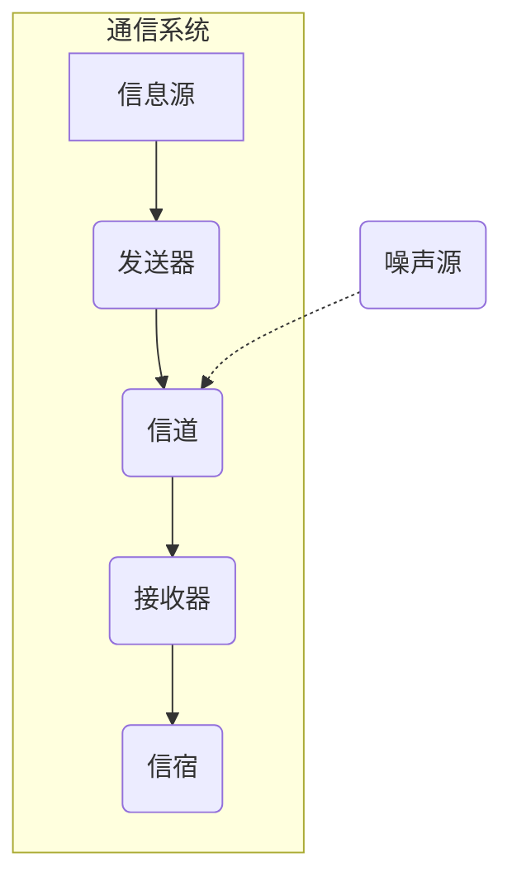
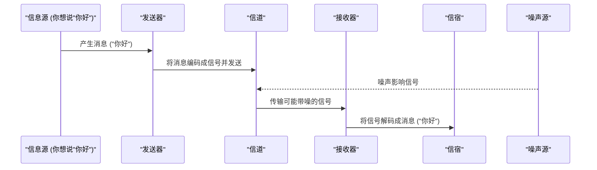

# Chapter 2: 通信系统模型

在上一章 [信息度量 (熵)](01_信息度量__熵__.md) 中，我们学习了如何量化信息和不确定性。我们知道了“熵”可以告诉我们一个信息源平均产生多少信息。但是，信息本身是如何从一方传递到另一方的呢？这就需要一个通信系统。本章，我们将一起探索克劳德·香农提出的一个经典的**通信系统模型**，它为我们理解信息传递的整个过程提供了一个清晰的框架。

想象一下最常见的场景：你和朋友打一个电话。你想告诉朋友：“喂，你好吗？” 这个简单的问候是如何从你的脑海中，通过电话，最终传递到你朋友的耳朵里的呢？这个过程看起来很简单，但实际上涉及到一系列复杂的步骤。香农的通信系统模型帮助我们将这个过程分解开来，理解其中的每一个环节。

这个模型就像一个蓝图，不仅适用于电话，还适用于发送短信、看电视、上网浏览等等几乎所有形式的通信。

# 香农通信系统模型的组成

香农在他划时代的论文《通信的数学理论》（`Shannon_Weaver_1949_Mathematical.pdf`，第34页，图1）中提出了一个通用的通信系统框图，这个模型通常包含以下几个核心部分：

让我们逐一了解这些组成部分：

1.  **信息源 (Information Source)**：
    *   **作用**：产生要传递的**消息 (Message)**。这个消息可以是你脑海中的想法、一段文字、一幅图像、一段声音等等。
    *   **例子**：
        *   在打电话时，信息源是你（说话的人）以及你想要表达的内容，比如“你好”。
        *   在发送电子邮件时，信息源是你输入的文字和附件。
        *   在温度传感器中，信息源是实际的温度变化。
    *   **与上一章的联系**：信息源产生的消息具有不确定性，我们可以用上一章学到的[信息度量 (熵)](01_信息度量__熵__.md)来衡量其信息量。
    *   **香农的描述** (参考 `Shannon_Weaver_1949_Mathematical.pdf` 第33页): “信息源产生要传递给接收终端的消息或消息序列。” (An information source which produces a message or sequence of messages to be communicated to the receiving terminal.)

2.  **发送器 (Transmitter)**：
    *   **作用**：将信息源产生的消息转换（**编码**）成适合在信道中传输的**信号 (Signal)**。
    *   **例子**：
        *   在打电话时，你的手机麦克风和内部电路将你的声音（声波，即消息）转换成电信号。这个转换过程就是一种编码。
        *   在发送电报时，报务员将文字（消息）按照摩尔斯电码转换成点和划的电流脉冲（信号）。
        *   在计算机网络中，网卡将数字数据（消息）转换成电信号或光信号。
    *   **香农的描述** (参考 `Shannon_Weaver_1949_Mathematical.pdf` 第33页): “发送器以某种方式对消息进行操作，以产生适合在信道上传输的信号。” (A transmitter which operates on the message in some way to produce a signal suitable for transmission over the channel.)

3.  **信道 (Channel)**：
    *   **作用**：传输信号的媒介或路径。
    *   **例子**：
        *   电话线（铜线）、光纤、空气（无线电波、声波）、水（声纳信号）。
        *   邮政系统中的运输网络（卡车、飞机、火车）。
    *   **香农的描述** (参考 `Shannon_Weaver_1949_Mathematical.pdf` 第34页): “信道仅仅是用于将信号从发送器传输到接收器的媒介。” (The channel is merely the medium used to transmit the signal from transmitter to receiver.)

4.  **噪声源 (Noise Source)**：
    *   **作用**：在信号通过信道传输时，会引入一些不希望有的、随机的干扰或失真，这些统称为**噪声 (Noise)**。噪声会使接收到的信号与发送的信号有所不同，从而可能导致信息传递的错误。
    *   **例子**：
        *   收音机的静电噪音。
        *   电话通话中的杂音或电流声。
        *   无线网络信号受到其他电子设备的干扰。
        *   印刷品上的污渍。
    *   **注意**：我们将在下一章 [噪声及其影响](03_噪声及其影响_.md) 中更详细地讨论噪声。
    *   **香农的描述** (参考 `Shannon_Weaver_1949_Mathematical.pdf` 第34页，图1中有所体现，并在原文第7页，Weaver的引言部分有更详细的讨论): “在传输过程中，不幸的是，信号中会加入一些信息源不希望有的东西。这些不想要的附加物……统称为噪声。” (In the process of being transmitted, it is unfortunately characteristic that certain things are added to the signal which were not intended by the information source. These unwanted additions ... are called noise.)

5.  **接收器 (Receiver)**：
    *   **作用**：将从信道接收到的（可能带有噪声的）信号还原（**解码**）成原始消息。接收器的功能通常与发送器相反。
    *   **例子**：
        *   在打电话时，对方手机的听筒和内部电路将接收到的电信号转换回声音。
        *   收音机将接收到的无线电信号转换成声音。
        *   计算机的网卡将接收到的电信号或光信号转换回数字数据。
    *   **香农的描述** (参考 `Shannon_Weaver_1949_Mathematical.pdf` 第34页): “接收器通常执行与发送器相反的操作，从信号中重建消息。” (The receiver ordinarily performs the inverse operation of that done by the transmitter, reconstructing the message from the signal.)

6.  **信宿 (Destination)**：
    *   **作用**：消息的最终接收者或使用者。
    *   **例子**：
        *   听电话的人。
        *   阅读电子邮件的人。
        *   控制系统根据传感器数据做出决策。
    *   **香农的描述** (参考 `Shannon_Weaver_1949_Mathematical.pdf` 第34页): “信宿是消息预定要传达给的人（或事物）。” (The destination is the person (or thing) for whom the message is intended.)

正如概念描述中所比喻的，整个通信系统模型就像一个完整的邮寄过程：
*   **信息源**：发件人（想要寄信和写信的内容）。
*   **发送器**：邮局工作人员将信件（消息）放入标准信封，贴上邮票，写上地址（编码成适合邮政系统处理的格式——信号）。
*   **信道**：邮政系统的运输网络，如卡车、火车、飞机（传输信号的媒介）。
*   **噪声源**：运输途中可能遇到的恶劣天气、交通事故等，可能损坏信件（噪声干扰信号）。
*   **接收器**：收件人所在地的邮局，对信件进行分拣，并准备投递（解码信号回消息）。
*   **信宿**：最终收到信件的收件人。

## 一个简单的例子：发送“你好”

让我们用一个非常简单的例子——通过即时通讯软件发送文字消息“你好”——来走一遍这个模型：

1.  **信息源**：你，你想发送“你好”这两个字。
2.  **发送器**：你的手机或电脑上的即时通讯软件。它会将“你好”这两个汉字（消息）转换成计算机能理解的二进制代码（比如UTF-8编码），然后再转换成可以通过网络传输的电信号或无线信号（信号）。
3.  **信道**：互联网，包括你家的Wi-Fi、光纤电缆、网络服务提供商的服务器等。
4.  **噪声源**：在信号传输过程中，可能会有各种电磁干扰，或者网络数据包丢失、延迟等，这些都是噪声。
5.  **接收器**：你朋友手机或电脑上的即时通讯软件。它接收到电信号或无线信号，将其转换回二进制代码，再将二进制代码转换回“你好”这两个汉字。
6.  **信宿**：你的朋友，他看到了屏幕上显示的“你好”。

这个图简单地展示了从你（信息源）发出“你好”的消息，到你的朋友（信宿）接收到消息的整个流程，以及噪声可能在信道中产生影响。

## 为什么这个模型很重要？

香农的通信系统模型非常重要，因为它：

*   **具有普遍性**：它不仅仅适用于电话或电报，而是适用于几乎所有类型的通信，无论是数字的还是模拟的，是有线的还是无线的。
*   **提供了一个分析框架**：它将复杂的通信过程分解为几个关键的、可分析的组成部分。这使得工程师和科学家可以针对每个部分进行研究和优化，例如如何更有效地编码（发送器），如何提高信道的传输能力（信道），如何抵抗噪声的干扰（信道与接收器），以及如何更准确地解码（接收器）。
*   **指明了研究方向**：这个模型清晰地指出了通信领域需要解决的核心问题，比如如何度量信息、如何定义信道能传输的最大信息率（即[信道容量](04_信道容量_.md)）、噪声如何影响信息传输（[噪声及其影响](03_噪声及其影响_.md)）以及如何通过编码来提高通信的效率和可靠性（[编码定理精髓](05_编码定理精髓_.md)）。

正如韦弗在其对香农理论的引言（`Shannon_Weaver_1949_Mathematical.pdf` 第7页）中所说，这个模型虽然首先应用于通信的工程技术层面，但其意义远不止于此。它揭示了通信的一些基本原理。

## 总结

在本章中，我们学习了香农提出的通用通信系统模型。我们了解到：

*   一个基本的通信过程可以分解为**信息源、发送器、信道、接收器、信宿**这五个核心部分。
*   **噪声源**是通信系统中一个不可避免的因素，它会干扰信号的传输。
*   这个模型为我们理解和分析各种通信系统提供了一个统一的、强大的框架。
*   每个组成部分都有其特定的功能，从消息的产生、编码、传输、解码到最终的接收。

理解了这个基本模型后，我们就能更好地理解信息是如何在各个环节中被处理、传递和可能被干扰的。在下一章 [噪声及其影响](03_噪声及其影响_.md) 中，我们将更深入地探讨模型中提到的“噪声”，看看它是如何影响我们的通信质量，以及我们有哪些方法来衡量和对抗它。

---

Generated by [AI Codebase Knowledge Builder](https://github.com/The-Pocket/Tutorial-Codebase-Knowledge)