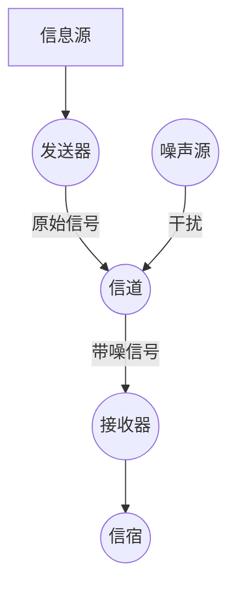
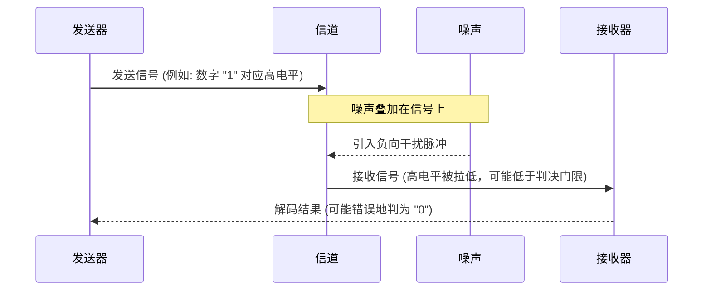

# Chapter 3: 噪声及其影响


在上一章 [通信系统模型](02_通信系统模型_.md) 中，我们学习了信息从发送方到接收方的完整过程，并初步提到了“噪声源”是这个过程中的一个干扰因素。本章，我们将深入探讨什么是**噪声 (Noise)**，以及它是如何影响我们的通信质量的。

想象一下，你正在一个非常嘈杂的派对上和朋友聊天。周围充满了各种声音：音乐声、其他人的谈话声、杯子碰撞声等等。这些声音使得你很难听清楚朋友在说什么，你可能需要朋友大声说，或者重复几遍。在这个场景中，那些干扰你和朋友对话的无关声音，就是一种“噪声”。

在通信系统中，噪声扮演着类似的角色。它无处不在，并且总是试图“破坏”我们想要传递的信息。理解噪声及其影响，对于设计出能够可靠传输信息的通信系统至关重要。香农的理论不仅帮助我们认识噪声，还提供了量化其影响并设法克服它的方法。

## 什么是噪声？

在通信系统中，**噪声**是指任何对原始信号产生干扰或失真的无用信号或能量。简单来说，就是我们不想要的东西混入到了我们想要传递的信息中。

噪声的来源多种多样：

1.  **外部噪声 (External Noise)**：来自通信系统外部环境的干扰。
    *   **例子**：
        *   收音机收到的雷电干扰（噼啪声）。
        *   无线网络信号受到旁边微波炉的干扰。
        *   宇宙射线对卫星通信的干扰。
        *   马路上的汽车喇叭声干扰你打电话。
2.  **内部噪声 (Internal Noise)**：由通信系统自身组件产生的干扰。
    *   **例子**：
        *   电子元器件（如电阻）内部电子不规则运动产生的热噪声 (Thermal Noise)。这是最基本、最普遍的一种内部噪声。
        *   线路连接不良产生的接触噪声。

正如韦弗 (Weaver) 在香农论文的引言部分（参考 `Shannon_Weaver_1949_Mathematical.pdf` 第7页，PDF文档第13页）所描述的：“在传输过程中，不幸的是，信号中会加入一些信息源不希望有的东西。这些不想要的附加物……统称为噪声。” (In the process of being transmitted, it is unfortunately characteristic that certain things are added to the signal which were not intended by the information source. These unwanted additions ... are called noise.)

在香农的通信系统模型图（参考 `Shannon_Weaver_1949_Mathematical.pdf` 第34页，PDF文档第40页，图1）中，噪声源被明确地表示为一个影响信道中信号的组成部分。


上图简化显示了噪声是如何在信道中混入信号的。

## 噪声如何影响通信？

噪声对通信系统的影响是负面的，主要体现在以下几个方面：

1.  **降低信号清晰度和质量 (Reduced Clarity/Quality)**：
    噪声会“淹没”或“污染”原始信号，使得接收到的信号变得模糊不清。
    *   **类比**：就像在一张干净的白纸上写字（原始信号），如果有人在上面随意涂鸦（噪声），那么原始的字迹就会变得难以辨认。
    *   **例子**：电话通话中的“沙沙”声使得对方的声音听起来不清晰；电视图像中的“雪花点”降低了画面质量。

2.  **导致信息传输错误 (Increased Errors)**：
    在数字通信中，信息通常用一串离散的符号（比如0和1）来表示。噪声可能会强大到足以改变这些符号。
    *   **例子**：发送器发送了一个代表“1”的高电平信号，但由于噪声的干扰，接收器在某个瞬间检测到的电平可能低于阈值，从而错误地判决为“0”。这种“比特翻转”是数字通信中常见的错误。

    这个图简单演示了噪声如何可能导致数字信号的误判。

3.  **增加接收端的不确定性 (Increased Uncertainty at the Receiver)**：
    即使接收器接收到了信号，噪声的存在也使得接收器不确定它收到的究竟是不是发送器发送的原始信号。在第一章 [信息度量 (熵)](01_信息度量__熵__.md) 中，我们知道熵是衡量不确定性的。噪声会增加这种“不希望的”不确定性。
    韦弗在其引言（`Shannon_Weaver_1949_Mathematical.pdf` 第18-19页，PDF文档第24-25页）中巧妙地指出了一个看似矛盾的现象：噪声的引入使得接收到的信号从一个更广泛的集合中选择，似乎“信息量”增加了。然而，这种增加的“信息”是虚假的、无用的，因为它源于噪声的干扰，而不是发送者的意图。
    香农用**含糊度 (Equivocation)**，记为 `Hy(x)`（参考 `Shannon_Weaver_1949_Mathematical.pdf` 第67页，PDF文档第73页），来量化这种由于噪声导致的不确定性：即在已知接收信号 `y` 的情况下，对原始发送信息 `x` 仍然存在的不确定性。
    因此，实际有效传输的信息率 `R` 是原始信息率 `H(x)` 减去由噪声引起的含糊度 `Hy(x)`：
    `R = H(x) - Hy(x)`

4.  **限制通信系统的性能 (Limits System Performance)**：
    为了对抗噪声，通信系统可能需要更复杂的编码方案、更高的发送功率或者更灵敏的接收设备，这些都会增加系统的成本和复杂性。噪声从根本上限制了一个信道能够可靠传输信息的最大速率，这个极限就是我们将在下一章讨论的 [信道容量](04_信道容量_.md)。

## 如何衡量噪声的影响？

既然噪声如此重要，我们自然需要一些方法来量化它及其影响。

1.  **信噪比 (Signal-to-Noise Ratio, SNR)**：
    这是最常用的衡量噪声影响的指标之一。信噪比定义为信号功率 (Signal Power, P<sub>S</sub>) 与噪声功率 (Noise Power, P<sub>N</sub>) 之比。通常用分贝 (dB) 表示。
    `SNR = P<sub>S</sub> / P<sub>N</sub>`
    `SNR (dB) = 10 * log₁₀(P<sub>S</sub> / P<sub>N</sub>)`

    *   **高信噪比**：意味着信号远强于噪声，通信质量通常较好。就像在一个安静的图书馆里轻声说话也能被听清。
    *   **低信噪比**：意味着噪声与信号强度相当，甚至强于信号，通信质量通常较差。就像在摇滚音乐会现场试图交谈。

    在香农著名的信道容量公式中（例如 `Shannon_Weaver_1949_Mathematical.pdf` 第100页，PDF文档第106页，定理17），噪声功率 `N` (或信噪比 `P/N`) 是一个关键参数：
    `C = W * log₂(1 + P/N)`
    这里的 `P` 是信号功率，`N` 是噪声功率，`W` 是带宽，`C` 是信道容量。这个公式明确显示了噪声功率如何直接影响信道能传输的最大信息速率。

2.  **误码率 (Bit Error Rate, BER) 或 符号错误率 (Symbol Error Rate, SER)**：
    在数字通信中，误码率是指接收到的数据中，错误比特数占总比特数的比例。类似地，符号错误率是错误符号数占总符号数的比例。这些指标直接反映了噪声对数据传输准确性的影响。
    *   **例子**：如果发送了1000个比特，其中有2个比特因为噪声而出错，那么误码率就是 2/1000 = 0.002 或 0.2%。

3.  **含糊度 (Equivocation, H<sub>y</sub>(x))**：
    如前所述，这是信息论中用来衡量噪声影响的理论指标。它表示在已知接收符号 `y` 的情况下，对原始发送符号 `x` 尚存的不确定性。含糊度越大，由噪声造成的信息损失就越多。

## 香农理论视角下的噪声

香农的伟大贡献之一在于，他并没有将噪声视为一个无法克服的障碍，而是将其数学化地融入到他的通信理论中。

*   **噪声是可量化的**：通过噪声功率、含糊度等参数，我们可以定量分析噪声对通信系统的影响。
*   **噪声是可对抗的**：香农的**有噪信道编码定理**（参考 `Shannon_Weaver_1949_Mathematical.pdf` 第71页，PDF文档第77页，定理11）指出，只要信息传输速率 `R` 小于信道容量 `C`（而 `C` 本身是受噪声水平影响的），就总能找到一种编码方法，使得信息传输的错误率可以达到任意小。
    这就像在嘈杂的房间里，虽然听清对方讲话很困难，但如果对方说话慢一点、清晰一点，或者使用一些手势和重复（这些都可以看作是“编码”的类比），你仍然有可能准确理解对方的意思。

这意味着，从理论上讲，噪声并不能完全阻止可靠的通信，它只是为可靠通信设定了一个速率上限（即信道容量）。

让我们看一个简单的例子来说明噪声如何歪曲信号：

假设我们用方波来表示二进制数字，高电平表示 "1"，低电平表示 "0"。

```mermaid
xychart-beta
    title "理想信号 vs. 带噪信号"
    x-axis "时间"
    y-axis "信号幅度"
    bar [ "理想信号", "带噪信号" ]
    line [
        {
            label: "理想信号 (101)",
            data: [[0, 1], [1, 1], [1, 0], [2, 0], [2, 1], [3, 1]]
        },
        {
            label: "带噪信号",
            data: [[0, 1.1], [0.5, 0.8], [0.9, 1.2], [1, 0.2], [1.3, -0.1], [1.6, 0.3], [2, 0.9], [2.5, 1.3], [3, 0.8]]
        }
    ]
    line [{label: "判决门限", data: [[0, 0.5], [3, 0.5]], type: "dashed"}]
```

**图解说明：**
*   **理想信号 (蓝色)**：清晰地表示了序列 "101"。第一个时间段是高电平 (1)，第二个时间段是低电平 (0)，第三个时间段是高电平 (1)。
*   **带噪信号 (红色)**：是理想信号叠加上了随机噪声后的结果。你可以看到信号的形状发生了扭曲。
*   **判决门限 (虚线)**：接收器通常会设置一个门限电压。如果接收到的信号电压高于此门限，则判为 "1"；低于此门限，则判为 "0"。

观察带噪信号：
*   在第一个时间段，尽管有波动，但信号幅度大部分时间仍在判决门限之上，所以可能仍被正确判为 "1"。
*   在第二个时间段，理想信号是 "0" (低电平)。但噪声可能使得某些时刻的信号幅度（例如在时间1.3附近，信号值变为-0.1，假设低电平是0，那么这个还是0；但如果噪声是正向的，使得0.2的信号值，若门限是0.1，可能会让原来是0的信号因为噪声叠加而错误地高于门限），如果噪声足够大，可能会让它看起来像 "1"，或者反之。在图中，1.3时刻的-0.1仍然低于门限，但1.6时刻的0.3若门限设在0.25，可能会被误判。假设门限是0.5，那么第二个时间段的0.2, -0.1, 0.3都远低于0.5，所以可能仍被正确判为 "0"。
*   在第三个时间段，信号 "1" 也受到了噪声干扰，但幅度大部分时间仍在门限之上，可能被正确判为 "1"。

这个例子直观地展示了噪声如何使信号失真，并可能导致接收器做出错误的判断。如果噪声特别强，红色曲线可能会剧烈波动，使得区分 "0" 和 "1" 变得非常困难，甚至不可能。

## 总结

在本章中，我们深入了解了噪声及其对通信的影响：

*   **噪声**是通信系统中任何无用的、干扰性的信号，它可能来自外部环境或系统内部。
*   噪声会**降低通信质量**，使信号失真，导致信息传输**错误**，并增加接收端对原始信息的**不确定性**（即含糊度）。
*   我们可以通过**信噪比 (SNR)**、**误码率 (BER)** 等指标来量化噪声的影响。
*   香农理论的重要贡献在于，它不仅将噪声纳入了数学分析的范畴，更重要的是证明了：即使存在噪声，只要我们的信息传输速率不超过一个由噪声水平等因素决定的极限——即**信道容量**——我们仍然可以通过巧妙的**编码**方法实现几乎无差错的可靠通信。

理解了噪声的本质和影响后，我们自然会问：在有噪声存在的情况下，一个信道究竟能以多快的速度可靠地传输信息呢？这个问题将引导我们进入下一章的学习：[信道容量](04_信道容量_.md)。

---

Generated by [AI Codebase Knowledge Builder](https://github.com/The-Pocket/Tutorial-Codebase-Knowledge)